# SketchUp 地理定位

> 原文：<https://www.educba.com/sketchup-geolocation/>

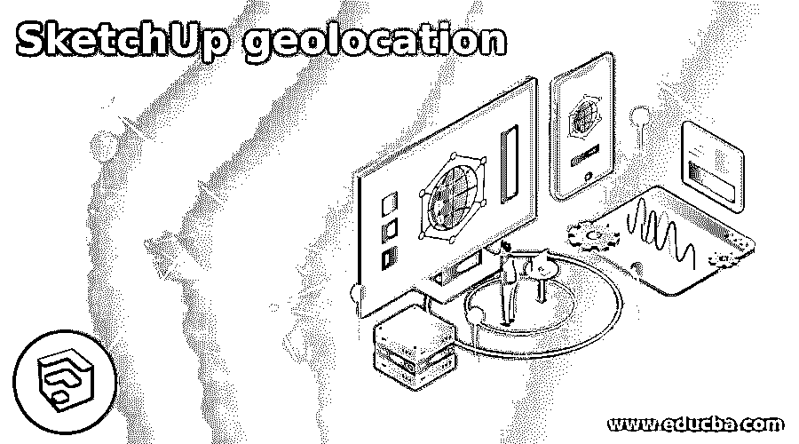

## SketchUp 地理定位简介

SketchUp Geolocation 是该软件的一个非常好的功能，通过使用该功能，您可以根据客户的需要将您的模型放置在所需的位置，这意味着您可以显示您的模型及其将要构建的地理位置，并了解不同的方面，如周围的环境、阳光方向和时间、周围社区的影响等等。通过在地理地图上定位您的模型，或者通过在该软件的地理位置框中输入该位置的地址，您可以为您的模型设置地理位置。在这个特性中，你可以根据自己的需要管理更多的东西。

### 如何使用 SketchUp 地理定位？

在 SketchUp 中使用地理位置是一项非常简单的任务。您只需要根据方向、高度和其他符合您期望的参数来管理您的模型。为了了解地理位置，我们需要一个模型，为此，我将从这个软件的 3D 仓库制作一个房子模型。3D Warehouse 是 Sketchup 的一个在线库，您可以从中获得不同的项目工作模型。您可以在窗口菜单的下拉列表中找到 3D Warehouse。

<small>3D 动画、建模、仿真、游戏开发&其他</small>

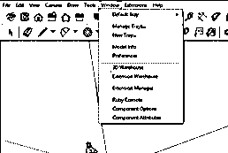

这是一个漂亮的传统房屋模型。但是，当然，你可以用你自己的模型来代替它。我拿这个模型只是为了向你解释这个话题。

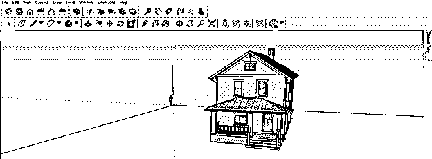

现在，再次进入菜单栏的窗口菜单，点击下拉列表中的模型信息选项。

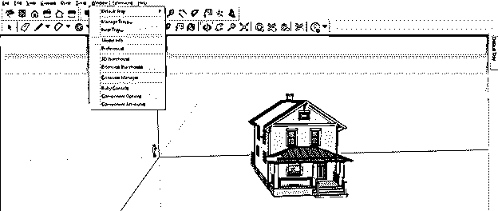

单击模型信息选项后，将会打开一个对话框。在这个对话框中，你会在它的列表中找到选项的数量。然后，点击列表中的地理位置选项。

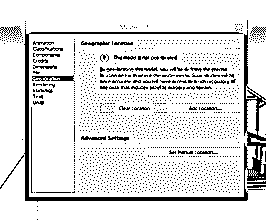

现在点击这个选项的添加位置按钮。

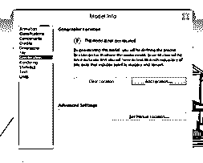

一旦你点击添加位置按钮，你所在位置的地理地图就会像这样打开。

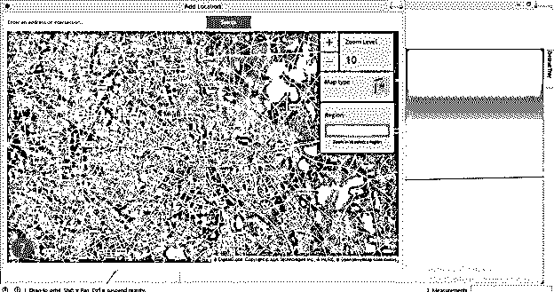

您可以在此添加位置对话框的搜索框中输入您想要的地址，当您单击搜索按钮时，它将在地图上找到您的地址。

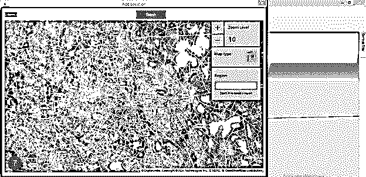

通过点击地图类型按钮，您可以将地理地图更改为普通地图结构。

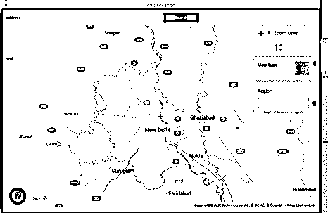

您可以根据您想要在模型区域中定位的详细程度来放大或缩小。一旦您对您的位置感到满意，然后单击此对话框的选择区域按钮。

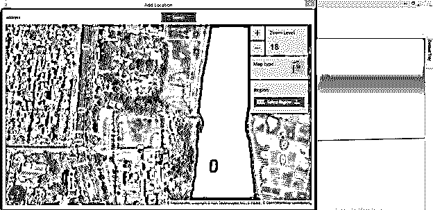

一个方框将变成用于选择区域。

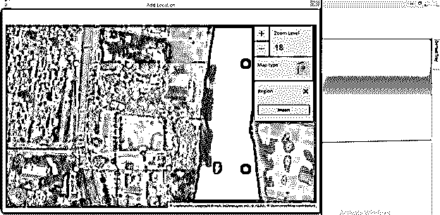

根据您想要选择的区域大小，您可以增大或减小选择框的大小。你也可以通过鼠标点击拖动地图来设置合适的位置。

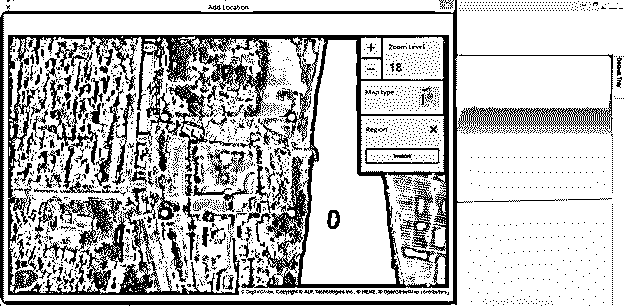

一旦您对您的位置和所选区域感到满意，单击此对话框的导入按钮。

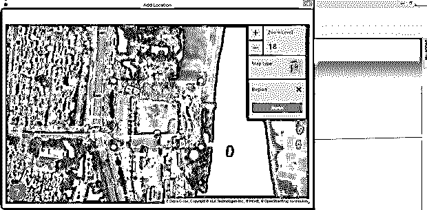

一旦你点击这个按钮，你所选择的地理位置将被导入到 SketchUp 的工作屏幕上，并且会出现一个模型信息对话框，在这个对话框中你可以看到你所选择的地理位置在地图上的具体位置。

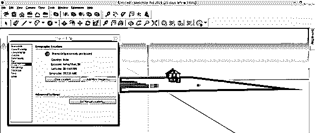

您也可以手动设置该位置，为此，您必须点击该模型信息对话框的“设置手动位置”按钮。

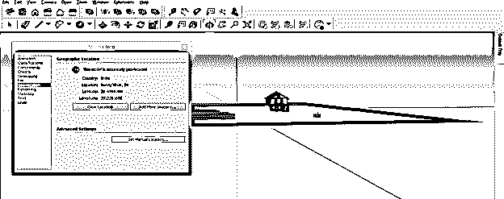

点击此按钮后，将会打开一个新的“设置手动地理位置”对话框。在这里，您可以根据您选择的位置输入值。

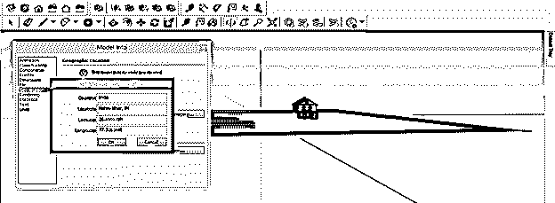

地理快照会像这样出现在你的工作屏幕上。

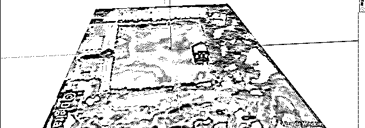

你可以根据这张地图的背景调整你的模型。

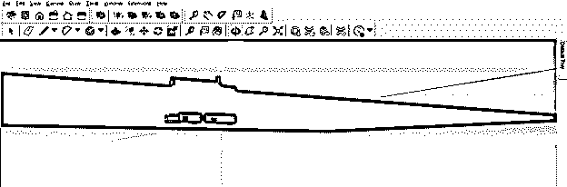

为了向上移动它，我将从工具面板中选择移动工具，然后选择移动轴，我将沿着它移动。

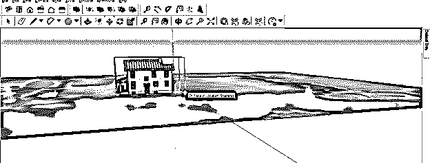

现在来到默认托盘的标签面板，在这里你会发现位置快照层，这是这个导入的地理地图层。

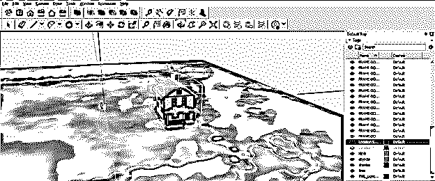

此快照还有一个图层:位置地形图层，通过启用它，您可以看到此地理位置快照的地形视图。

它会向你展示那个地区所有可能的地理位置。

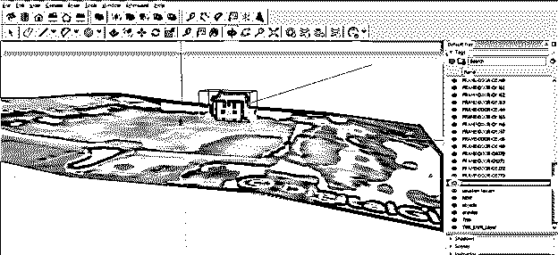

您可以根据您希望模型面向的方向来旋转模型。例如，我想沿着绿色轴旋转这个模型，所以我将使用旋转工具并为这个模型指定旋转轴。

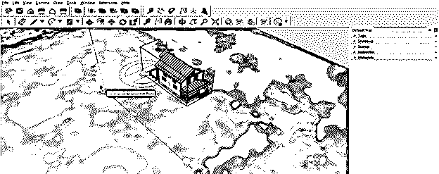

然后像这样旋转它。你可以根据你的位置设置你的模型。

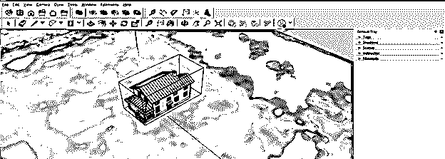

让我们再次来到默认托盘，这里你将有一个阴影面板，通过它你可以根据那个位置的时间或日期了解光源或太阳的方向。

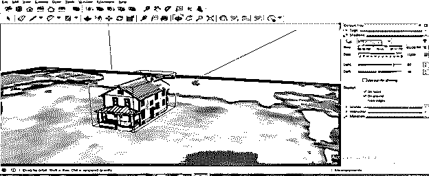

我将启用阴影面板中的“使用太阳作为阴影”选项，因为它希望太阳作为光源，并希望看到阴影如何根据地球围绕太阳的运动而变化。换句话说，它将向我展示太阳列表如何与这个位置上的模型进行交互。

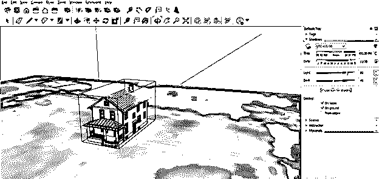

我将假设有两栋房子并排在这个模型上，为此，我在这个房子模型的边上画了两个方块。

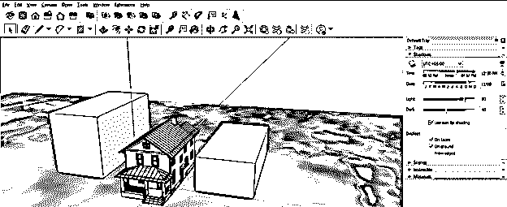

现在，当我在上午 9:31 滑动滑块时，在阴影面板的时间滑块上更改时间，你可以看到阳光对房子模型的影响。阳光会根据地理位置影响你的模型。

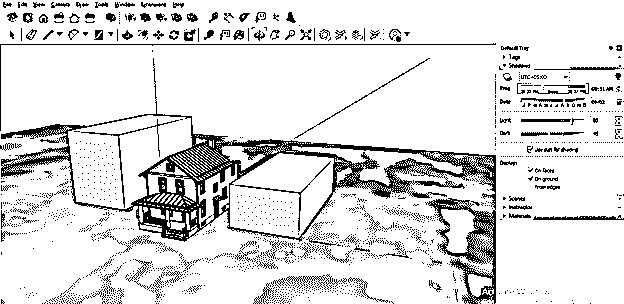

现在，如果我把这个时间改为下午 1:58，那么你可以看到落在房子模型上的阳光强度，与之前的有所不同。您也可以通过更改阴影面板的日期滑块上的日期来查看阴影效果。

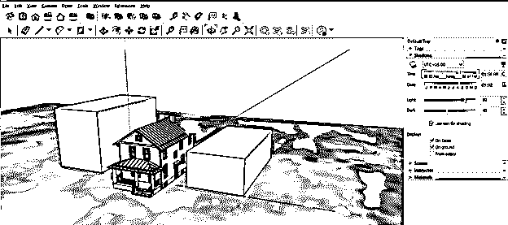

这都是关于地理位置的，要很好地理解 SketchUp 的这个特性，你必须知道地理位置。

### 结论

SketchUp 的地理定位功能将不再是一个陌生的术语，您可以轻松地设置它来定位将要构建的模型的位置。你只需要填写你的模型的地理位置的确切地址，并选择一个区域；然后，根据该位置周围的环境，您可以分别为您的模型设置其他内容。

### 推荐文章

这是 SketchUp 地理定位指南。在这里，我们将一步一步地详细讨论如何在 SketchUP 中使用地理位置来理解这一功能。您也可以看看以下文章，了解更多信息–

1.  [SketchUp 旋转](https://www.educba.com/sketchup-rotate/)
2.  [SketchUp 架构](https://www.educba.com/sketchup-architecture/)
3.  [SketchUp AutoCAD](https://www.educba.com/sketchup-autocad/)
4.  [CorelDRAW 标志设计](https://www.educba.com/coreldraw-logo-design/)

