# SketchUp 动画

> 原文：<https://www.educba.com/sketchup-animation/>

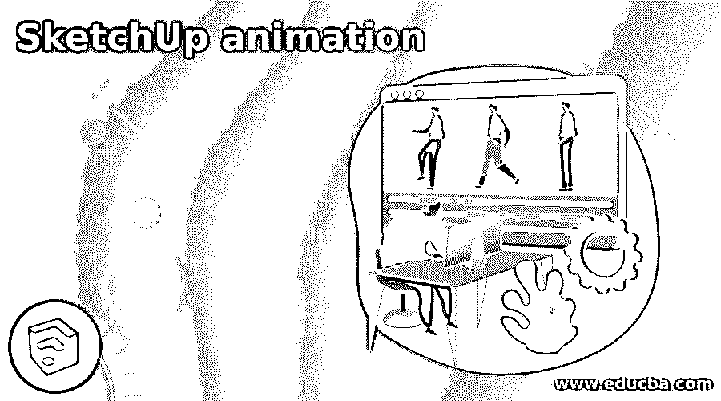

## SketchUp 动画简介

SketchUp 动画是该软件的一个非常好的功能，通过动画选项为您的模型制作动画，您可以通过播放动画场景从不同的角度呈现您的模型。要创建模型不同场景的动画，您需要做的事情很少。您还可以为任何建筑设计模型的内部部分制作动画视图。动画也有助于定位你的观点，只需点击一下；例如，如果我从前视图设置我的模型，并经常使用这个视图用于不同的目的，那么就没有必要通过使用动态观察工具去前视图，一次又一次，我们只需要点击它的场景按钮。

### 如何在 SketchUp 中制作动画？

让我们找到我们如何能为我们自己的模型做上面讨论的所有事情。只需选择您想要创建动画的模型。我拿过这个模型，我是从 SketchUp 的 3D 仓库下载的，是这个软件的在线库。如果你想了解更多关于 3D 仓库的知识，可以去看看我关于 SketchUp 库的文章。

<small>3D 动画、建模、仿真、游戏开发&其他</small>

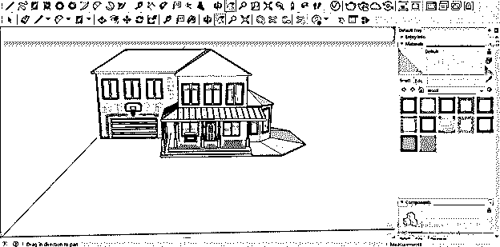

创建动画的第一步是去菜单栏的视图菜单，点击它，然后去下拉列表的动画选项。这里我们有一些动画子选项。让我们逐一了解。第一个是添加场景，所以点击它。

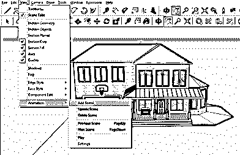

一旦你点击它，你会看到工具栏下面的场景 1 标签。这是一个选项卡，我们在其中制作动画。

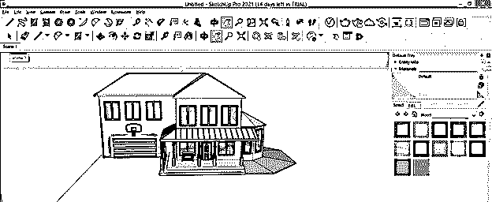

现在，您可以根据您想要在第一个动画中显示的方向或场景来环绕您的模型。我会将这个模型环绕到右侧视图。

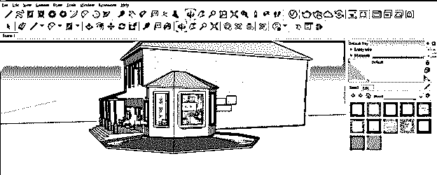

现在让我们添加下一个屏幕，为此，您可以像我们添加第一个场景一样重复前面的步骤，或者简单地右键单击这个场景 1 按钮。单击后，将会打开一个下拉列表。在这里点击添加选项。

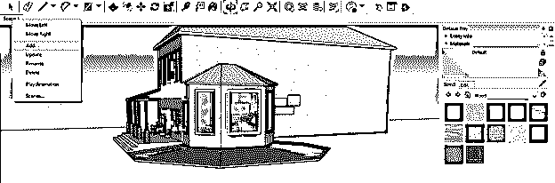

下一个场景选项卡将添加到这里，名称为场景 2。现在根据你来制作这个场景的动画。我会绕着这房子转到它的背面。

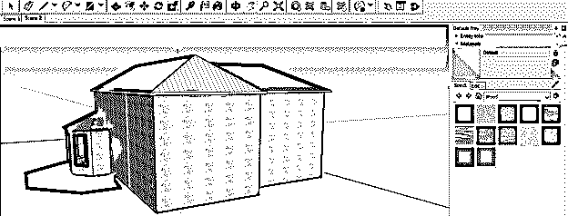

和前面两个场景一样，你可以根据你想要的动画类型添加更多的场景。例如，我在这里添加了 4 个场景。

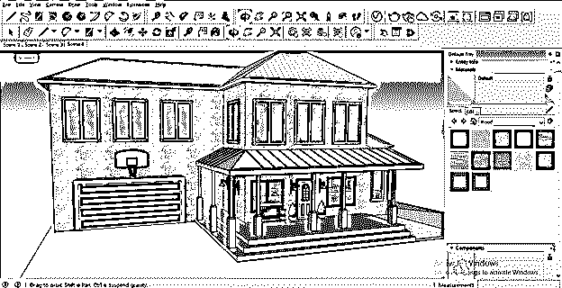

现在转到您想要播放动画的场景的选项卡。例如，我将单击场景 1，然后右键单击它。将再次打开一个下拉列表。点击播放动画选项来播放它。

您也可以从菜单栏的“视图”菜单中播放动画。只需进入查看菜单，然后点击动画下拉列表中的播放选项。

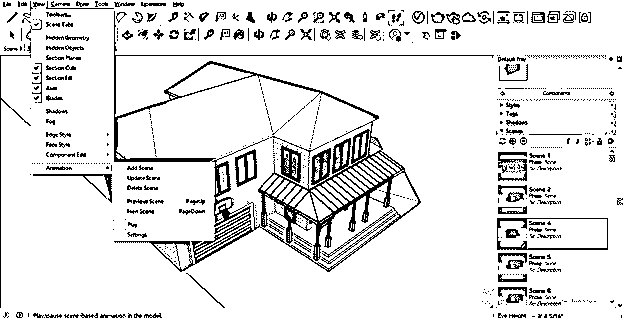

现在，您的动画将根据您设置的动画场景播放。你可以看到在这个软件的显示窗口区域的左上角有一个动画的小对话框。您可以点击暂停按钮来暂停动画，再次点击相同的按钮，您可以再次播放它。此对话框的下一个停止按钮将停止动画。

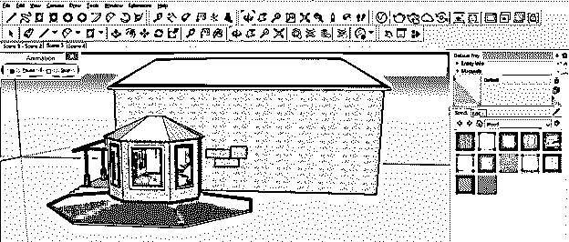

您也可以删除不想要的场景，并选择该场景，然后再次转到动画选项并单击删除场景选项，或者您可以通过右键单击该场景的选项来完成此操作。

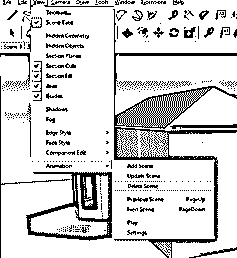

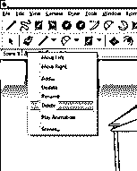

您可以在播放动画时进行一些设置，因此，请转到查看菜单增益然后动画选项，并单击下拉列表中的设置选项。

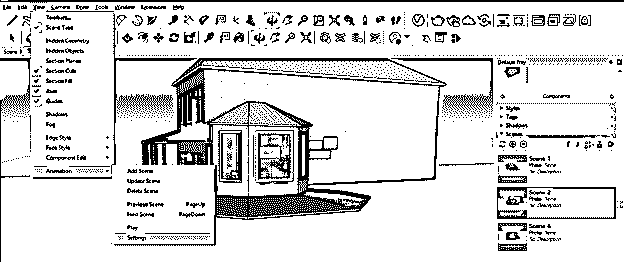

在动画设置的对话框中，我们有两个主要参数:场景转换和场景延迟。因此，例如，我们可以设置两个场景之间的动画变化时间与场景蒸腾。

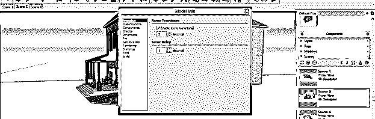

如果您取消选中“启用场景转换”复选框，动画将不会从一个场景移动到另一个场景；事实上，它会从一个场景跳到另一个场景。所以这完全取决于你想如何展示你的动画。

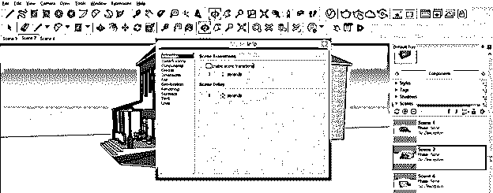

您还可以设置从一个场景移动到下一个屏幕所需的时间。如果时间很长，那么动画将缓慢移动以到达下一个屏幕。

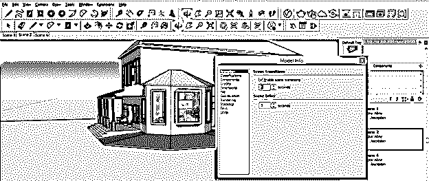

一旦第一个动画场景结束，第二个动画场景开始，动画和前一个场景之间会有一小段时间间隔。你也可以设定这个时间。如果给定一个高的时间值，那么动画将在场景中保持更长的时间。如果你不想要任何保持时间，那么你可以通过在场景延迟选项中输入一个值来使这个时间像 0 秒。

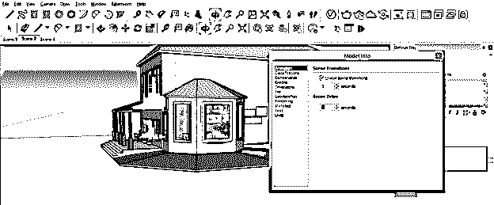

如果你愿意，你可以互相改变场景的顺序，比如你想在场景 2 之前显示场景 4；只需点击场景 4，然后右键单击。然后，根据场景的交换位置，点击向左移动或向右移动。

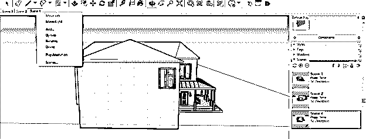

这一次，当您播放动画时，场景 4 将出现在场景 1 之后，而不是场景 2。

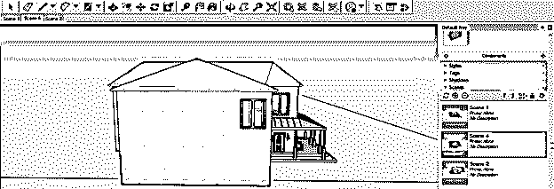

如果你想对你之前的动画做一些改变呢？你只需要去那个你想改变动画的场景，然后根据你做改变，然后右键点击那个场景。然后，点击该场景下拉列表的更新按钮进行更新更改。

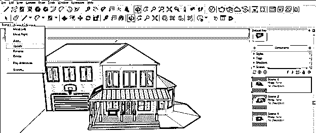

就像我们为模型的外表面制作动画一样，我们也可以从这个模型的内部制作。你只需要设置好拍摄角度。

### 结论

我认为这是 SketchUp 中关于动画的一个很好的讨论，你会发现这篇文章对于学习这个主题非常有用。正如我告诉你的，你可以创建一些场景，并根据你的模型的要求制作动画，只需点击一下鼠标就可以给你的模型做简报；你不需要一次又一次地使用动态观察工具来观察你的特定视点。

### 推荐文章

这是一个 SketchUp 动画指南。在这里，我们讨论如何在 SketchUp 中创建动画，以及如何创建几个场景并根据模型的要求制作动画。您也可以阅读以下文章，了解更多信息——

1.  [SketchUp 替代方案](https://www.educba.com/sketchup-alternative/)
2.  [SketchUp 旋转](https://www.educba.com/sketchup-rotate/)
3.  [SketchUp AutoCAD](https://www.educba.com/sketchup-autocad/)
4.  [Photoshop 中的 3D 文本效果](https://www.educba.com/3d-text-effect-in-photoshop/)

