# SketchUp 更改尺寸

> 原文：<https://www.educba.com/sketchup-change-dimensions/>

## SketchUp 变更标注简介

SketchUp 更改尺寸可以理解为在创建 3D 模型的任何时刻更改任何绘制对象的尺寸。改变任何绘制对象的尺寸在这个软件中有点困难，这意味着没有特定的工具或功能；您只需点击一下鼠标就可以更改尺寸，但是我们可以按照我们的要求通过一些步骤和使用一些技术来更改尺寸。您还可以显示任何对象的尺寸，以查看尺寸的实时变化，从而很容易识别哪些尺寸正在变化。所以让我告诉你有什么技巧可以让你做到这一点。

### 如何在 SketchUp 中更改尺寸？

为了理解如何在这个软件中改变尺寸，让我们在其中画一个对象。因此，我将使用矩形工具。

<small>3D 动画、建模、仿真、游戏开发&其他</small>

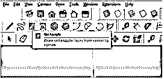

并通过在该软件的尺寸框中输入值 10 '，10 来绘制一个 10' x 10 '的矩形。

现在我想把这个矩形变成 5' x 5 '，但是你可以看到我现在不能这样做，即使我已经选择了这个对象。

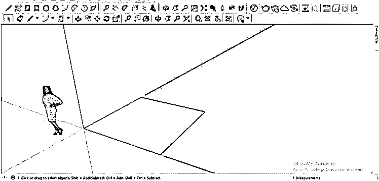

现在让我们做另一件事来改变它的维度。我先拿缩放工具。

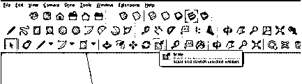

现在，我将首先单击这个矩形的任意边，并向任意方向拖动它；然后，我将输入我想要更改其尺寸的值，例如，我将在尺寸框中输入 5 '，5，然后按键盘上的 enter 按钮。

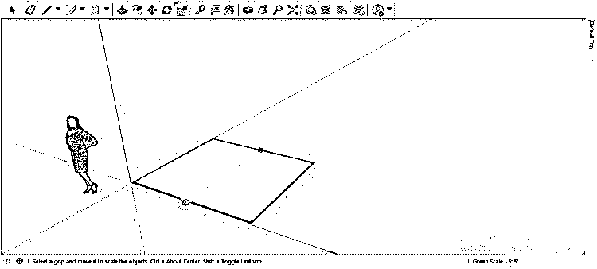

你可以看到它会像这样变化。

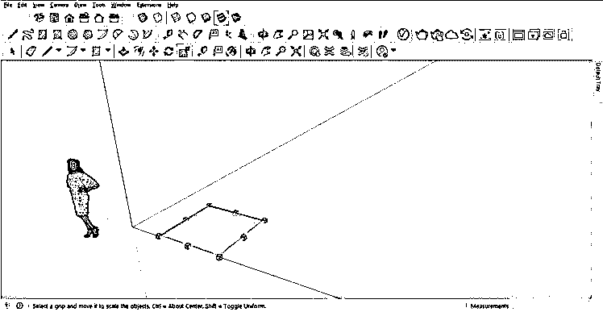

这是改变任何物体尺寸的第一种方法。现在让我告诉你另一种方法。对于这种方法，您必须首先使用卷尺工具。

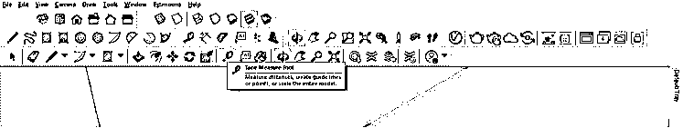

然后单击该矩形的边缘并向您想要更改尺寸的方向拖动，然后输入更改后的尺寸值，例如我将输入 5 '并点击键盘上的 enter 按钮。

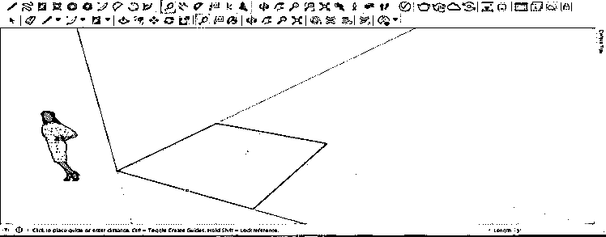

一旦你输入了你想要的值，这个工具会在输入的值上放置一个参考线，就像这样。

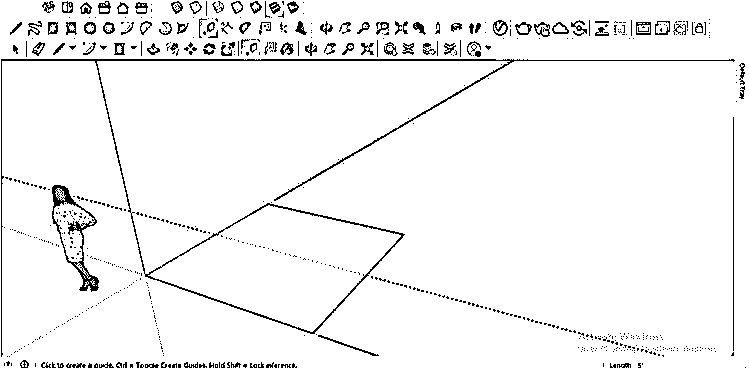

我会对其他维度做同样的事情。

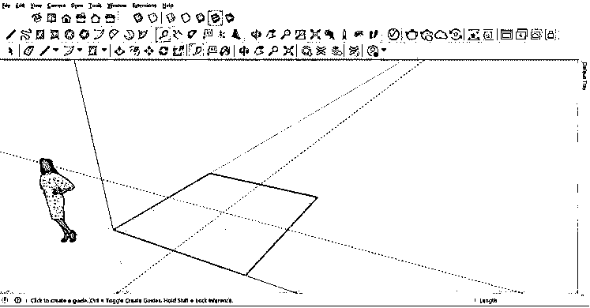

现在使用缩放工具向内拖动外边缘，因为我在这里提到的改变的尺寸在这个 5' x 5 '的矩形内。因此，当您将边缘拖动到辅助线附近时，它会自动捕捉到辅助线。

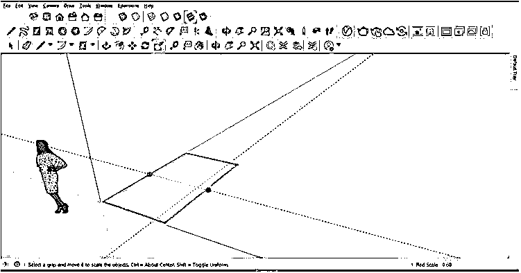

我将重复同样的另一边，然后我们可以得到我们想要的尺寸。

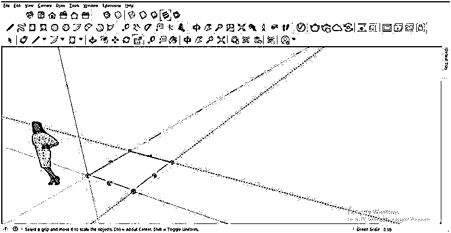

我现在将在推/拉工具的帮助下给这个矩形增加一些高度，然后从工具面板中选择尺寸工具。

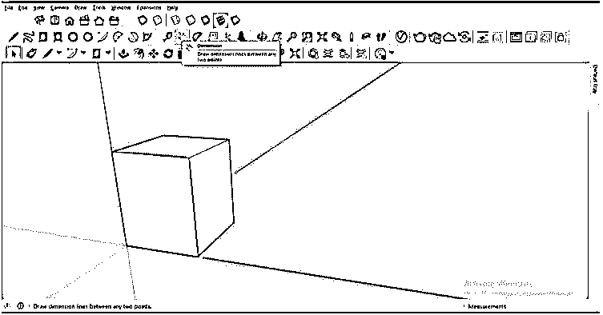

使用此工具，我们可以显示任何边的尺寸，首先，在您想要开始测量的第一个角上单击，然后在您想要结束测量的矩形的第二个角上单击。

然后向上拖动它，这样我们就能正确地看到它。

你可以对另一边做同样的事情。

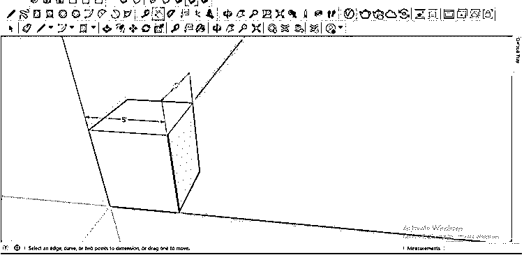

当您在显示的尺寸侧进行任何类型的更改时，它将自动更新尺寸的书写文本。例如，我将选择这个三维形状的侧面，并在推/拉工具的帮助下以相同的方向挤压它。你会注意到，挤压这一边时，这一边的尺寸也会改变。所以你也用这种方法改变维度。

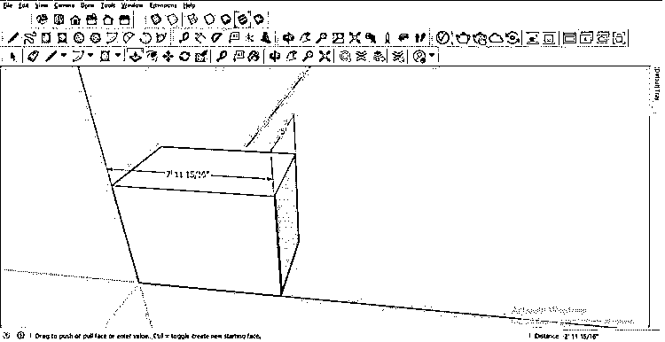

如果您想添加一个精确的值，那么只需在 Dimensions 框中输入该值，然后点击键盘上的 enter 按钮。

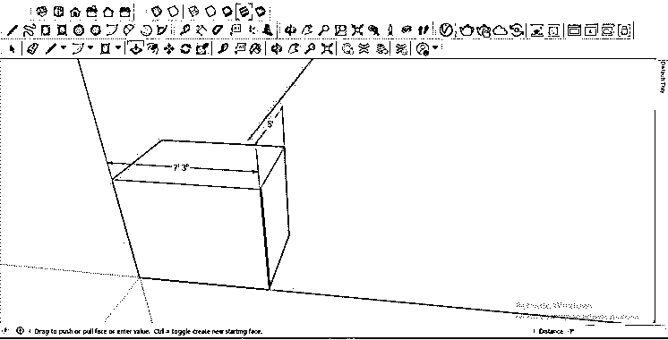

例如，如果希望此边为 12 '，那么我将在测量框中输入 7 '，当我按 enter 时，它将增加 5 '，并且此边的总宽度将为 12 '，这将自动更新显示的尺寸。

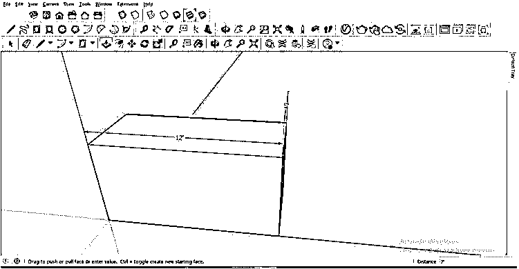

您还可以根据自己的需要在显示的尺寸中添加任何文本。例如，我想将文本宽度添加到该尺寸，所以我将双击显示尺寸的文本并键入我的文本。

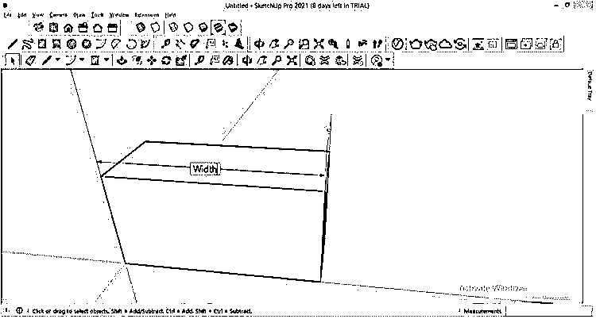

而且会这样更新。

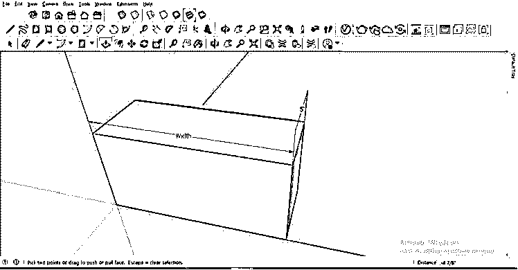

但是我也想用这个文本显示尺寸，这样我就可以在我工作的任何地方很容易地改变尺寸，为此，只需输入你的文本并从键盘输入特殊字符<>，然后按下键盘的回车键。

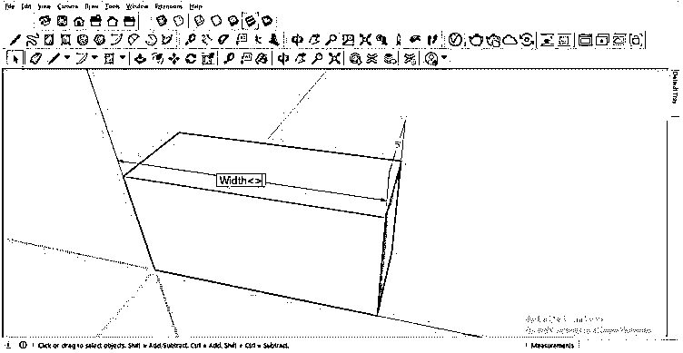

按 enter 键后，尺寸也将与文本一起显示。

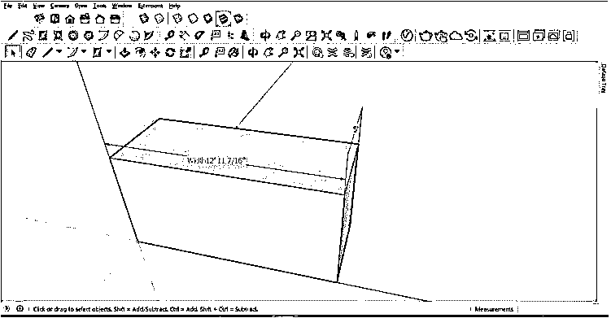

您还可以更改显示尺寸的样式，这将有助于您更改尺寸，因此，请转到菜单栏的窗口菜单(位于工作屏幕的顶部),然后单击它。从列表中选择型号信息选项。

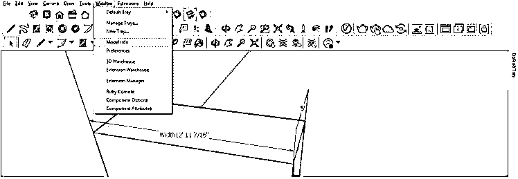

将会打开一个模型信息对话框，在这个对话框中，您将会在它的列表中找到尺寸选项。所以点击它。

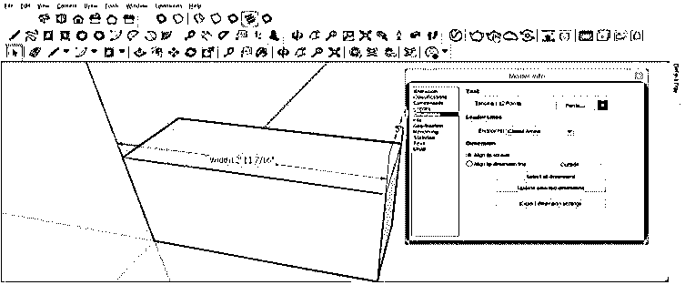

通过点击此选项的字体选项卡，您可以更改字体样式和字体大小，以便在进行任何更改时，您可以正确地看到它。

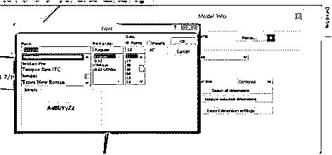

如果单击“字体”( Fonts)选项卡旁边的颜色框，则可以从该颜色框中为显示的文本选择一种颜色，如果模型中有相同颜色的材料，这将有助于区分尺寸和 3d 模型。

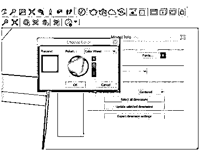

您还可以更改维度的显示类型；例如，如果我从这里选择居中选项，并单击“更新所选尺寸”按钮。

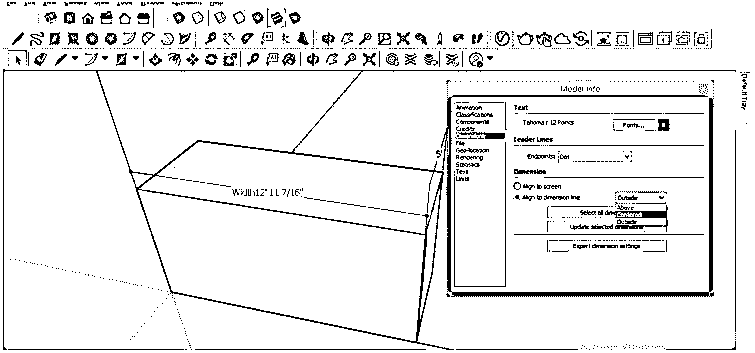

然后我会像这样进入尺寸线的中心。

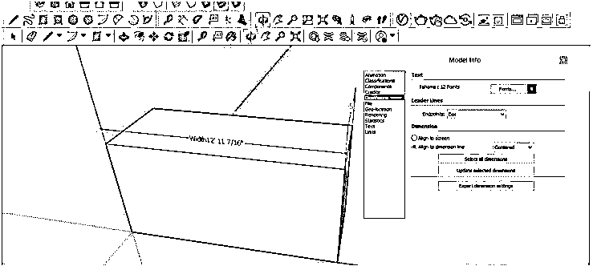

这样，你可以在这个软件中改变物体的尺寸。

### 结论

在对这个话题进行了很好的讨论之后，你可以理解在这个软件中通过一次点击或使用一个工具来改变尺寸是相当困难的，但是我们可以通过做一些安排和使用一些工具以及这个软件的功能来非常顺利地完成它。

### 推荐文章

这是 SketchUp 更改尺寸的指南。这里我们讨论一下在 SketchUp 中改变尺寸的技巧。您也可以阅读以下文章，了解更多信息——

1.  [SketchUp 替代方案](https://www.educba.com/sketchup-alternative/)
2.  [SketchUp 旋转](https://www.educba.com/sketchup-rotate/)
3.  [SketchUp AutoCAD](https://www.educba.com/sketchup-autocad/)
4.  [建筑设计类型](https://www.educba.com/architecture-design-types/)

