# SketchUp 导入

> 原文：<https://www.educba.com/sketchup-import/>

## SketchUp 导入简介

SketchUp 导入是 SketchUp 的文件菜单的一个选项，通过它你可以导入不同的 2D 绘图文件到它里面来制作那个绘图的 3D 模型。您可以导入多种 2D 和 3D 建模软件的不同类型的文件格式，如. 3ds、.bmp，。dwg，。dxf，。jpg，。png，。psd 等等。您不仅可以将图形文件导入 SketchUp，还可以导入任何图形平面图的 jpge 或 png 文件。今天，我将告诉您如何在 SketchUp 中导入 AutoCAD 文件，并准备开始创建一个带有布局的 3D 模型。所以让我们开始学习吧。

### 如何在 SketchUp 中使用 Import？

导入是这个软件的一个很好的功能，我们可以很容易地掌握它。这里我用两个例子向大家解释一下这个软件的导入选项。在第一个例子中，我会告诉你导入的 AutoCAD 文件。dwg 文件扩展名，而在第二个例子中，我将通过导入 jpg 文件格式来告诉你 2D 的绘图布局。

<small>3D 动画、建模、仿真、游戏开发&其他</small>

对于导入选项，请转到菜单栏的文件菜单，它位于工作屏幕的顶部。所以点击它，在这个菜单的下拉列表中，你会发现导入选项。

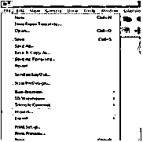

一旦你点击了这个选项，一个导入对话框就会像这样打开。在这里的下拉列表中支持的文件格式，你可以检查有多少文件格式可以支持，当你导入任何文件。

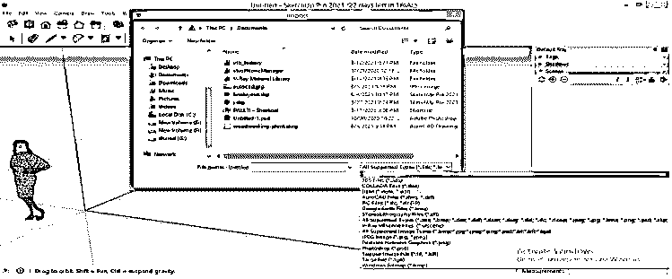

在这里，我将选择“所有支持的文件”选项来查看 AutoCAD。打开的文件夹中的 dwg 文件。

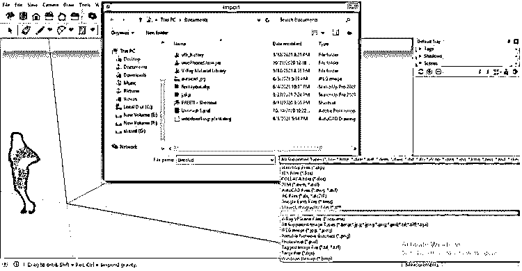

我将选择我从互联网上下载的这个 AutoCAD 文件。这是一个简单房屋模型的平面布置图。您可以使用自己的 AutoCAD 文件来了解该主题。选择文件后，单击此对话框的选项按钮。

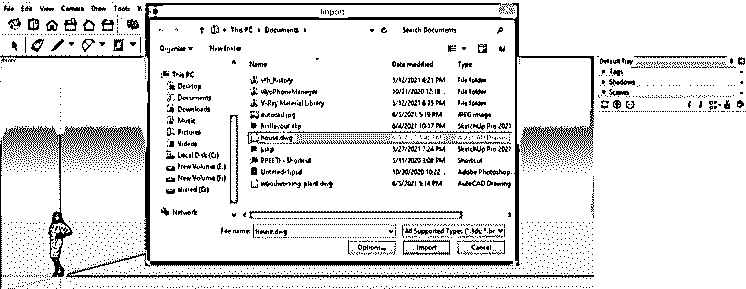

一旦你点击它，你就会看到这种类型的对话框。在此对话框中，我们有一些选项，可以根据需要启用或禁用。

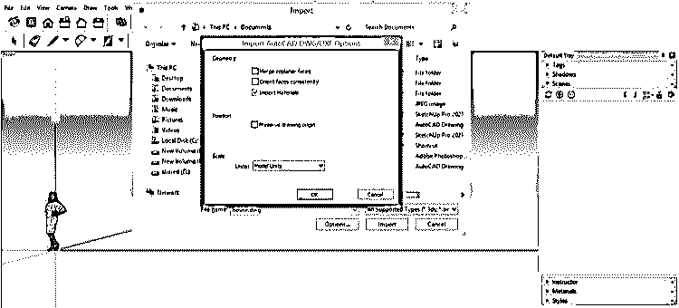

例如禁用/启用导入绘图材料，为导入绘图保留原点等等。

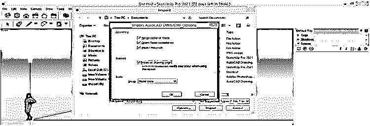

选择缩放绘图或创建 3D 模型所需的单位。我将从列表中选择“脚”选项，然后单击此对话框中的“确定”按钮。

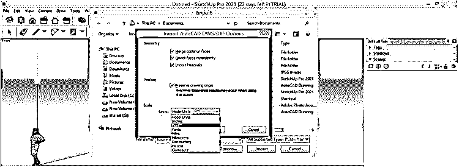

现在，在完成所有需要的设置后，点击这个对话框的导入按钮。

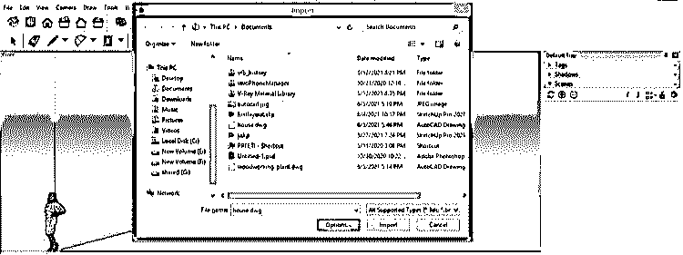

导入您的之前。SketchUp 中的 dwg 文件，它将向您显示绘图的详细信息，即在此导入的内容，如层数、绘图中的块数和绘图中的圆弧数等。

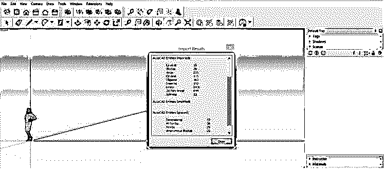

它将在 SketchUp 的基础上这样导入。

现在，我将切换到俯视图，从顶部平面看这幅图。

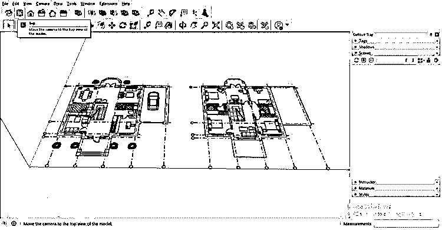

如果导入的文件没有导入此绘图所需的精确尺寸，您可以根据所需的尺寸和定位工具面板对其进行缩放，并从此处使用卷尺工具。

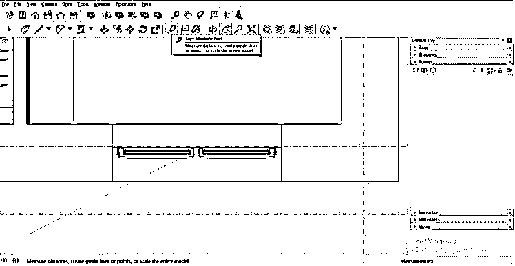

并用它来测量任何零件的尺寸。例如，对于测量尺寸，通过单击指定要开始的第一个点，然后将其拖动到下一个点并单击。

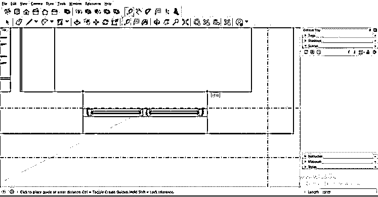

点击后，输入您想要的测量值，例如我将在该软件的测量框中输入 2’。您可以在工作屏幕的右下角找到这个框。

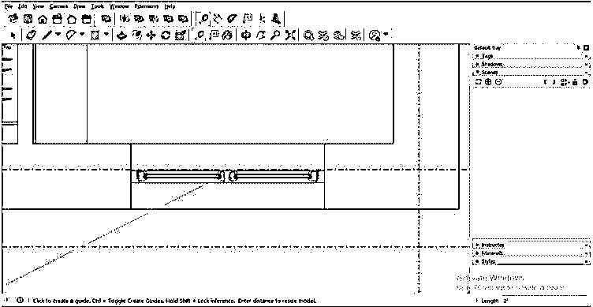

一旦你输入值并按下键盘上的回车键，它会问你‘你想调整模型的大小吗？我将单击此框中的“是”按钮。

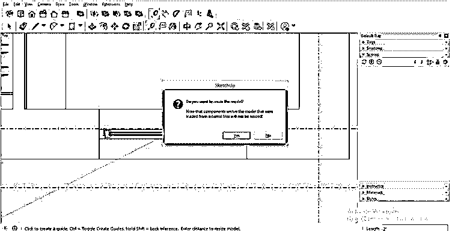

现在你可以看到你的模型消失了，但它并没有完全消失；它必须缩小规模。所以放大来看。

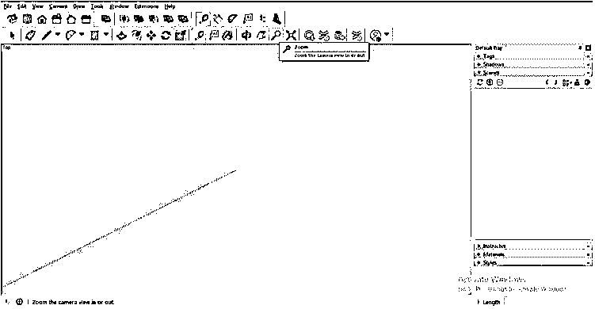

像这样放置。

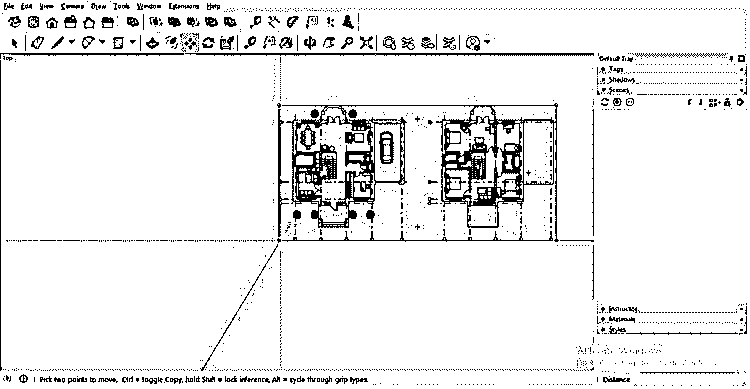

现在，当您选择它时，您可以看到它是一个组件。

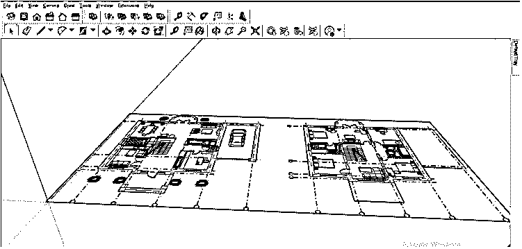

因此，你必须分解它，并选择你的绘图，然后右键单击。现在点击下拉列表中的爆炸选项。

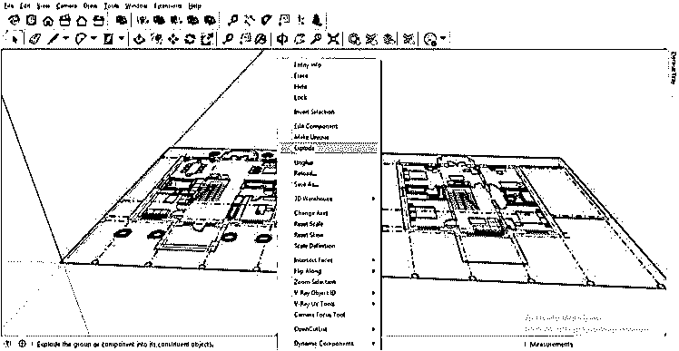

现在，您可以选择在此图形中分隔的任何对象。

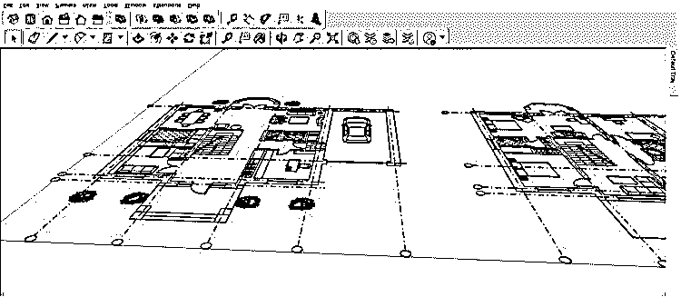

使用“线”工具，可以为墙创建边界，并开始在导入的文件中设计三维模型。

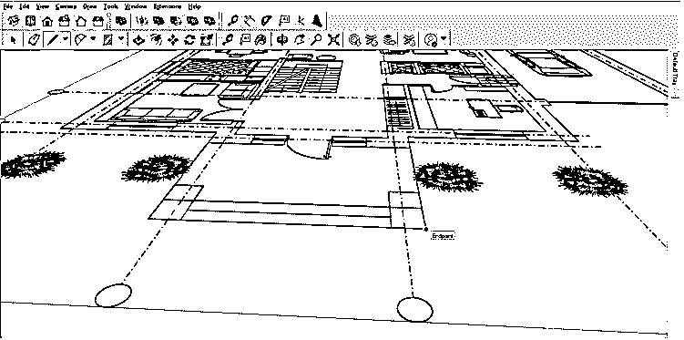

现在让我告诉你如何使用导入选项导入 jpg 文件格式。所以，再次进入文件菜单的导入选项。

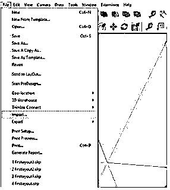

并选择 AutoCAD 绘图的 jpg 文件。确保启用此对话框中图像选项的单选按钮，因为我们将把它作为图像而不是纹理导入。现在点击这个对话框的导入按钮。

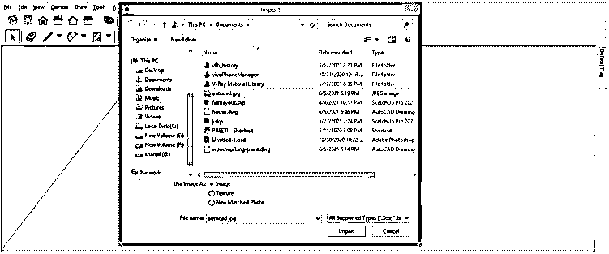

现在它会像这样导入，你可以把它放在轴的原点。

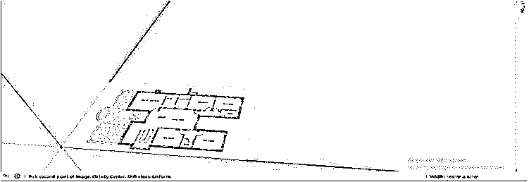

如果我们选择这个图像文件，它将在 SketchUp 中作为一个矩形平面。

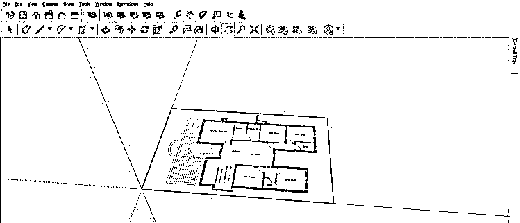

你也可以像我们在 auto cad 中那样缩小它。dwg 文件格式。使用工具面板的卷尺工具测量绘图上的任何尺寸。

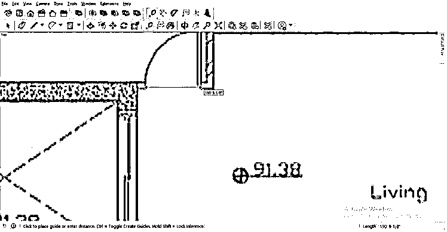

并输入该尺寸的值，然后按键盘上的 enter 键。

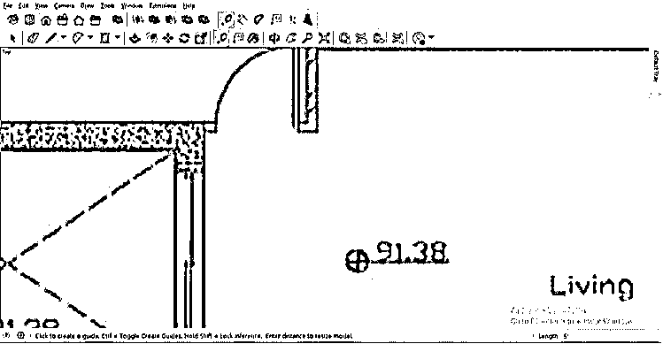

现在它会像这样缩小。

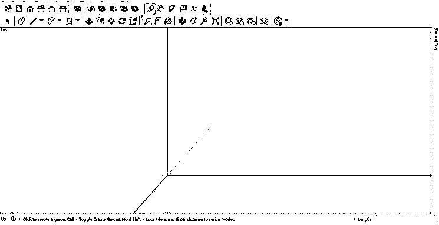

您可以再次测量尺寸，查看接近输入值的缩放值。

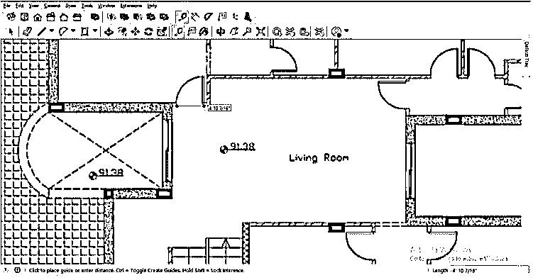

要跟踪该布局，首先，分解它，要分解它，选择该文件并右键单击，然后从下拉列表中选择分解选项。

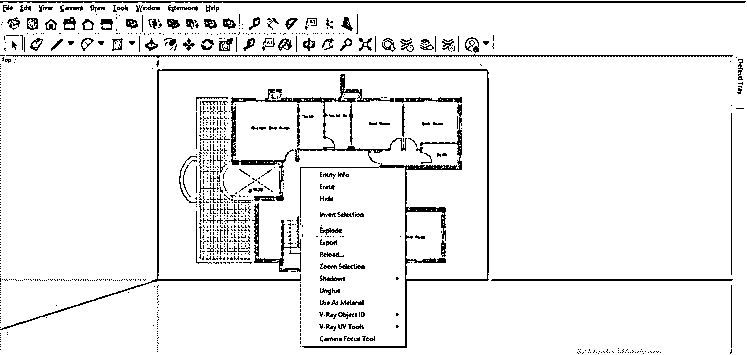

现在，您可以开始使用该软件的不同 3D 建模工具为您的绘图创建 3D 组件。

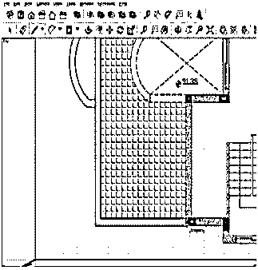

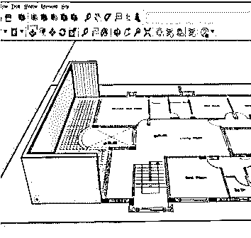

### 结论

现在你可以理解 SketchUp 中的导入选项是什么了吧？以及如何在该软件中导入任何图形文件以及任何图形的图像文件。阅读完本文后，您可以调整导入的布局文件，使其与开始 3D 建模兼容。

### 推荐文章

这是一个 SketchUp 导入的指南。在这里，我们将讨论如何在 SketchUp 中导入 AutoCAD 文件，并准备开始使用其布局创建 3D 模型。您也可以看看以下文章，了解更多信息–

1.  [SketchUp 旋转](https://www.educba.com/sketchup-rotate/)
2.  [SketchUp 架构](https://www.educba.com/sketchup-architecture/)
3.  [SketchUp AutoCAD](https://www.educba.com/sketchup-autocad/)
4.  [CorelDRAW 标志设计](https://www.educba.com/coreldraw-logo-design/)

