# SketchUp 2D

> 原文：<https://www.educba.com/sketchup-2d/>

## 2D SketchUp 简介

SketchUp 2D 意味着你也可以在这个软件中创建 2D 绘画，尽管它是一个 3D 建模软件。有一些 2D 工具，您可以通过它们创建 2D 绘图平面来开始创建 3D 模型，这些工具是线工具、弧工具、2D 形状工具、手绘工具等。在 SketchUP 中处理 2D 时，您需要全神贯注，因为在此过程中有三个轴处于活动状态。你只需要在脑海中记住一些要点，然后在 SketchUp 中创建一幅 2D 的画对你来说就变得很容易了。

### 如何在 SketchUp 中使用 2D？

你可以在这里用不同的方法在这个软件中创建 2D 图；我会告诉你一个非常简单易懂的方法，但是在我们开始画 2D 之前，让我们先看看有什么工具可以用来画 2D，以及我们如何使用它们。在 SketchUp 的顶部有一个工具面板，在这个面板中，你会发现一些 2D 形状。

<small>3D 动画、建模、仿真、游戏开发&其他</small>

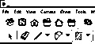

例如带有铅笔图标的线条工具、旁边的弧形工具以及弧形工具旁边的形状工具。

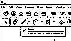

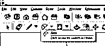

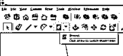

在形状工具中，您将找到矩形、旋转矩形、圆形和多边形。

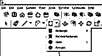

让我们借助形状工具中的矩形工具来创建一个矩形。您可以通过按键盘上的 R 键激活该工具。

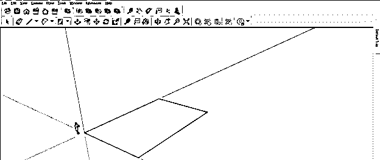

然后，我将在工具面板的线条工具的帮助下，在这个矩形上绘制随机的形状。所以你可以看到这个随机的形状是画在矩形的同一个平面上的。

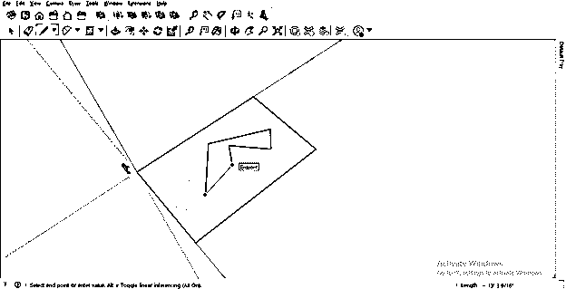

但是当你改变视角时，你会发现它并没有完全画在同一平面上；有些线画在另一个平面上。

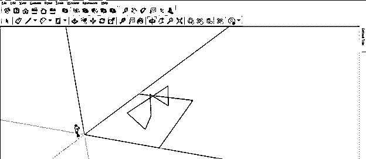

因此，在使用线条工具或手绘工具绘制任何东西时，请确保您在同一平面上创建点，并且您可以通过识别该点的“正面”高光来理解它。

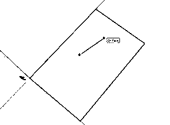

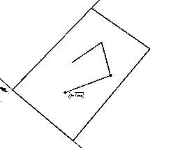

现在你可以看到它完全在所画矩形的同一平面上。

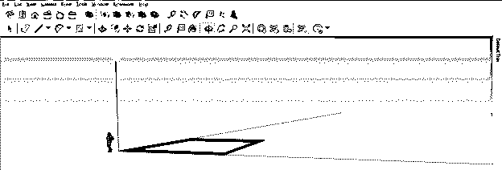

你可以用同样的方法画出另一个形状来制作任何几何图形。比如，我会借助圆形工具画一个圆。

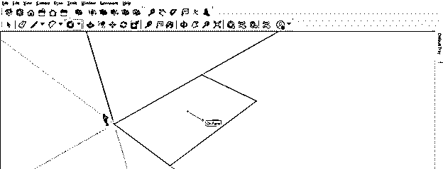

然后用选择工具选择这个圆内的区域。

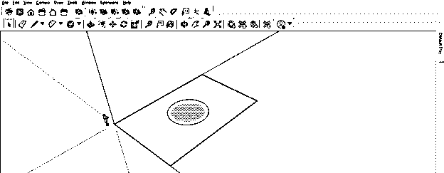

并按下键盘的删除按钮，从矩形形状中减去该区域。

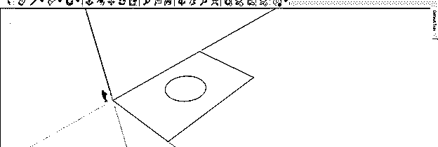

现在让我告诉你你如何能与 2D 一起创作建筑平面图。这是 autocad 平面图的 2D 图，我会用它来参考 SketchUp 的 2D 图。我已经从网上下载了。

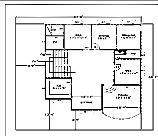

现在，我将把这张图并排放到这个软件中，并切换到软件的俯视图。

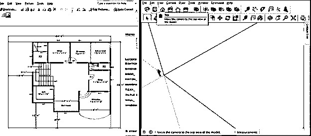

并从工具面板中选择一个攻丝测量工具。

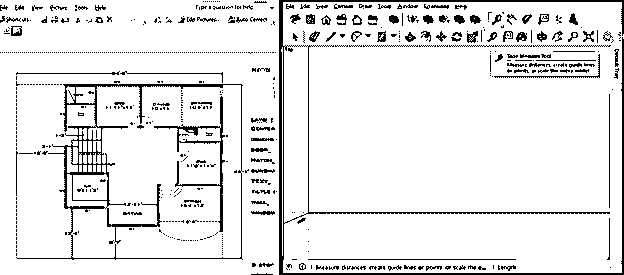

现在使用卷尺工具，创建两条指导线。一个是水平的，第二个是垂直的。接下来，我将从这些线的交点开始画这幅 2D 图。

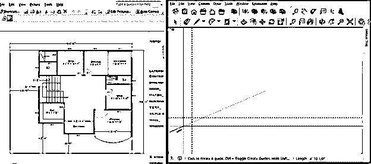

我没有照原样考虑这个布局的所有维度。我只是向你解释你可以如何与 2D 绘画，所以假设这个布局的墙的厚度是 1。

现在，我将首先勾勒出这个大约为 54' x 46 '的布局，因此我将在距离垂直参考线 54 '处创建一条基准线。我会在这个软件右下角的测量框里输入 54’。

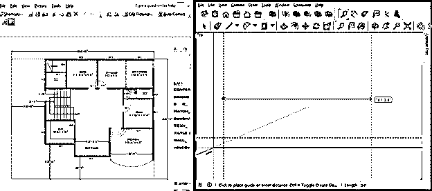

和 46’。

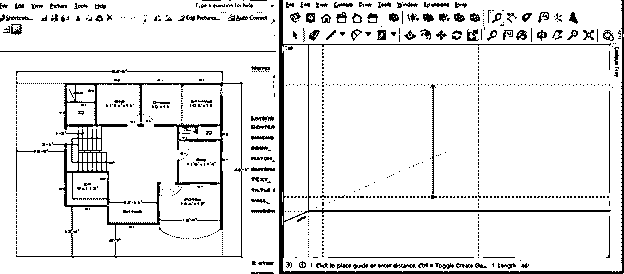

现在我将从布局的左上角开始绘制，这样我将从这两条线的顶部交点开始。但是，首先，在墙的厚度处取一条参考线，即 1 英尺。

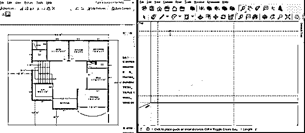

然后从这个布局的另一边做同样的工作，增加墙的厚度。现在假设第一个房间的尺寸为 11' x 9 '，那么我将在距离顶部水平线 11 '的位置创建一条基准线。

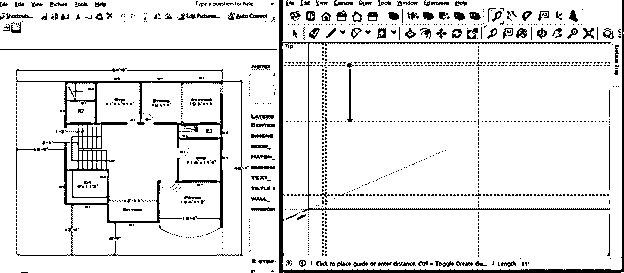

从垂直基准线开始做同样的事情，这次在距离 9 '处画线。

我将在这个房间中以 4 '的距离添加一面墙，并为其提供 1 '的墙厚度。

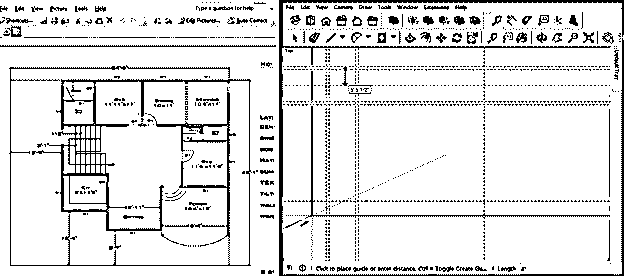

我将根据提到的尺寸为这个布局的顶部创建指南。现在你可以使用线条工具来创建这个布局。

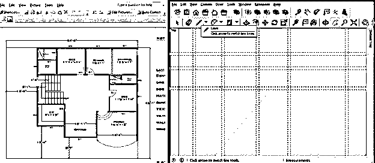

开始像这样画画。

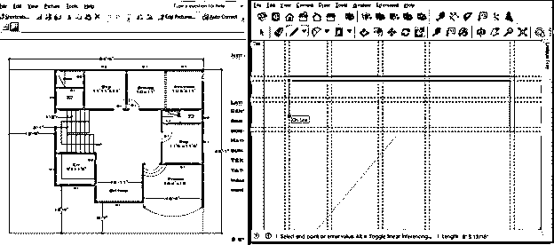

或者你也可以用矩形工具来完成。所以在这些房间的角点周围画一个矩形。

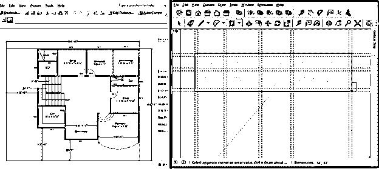

然后从壁厚的角点再画一个矩形。

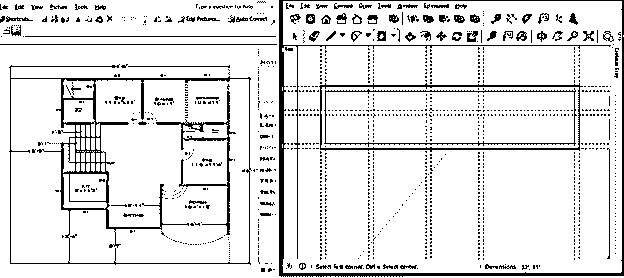

根据布局在房间中绘制矩形以添加部分。

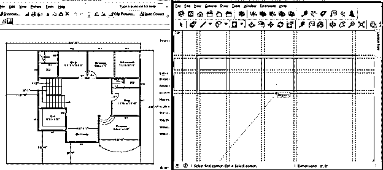

现在，您可以通过选择这些指南，然后按下键盘上的删除按钮来删除它们。我建议你在创建完布局的一个部分后删除指南，这样你就不会感到困惑了。

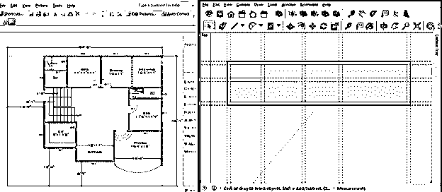

现在，为了添加门，我将在距离墙 1 '处添加一条新的参照线。

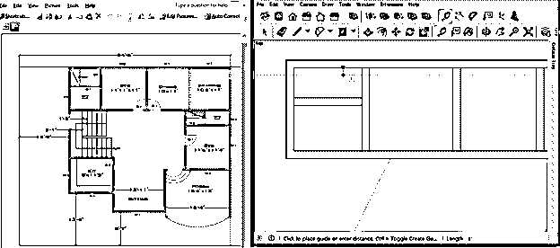

假设门是 2' x 7 '，那么我将在距离 2 '处添加另一条参考线。

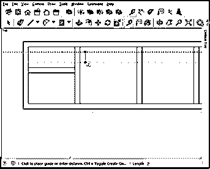

你可以在这里画一个长方形作为门。

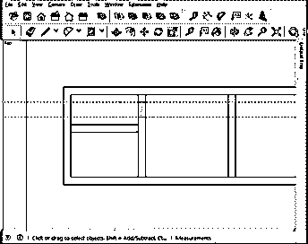

您可以使用更多参考线来创建布局平面的另一扇门，然后从工具面板中选择橡皮擦工具。

像这样擦掉门区域的线条。

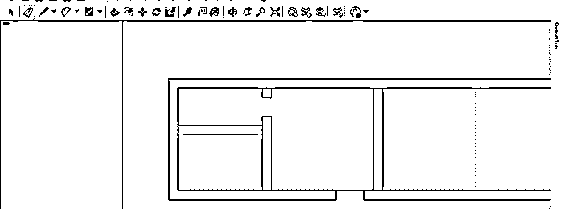

您可以使用此软件的其他 2D 工具绘制其他形状，以便在此布局中创建另一个对象。

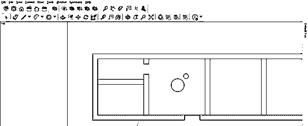

我告诉了你创建这个布局的一部分的 2D 绘图的一些步骤，你可以用同样的方法完成这个绘图。

### 结论

我相信现在你可以理解如何在 SketchUp 中使用 2D 了？在画任何一幅 2D 的画时，你必须牢记的要点是什么？我会建议你开始练习 2D 工具和飞机，这样你就能明白如何在同一架飞机上工作而不会把事情弄糟。

### 推荐文章

这是一个 SketchUp 2D 指南。在这里，我们讨论如何在 SketchUp 中与 2D 一起工作，以及在任何 2D 绘画中对你有帮助的要点。您也可以看看以下文章，了解更多信息–

1.  [SketchUp 替代方案](https://www.educba.com/sketchup-alternative/)
2.  [SketchUp 旋转](https://www.educba.com/sketchup-rotate/)
3.  [SketchUp 架构](https://www.educba.com/sketchup-architecture/)
4.  [SketchUp Vray](https://www.educba.com/sketchup-vray/)

