# SketchUp 渲染

> 原文：<https://www.educba.com/sketchup-rendering/>

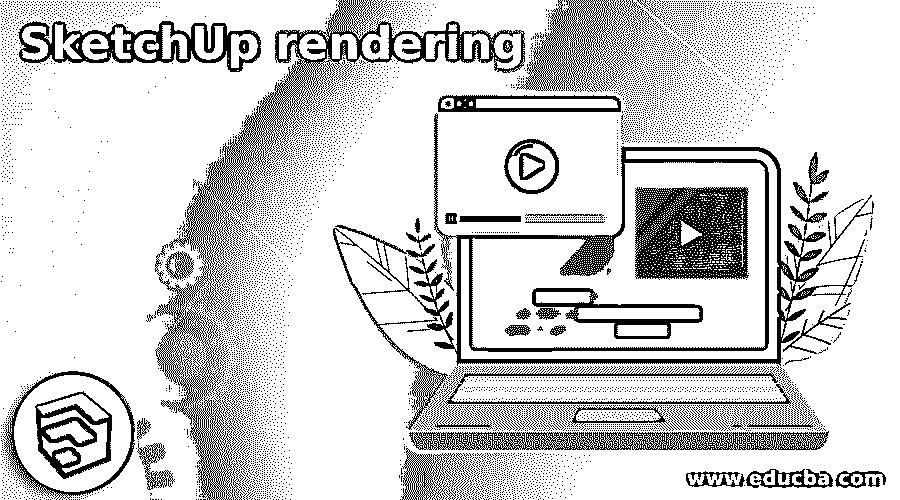

## SketchUp 渲染简介

SketchUp 渲染是一个过程，通过它我们可以表示或看到我们设计的 3D 模型的照片级真实感视图。通过渲染，我们可以了解我们的模型在真实世界中使用所有材质(环境、阳光等)后的样子。)围绕着它。有许多渲染插件，通过它们我们可以对我们的模型进行逼真的渲染，V-ray 就是其中一个有效的插件。使用 V-ray，我们可以获得高质量的渲染，并使用它的材质来提高我们应用到模型中的材质质量。所以你必须通过一些设置来获得最好的渲染效果。所以让我们找到那些设置和渲染的过程。

### 如何在 SketchUp 中进行渲染？

我们可以通过调整 V-ray 插件的参数来进行渲染。当然，在 V-ray 中还有很多东西需要你慢慢学习，但是让我来告诉你，你能很好地掌握哪些参数和设置来获得最佳的渲染效果。在我们开始之前，让我们制作一个简单的模型，我们将在渲染过程中使用。然后，您可以在自己的模型上应用下面讨论的渲染设置。

<small>3D 动画、建模、仿真、游戏开发&其他</small>

我将首先从工具面板中取出矩形工具，它位于工作屏幕的顶部，或者按 R 作为它的快捷键。

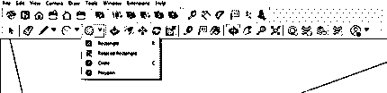

现在我将制作一个像这样的矩形，然后在偏移工具的帮助下偏移一段距离。我没有采取任何具体的维度来创建这个模型。

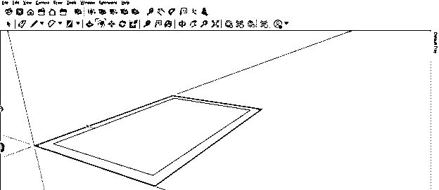

现在，用推/拉工具，我将通过挤压这个矩形的边界来增加它的高度。

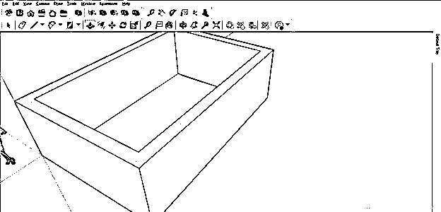

现在，我将在这个简单的房子里制作一个像模型一样的门窗缝隙区域。

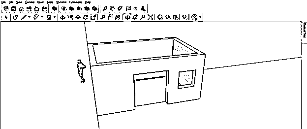

现在让我们将任何材质应用到这面墙上，要应用它，请转到默认托盘的材质面板，并单击它的下拉箭头键。您会在工作屏幕的右侧找到它。

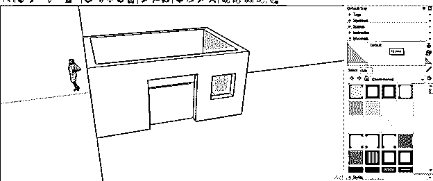

如果没有材质面板，您可以通过菜单栏的窗口菜单，并转到它的下拉列表的默认托盘选项来拥有它；然后，在新的下拉列表中，你会发现材料选项。

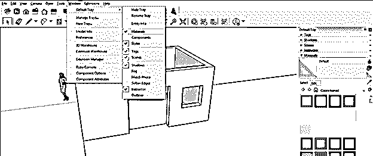

我将应用瓷砖材料到这个房子模型的墙上。

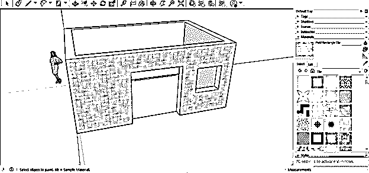

现在让我们转到 V-ray 插件，你会在扩展菜单中找到 V-ray 插件，在它的下拉列表中，我们会有一个 V-ray 选项。如果您已经安装了该选项，您可以在列表中看到它。

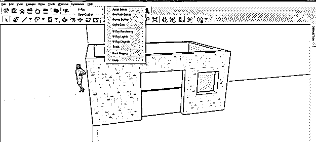

或者转到“查看”菜单，单击工具栏上的“向下滚动列表”选项。

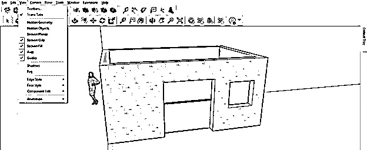

在工具栏的对话框中，我们有 V-ray 的不同面板选项，您可以通过单击它们的复选框来根据您的选择启用它们。

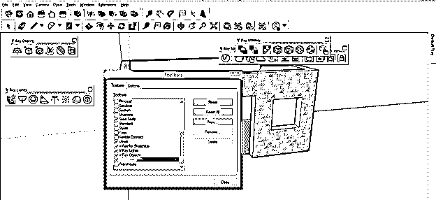

现在我将把这些面板像这样放在工具栏区域，因为它们是可移动的。

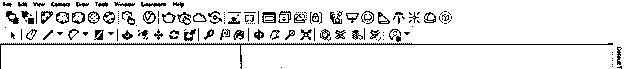

如果您想直接渲染您的模型，而不通过 V-ray 面板的“资源编辑器”选项进行任何设置，您只需单击此渲染按钮即可查看渲染的输出结果。

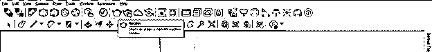

在这个面板中还有一个按钮:渲染交互，这意味着使用这个渲染按钮，在模型的渲染过程中，您可以在渲染对话框中看到实时更改(您在模型中进行的更改)。

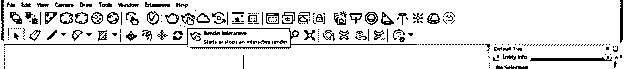

我将首先告诉你一些在渲染中获得最佳输出结果的设置。为此，单击 V-ray 面板的“资源编辑器”按钮。

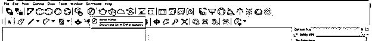

单击它后，将会打开“资产编辑器”对话框。它将在材料选项中显示所有应用材料的列表。因此，举例来说，它现在会显示房子的墙壁的材料和虚拟人物剪影的材料。

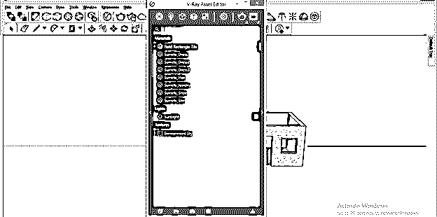

现在点击侧箭头按钮打开材质编辑器参数框。在此框中，您可以通过对其参数进行一些设置来为您的模型创建高质量的材质。

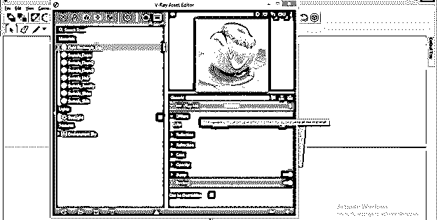

所以在你的模型上应用好质量的材质，然后点击这个对话框的设置按钮。

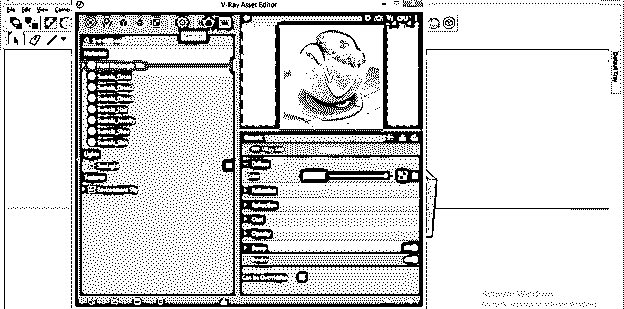

一旦你点击这个按钮，你将有这些设置在里面。首先，点击这个框的渲染选项的下拉箭头键，然后你必须在引擎选项中选择 CPU。

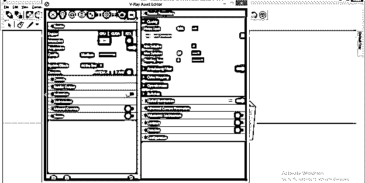

然后，通过向一侧滑动其滑块按钮来启用 V 射线(降噪器的选项)。

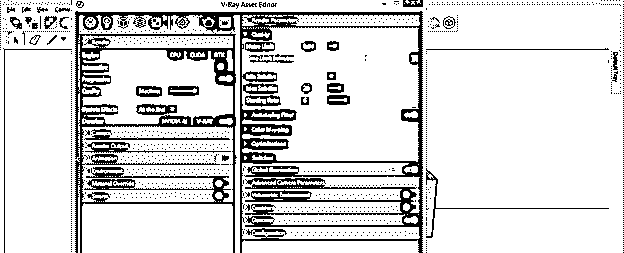

现在点击渲染输出选项的下拉箭头键，并启用安全帧选项。

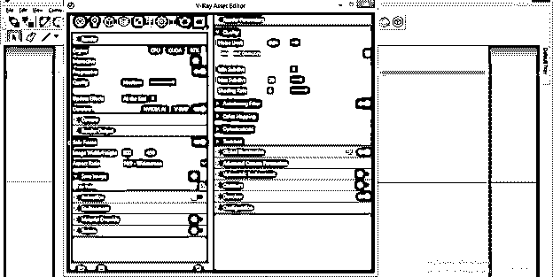

来到全局照明选项，点击它的按钮，启用它的高级设置。

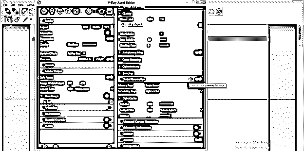

在它的高级设置中，你会发现环境遮挡选项也可以使用。此外，它将在渲染过程中保持白色和黑色(高光),以提高模型的清晰度。

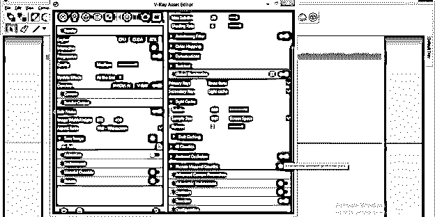

你可以使用环境遮挡的参数来改变输出。我会让它们保持原样。

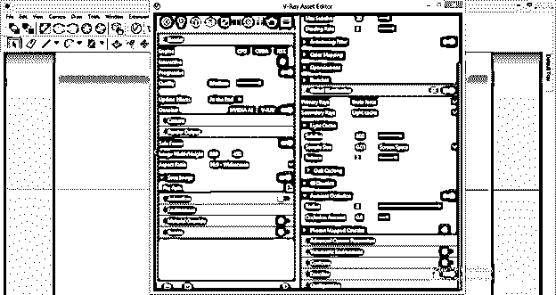

现在，在为更好的渲染输出做了所有的设置之后，用这个资源编辑器对话框的 V 射线按钮点击渲染。

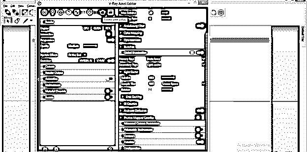

你也可以通过点击 V-ray 交互按钮来进行实时渲染。

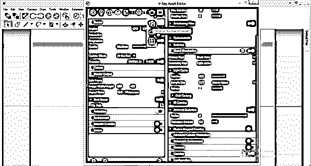

另一个选项是使用混沌云渲染，这意味着它将在云上渲染你的模型，这样你就可以将你的模型渲染与其他人在线连接。

我现在将点击渲染与 V 射线按钮；然后，我会得到这个渲染输出对话框的名称为 V 射线帧缓冲区。当然，输出将取决于许多因素，如应用材料的质量、计算机系统的容量、V-ray 面板的设置等等。

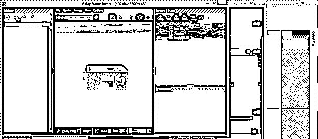

### 结论

现在，您可以很好地理解 SketchUp 中的渲染，并调整 V-ray 插件的参数，以获得模型渲染过程的最佳输出结果。我只告诉你 SketchUp 中的一个渲染插件，但是你可以尝试其他的渲染插件来分析它们的输出质量。

### 推荐文章

这是一个 SketchUp 渲染指南。这里我们一步步详细讨论如何在 SketchUp 中进行渲染，以便于理解。您也可以看看以下文章，了解更多信息–

1.  [SketchUp 替代方案](https://www.educba.com/sketchup-alternative/)
2.  [SketchUp AutoCAD](https://www.educba.com/sketchup-autocad/)
3.  [SketchUp 旋转](https://www.educba.com/sketchup-rotate/)
4.  [SketchUp 3D 模型](https://www.educba.com/sketchup-3d-models/)

