# SketchUp 图层

> 原文：<https://www.educba.com/sketchup-layers/>

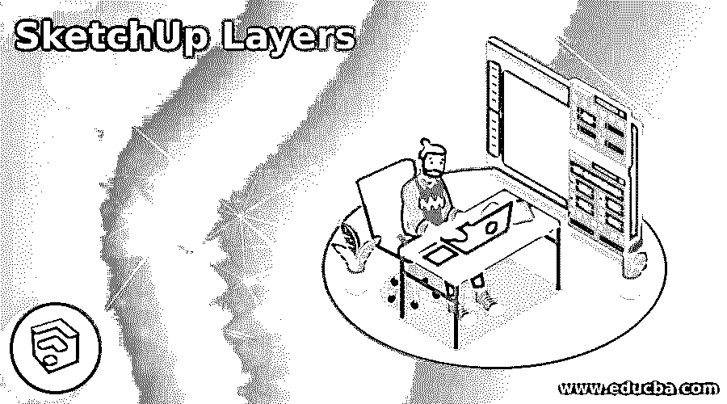

## SketchUp 图层简介

SketchUp Layers 是该软件的一个非常有用的功能，通过它我们可以将任何模型的不同组件组织在每个单独的部分中，您可以将这些部分称为层/标签。这个软件中有许多图层面板的特性，通过使用它们，我们可以很好地管理任何模型的组件。在这个软件的最新版本中，你可以找到带有名称标签的图层，它比以前版本的图层面板有更多的功能。你知道，几乎每个设计软件都有图层面板，但在 SketchUp 中是以不同的方式工作的。让我们来看看它在这个软件中是如何工作的。

### 如何在 SketchUp 中使用图层/标签？

如果您开始在此软件中使用图层面板或标签，您可以以更明确的方式管理您的工作。因此，您可以在默认的托盘面板中找到标签/图层面板，它位于工作屏幕的右侧。

<small>3D 动画、建模、仿真、游戏开发&其他</small>

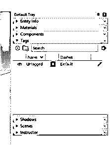

如果没有默认托盘，您可以在窗口菜单的下拉列表中找到它。然后，只需点击它启用它。

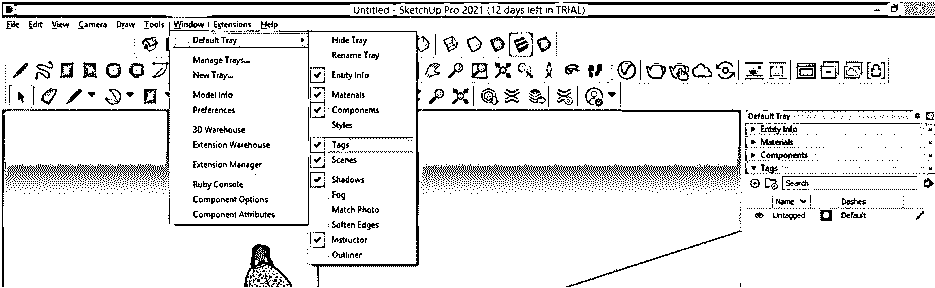

还有一种方法可以让您拥有一个可移动的标签/层面板，为此，单击查看菜单下拉列表中的工具栏选项。

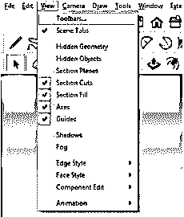

并启用“工具栏列表”对话框的“标记”选项的复选框。

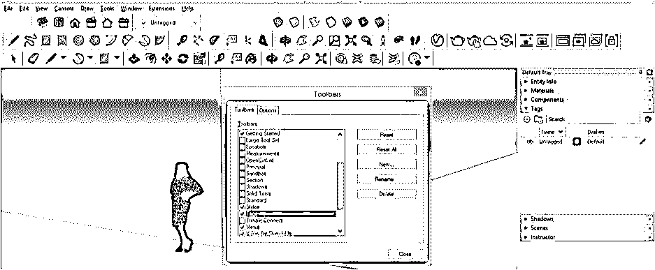

您可以将标签/层面板移动到工作窗口屏幕上的任何位置。

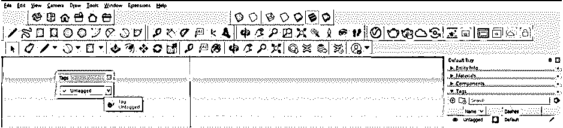

我画了这个物体。您可以在“标签”面板中看到有一个未标记的标签/层(在之前的层面板中，它由层 0 表示)，并且所有绘图对象都将位于默认标签/层中。您可以在实体信息面板中看到它。

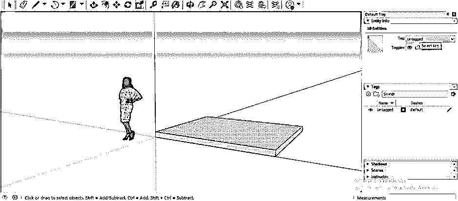

让我们创建一个新的标签/层，为此，单击该面板的加号按钮。

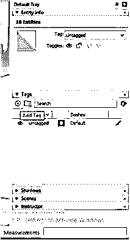

我将把它命名为地板。您可以双击任何标签/层进行重命名。

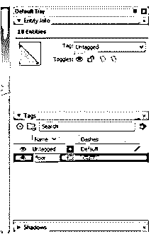

你必须记住，你必须从实体信息中分配层给任何组件，以便组件将从未标记的层移动到分配的层。因此，我将选择该组件并转到“实体信息”面板，然后从该面板的“标记”选项中选择“楼层标记”。

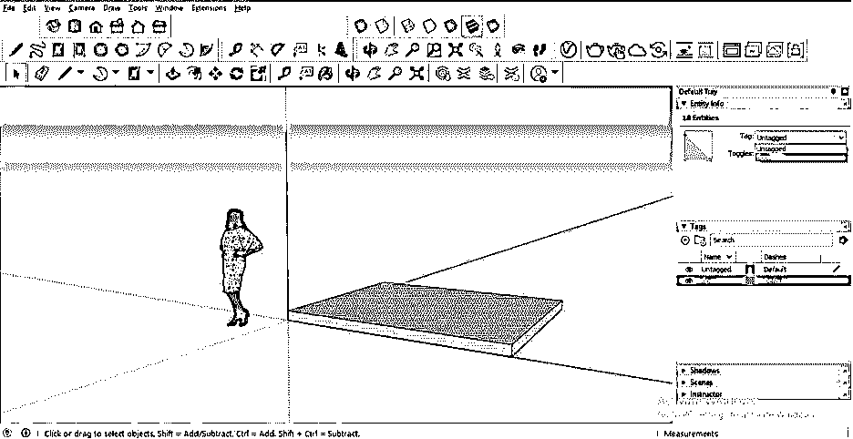

您可以看到此构件现在已指定给楼板标记/层。

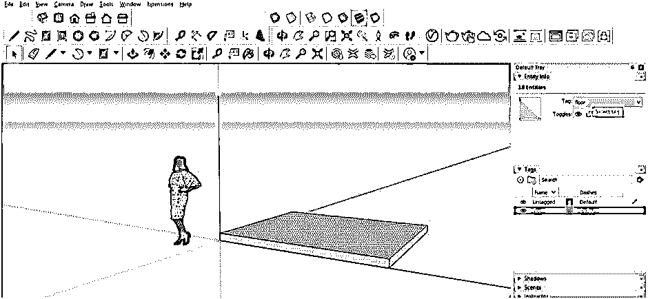

如果我点击它的眼睛按钮来隐藏这一层，那么这个组件也将隐藏。

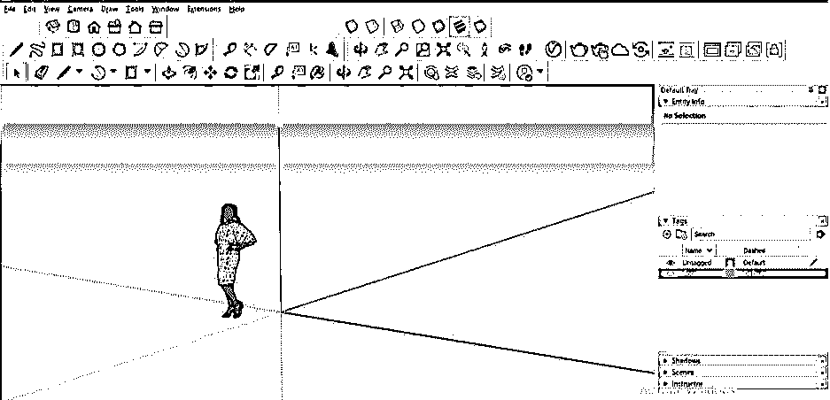

现在我将添加一个标签/层，并命名为墙。

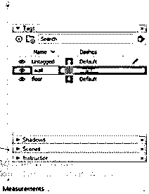

现在我要画一面这样的墙。绘制完成后，我将从实体信息面板中将其分配给墙标签/层。

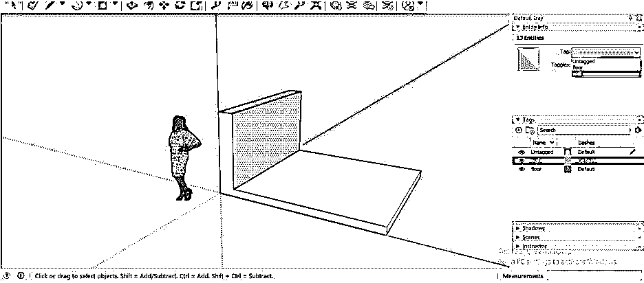

现在，我将通过单击它的眼睛按钮来隐藏墙标签/层。您可以看到一些未隐藏的部分，它们也会影响楼板层构件。

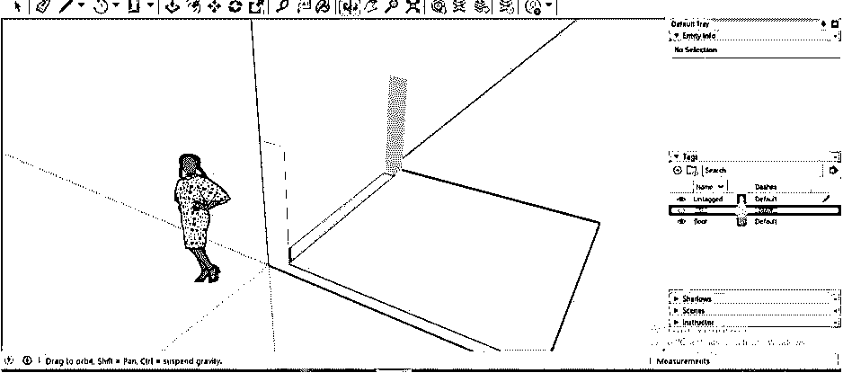

因此，在处理标签/层或 SketchUp 时，您必须对任何组件进行分组，以便在您对一个组件进行任何更改时，其他组件不会影响它。因此，我将首先选择地板组件，右键单击它，然后单击“Make group”选项，将 I 作为一个组件。

现在，我将再次绘制墙层中的这面墙，方法与之前相同。

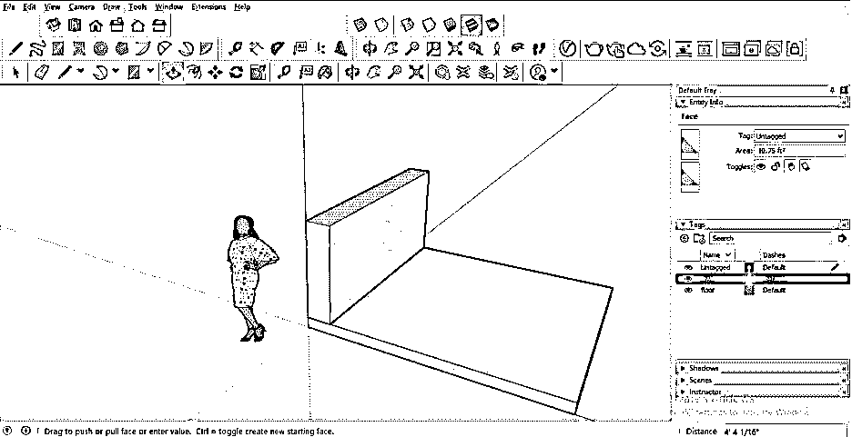

现在，这一次如果您隐藏此墙层，那么此标记的组件将会隐藏，而不会影响其他层组件。

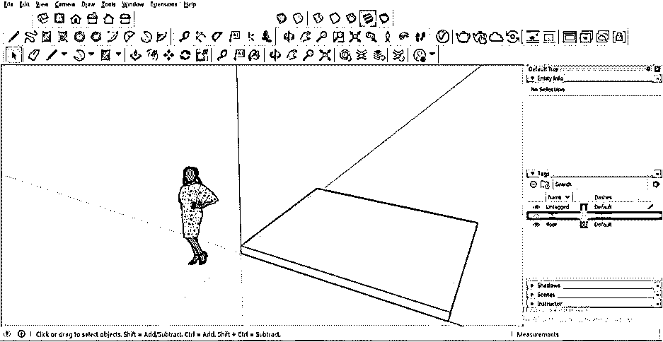

现在，我将制作一个屋顶组件，并将其分配给一个新的标记/层，这是一个屋顶标记。

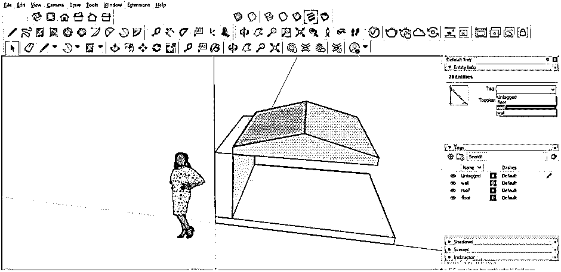

您可以只显示您想要更改的层，并通过单击这些层的眼睛按钮来隐藏多个层。我想告诉你，你必须双击编辑任何组件，因为我们已经将它们单独分组，使一个组件。

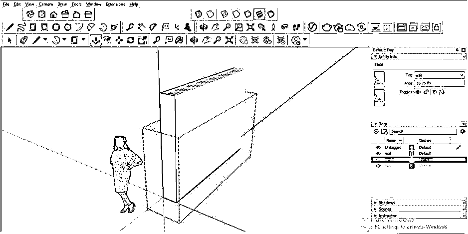

有一个按钮是详细信息按钮，所以单击它。

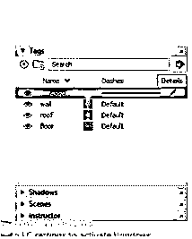

现在点击开放列表中的“标签颜色”选项。

并且每个组件将根据分配给它们的标签/层的颜色转换成彩色对象。

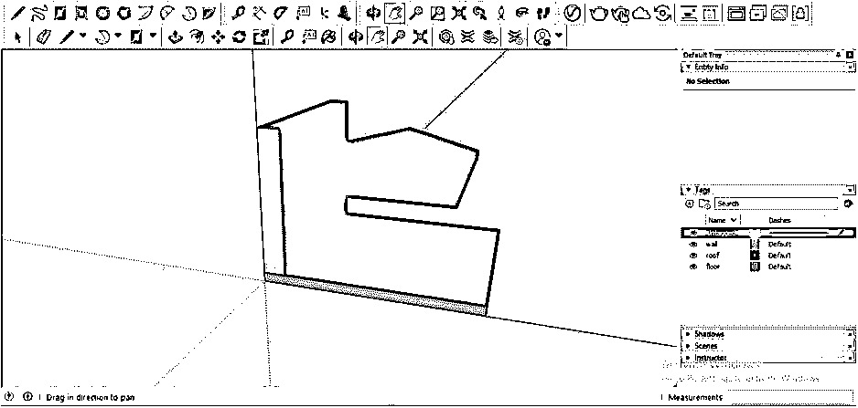

你也可以通过点击特定层的颜色框来改变任何层的颜色，一旦你点击它，一个编辑材料对话框将会打开，你可以从中选择你想要的颜色。

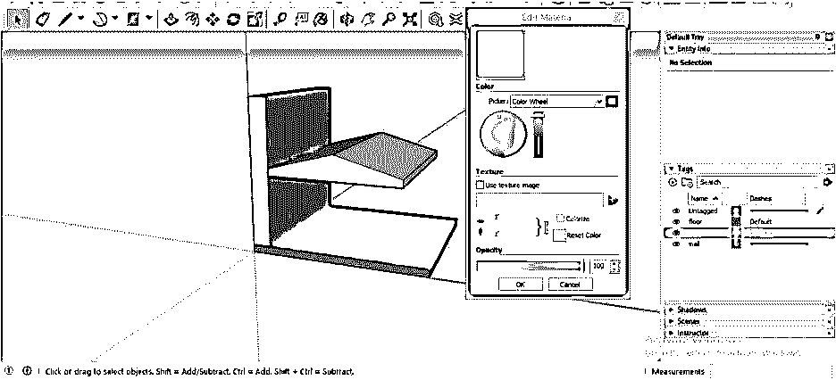

您也可以将组件的线条更改为虚线，以便分别标识每个组件。为此，单击此面板的虚线按钮的默认选项，并选择您想要的线型。

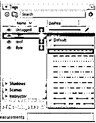

和组件将具有您指定的线型，如下所示。

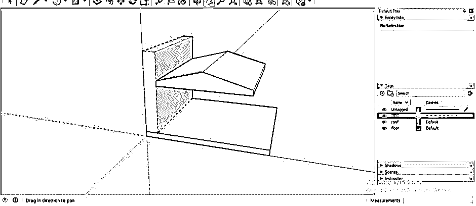

让我添加一个空层，我将它命名为椅子。

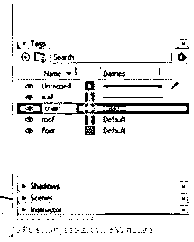

现在，单击“详细信息”按钮，然后单击下拉列表中的“清除”选项。一旦你点击清除按钮，它将自动删除所有空层。

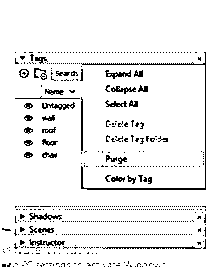

您也可以创建一个与我们创建标签相同的文件夹。因此，要创建文件夹，请单击该面板的“添加文件夹”按钮。

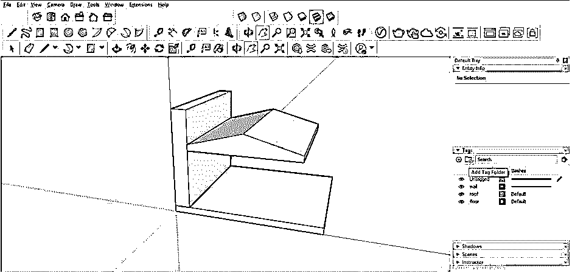

我将把它命名为外部。

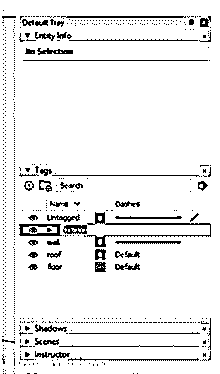

您可以将所需的标签/层移动到任何文件夹中，以便任何对象的所有层都在一个文件夹中，并且它们的管理变得容易。

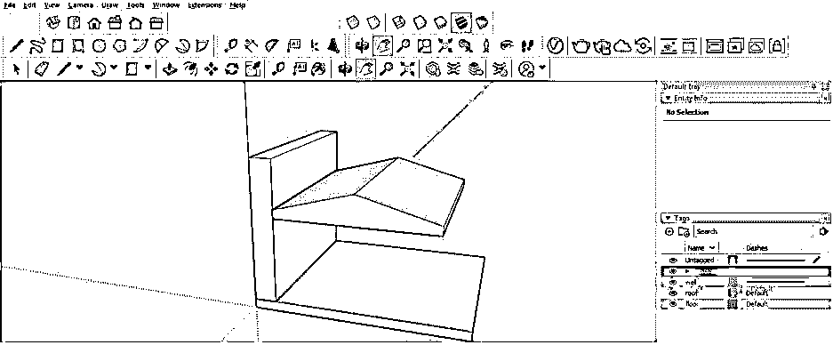

我在这个文件夹中移动了两层，当我单击下拉箭头时，我们可以看到这个文件夹中的可用标签。

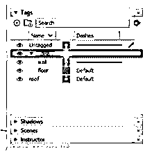

您也可以删除不需要的层。因此，选择该层，进入细节面板，然后点击删除标签选项。

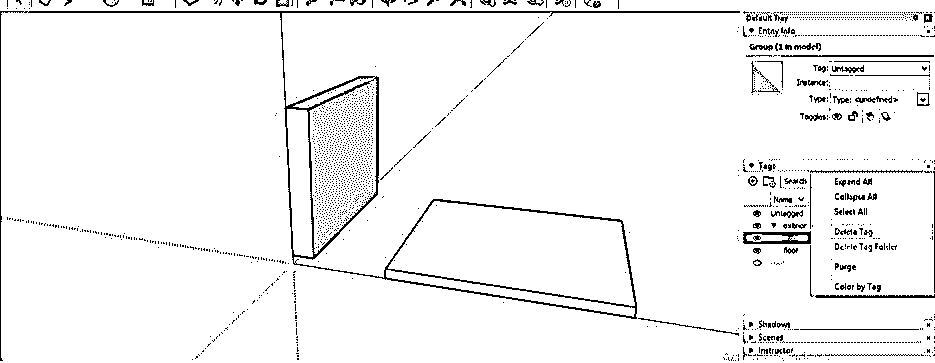

一旦你点击删除选项，它会问你是否要将被删除层的组件转移到任何其他层。您可以从该列表中选择要将该组件移动到的层。

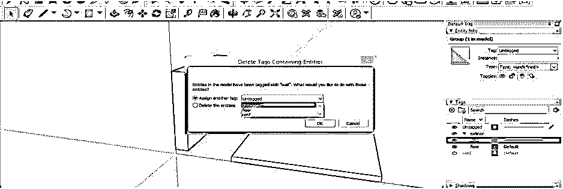

您也可以通过选择“删除实体”选项来删除该层及其组件。

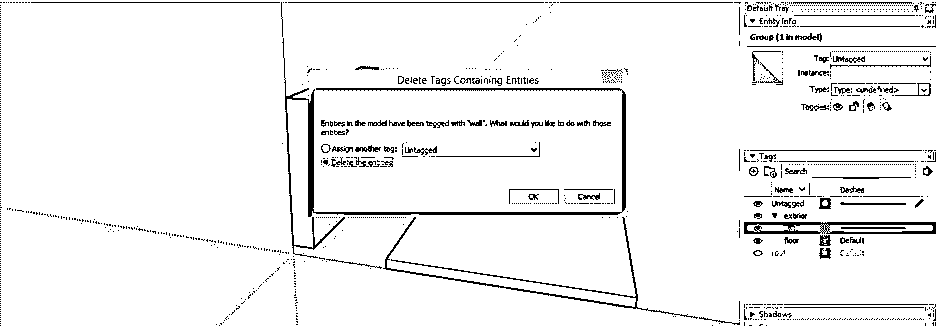

### 结论

所以我想你可以理解这个软件中的层是什么，现在在 SketchUp 的新版本中，我们知道它是标签，我告诉过你标签面板的附加功能，这些功能在以前的层面板中没有。因此，您可以使用此面板更好地管理您的工作。

### 推荐文章

这是一个 SketchUp 层的指南。在这里，我们讨论了 SketchUp 中的层的使用以及标签面板的附加功能。您也可以阅读以下文章，了解更多信息——

1.  [SketchUp 替代方案](https://www.educba.com/sketchup-alternative/)
2.  [SketchUp 旋转](https://www.educba.com/sketchup-rotate/)
3.  [SketchUp AutoCAD](https://www.educba.com/sketchup-autocad/)
4.  [CorelDRAW 标志设计](https://www.educba.com/coreldraw-logo-design/)

