# SketchUp 3D 模型

> 原文：<https://www.educba.com/sketchup-3d-models/>

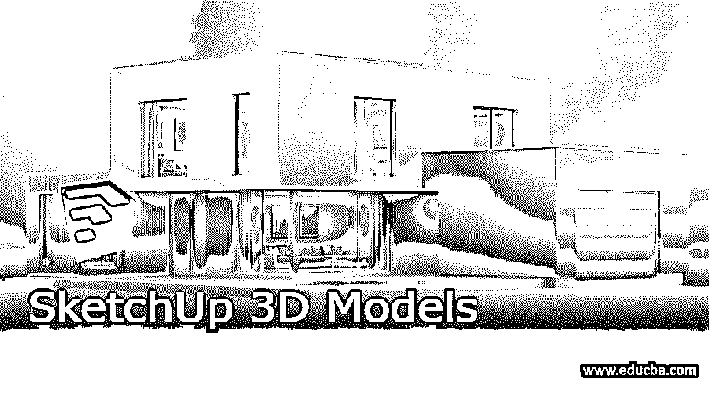

## SketchUp 3D 模型简介

SketchUp 3D 模型可以理解为通过使用该软件的不同类型的 3D 工具来创建 2D 图纸的 3D 结构。为了创建一个三维模型，我们可以使用 2D 图纸布局，并使用它作为结构的指导。在创建不同 2D 绘画的 3D 模型时，有一些事情你必须记住。我们可以创建不同工程领域和其他相关行业的若干元素或组件的 3D 模型。在三维建模中起主要作用的三维工具是该软件的推/拉工具。所以让我们来讨论一下它是如何工作的。

### 如何在 SketchUp 中创建和使用 3d 模型？

为了创建 3d 模型，你需要一张你的设计的 2D 图纸，或者有你想要制作的 3D 模型的适当的结构尺寸。我会告诉你它没有 2D 图纸，只是按照三维模型的尺寸。我要创建一个房子的模型。所以首先从工具面板中选择矩形工具，或者按键盘上 R 键作为快捷键。

<small>3D 动画、建模、仿真、游戏开发&其他</small>

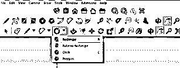

现在画一个布局区域，我的房子模型将在上面制作。我正在创建它的徒手维度。您可以在此输入绘图区域的特定值。

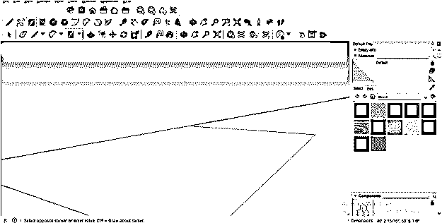

这是布局图。我将在选择工具的帮助下选择它，然后从工具面板中选择偏移工具。

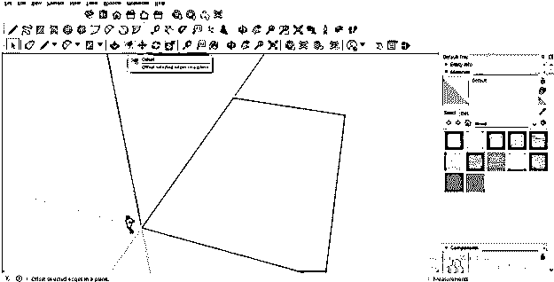

我将它偏移 1 英尺。为了输入这个值，我将在距离框中输入 1 ’(它在工作窗口的底部)。这个偏移的距离会让这个房子的墙厚。

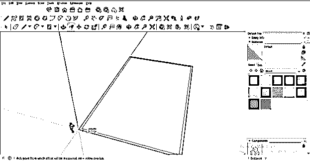

现在让我们把这个布局分成几个部分，你可以把这些部分看作这个房子模型的一个房间。所以再次使用矩形工具，从 12' x 10 '的这一边画一个矩形。将该值输入尺寸框，然后按键盘上的 Enter 键。

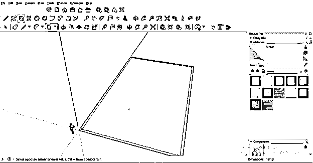

与第一部分相同，我将绘制这两个不同尺寸的部分。

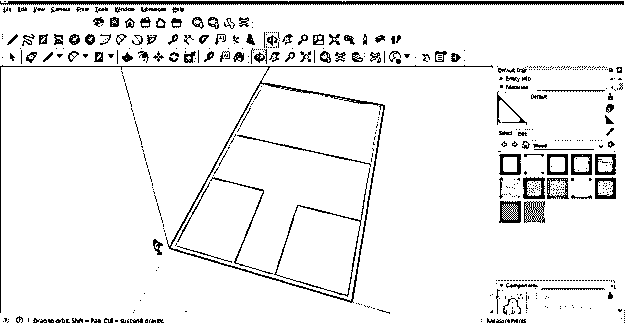

现在，就像我们偏移布局矩形的壁厚一样，我们将偏移每个部分的矩形。您可以在此矩形内偏移壁厚。

或者根据您的 3D 模型的要求在该矩形之外。

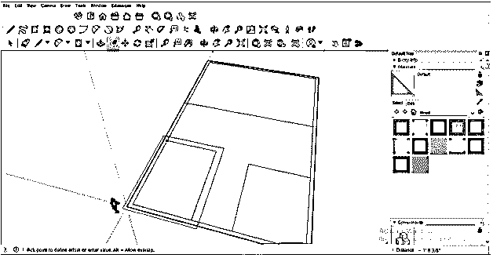

一般来说，房子所有部分的墙厚都是一样的，所以我会将这个矩形偏移到与布局墙相同的厚度。为了偏移它，用选择工具选择这个矩形，然后从工具面板中选择偏移工具。可以使用 F 作为偏移工具的快捷键。

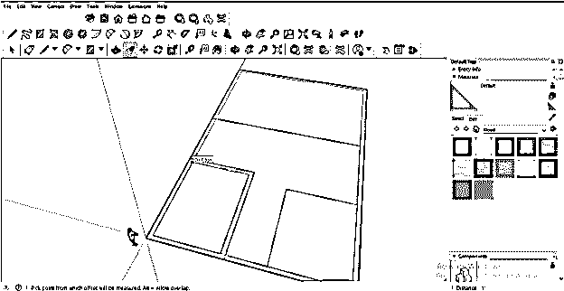

现在选择下一个矩形部分，切换到偏移工具，然后双击它。双击后，该矩形将在先前使用的尺寸上偏移。

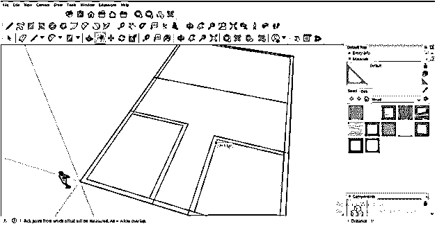

对所有部分执行此操作后，从工具面板中选择“擦除工具”或按键盘上的 E 键获得快捷键。

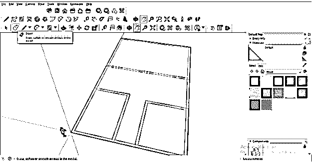

并擦除布局边界墙上的所有相交线。

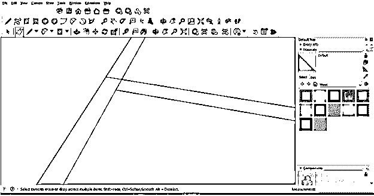

我正在擦除所有这些相交的线，因为我想让它成为一面连接的墙。所以擦除后，你会得到这种类型的墙壁布局。由于连接墙，您只需使用一次推/拉工具即可提供高度。

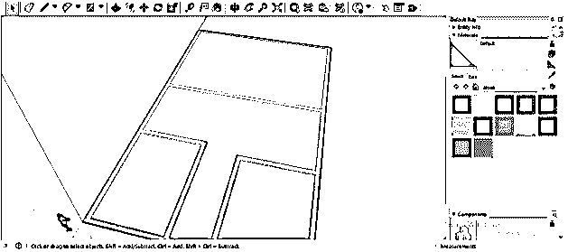

现在转到工具面板，并采取推/拉工具，这是一个三维制作工具。你也可以按 P 键作为快捷键吧。

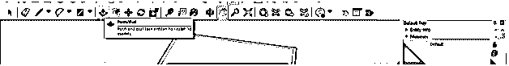

现在，用选择工具选择墙边界后，在它上面使用推/拉工具。如果您向上拖动此工具的鼠标光标，它将为您选择的区域提供高度；如果您向下拖动推/拉工具的鼠标光标，它将提供负方向的高度。因此，我将向上拖动鼠标光标，并输入这堵墙的高度值。我将输入 9 '作为这面墙的高度。

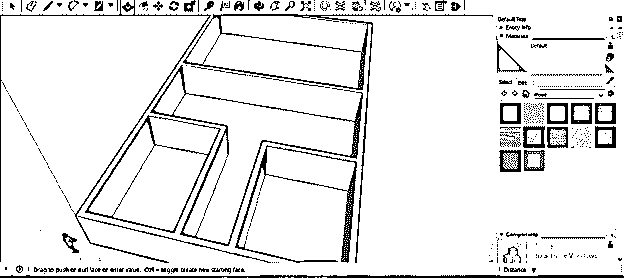

如果你想创造一扇门呢？让我们也看看吧。回到我们的布局，画一个像这样的矩形。

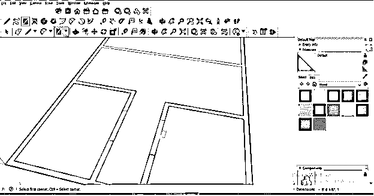

这一次当你像这样拉它的时候，就会有一个门的部分。

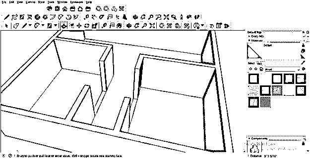

但是你知道应该有一个下降墙来创造适当的门结构。所以我会像这样在这里创建一个矩形。

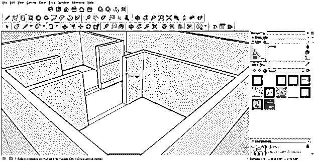

你可以看到，当我松开鼠标按钮时，它会覆盖所有区域，就像这样。

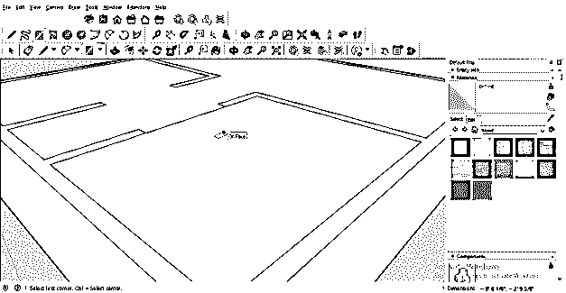

你必须像这样一个接一个地删除不想要的覆盖物。

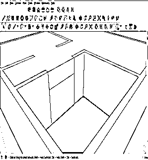

会有像这样的门结构，但我认为这种创建门区域的方式有点长。

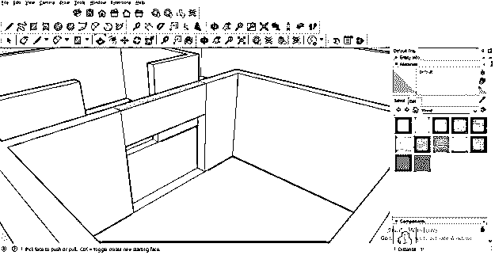

因此，有另一种简单的方法可以在模型中创建门和窗。只需再次使用矩形工具，用你想要的尺寸画一扇门。

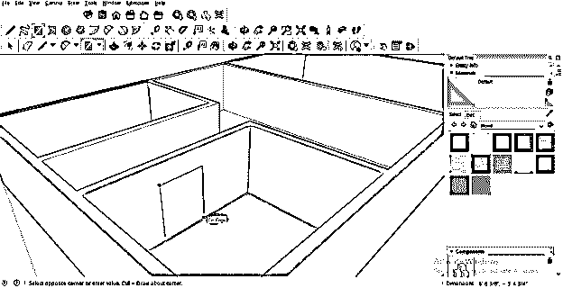

现在用推/拉工具向后推这个矩形，这样它就会从主模型中减去这个矩形。

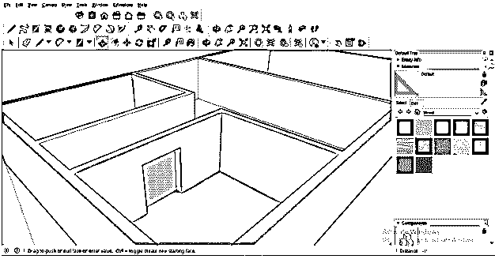

或者你可以简单地用推/拉工具双击这个矩形，它将删除这个区域。

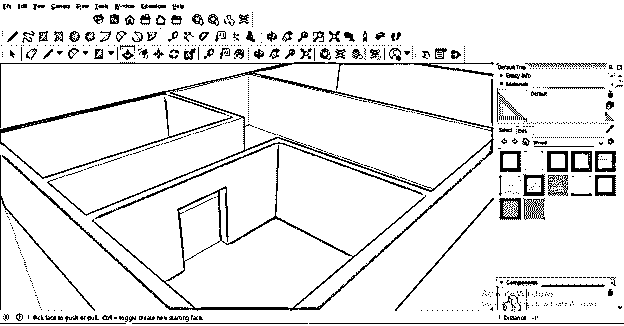

和门一样，你也可以在墙上你想要的地方创造一个窗户。创建一个与窗口大小相同的矩形。

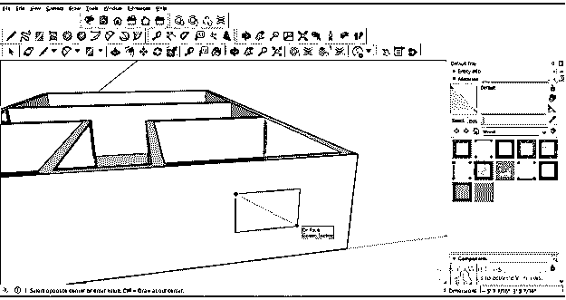

减去它，就像我们做门的时候一样。

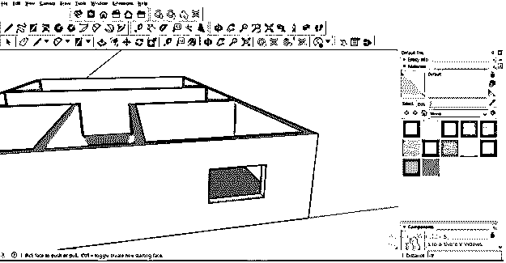

现在从工具面板中选择线条工具。

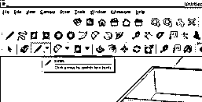

然后像这样画一条对角线来做这个房子的屋顶。你可以在每一部分上分别画一条对角线，一个一个地覆盖它们。

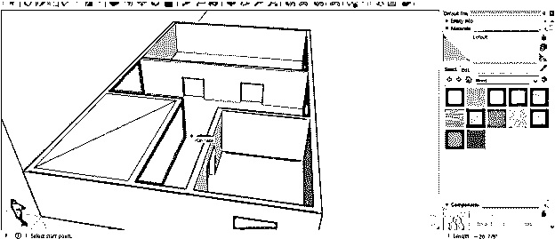

或者像这样从模型的一个角到另一个角画一条对角线来覆盖整个模型。

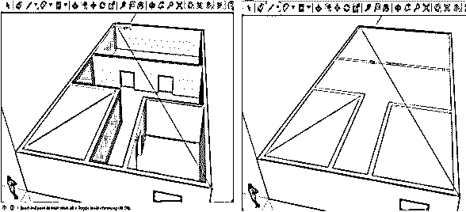

这样，您可以使用该软件的不同工具创建 3D 模型。

### 结论

这些是关于如何在 SketchUp 中从最基础的水平开始创建 3D 模型的基本信息。如果你正确理解了我在这里告诉你的创建 3D 模型的所有步骤，那么你可以很容易地掌握在这个软件中创建 3D 模型的一些技巧。我还会建议你在你的 2D 画上试试，这样你就可以深入地学习了。

### 推荐文章

这是 SketchUp 3D 模型的指南。这里我们讨论一下入门，如何在 SketchUp 中创建和使用 3d 模型？.您也可以看看以下文章，了解更多信息–

1.  [SketchUp 替代方案](https://www.educba.com/sketchup-alternative/)
2.  [SketchUp 旋转](https://www.educba.com/sketchup-rotate/)
3.  [SketchUp vs Fusion 360](https://www.educba.com/sketchup-vs-fusion-360/)
4.  [SketchUp AutoCAD](https://www.educba.com/sketchup-autocad/)

