# SketchUp Vray

> 原文：<https://www.educba.com/sketchup-vray/>

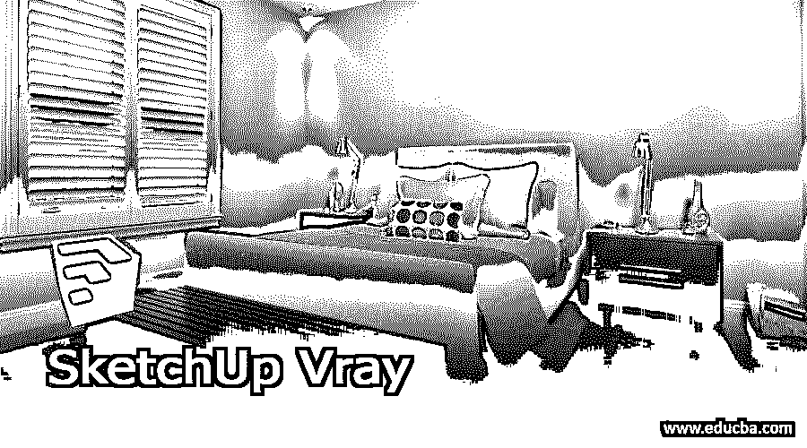

## SketchUp Vray 简介

SketchUp Vray 是一款专业的 3D 渲染软件，它可以在 SketchUp 中为我们设计的模型提供逼真的实时渲染。使用该软件，我们可以获得高质量模型材料的可视化，提供模型真实世界的外观。在开始使用 Vray 之前，你必须了解这个软件中的一些内容。它不是自由软件，但它的开发者向你提供免费试用。你可以选择不同的许可方案，比如商业目的，教育目的，个人目的等等。所以你可以按照你的要求和任何人一起去。

### 如何在 SketchUp 中创建和使用 Vray？

Vray 是一个需要学习的庞大软件，但是如果你继续在这个软件上练习，你可以慢慢学会它。在这篇文章中，我会告诉你一些关于它的方面，这样你就可以有一个关于 Vray 软件工作的想法。一旦你安装了这个软件，你将拥有这些不同类型的 Vray 标签(在 SketchUp 的用户界面上),它们用于不同类型的目的。

<small>3D 动画、建模、仿真、游戏开发&其他</small>

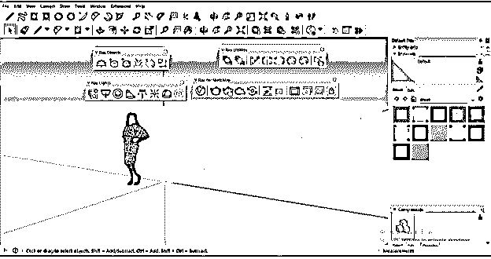

如果您在工作屏幕上没有找到 Vray 选项卡，那么您可以转到视图菜单下拉列表中的工具栏选项，然后单击它。

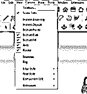

之后，通过激活复选框来启用所有 Vray 选项卡。

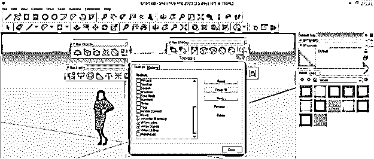

这些选项卡/面板是可移动的，因此您可以根据自己的需要将它们放置在工具栏区域的任何位置。

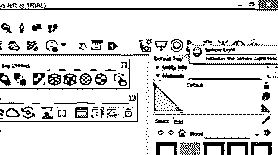

现在点击 Vray 面板的资产编辑器标签。

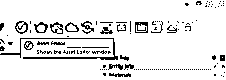

你会看到这样的 V-Ray 资源编辑器对话框。

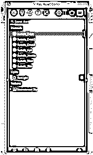

这个盒子里有很多标签，让我们来看看。第一个是材料标签，你可以看到所有使用过的材料，并通过选择它们来编辑它们的属性。

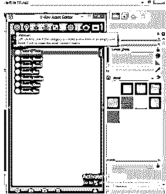

下一个是灯光标签，在这里你可以找到所有应用在你的 3D 模型上的灯光。

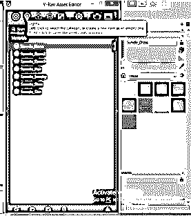

在下一个选项卡中，您将拥有不同类型的包含 3D 建模的功能。

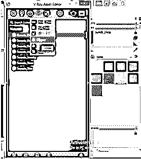

这是纹理选项卡，您可以为 3D 模型的不同组件创建纹理，还可以根据模型的要求编辑它们。

这是设置选项卡，我们可以根据我们的系统容量和其他一些参数来设置渲染过程。

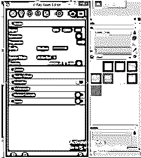

这是渲染标签，点击它你可以渲染你的模型，看看这个模型在现实世界中是什么样子。

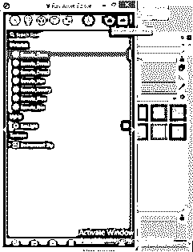

在渲染选项卡的下拉列表中还有一个渲染选项，这就是“使用 V-Ray 交互式”渲染。此渲染选项将为您提供在渲染过程中对模型所做更改的实时预览。实时预览的输出将取决于您的电脑容量。

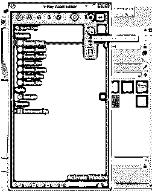

在“新建”选项卡中，您可以在该对话框的底部找到相同的选项。让我通过单击来创建这个通用材质。

现在点击保存按钮，这是在这个对话框的按钮。

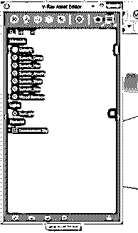

你可以用你想要的名字把这些资料保存在你电脑上你想要的地方以备将来使用。材料的命名在这个软件中是非常重要的事情，因为当你在一个有很多材料的非常大的项目中工作时，它会帮助你。

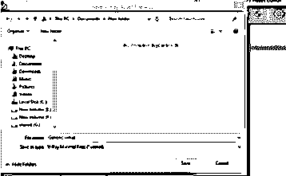

让我删除此通用材料，要删除它，我将选择它，然后按键盘上的删除按钮或单击此对话框中的删除资产按钮。

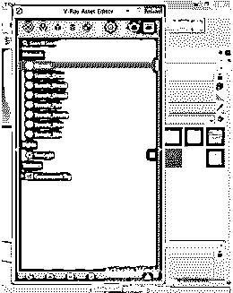

现在，您可以再次删除这些材料，因为我们之前已经保存了它们。所以这次点击这个对话框的导入资产文件按钮。

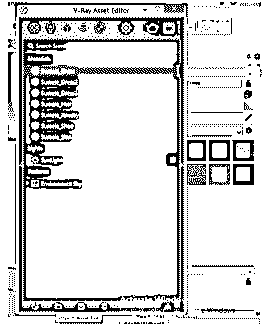

并从其保存位置选择该文件。

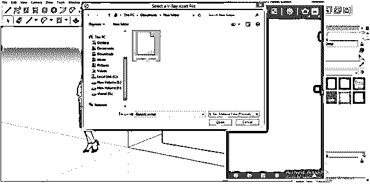

如果我从“材料”选项卡中删除任何材料，那么它也会从 3d 模型中删除，例如，如果我删除这个女孩衣服的材料，你可以看到它也会从这个女孩模型中删除。

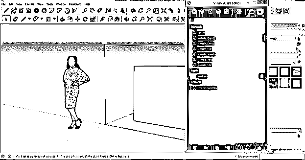

你也可以通过以下几个步骤将一个组件的纹理或材料用于另一个组件，例如我想用手表的颜色来改变这个女孩衣服的颜色。因此，我将右键单击手表的图层，然后单击“用作替换”选项。

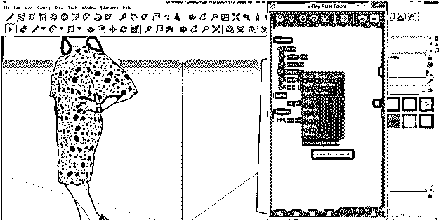

然后我将去服装层，并使右键单击它。这次点击场景中的替换。

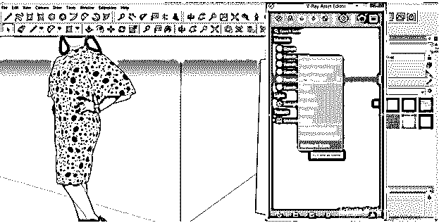

而且会有这样的变化。

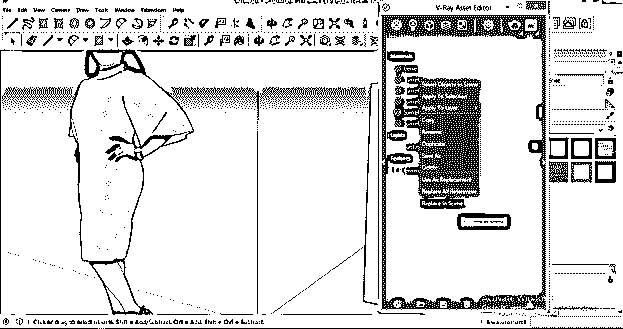

除此之外还有很多东西，我刚刚给了你一些选项卡的概述。现在让我告诉你，如果你点击渲染选项卡的“使用 V-Ray 交互式渲染”选项，会发生什么。

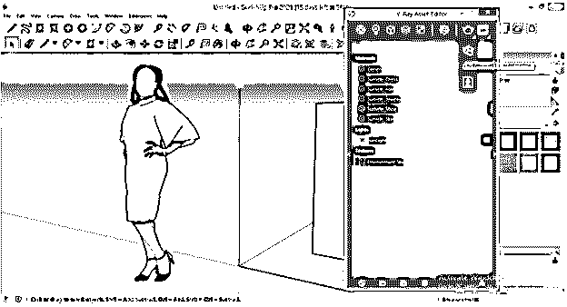

一个渲染帧将像这样打开，在这个窗口中，你可以看到你在渲染过程中对你的模型所做的实时修改。此对话框中还有一些其他选项卡，您可以通过练习来了解。

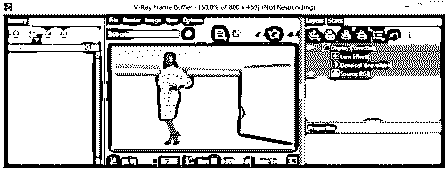

如果你点击这个左箭头按钮，你将看到 Vray 的材料列表。你可以点击下载按钮从 Vray 下载所有资料。下载后，你可以在你的模型上应用 Vray 材质，就像我们应用 SketchUp 材质一样。

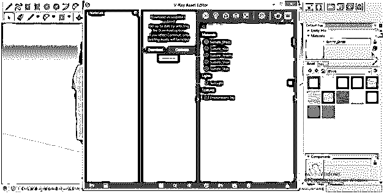

如果你点击右箭头，你会看到这个材质设置标签，里面有很多不同的参数。例如改变颜色、不透明度以及所选材料的其他属性。您可以更改这些属性。

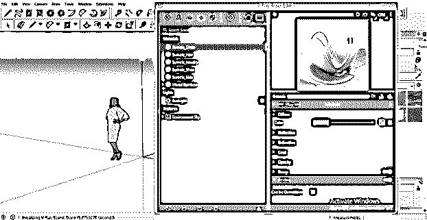

这是关于 Vray 界面的基本信息，关于这个软件还有很多需要理解的东西，但是你可以通过使用它们很容易地学会所有这些东西。

### 结论

我告诉了你 Vray 软件的一些主要功能，你可以了解如何使用该软件在该软件中为你的 3D 模型获得真实感渲染效果。您可以使用视觉质量高的 Vray 材质，使您的模型非常有效。你还可以用这个软件做更多的事情，开始探索它，获得更多的知识。

### 推荐文章

这是一个 SketchUp Vray 的指南。这里我们讨论入门，如何在 SketchUp 中创建和使用 Vray？您也可以看看以下文章，了解更多信息–

1.  [SketchUp 替代方案](https://www.educba.com/sketchup-alternative/)
2.  [SketchUp 旋转](https://www.educba.com/sketchup-rotate/)
3.  [SketchUp AutoCAD](https://www.educba.com/sketchup-autocad/)
4.  [AutoCAD vs SketchUp](https://www.educba.com/autocad-vs-sketchup/)

