# SketchUp 花园设计

> 原文：<https://www.educba.com/sketchup-garden-design/>

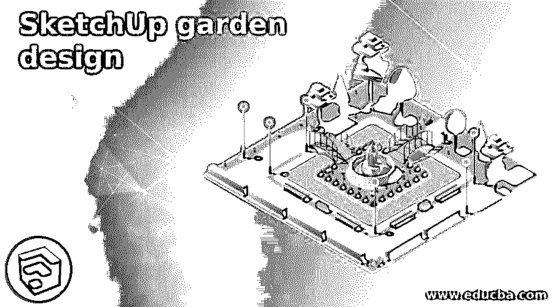

## SketchUp 花园设计简介

SketchUp 花园设计是该软件中景观设计的一部分，我们可以用创建景观设计的相同方式创建花园设计。为了创建一个花园设计，我们需要了解一些工具和他们的工作，以及不同菜单的其他选项。您可以从外部资源导入一些 garden 人员，这意味着您可以使用一些从互联网上下载的 3D 建模组件。在 Sketchup 中，我们有一个在线的 3d 组件库，你可以找到这个名为 3D Warehouse 的库。所以我用一个简单的园林设计来给大家讲解一下园林设计。

### 如何在 Sketchup 中进行园林设计创作？

这完全取决于你想如何创建你的花园，它看起来是什么样子，根据这一点，你可以为你的模型创建一个美丽的设计，以及使用该设计作为景观设计。

<small>3D 动画、建模、仿真、游戏开发&其他</small>

首先，我会采取矩形工具是在工作屏幕的顶部，或按下 R 作为快捷键。

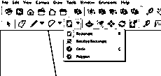

现在我将绘制这个矩形作为一个花园的一小部分的布局。我没有为这个设计使用任何特定的尺寸。

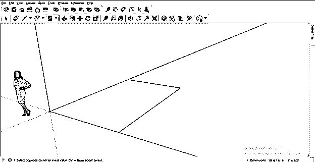

现在我将采取两点圆弧工具。

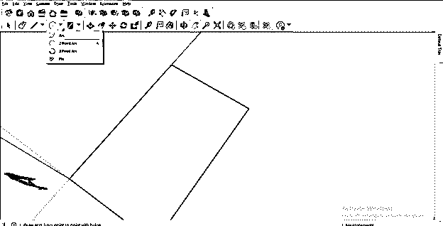

现在我将在这个矩形的一个角上画一个这样的圆弧。

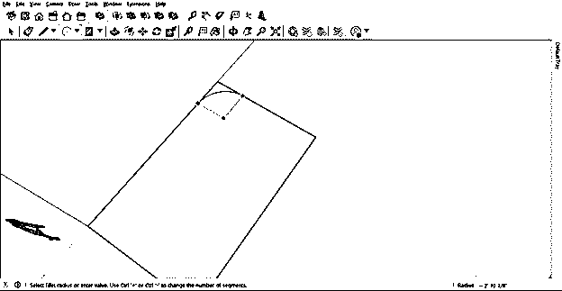

并通过删除不需要的弧形区域来创建这种形状。对于删除不需要的区域，只需选择并按下键盘上的删除按钮。现在我将使用选择工具选择这个形状的两条边。要选择两条边，请在选择一条边后按住 shift 键，然后单击另一条边。

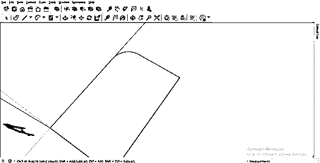

现在我将使用偏移工具，像这样将这些边偏移一段距离。

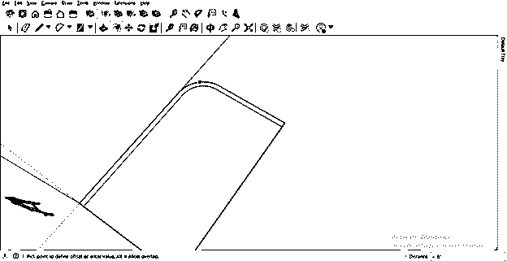

现在使用推/拉工具，给它增加一些高度。

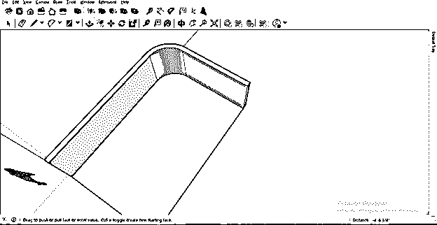

现在选择整个对象并创建组，这样它就不会在创建过程中干扰其他对象。要创建组，请在选择后右键单击，然后单击下拉列表中的“创建组”选项。

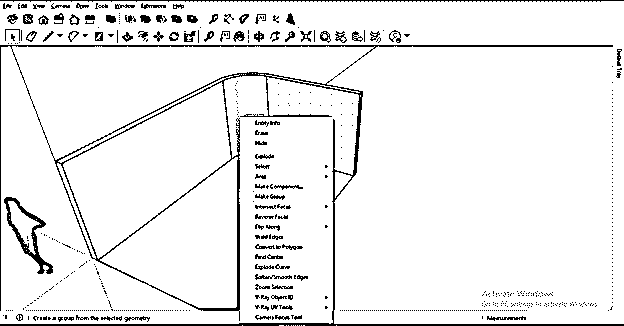

现在让我们给地面添加一些设计来制作水池的侧面物体，这将在下一步中创建。为了创建这个设计，我将再次使用两点圆弧工具，并像这样绘制它。

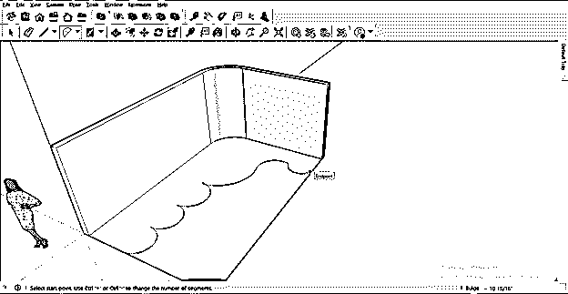

现在再次使用推/拉工具，我将增加地板设计的高度。

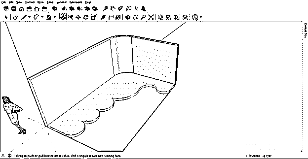

选择地面矩形的其他两条边，并像我们在上一步中偏移矩形的第一条边一样偏移它们。

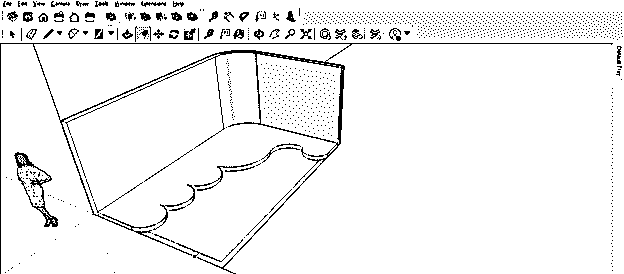

我将增加同样的高度，因为我们已经增加了花园的地面设计。

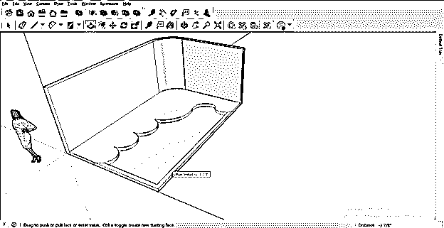

现在用橡皮擦工具擦掉多余的线条，使这些物体成为一个单一的物体。

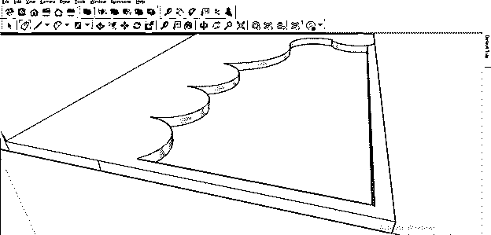

现在选择这些对象，然后将这个设计组合成一组，这样它将与其他设计分开。

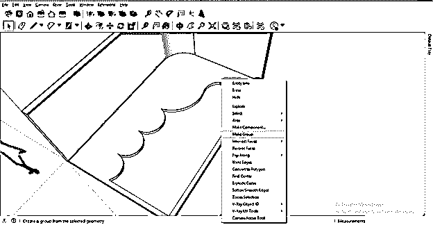

现在让我们将材质应用到我们的设计中，要应用材质，请转到默认托盘选项的材质面板，它位于工作屏幕的右侧。

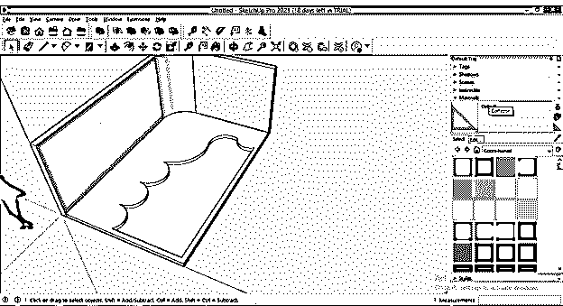

如果您的工作屏幕上没有物料选项卡，您可以在窗口菜单中找到它。所以点击窗口菜单，然后转到默认托盘，并从下拉列表中选择材料选项。

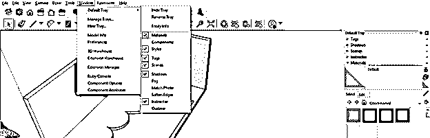

现在从材料列表中，我将选择景观，围栏选项。

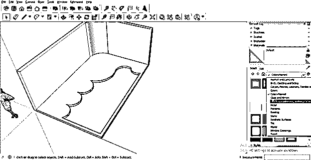

现在，我将从景观选项的材质列表中为所选的地面区域选择岩石材质。

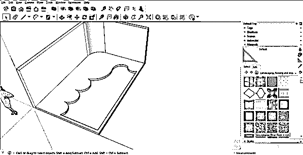

并且像这样应用它。

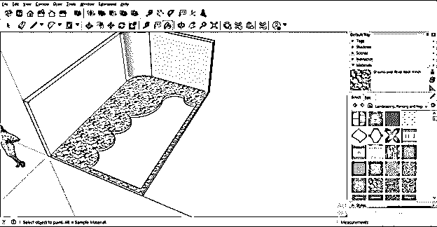

我将在这个区域的深处应用混凝土块材料。

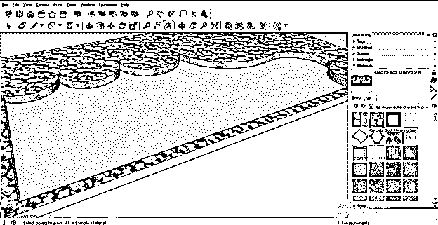

现在，我将选择这个花园设计一侧的墙状结构，然后对其应用木栅栏，为此，我将从材质面板中选择木栅栏，并使用铲斗工具单击选定的区域。

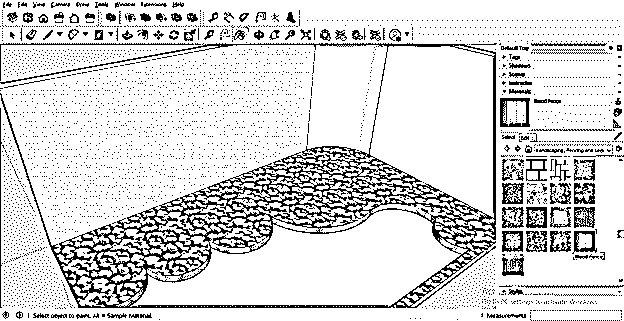

现在，让我们将池水应用到这个选定的区域，我将再次转到“材质”选项卡，从材质列表中选择“水”。

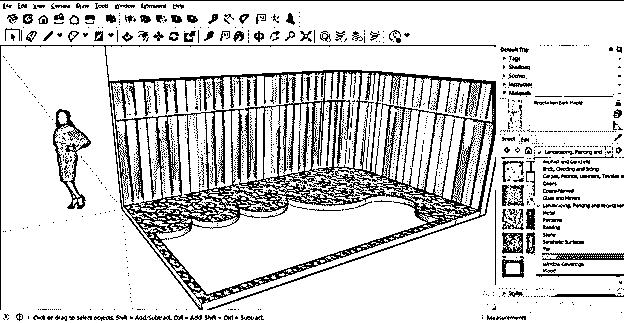

我将从水的材质列表中选择这个水池材质。

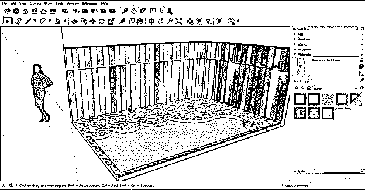

并在铲斗工具的帮助下将其应用于选定的区域。

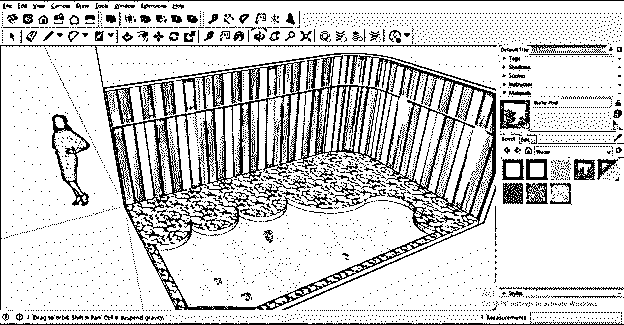

现在让我们在这里放置一些园艺人员，为此，我将转到 3D 仓库，您可以在窗口菜单的下拉列表中找到它。所以去那里点击它。

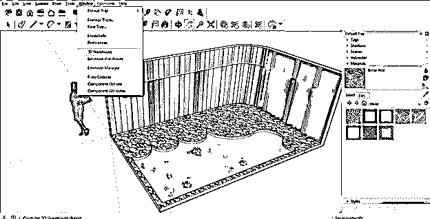

一旦你点击它，一个 3D 仓库对话框就会像这样打开。在这里的搜索框中，我将寻找花园花盆。

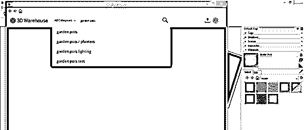

并从锅的结果中下载这个。你可以根据你的设计选择任何其他的。

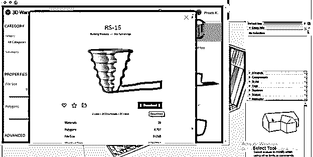

我会像这样把它放在这里。

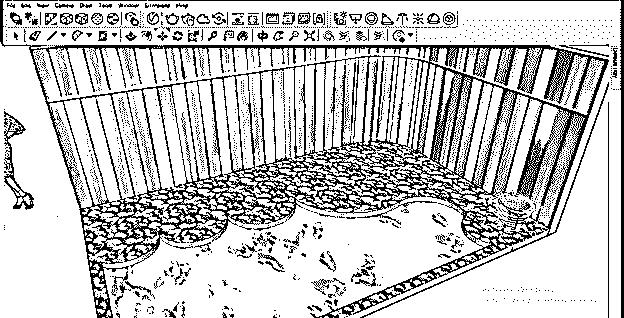

您可以使用工具面板的缩放工具，根据设计中所需的大小对其进行缩放。你也可以把植物放在这个花盆里。

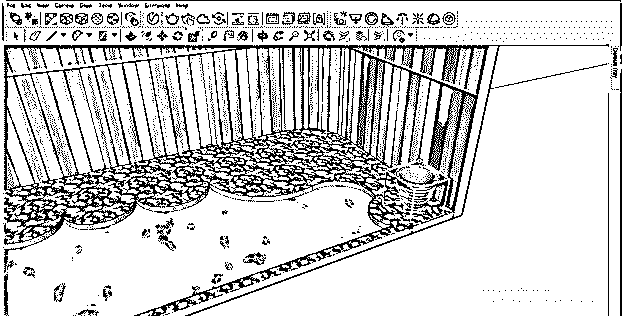

或者导入一个已经种植了植物花盆。因此，我将通过单击下载按钮来下载它。

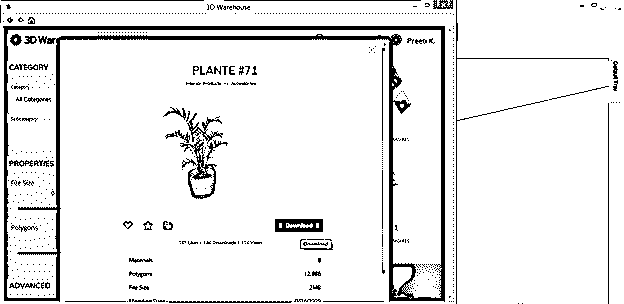

把它放在花园设计的角落里。

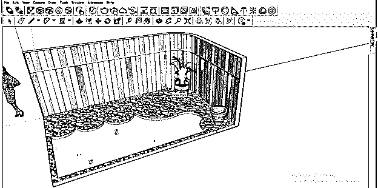

你也可以复制它，并且用移动工具复制移动它，在移动它的时候按住键盘上的 Ctrl 键，它会在你想要的距离复制移动的物体。

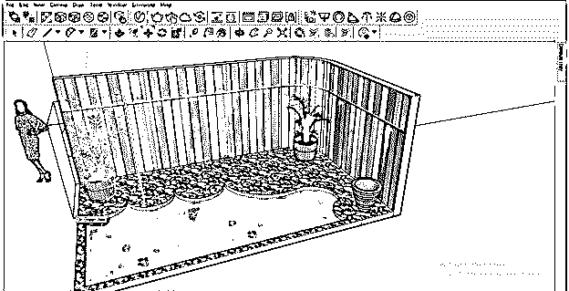

现在，我将在这个设计中使用花园家具，我也将从 3D 仓库导入它。

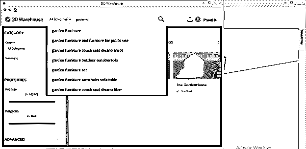

我要进口这个。

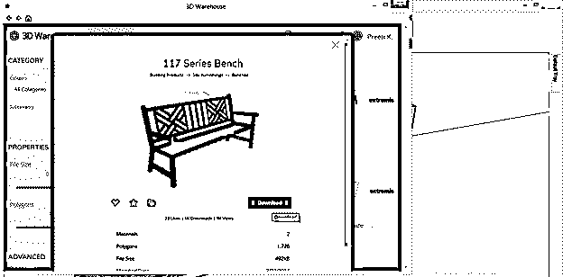

将其放在工作区的任何地方。

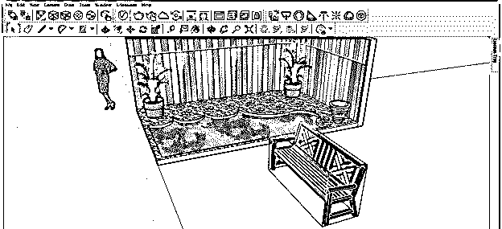

这不是我想要的方向，所以我会用这样的旋转工具来旋转它。

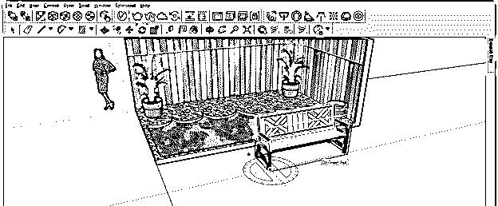

把它移到花园设计的这个部分。

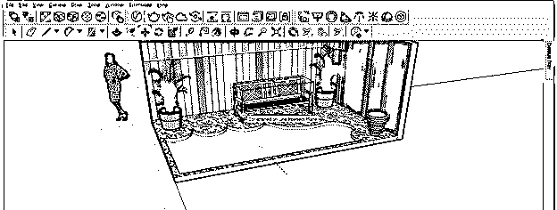

这样你就可以根据自己的想法设计出一个花园。

### 结论

现在你可以理解，花园设计完全取决于你自己的创作理念，以及你想如何将这种设计运用到你的 3D 模型中。你可以开始实践花园的设计，使用几个组件，这样你就可以在工作中获得最佳效果。

### 推荐文章

这是一个 SketchUp 花园设计指南。在这里，我们讨论如何在 Sketchup 中创建花园设计，以及如何在 3D 模型中使用这种设计。您也可以看看以下文章，了解更多信息–

1.  [SketchUp 架构](https://www.educba.com/sketchup-architecture/)
2.  [SketchUp AutoCAD](https://www.educba.com/sketchup-autocad/)
3.  [SketchUp 3D 模型](https://www.educba.com/sketchup-3d-models/)
4.  [SketchUp Vray](https://www.educba.com/sketchup-vray/)

