# SketchUp 镜子

> 原文：<https://www.educba.com/sketchup-mirror/>

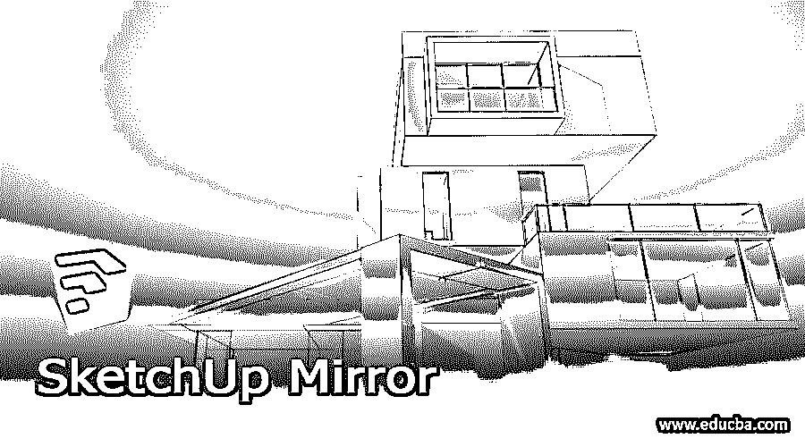

## SketchUp 镜像简介

SketchUp Mirror 是一个过程，通过它您可以将任何对象反射到它的对面，以用于不同类型的目的。您可以通过多种方式镜像该软件中的任何对象或组件。您也可以使用 Mirror extension 来为您的组件完成这项工作，您可以从该软件的扩展仓库中下载它。对于制作任何对象的镜像或制作任何组件的镜像对象，您应该了解不同工具的一些功能和参数以及该软件的方法。所以让我以一种非常激动人心的方式向你解释一些方法，通过这些方法你可以做到这一点。

### SketchUp 中的镜像工具怎么用？

SketchUp 中并没有专门的名为 Mirror tool 的工具，但是我们可以通过几种方式对物体进行镜像。您也可以复制任何对象，然后镜像它。您还可以从扩展仓库获得镜像扩展，并将其用作镜像工具。那么让我们来看看这些方法是什么？

<small>3D 动画、建模、仿真、游戏开发&其他</small>

首先，我将创建一个像这样的对象，我们将以不同的方式镜像它，我已经使用工具面板的矩形和圆形工具绘制了这个形状。

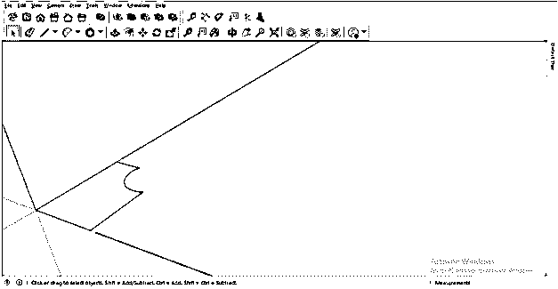

现在我将在推/拉工具的帮助下给这个形状增加一些高度。我没有使用标准尺寸来创建这个对象。

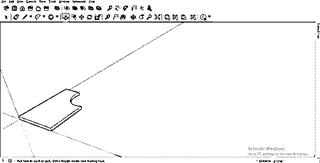

我将在这里制作一个圆柱形，也像这样在一个圆形表面上再次使用推/拉工具。

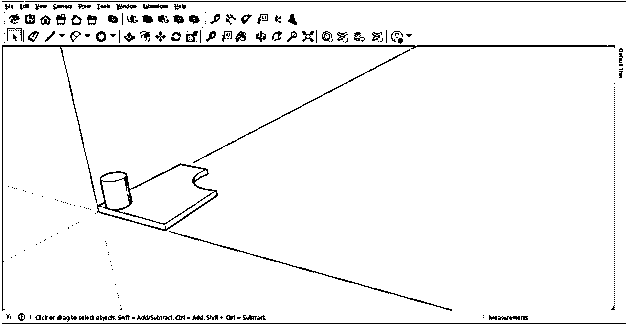

现在，我将把这个选定的对象作为一个组件，为此，选择整个对象，然后右键单击。单击下拉列表中的“制作组件”选项。

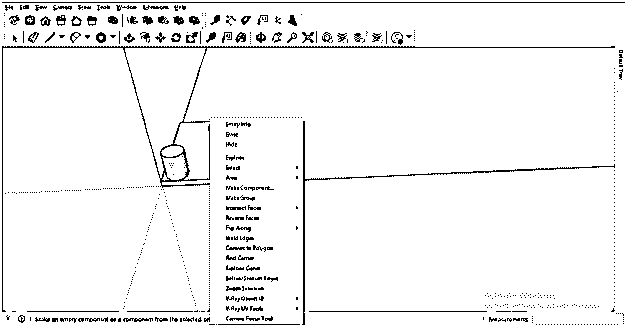

一旦你点击这个选项，它将要求你命名你的组件，我将命名为一个镜像对象，然后点击这个对话框的创建按钮。

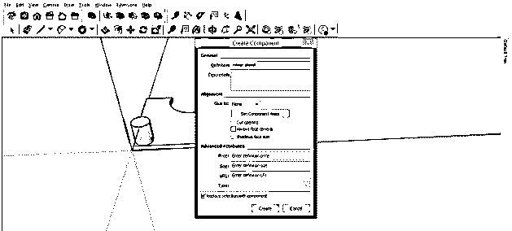

现在选择这个对象，并再次右键单击。现在，这一次，去翻转随着向下滚动列表的选项。

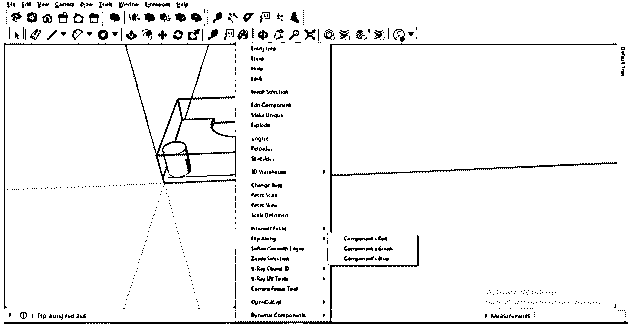

在此选项中，您会发现组件的红色、绿色和蓝色选项。这意味着如果你想沿着红色的轴镜像这个物体，那么就用组件的红色选项；对于沿绿色轴的镜像，使用组件的绿色选项，依此类推。

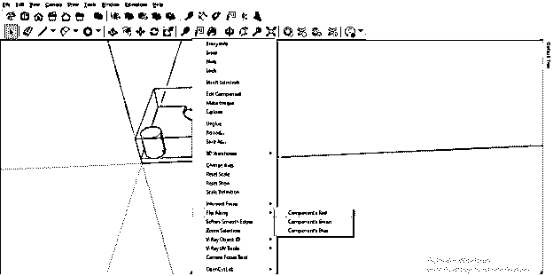

现在，我将首先选择组件，然后单击组件的红色选项。

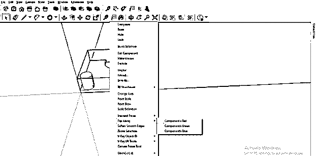

它会像这样沿着红轴翻转。

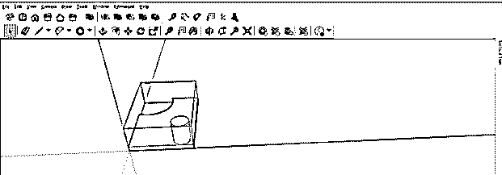

另一方面，如果你使用组件的蓝色选项“翻转”从另一侧镜像该组件。

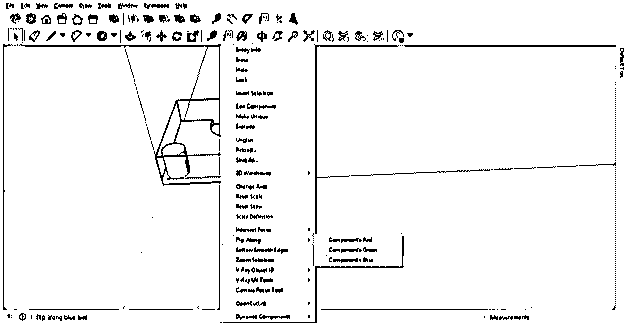

然后就会这样镜像。因此，这完全取决于您希望如何镜像您的组件，并且根据您的需求，您可以为您的组件选择三个选项中的任何一个。

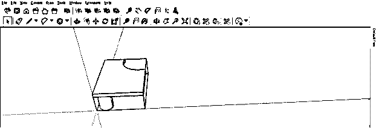

镜像任何对象的第二种方法是通过 SketchUp 的缩放工具。因此，从工具面板中选择缩放工具，它位于该软件工作屏幕的顶部。

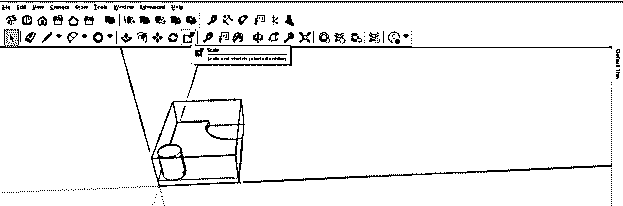

现在点击缩放工具的缩放框的一个红色锚点，它在这个组件的周围。

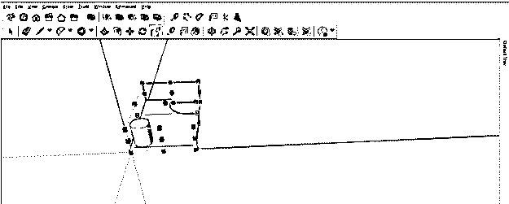

并将其向所选 achorn 点的相反方向拖动。

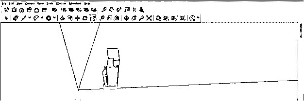

一旦你在另一个方向达到这个组件的相同大小，它会自动捕捉到那里，这就是，你可以做这个组件的镜像。在此过程中，您可以根据自己的选择增加或减少组件的大小。

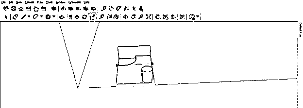

现在，如果你从这个方向抓住一个红色的锚点，并开始向相反的方向拖动它。

然后你可以像这样从这边镜像它。

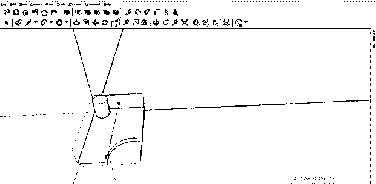

您不仅可以使用缩放工具从纵向或横向镜像组件或对象，还可以从对角线镜像，为此，选择缩放框的红色对角锚点，然后开始对角拖动。

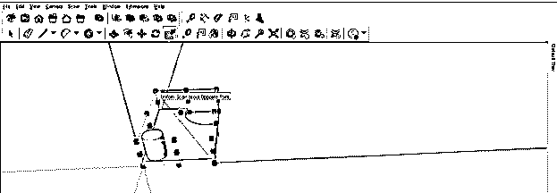

它会像这样斜着镜像。

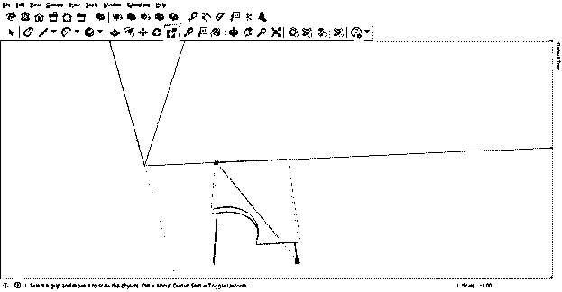

让我们制作这个组件的副本，为了制作副本，我将首先使用选择工具选择这个组件，然后从工具面板中选择移动工具。现在我按住键盘上的 Ctrl 键移动它，它会这样复制一份。

现在让我们在工具面板的缩放工具的帮助下将它镜像到相反的方向。使用缩放工具，按照我们在前面步骤中所做的那样对其进行镜像。

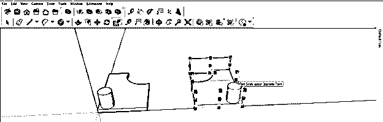

制作源组件的副本，然后使用缩放工具镜像它有一个好处，即虽然它是组件对象的副本，所以当您在其中任何一个对象中进行任何更改时，更改将自动应用到两个对象。例如，如果我转到第一个组件的可编辑模式，并在推/拉工具的帮助下减小该组件的圆柱形部分的大小，那么您可以看到更改也应用到复制的组件。

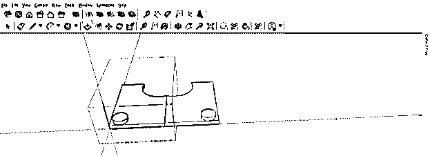

所以你可以在你的设计中使用这种技术来加速你的工作。现在，如果您愿意，您可以安装镜像扩展并将其用作镜像工具。你可以从这个软件的扩展仓库中下载一个镜像扩展，你可以在窗口菜单的下拉列表中找到扩展仓库选项。所以转到窗口菜单，点击列表中的扩展仓库选项。

现在在扩展仓库的打开对话框的搜索框中搜索镜像。

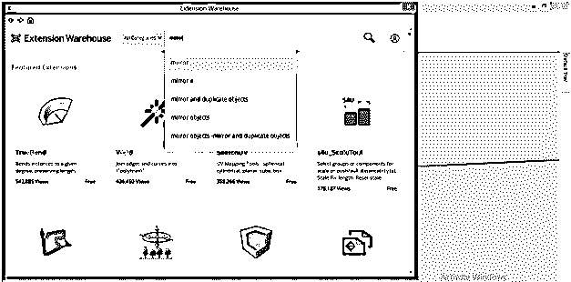

一旦你搜索它，你会得到镜像扩展的结果，你可以根据自己的选择从列表中下载任何人。

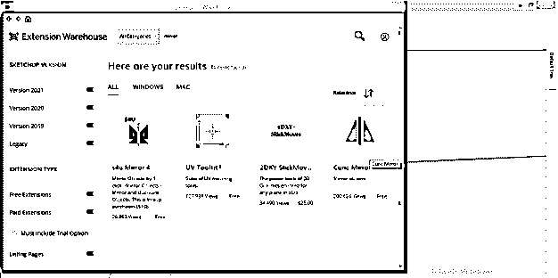

您可以从该软件的扩展管理器中启用下载的镜像扩展。因此，对于扩展管理器，再次转到窗口菜单，这一次，单击该菜单下拉列表中的扩展管理器选项。

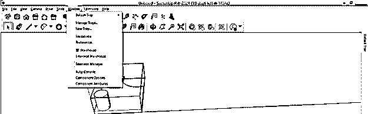

### 结论

我确信镜像工具在 SketchUp 中不会再为你带来一个不认识的单词，你可以使用这个软件的不同选项和工具，通过几种方式对物体进行镜像。你只需要正确理解所有的技术，然后你就可以非常容易地制作任何物体的镜子。

### 推荐文章

这是一个 SketchUp 镜像指南。这里我们讨论一下入门，如何在 SketchUp 中使用镜像工具？使用不同选项和工具的几种方式。您也可以看看以下文章，了解更多信息–

1.  [SketchUp Vray](https://www.educba.com/sketchup-vray/)
2.  [SketchUp 3D 模型](https://www.educba.com/sketchup-3d-models/)
3.  [SketchUp 架构](https://www.educba.com/sketchup-architecture/)
4.  [SketchUp 替代方案](https://www.educba.com/sketchup-alternative/)

