# SketchUp 扩展

> 原文：<https://www.educba.com/sketchup-extensions/>

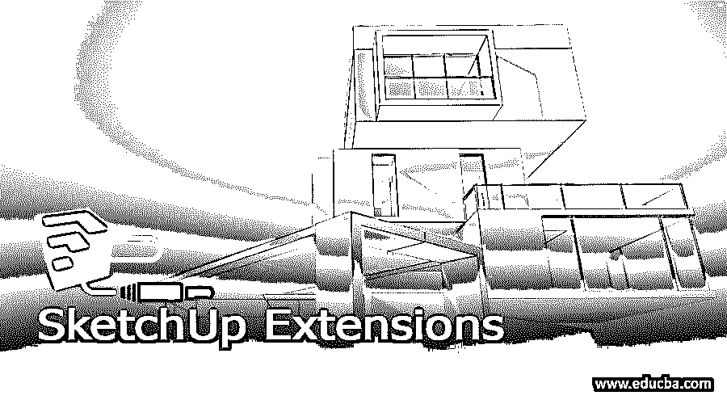

## SketchUp 扩展简介

SketchUp 扩展是不同类型的软件，用于通过多种方式增强 SketchUp 的工作能力。您可以从该软件的扩展库中获得不同类型的扩展，也可以从外部来源下载扩展。安装这两种类型的扩展有不同的方法(从 SketchUp 仓库或外部源)。你会发现市场上有许多很好的扩展，用于以高级方式执行多项任务，例如，你可以使用联合推/拉扩展来推/拉两个或多个曲面或复杂曲面。这里将告诉你如何在这个软件中安装任何扩展并使用它们。

### 如何在 SketchUp 中安装扩展？

要在 SketchUp 中安装扩展，请转到菜单栏的窗口菜单，它位于工作屏幕的顶部，然后单击它。您将在它的下拉列表中找到扩展管理器。所以点击这个选项。

<small>3D 动画、建模、仿真、游戏开发&其他</small>

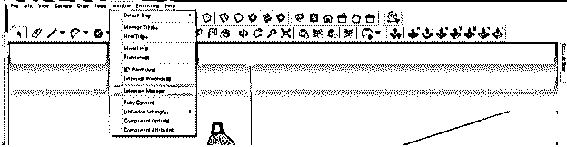

您也可以在工具面板部分的工作屏幕上找到带有此图标的扩展管理器。

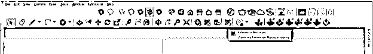

一旦你点击它，这个扩展管理器对话框将被打开。在这里安装你从外部下载的插件或扩展，点击对话框底部的安装扩展按钮。

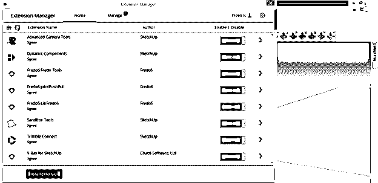

现在将打开一个打开对话框。在这个框中，选择。从您个人计算机上的保存位置下载您的扩展的 rbz 文件。在这个对话框中，我有一些 Fredo 6 的扩展。因此，我将选择其中一个并单击“打开”按钮。

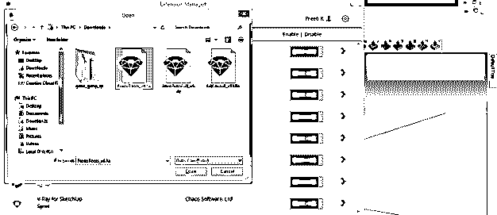

我已经安装了它们，所以你可以在列表中看到一些扩展。确保您要使用的扩展应该在此对话框中启用，要启用它们，您只需单击该扩展前面的启用按钮。

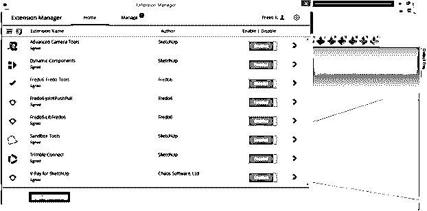

在此对话框的“管理”选项卡中，您可以及时检查已安装扩展的更新，并更新它们以获得新功能。

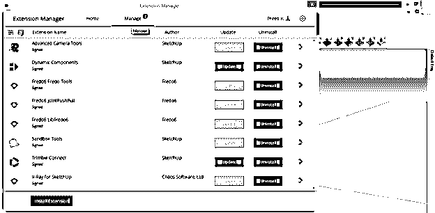

一旦 SketchUp 中安装了任何扩展，您必须重启 SketchUp 软件，并且该扩展的面板将出现在您的工作屏幕上。就像这里是关节推/拉工具的面板，工作区域上的 V-ray 的不同面板。

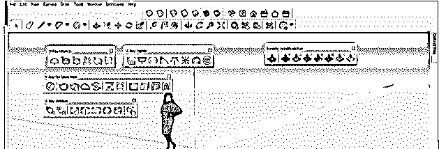

因为延伸板是可移动的，所以您可以根据工作适应性将它们放置在所需部分的工具面板区域。

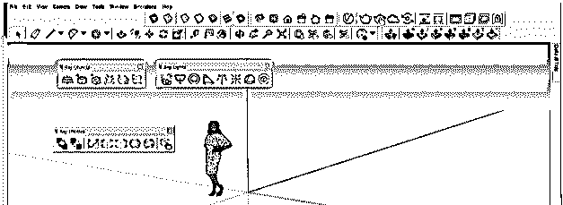

现在让我告诉你如何从 SketchUp 的扩展库中安装任何扩展。您将在窗口菜单的下拉列表中找到此扩展仓库选项。

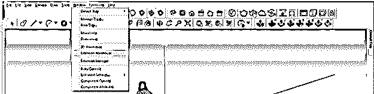

一旦你点击它，你会有一个扩展仓库的对话框。在这里的搜索框中，我将搜索镜像扩展。所以我将简单地在这个框中键入 Mirror。你也可以用同样的方法在这里搜索你想要的分机。

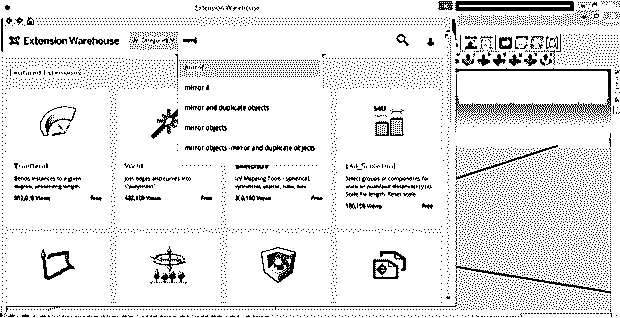

而搜索之后，我们会找到这些结果。你可以从这个列表中下载任何一个。我会点击 s4u Mirror 4 扩展。

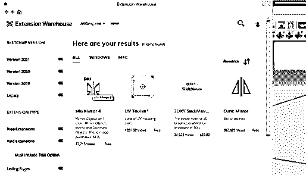

一旦你点击它，你就会进入它的下载页面。在这里，你将有一个演示视频，通过它你可以学习如何在 SketchUp 中使用这个扩展。

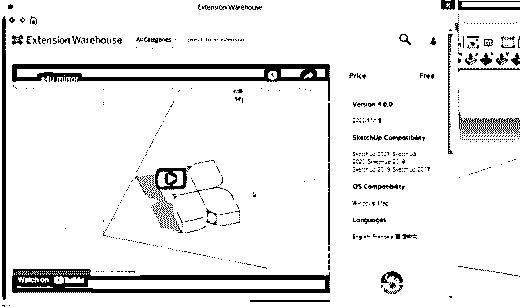

向下滚动此页面，您将看到安装按钮，因此单击它。

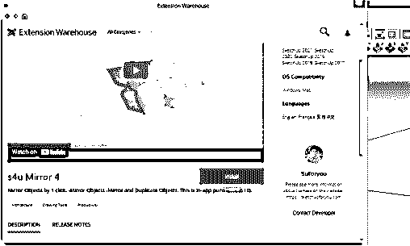

接受条款和条件后，您就可以安装它了。

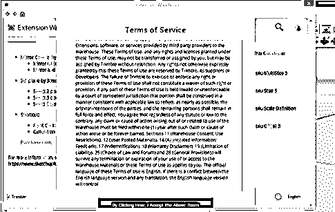

它会自动安装，并在安装后向您显示这种类型的消息。

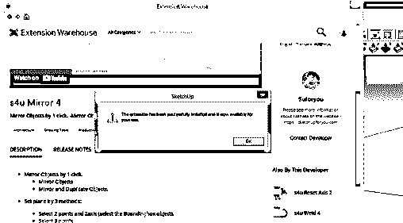

您可以再次转到“扩展管理器”对话框，并确保此处启用了此扩展。如果它被禁用，那么通过点击 enable 按钮(当该扩展被禁用时，将禁用该按钮)来启用它，开始使用它。

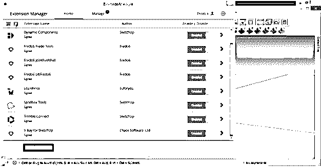

在工作屏幕的任何地方都会有一个带有图标的扩展面板，或者您可以在菜单栏的扩展列表菜单中查看它。这里我们在工作屏幕上有一个镜像面板，它也在扩展菜单列表中。

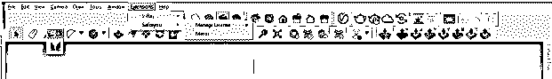

### 如何在 SketchUp 中使用扩展？

让我告诉你如何使用扩展。我将告诉你我的 SketchUp 中的一些扩展的工作方法的非常基本的方面。这是一个镜像扩展，有了这个扩展，你可以在你想要的方向镜像任何物体。

让我们首先为此创建一个对象，我将完全选择它，然后使它成为一个组件。

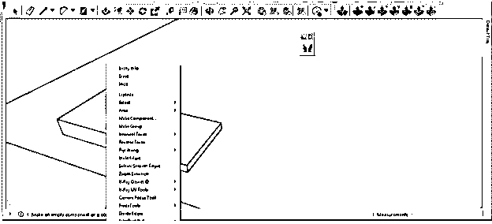

现在从这个扩展的面板中取出镜像工具。

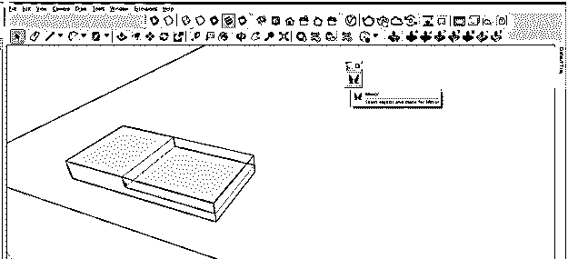

现在，通过单击将成为镜像平面第一个点的点来指定第一个点。

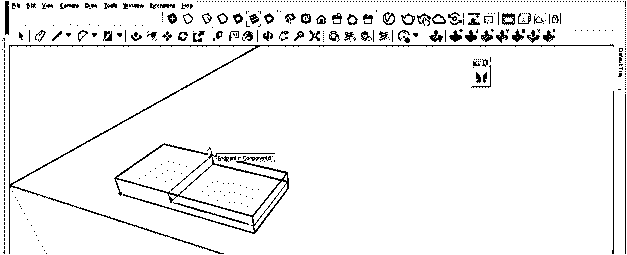

然后在第二个点上单击以指定镜像平面的第二个点。

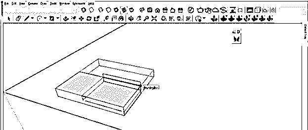

并且它将在所选平面的方向上镜像它。它将在镜像源组件后删除源组件(如果您希望源组件保持原样，并沿镜像方向复制它，则首先复制源组件，然后使用“粘贴到位”选项将其粘贴到同一位置。现在，当您镜像它时，复制的对象将在镜像位置的方向上镜像，保持源组件不变)。

还有一个扩展在任何项目中非常有用。这是一种联合推/拉，使用它可以同时推/拉任何组件的两个或多个曲面。只需选择那些你想要推拉的表面，然后从这个扩展的面板中选择关节推拉工具。

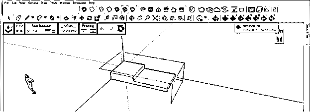

你可以像这样挤出两个表面。

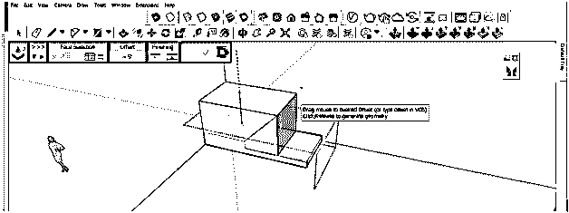

Sketchup 中有许多扩展，您可以使用它们来提高工作质量。

### 结论

我告诉过你如何从 SketchUp 的外部和内部资源安装任何扩展。现在，您已经了解了如何处理不同扩展的面板，并使用它们来执行特定的任务。所以只要开始和他们一起工作，对他们有越来越多的了解。

### 推荐文章

这是 SketchUp 扩展的指南。这里我们讨论一下定义，如何在 SketchUp 中安装扩展？，如何在 SketchUp 中使用扩展？.您也可以看看以下文章，了解更多信息–

1.  [SketchUp Vray](https://www.educba.com/sketchup-vray/)
2.  [SketchUp 3D 模型](https://www.educba.com/sketchup-3d-models/)
3.  [SketchUp 架构](https://www.educba.com/sketchup-architecture/)
4.  [SketchUp 替代方案](https://www.educba.com/sketchup-alternative/)

