# SketchUp 取消隐藏

> 原文：<https://www.educba.com/sketchup-unhide/>

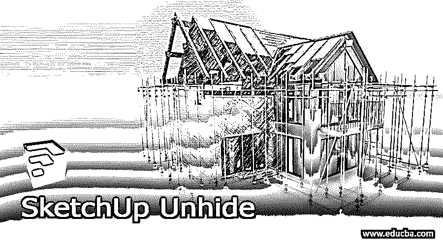

## SketchUp 取消隐藏简介

SketchUp Unhide 是这个软件的一个非常重要的功能或选项，因为在 SketchUp 中创建模型的过程中，大多数时候，我们需要从工作区隐藏一些对象或组件，以便我们可以非常顺利地看到和创建另一个对象。一旦我们隐藏组件，它需要在我们复杂的工作后取消隐藏它们，这样我们就可以只需点击一下就可以取消隐藏所有隐藏的对象，或者如果你的工作区中有许多隐藏的对象，你可以逐个取消隐藏它们。您可以通过几个选项来取消隐藏对象。

### 在 SketchUp 中如何取消隐藏？

你可以在这个软件中使用菜单栏的菜单和一些其他选项来取消隐藏对象，所以让我告诉你如何在你的工作中做到这一点。

<small>3D 动画、建模、仿真、游戏开发&其他</small>

我已经从 SketchUp 的 3D 仓库下载了这把椅子的模型来解释这个话题。你可以在你自己设计的模型上学习和练习。

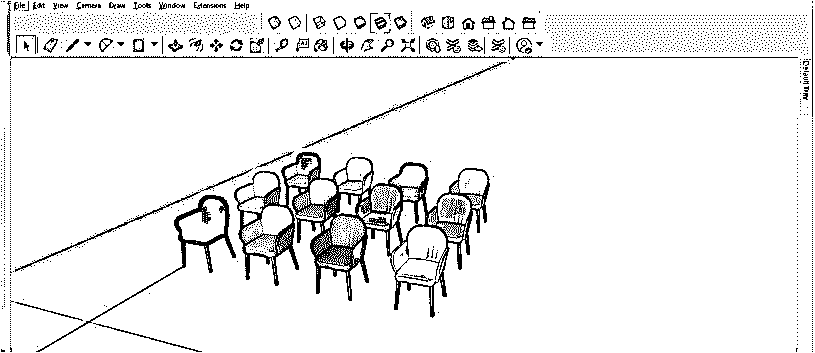

现在我想隐藏第一把椅子，为此，我将首先使用选择工具选择它，然后右键单击它。从下拉列表中选择隐藏选项。

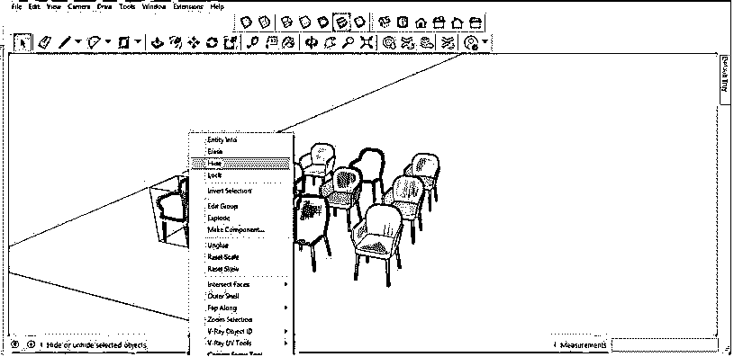

一旦我选择了这个选项，它将隐藏我们选择的椅子。我将对其他一些椅子做同样的事情。

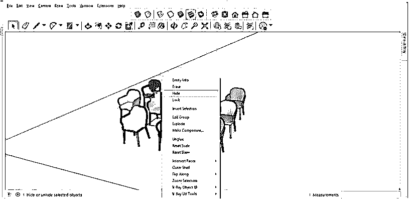

现在，如果你想取消隐藏它们，那么去菜单栏的编辑菜单，它在工作屏幕的顶部，然后点击它。在这里的下拉列表中，你会发现取消隐藏选项。在“取消隐藏选项”中，有三个选项可以用来取消隐藏对象。

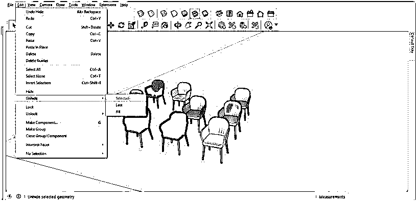

我将首先点击“取消隐藏”选项的“最后”子选项。

你可以看到它将取消隐藏整个隐藏的对象，但这个选项(最后)是用来取消隐藏最后一个对象。在目前的情况下，它取消隐藏所有隐藏的对象，因为我们一直在按顺序一个接一个地隐藏所有的椅子。

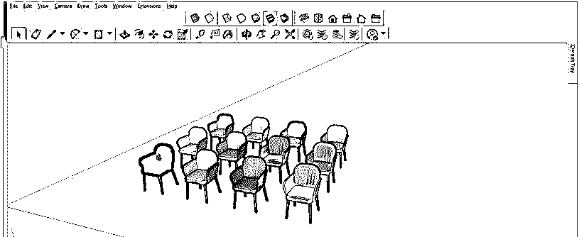

现在让我们以另一种方式来理解这个选项，它将只显示最后一个隐藏的对象。我将再次隐藏这张选中的椅子，然后使用推/拉和矩形工具创建一个这样的对象。

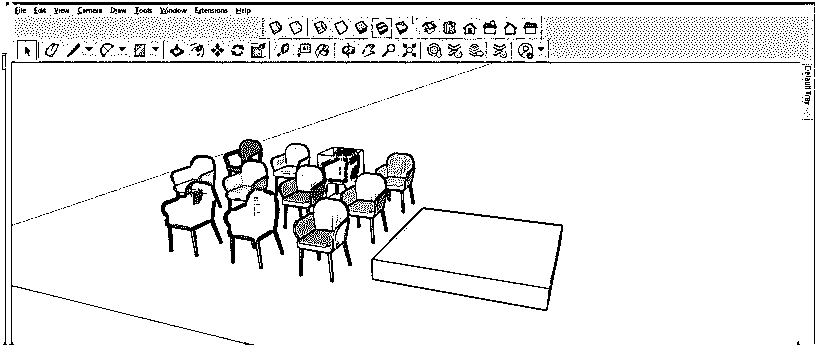

我也将向这个对象添加一个块。

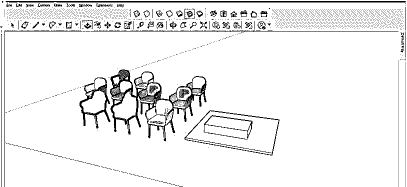

现在这一次，当你点击最后一个子选项的取消隐藏选项取消隐藏最后一个对象。

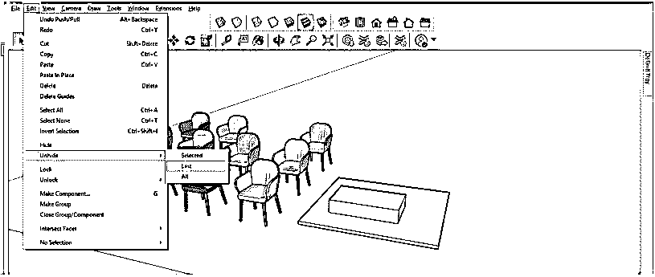

它只会取消隐藏最后一把隐藏的椅子。所以我想你明白了，如果我们隐藏任何组件，然后做其他设计工作，那么它只会取消隐藏最后一个隐藏的对象。

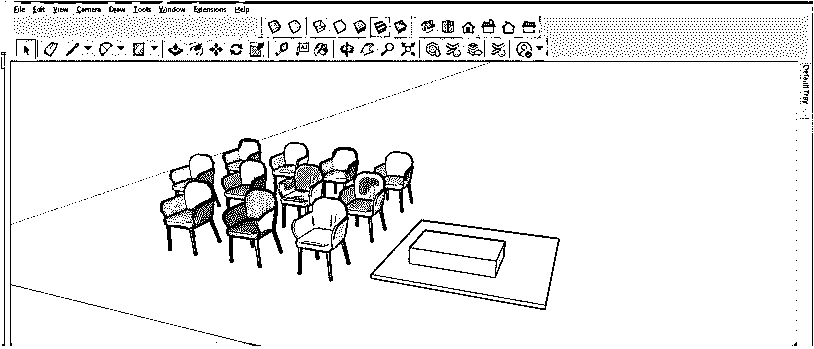

我将以同样的方式隐藏这个绘制的对象。

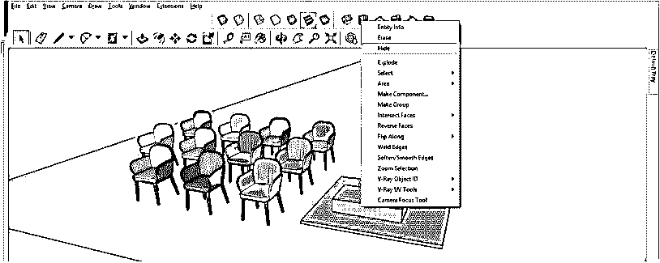

现在再一次，转到编辑菜单的取消隐藏选项，这次选择取消隐藏选项的所有子选项。

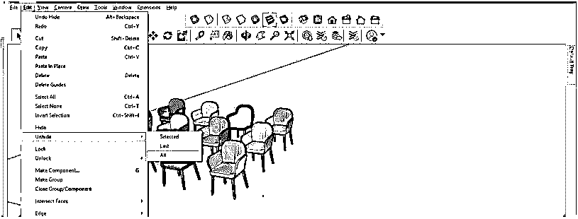

它会显示所有隐藏的对象，我们的工作模式，只需点击一下。

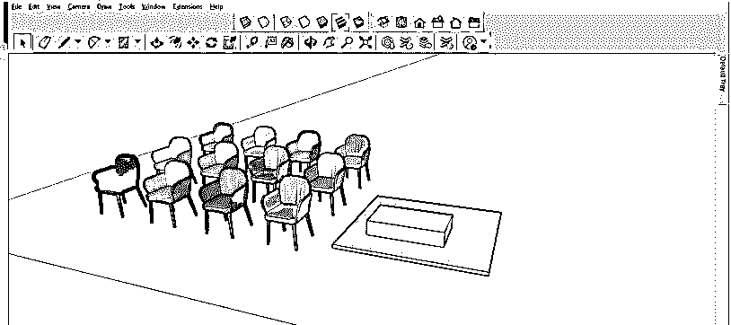

如果你想一个接一个地取消隐藏对象，或者只隐藏你想要的对象，你也可以这样做，在菜单栏的视图菜单中点击它，然后从这个菜单的下拉列表中选择隐藏对象选项。

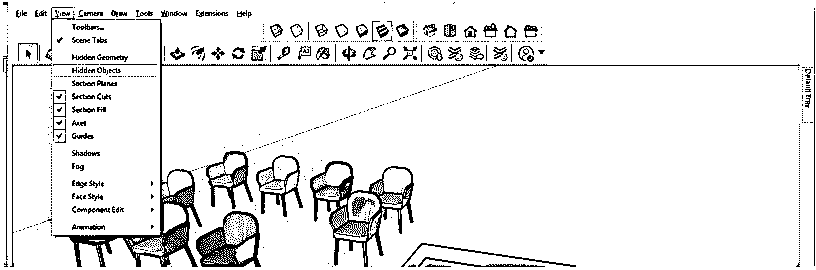

它会像这样显示你的工作模型的所有隐藏对象的线框视图。我只隐藏了这些椅子，所以它只显示它们。

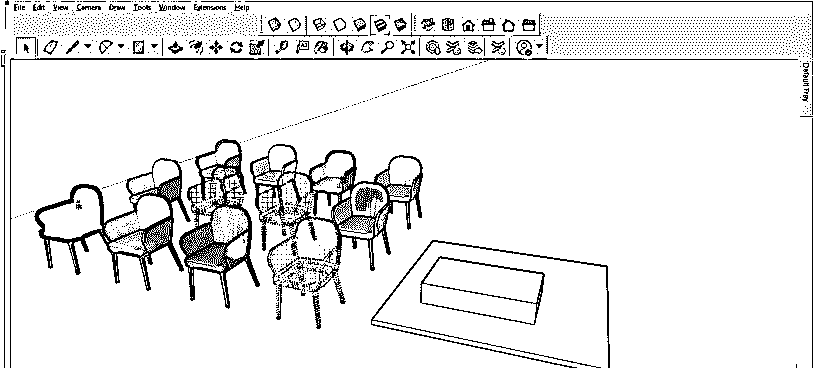

现在，我将选择线框视图中的第一把椅子，并从取消隐藏选项中选择选定的子选项。

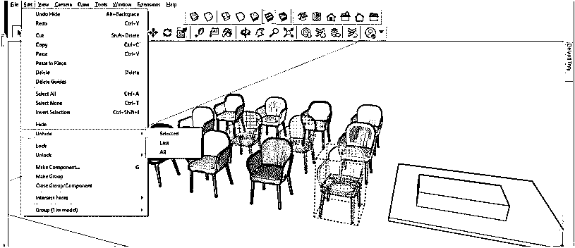

它只会取消隐藏这把椅子。因此，通过这种方式，您可以在任何项目中只显示您想要的对象或组件。

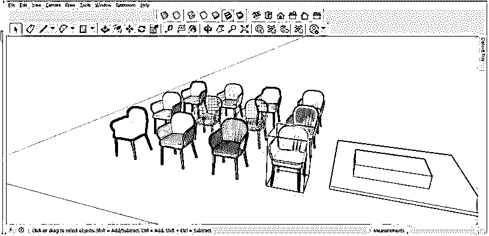

现在让我告诉你多一个选项，通过它你可以隐藏你想要的对象以外的其他对象，这样你就可以很容易地在你选择的对象中进行编辑。进入菜单栏的窗口菜单，点击下拉列表中的模型信息选项。

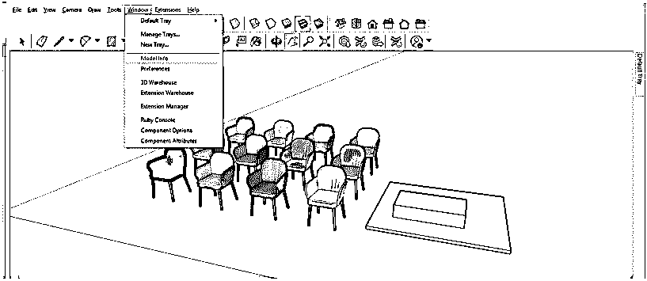

在模型信息对话框中，从显示的列表中选择组件选项。

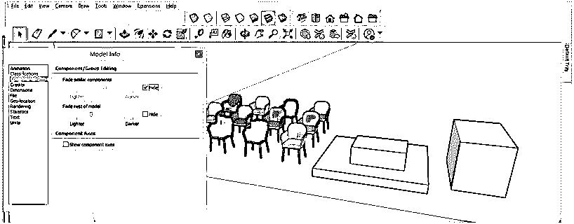

并启用该组件选项卡的第一个选项。要启用第一个选项，请选中隐藏选项的复选框，然后双击要处理的对象。你可以看到它将只突出选定的对象，另一个类似的对象将淡出。

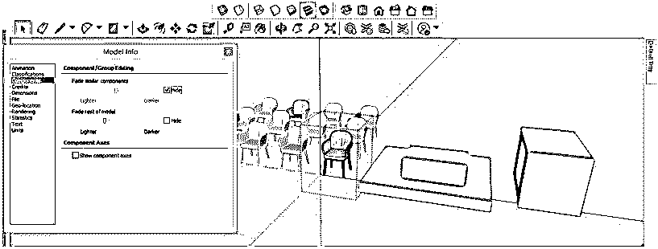

现在启用这个组件选项卡的第二个选项。要启用此选项，请选中隐藏选项的复选框，然后双击您要操作的对象。你可以看到它将只突出显示选定的对象，其余的对象将像这样消失。

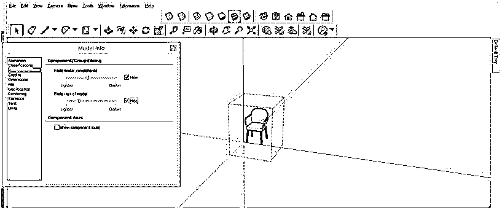

如果您选择其他组件，那么第一个选择的对象将会像这样消失。

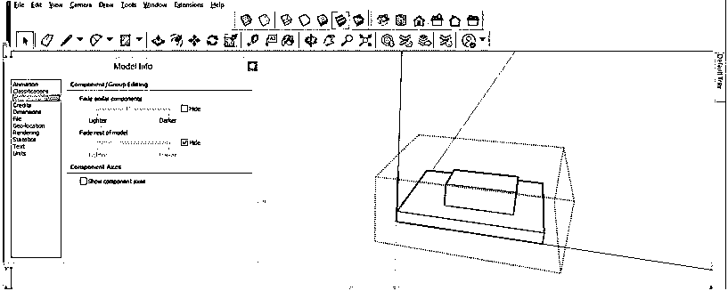

如果你愿意，你可以给上面讨论的两个选项分配一个快捷键，为此，再次转到窗口菜单，并在这个类型的下拉列表中点击 Preference 选项。

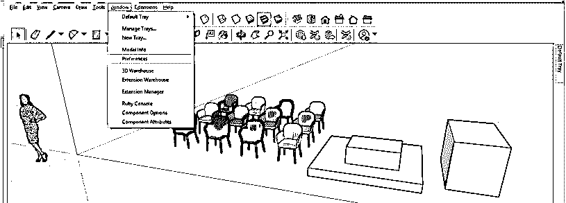

在首选项对话框中，从显示的列表中选择快捷方式选项，并在功能列表选项卡中选择“隐藏对象的其余部分”选项。然后转到添加快捷键框，并分配您想要的键与键盘的 Ctrl 键的组合。一旦您为它分配了一个键，如果该组合键已经被分配给另一个命令，那么它将显示一条消息，告诉您它已经被分配了。所以选择一个没有分配给另一个命令的命令。

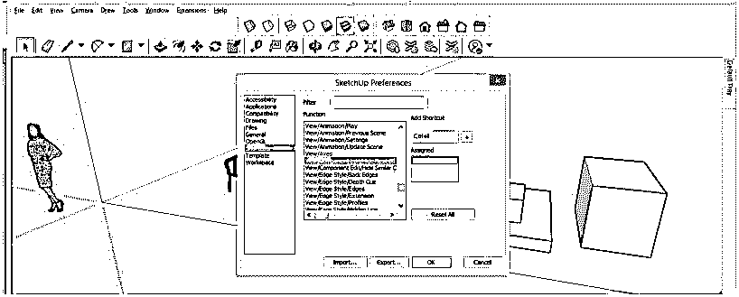

之后，点击这个框的加号按钮，你的分配键将进入一个分配框，这意味着它是为你选择的命令设置的。现在你可以用它来隐藏另一个对象，在你的模型上工作时也可以用同样的方式。

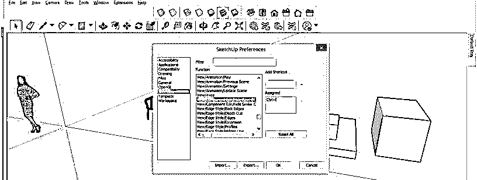

### 结论

这些是 SketchUp 的取消隐藏功能的一些重要方面，您可以在创建 3D 模型时使用它来获得平滑的工作能力。根据您的工作需要，您可以选择上述任何一种方式。您还可以根据自己的选择指定快捷键“隐藏其他对象”,以提高您在 SketchUp 中的工作技能。

### 推荐文章

这是一个 SketchUp 取消隐藏的指南。在这里，我们讨论的工作取消隐藏在 SketchUp 使用几个选项，通过它你可以做的过程中取消隐藏的对象。您也可以看看以下文章，了解更多信息–

1.  [SketchUp 架构](https://www.educba.com/sketchup-architecture/)
2.  [SketchUp AutoCAD](https://www.educba.com/sketchup-autocad/)
3.  [SketchUp 3D 模型](https://www.educba.com/sketchup-3d-models/)
4.  [SketchUp Vray](https://www.educba.com/sketchup-vray/)

