# SketchUp 背景

> 原文：<https://www.educba.com/sketchup-background/>

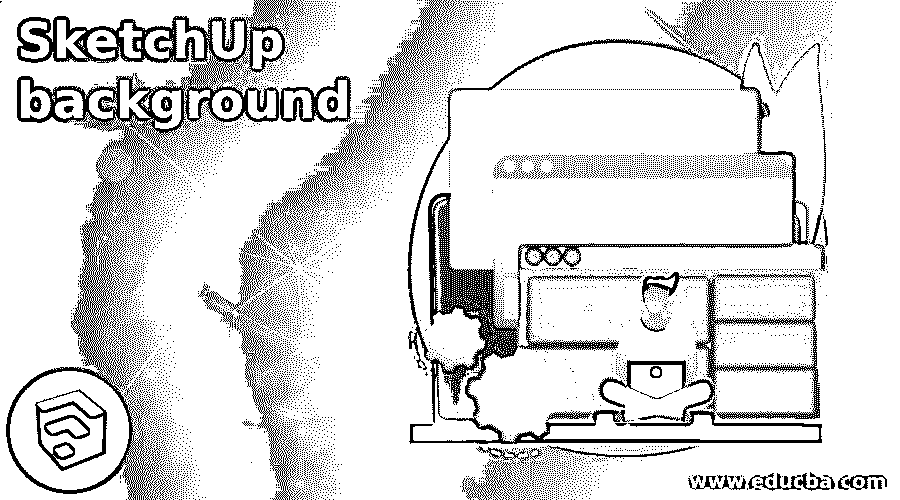

## SketchUp 背景介绍

创建 SketchUp 背景是在该软件中最终确定我们的 3D 模型的重要步骤之一，这意味着为了创建真实世界的影响并为我们的 3D 结构提供自然的外观，我们在该软件中创建背景，背景可以是任何颜色或任何图像，可以为我们的 3D 模型创建良好的可视化。你可以做很多参数设置来获得不同类型的背景。有几种方法可以在 SketchUp 中创建背景，并使用它们来准备您设计的 3D 模型的有效演示。因此，让我们找出我们能够做到这一点的方法。

### 如何在 SketchUp 中创建和使用背景？

我已经从 SketchUp 的 3D 仓库下载了这个美妙的 3D 模型，来解释你如何为这个模型创建一个背景。为此，您可以采用自己设计的模型。

<small>3D 动画、建模、仿真、游戏开发&其他</small>

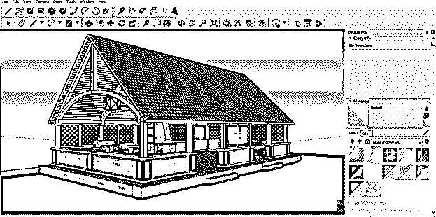

有几种方法可以为模型创建背景。所以在它的第一个方法中，我将在这个模型后面的工具面板的矩形工具的帮助下创建一个矩形。

现在转到菜单栏的文件菜单并点击它，然后选择下拉列表的导入选项。

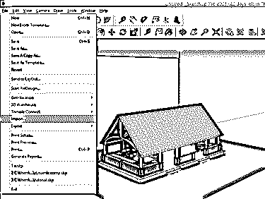

现在，在打开的对话框中导航到所需的背景文件。该文件应该是图像文件格式，以便我们可以在 Sketchup 中将其作为纹理导入。我将选择这个文件并启用纹理选项的单选按钮，然后单击导入按钮。

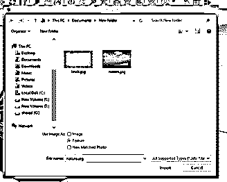

现在你可以把它放在这个矩形上，放置时，只需选择矩形的一个角并拖动它，然后点击填充它。

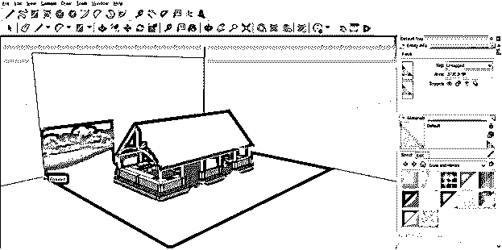

它会像这样填充。

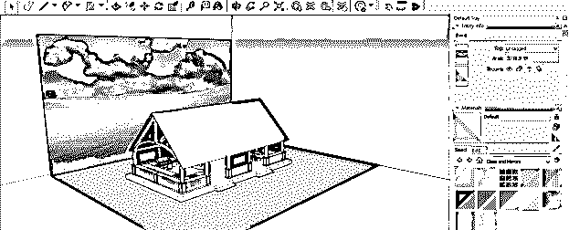

现在你可以看到你的模型后面有一个背景。

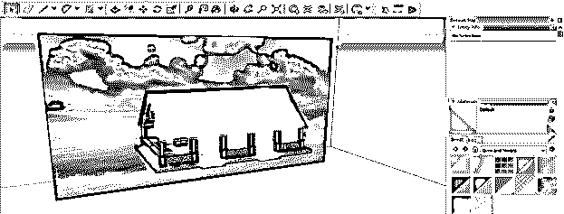

但使用这种方法，有一个问题是，如果您改变视图，那么这个背景将不会覆盖所有的视点。它只适用于一个视点。

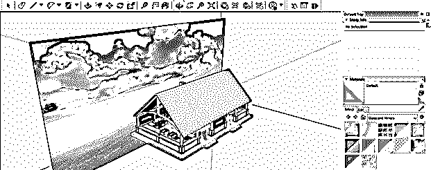

现在让我们讨论另一种方法，对于这种方法，单击默认托盘的样式栏，它位于工作窗口的右侧。

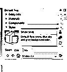

在此栏的选择选项卡中，您可以找到几个默认的背景设置。

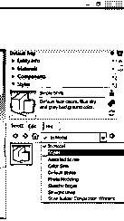

例如，如果从“选择”选项卡的“在模型中”选项的下拉列表中选择了“颜色集选项”,则可以像这样更改颜色。

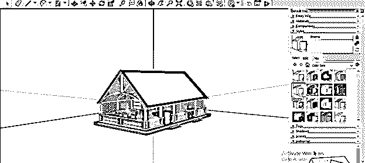

现在让我们转到自定义背景选项，这意味着您可以使用任何图像作为背景，为此，请单击样式栏的编辑选项卡的背景设置图标。

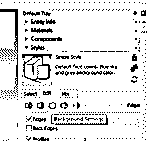

在这里，您可以通过点击背景选项的颜色方框，将背景颜色更改为您想要的颜色。单击此框后，将会打开一个选择颜色对话框，从色轮中选择您想要的颜色，然后单击确定按钮。

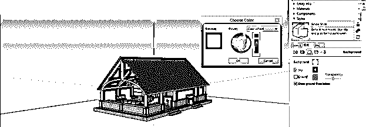

而且会有这样的变化。

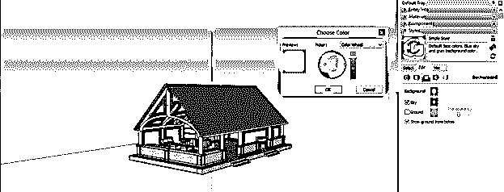

你可以用同样的方法从天空选项中改变天空的颜色。

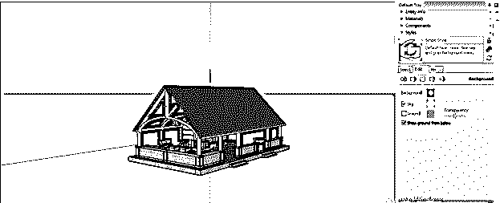

您也可以通过取消选中天空或地面颜色复选框来禁用它们。

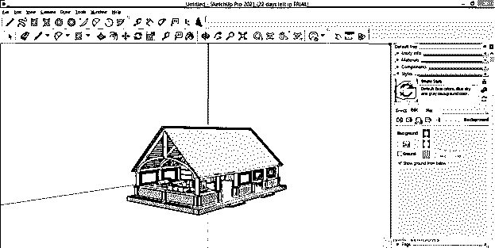

让我把这个模型移到下面，你可以看到这个模型的一点点。

通过更改“样式”面板的“透明度”选项的“透明度”值，可以根据需要管理这种可见性。如果向左滑动滑块，它会变得不那么明显。

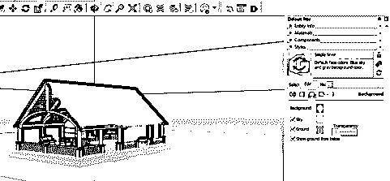

与之相反，如果你朝正确的方向移动，那么它将变得完全可见。

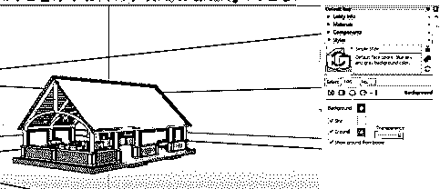

现在让我告诉你如何以另一种方式添加自定义背景到你的模型中。为此，单击编辑选项卡的水印设置图标。

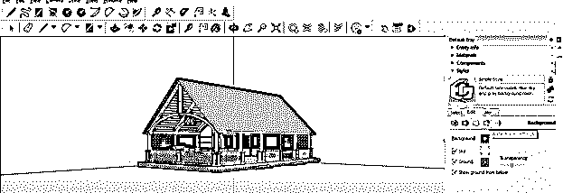

现在点击添加水印按钮。

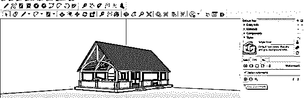

将会打开一个对话框来选择您想要的图像。我将选择此图像，并单击此对话框的“打开”按钮。你可以从网上下载任何适合你的型号的图片。

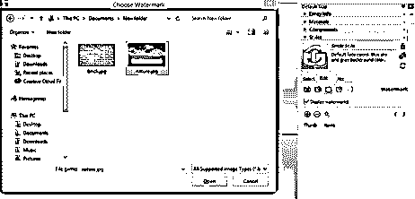

现在将打开一个创建水印对话框，它将询问您是否想要覆盖此图像或将其用作 3d 模型的背景图像。

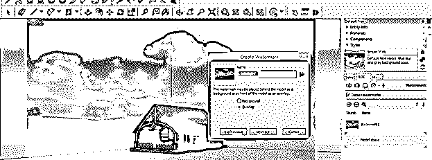

单击此对话框背景选项的单选按钮，将此图像用作模型的背景，然后单击此对话框的下一步按钮。

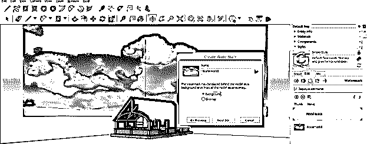

您可以将此图像与背景颜色混合，方法是在此比例上滑动混合滑块，这意味着此图像与背景颜色的外观。设置完毕后，它再次点击下一步按钮。

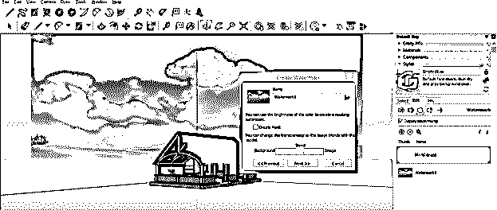

有三种方法可以显示这个图像。如果你选择“平铺在屏幕上”选项，它会把屏幕分成几块。

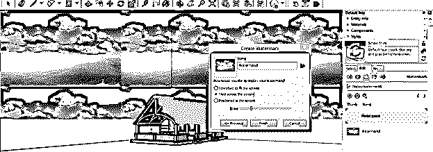

使用“定位在屏幕中”选项，您可以将此图像定位在背景矩形的中心或任何角点或边缘中点。例如，如果我单击此对话框中显示的矩形的中心点的单选按钮，它会将我的图像放在中心。

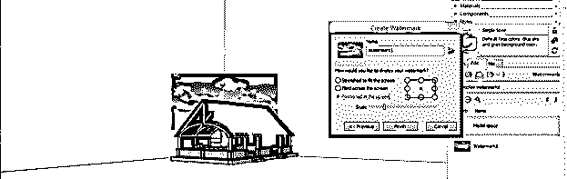

或者如果我选择任何一个角点，它会像这样把它放在选择的角上。

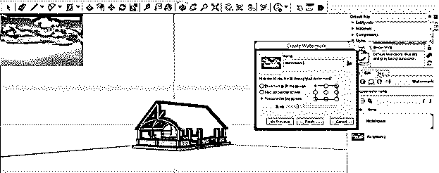

放置后，您可以根据您的要求从该对话框的缩放滑块中缩放它。

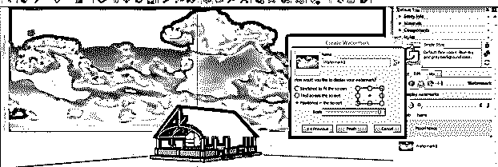

第一个选项是“拉伸 t 以适应屏幕”选项，通过该选项，它将自动拉伸图像以适应模型的背景。您只需禁用此选项的锁定纵横比子选项。完成所需设置后，单击该对话框的“完成”选项。

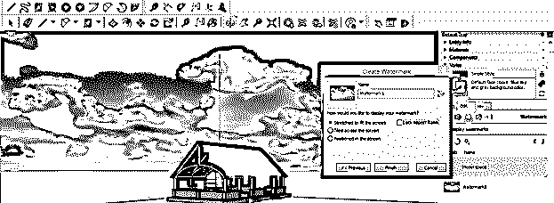

你可以从不同的角度看到这个背景和你的 3D 模型设置得很好。

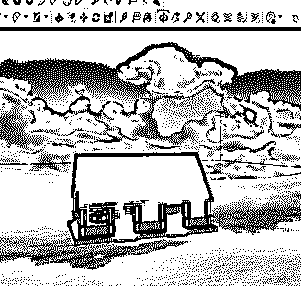

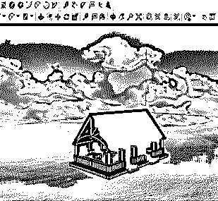

### 结论

现在你对如何在 SketchUp 中创建和使用 3D 模型的背景有了很好的了解，你可以使用我们上面讨论过的任何方法来实现这个目的。我建议你尝试每一种方法，并对参数进行不同的调整，以获得不同类型的 3D 模型有效背景的结果。

### 推荐文章

这是一个 SketchUp 背景指南。这里我们讨论如何在 SketchUp 中创建和使用 3D 模型的背景。您也可以看看以下文章，了解更多信息–

1.  [SketchUp 旋转](https://www.educba.com/sketchup-rotate/)
2.  [SketchUp 替代方案](https://www.educba.com/sketchup-alternative/)
3.  [SketchUp AutoCAD](https://www.educba.com/sketchup-autocad/)
4.  [UI 设计工具](https://www.educba.com/ui-design-tools/)

