# SketchUp 库

> 原文：<https://www.educba.com/sketchup-library/>

## SketchUp 库简介

SketchUp 库可以理解一个地方，在那里你可以找到许多不同的组件，你可以在你的模型设计中使用这些组件来显示你的模型中的对象。SketchUp 有一个在线库是 3D Warehouse，你可以从 SketchUp 软件面板访问它。您需要有 internet 连接才能打开此在线图书馆。这个库有一个好处，你可以从这里下载任何组件，并上传你设计的模型。通过一些设置和步骤，您可以将所需的组件从在线库中添加到您的模型中。所以让我来告诉你每一个步骤。

### 如何在 SketchUp 中使用 library its 组件？

在 Sketchup 中，您可以通过两种方式扩充 3D Warehouse 库。首先，去菜单栏，这是在工作屏幕的顶部，并点击它的窗口菜单。在此菜单的下拉列表中，您会找到 3D 仓库选项。

<small>3D 动画、建模、仿真、游戏开发&其他</small>

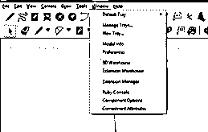

第二种方法是，您可以单击这个图标，这是 3D Warehouse 选项卡。

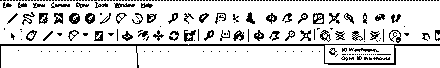

如果您找不到此图标，那么您可以转到菜单栏的“视图”菜单的“工具栏”选项。

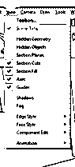

并通过单击其复选框来启用仓库选项，然后通过单击关闭按钮来关闭此对话框。

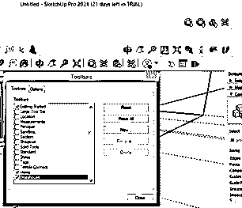

一旦您启用它，您将有一个仓库面板，您可以把它放在工具栏区域的任何地方。

现在单击 3D 仓库选项，一旦单击，此对话框将打开。确保您的互联网连接已打开。

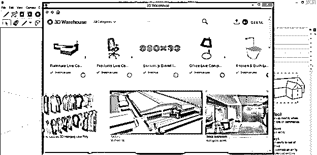

现在你可以在这个对话框的搜索框中搜索你想要的组件，比如我想要一个窗口组件，所以我要在里面搜索窗口。

你会发现许多不同的窗口组件预览。你可以点击你想要的。

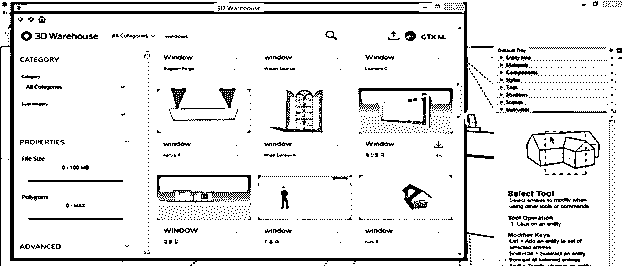

单击后，所选组件的详细信息将像这样打开。现在点击下载按钮。

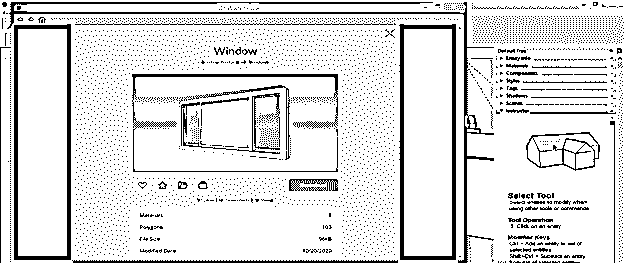

单击 Download 按钮后，它会询问您是想将该组件直接用于您的模型还是下载它。如果您单击“是”,那么它将直接出现在您的模型上，无需保存。你可以选择是或不是。我将单击该弹出框中的“是”按钮。

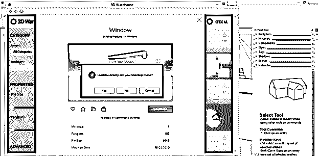

现在你的模型上就有这个窗口了。我也从 3D 仓库下载了这个模型。现在点击将这个组件放置在地面上的任何地方。

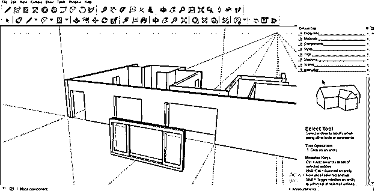

或者，无需点击，您可以直接将其放置在您想要的位置，或者从工具面板中选择移动工具(如果您已经将其放置在地面上的任何位置),然后将此窗口移动到您想要的模型位置。我会把它移到这里。

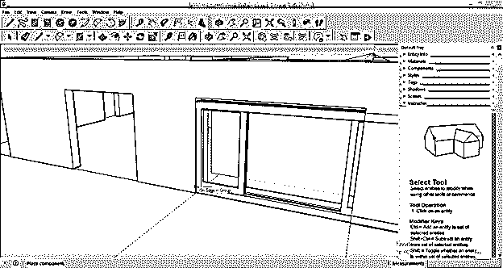

你可以看到它不是根据这个模型的形状。因此，您也可以根据您的模型缩放组件。

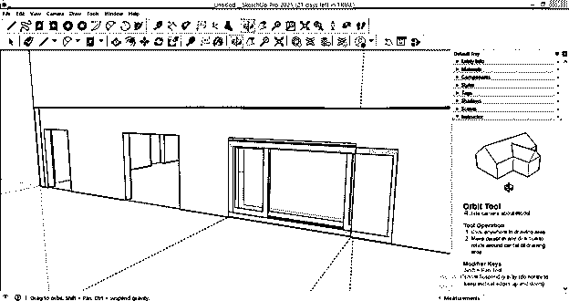

我将使用工具面板的缩放工具，并根据这个模型进行调整。

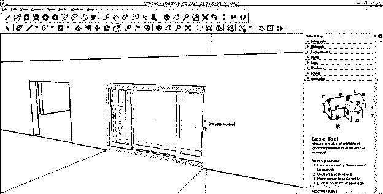

现在让我们下载一个门，就像我们下载一个窗口组件一样。我已经下载了这个门，你可以看到它和这个模型不是一个方向。所以只要点击一下，把这扇门放在地上的任何地方。

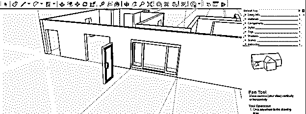

现在选择工具面板中的旋转工具，将它旋转到与你的模型相同的方向。

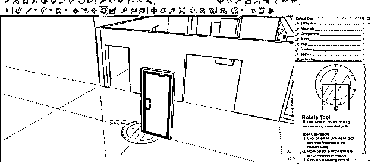

现在使用移动工具把它放在你想要的地方，如果它不适合你的模型就缩放它。

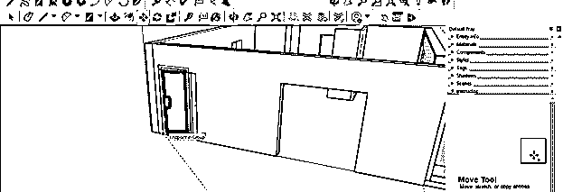

它会像这样合身。

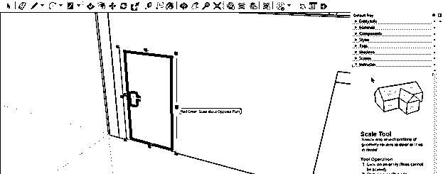

现在让我再告诉你一件关于库组件的事情。这次我下载了这个窗口组件，你可以看到有两套窗口，而我只需要一套。

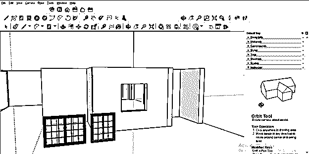

因此，为了删除不需要的部分，选择你的组件并点击右键，然后点击向下滚动列表的分解选项。

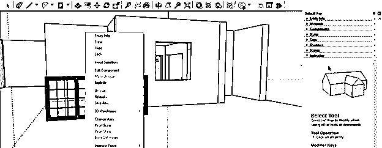

这个组件的两部分会像这样分开。您现在可以删除不需要的部分。我会在选中这个蓝色的部分后，按下键盘上的删除键来删除它。

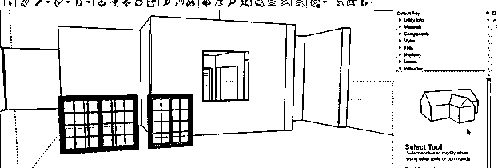

现在用移动工具，你可以把它放在你想要的地方。

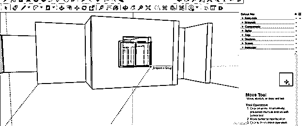

您还可以更改已下载的库组件的材料，为此，请选择该组件，然后转到位于工作屏幕右侧的该软件的材料栏。你可以在这里找到许多不同类型的资料，也可以使用任何从网上下载的资料。我将点击列表中的窗帘选项。

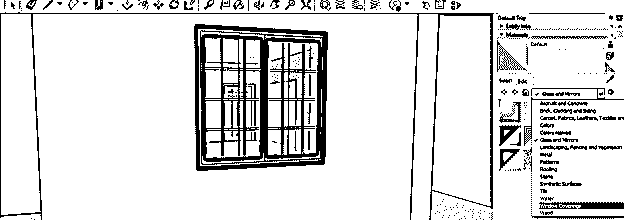

现在从这里选择你想要的任何材料。

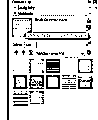

并双击选择您想要的组件部分，因为组件是分组的。

然后用选择的材料点击它，它会像这样填充。

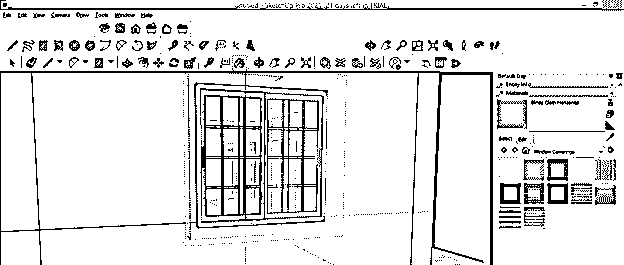

可以用同样的方法将两种或两种以上的材料填充到一个元件的零件中。

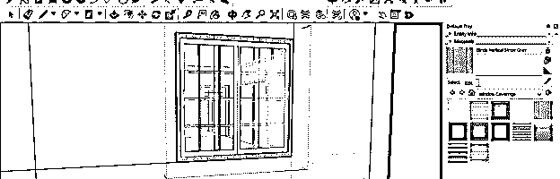

您也可以在 3D Warehouse 库上传自己设计的组件。我通过选择我从 3D Warehouse 下载的这个组件向您展示这一点。所以在选择你的组件后，进入菜单栏的文件菜单并点击它，然后进入下拉列表的 3D 仓库选项。这里你有两个选择:上传你设计的组件，另一个是上传你设计的模型。我将单击“共享组件”选项。

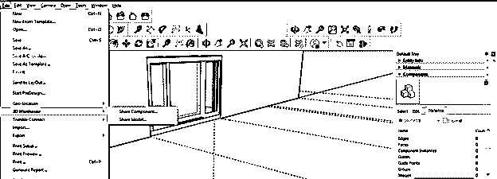

一旦你点击它，这个对话框就会打开，你必须在里面填写一些细节。

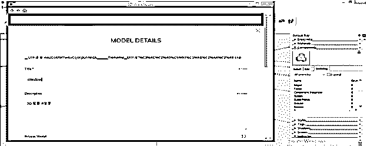

完成详细信息部分后，您可以单击 con Upload 选项来上传您选择的组件或型号。

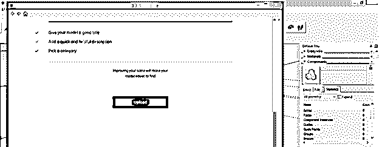

### 结论

这是关于 SketchUp 库的所有内容，为了更好地理解它，有必要知道这些内容。现在，您可以在这个在线库中找到任何类型的模型和组件，并下载它们用于您的模型设计。您不仅可以下载它，还可以上传您自己设计的模型，以便其他人可以从这个美妙的 3D 仓库平台使用您的模型。

### 推荐文章

这是 SketchUp 库的指南。在这里我们讨论如何使用 SketchUp 中的库及其组件，每一个步骤都很清楚。您也可以看看以下文章，了解更多信息–

1.  [SketchUp 替代方案](https://www.educba.com/sketchup-alternative/)
2.  [SketchUp 旋转](https://www.educba.com/sketchup-rotate/)
3.  [SketchUp AutoCAD](https://www.educba.com/sketchup-autocad/)
4.  [CorelDRAW 标志设计](https://www.educba.com/coreldraw-logo-design/)

