# SketchUp 动态组件

> 原文：<https://www.educba.com/sketchup-dynamic-components/>

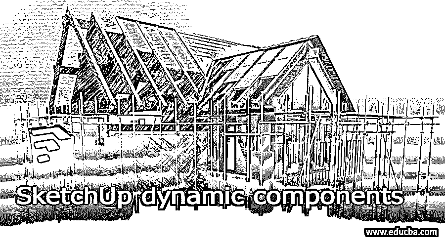

## SketchUp 动态组件简介

SketchUp Dynamic Component 顾名思义并不是任何类型的组件，它实际上是一种具有多个参数的工具类型；通过设置它们，我们可以在建模过程中为我们在 SketchUp 软件中创建的项目的 3D 组件添加动态值。向组件添加动态值可以理解为提供组件的任何特定部分的运动或动画，以表示该组件的该部分在真实结构中如何工作。在动态组件工具中，您会发现许多我们今天将通过一些例子在本文中讨论的特性。在本主题中，我们将学习 SketchUp 动态组件。

### 如何使用 SketchUp 中的动态组件工具？

我们可以通过几个简单的步骤来使用 SketchUp 的动态组件特性。所以让我们开始讨论这个话题。为此，我将从该软件的欢迎窗口屏幕中取出一个空白项目。

<small>3D 动画、建模、仿真、游戏开发&其他</small>

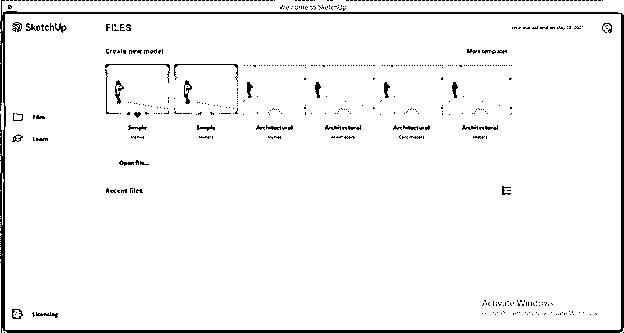

我要做的第一件事是设置单位。要根据您的项目要求设置单位，请转到菜单栏的“窗口”菜单，然后单击该菜单下拉列表中的“型号信息”选项。

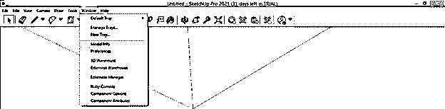

现在从这里选择你想要的单位。我将选择此对话框的格式选项中的小数。

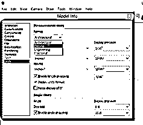

并选择“长度单位为毫米”选项。

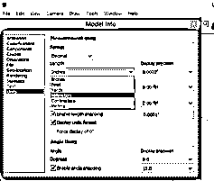

现在我将用这个单元按下键盘的 Ctrl+ S 键来保存这个项目。我将用“动态 comp”这个名称保存它。您可以根据自己的选择将其保存在个人电脑的所需位置。

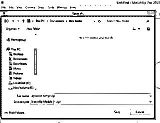

现在，我将制作一个组件，用于向您解释动态组件工具。因此，从工具面板中选择矩形工具。

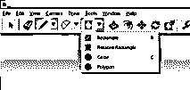

我将画一个大小为 1200 毫米 x 4000 毫米的矩形。

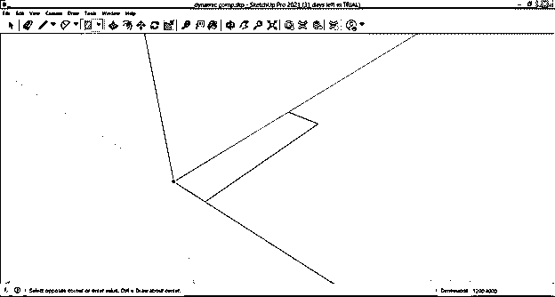

现在从工具面板中取出推/拉工具。

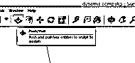

我将把这个矩形拉伸到 3000 毫米。

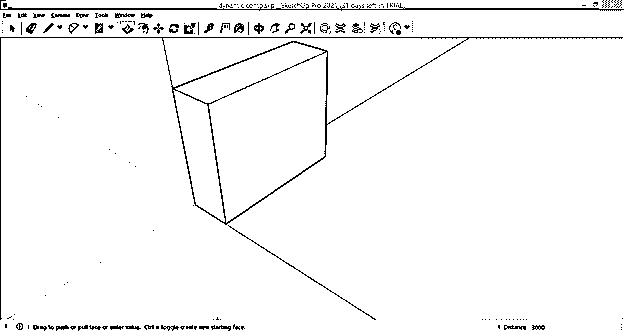

现在选择整个组件并在其上单击三次右键，然后单击鼠标左键，将会打开一个下拉列表。接下来，点击下拉列表中的制作组件选项，将这些面制作成组件。

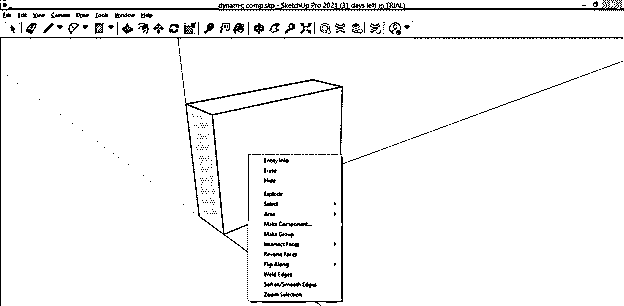

一旦你点击，它会要求你按照你的选择来命名这个组件，以便将来在这个项目上工作时可以很容易地指定这个组件。现在点击这个对话框的创建按钮。

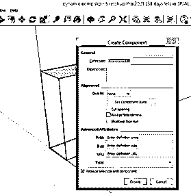

现在，再次单击三次，然后左键单击，这次单击下拉列表中的“Make Group”选项。

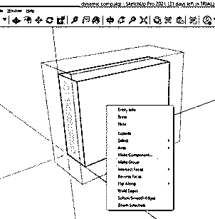

现在我将再次使用矩形工具为这个物体制作一个门。这个门将在这个组件的一半。

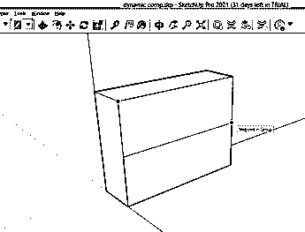

现在，我将再次使用推/拉工具来设置门的厚度，对于厚度，我将输入 100 mm 作为其值。

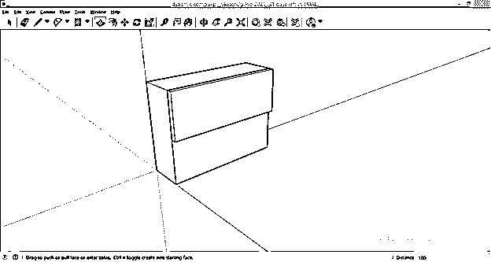

现在，将这些面作为组件，并使用与前一个对象相同的方法对它们进行分组。

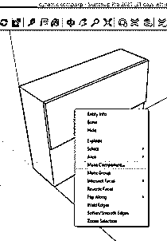

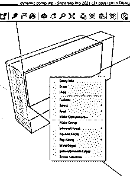

现在从工具面板中选择移动工具，按住键盘上的 Ctrl 键，将这个门拖动到这个组件的按钮上进行复制。

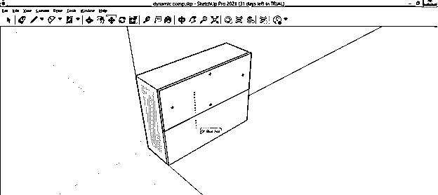

如果你的 Sketchup 软件的工作屏幕上没有动态组件工具栏，那么进入查看菜单点击它，然后点击下拉列表的工具栏选项。

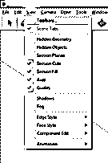

通过单击此选项的复选框，从“工具栏”对话框中启用动态组件工具。启用此选项后，其面板将在工作屏幕上打开。

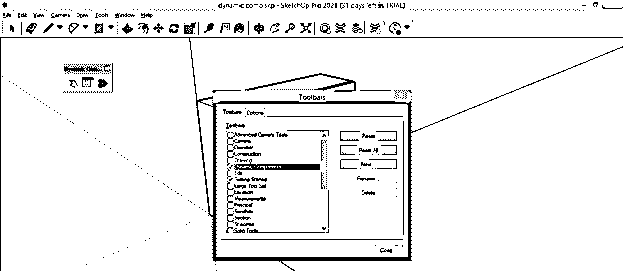

您可以在工作屏幕的任何地方设置它。例如，在动态组件的工具面板中，有三个选项:与动态组件交互、组件选项和组件属性。

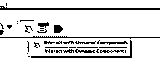

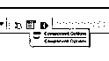

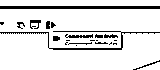

现在选择你想要动画或运动对象。我将选择第一扇门，然后单击动态工具面板的组件属性选项。

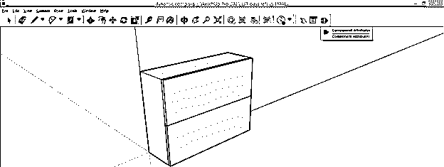

这是“组件属性”对话框。我会旋转这个门，所以首先点击这个对话框的添加属性按钮的加号。

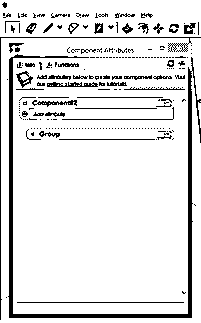

并选择要围绕其旋转组件的平面。

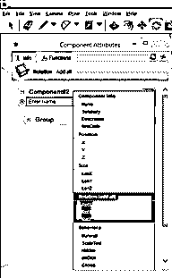

您可以使用旋转工具检查组件的旋转面板。例如，我将绕这个轴旋转这扇门，你可以看到它是绿色的。

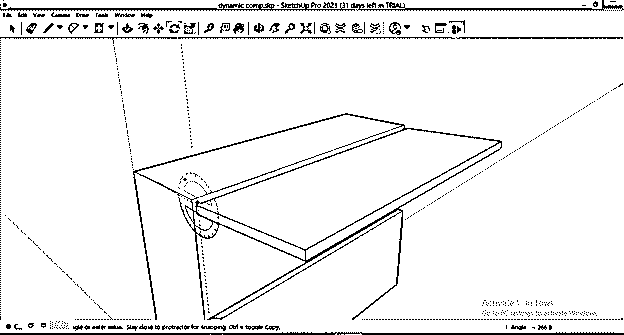

现在，我将在“组件属性”对话框的“旋转”选项中选择同一轴。所以你可以看到我选择的轴也是绿色的，所以你可以很容易地识别相同的轴。

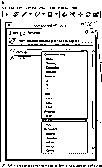

现在，再次点击添加属性按钮，这一次，我将分配一个方法，通过它我的动画将播放。

我将为该属性选择行为选项的“OnClick”子选项。

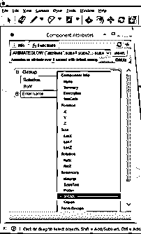

现在点击这个对话框的函数选项卡，从 onClick 函数选项列表中搜索' ANIMATESLOW("attribute "，State1…)子选项。

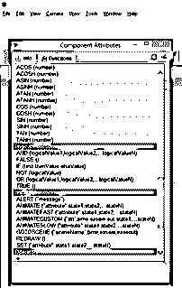

现在，单击 OnClick 的文本框，然后单击位于函数框旁边的插入按钮。我们选择的函数将像这样插入。

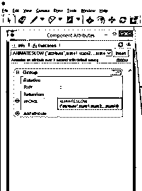

现在代替属性，插入旋转轴，并点击 RotY 来插入它。

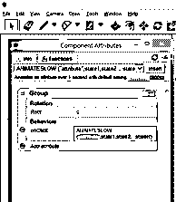

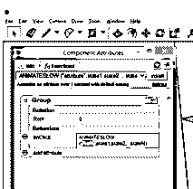

我将用 90°代替 state1 作为旋转角度，因为我想将门旋转 90 度。

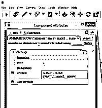

并给 0 作为 state2 值，因为它会把这个门收回到原来的位置，也就是 0 度。

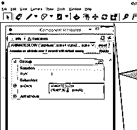

如果你想给另一个旋转角度，那么你可以继续给数值或从这个括号中删除其他文本值，然后按键盘的 enter 键。

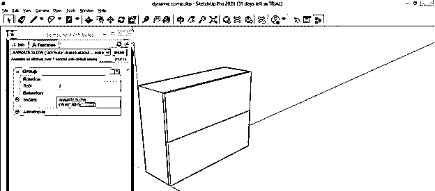

现在从动态组件的工具面板中选择“与动态组件交互”工具。

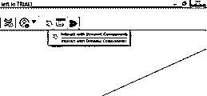

点击这扇门，它会像这样打开，再点击一下，你也可以关上它。

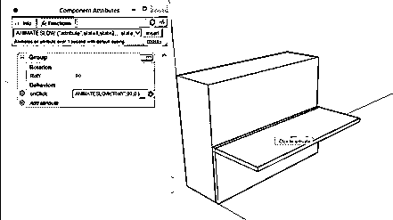

如果你把这个盒子做成这样的中空形状，那么它就像一个衣柜或者一张敞开的书桌。你可以用同样的方法制作隔壁的动画。

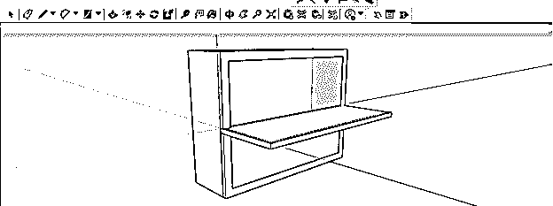

### 结论–SketchUp 动态组件

这些是动态组件工具的几个步骤；通过遵循它们，您可以将运动添加到 SketchUp 软件的项目工作组件中，并在实际应用中获得该组件的视觉运动结果。此外，您可以尝试动态组件的其他功能，以不同的方式制作对象的动画。

### 推荐文章

这是一个 SketchUp 动态组件的指南。在这里，我们讨论 SketchUp 动态组件的一些特性以及一些例子。您也可以看看以下文章，了解更多信息–

1.  [SketchUp 旋转](https://www.educba.com/sketchup-rotate/)
2.  [SketchUp 替代方案](https://www.educba.com/sketchup-alternative/)
3.  [SketchUp AutoCAD](https://www.educba.com/sketchup-autocad/)
4.  [UI 设计工具](https://www.educba.com/ui-design-tools/)

