# 草图列表

> 原文：<https://www.educba.com/sketchup-cutlist/>

## SketchUp CutList 简介

SketchUp CutList 是一个扩展，可以帮助我们创建切割列表以及任何木制模型的布局，这意味着您可以在 SketchUp 中准备任何木制对象的切割部分的布局，根据布局，您可以在锯床上从指定的材料中切割所有部分。在 SketchUp 中，有一个扩展仓库，您可以从那里下载免费的源代码 CutList 扩展，并使用它们来创建组件和布局的切割部分列表。但是，为了正确处理 CutList 扩展，您必须知道一些参数。

### 如何在 SketchUp 中创建和使用 CutList

您可以通过使用该软件的扩展管理器的免费源代码 CutList 扩展来为任何木制组件创建 CutList。

<small>3D 动画、建模、仿真、游戏开发&其他</small>

所以首先我们会考虑这个组件是木质组件，我们会创建 CutList。

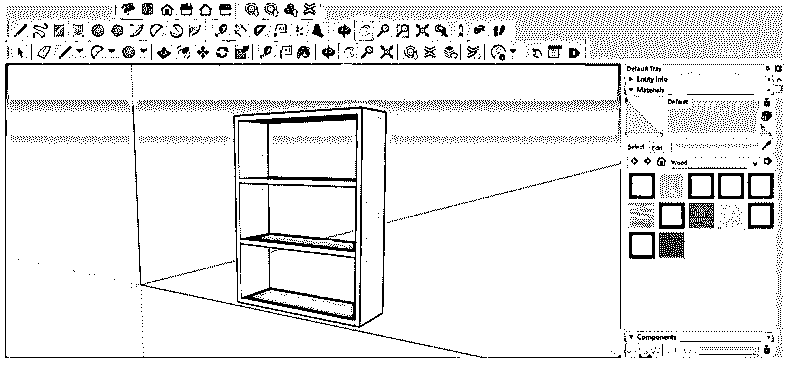

首先，让我们为此下载 CutList 扩展，为此，单击工具面板上的扩展仓库图标。

您也可以在菜单栏的 Windows 菜单的下拉列表中找到这个扩展仓库。

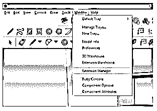

现在扩展仓库对话框将被打开。请确保您已打开互联网连接，以便您可以在线搜索它。在此对话框的搜索框中，键入 CutList 并按 enter 键。

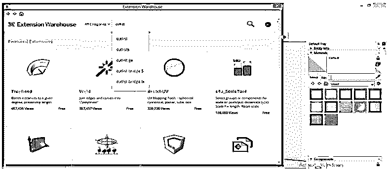

在这里，您将有许多 CutList 扩展。此外，您可以下载该列表中的任何人。

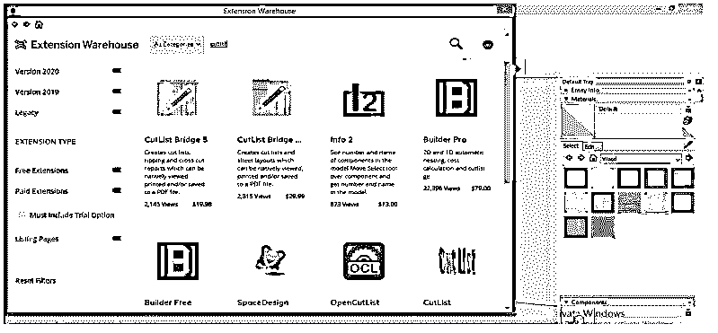

我们将下载这个 OpenCutList 扩展，因为它非常方便易用。

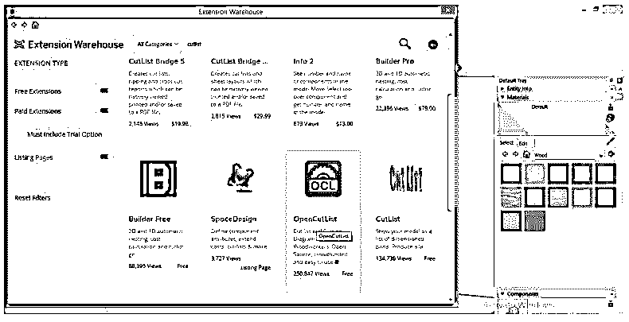

一旦你点击了你想要的扩展，你将会得到该扩展的所有相关细节，你可以在安装前阅读它。

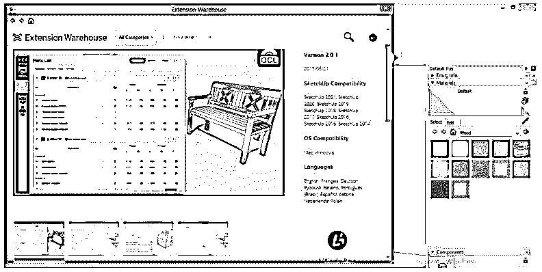

一旦你安装了它，进入窗口菜单下拉列表中的扩展管理器选项。

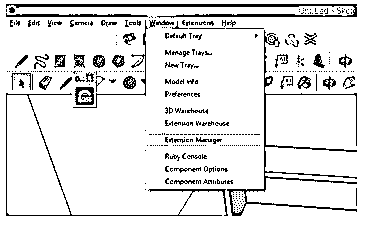

并检查在“扩展管理器”对话框中是否启用了 CutList 扩展。

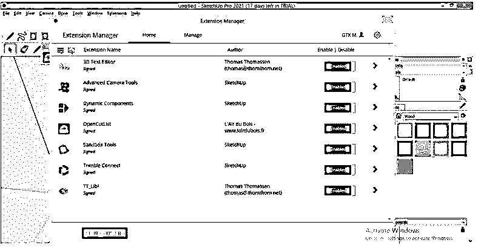

现在在扩展菜单中，您会发现 OpenCutlist 扩展。

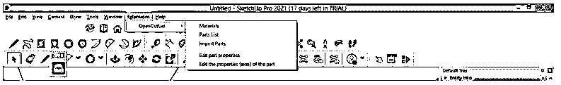

现在，让我们将物料分配给该组件的各个部分，以便我们可以为该物料创建说明列表。对于指定材质，我们将转到材质面板中的木材材质列表，它位于工作屏幕的右侧，我将选择这种木材胶合板纹理。

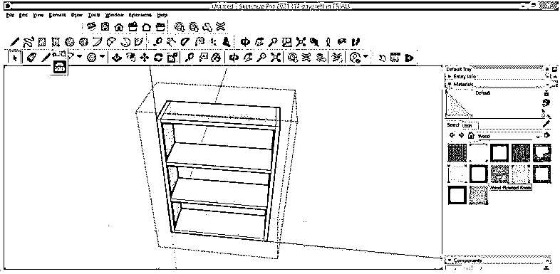

并把它填入这个组件的每一部分，因为这个组件将由木质胶合板组成。所以你可以用不同的材料来制作一个组件的不同部分。

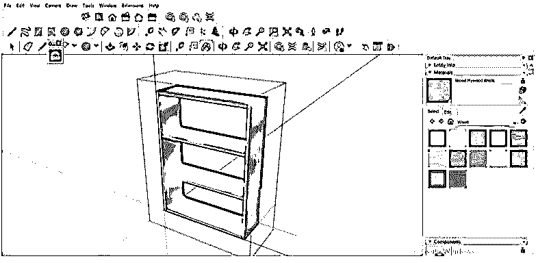

现在，在分配材料后，进入扩展菜单，然后点击 OpenCutList 扩展的材料选项。

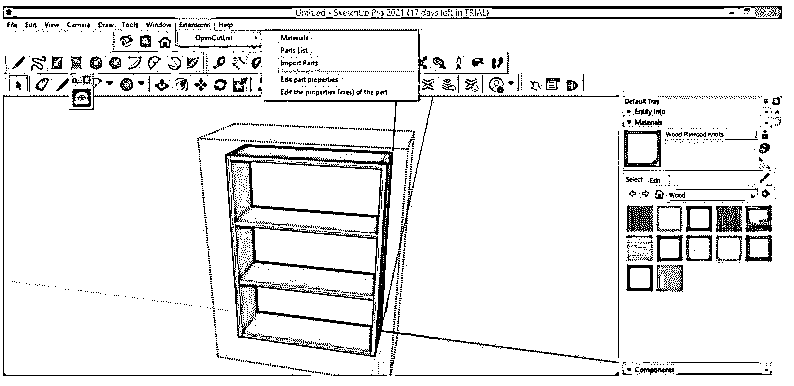

这个扩展的对话框里有预定义的材质，我分配的材质也在这里。

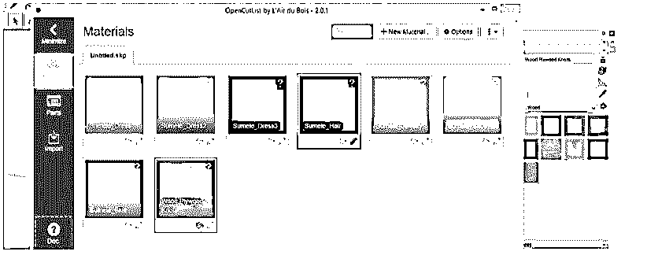

我们将删除其他材料，因为它们不在我的组件中，所以请单击“编辑属性”材料标签的按钮。

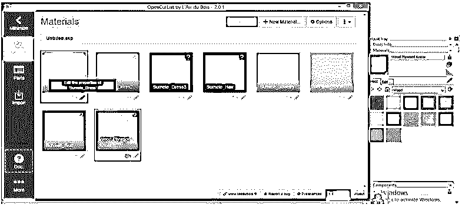

一旦你点击它，一个编辑对话框将被打开；单击“删除”按钮将其删除。

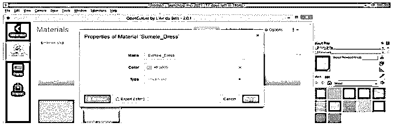

它将再次要求您确认删除选定的材料，因此再次单击删除按钮。

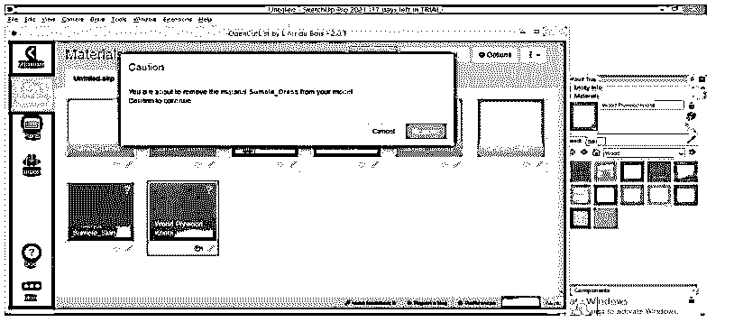

删除所有不需要的材料后，我们将单击我分配的材料的编辑按钮，对其属性进行更改。

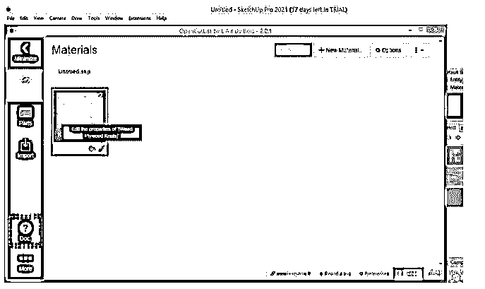

这是木质胶合板材料的属性框。如果有许多相同材料的组件，您可以在此处更改颜色以正确识别组件的不同部分。您也可以根据自己的选择更改材料的名称。

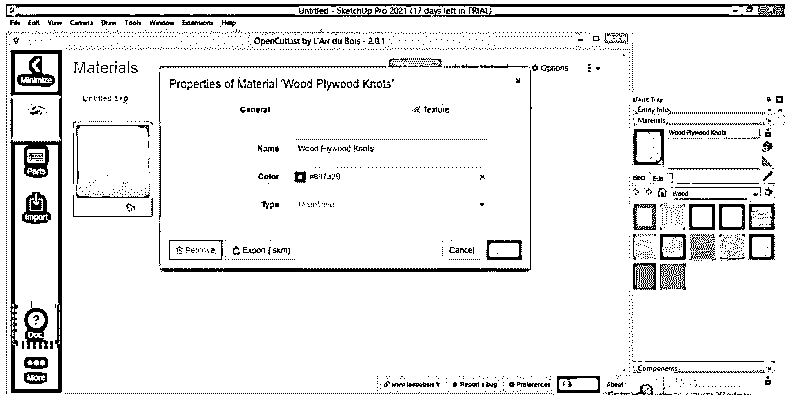

现在，单击类型框的下拉箭头按钮，您可以选择将在其上切割该组件零件的材料类型。

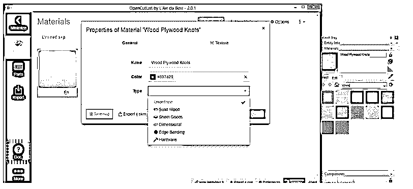

如果我们从列表中选择实木，它会显示标准实木胶合板的所有规格，如标准厚度、尺寸过大的长度、宽度等。

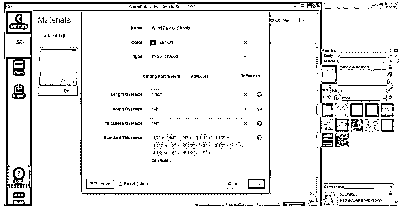

您可以根据您的组件要求给出超大尺寸。

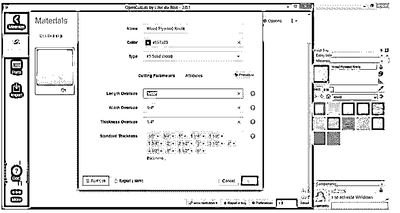

这是实木材料的标准厚度。如果厚度值与这些值不同，您可以输入自己的材料厚度值。

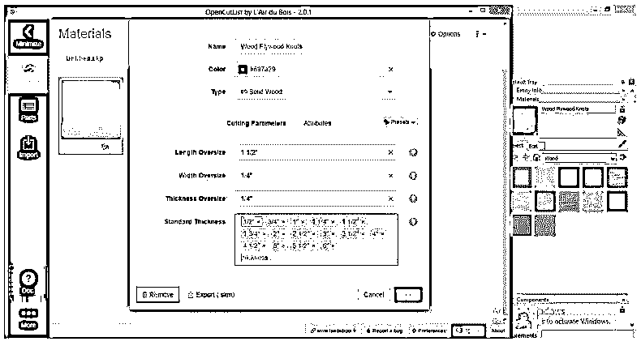

完成后，单击“应用”按钮。

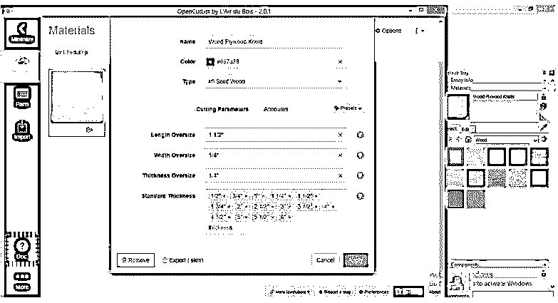

让我再告诉你一种材料，如果你从材料类型列表中选择片状物品选项。

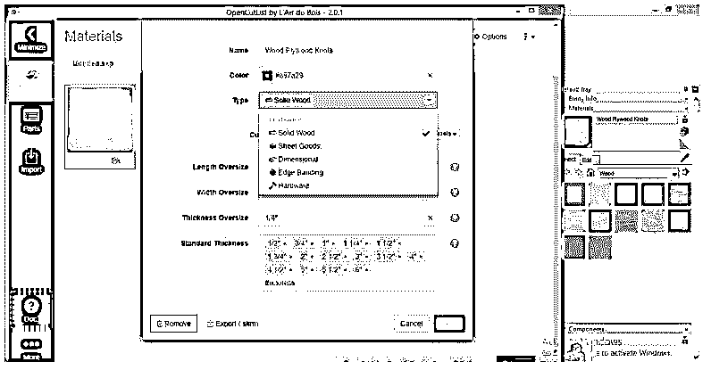

然后将有不同的参数设置，您可以根据可用的材料或默认值进行更改。

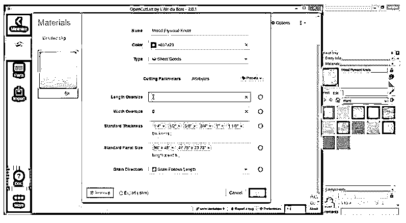

还有一件事，在哪个方向，你想削减胶合板材料的纹理遵循长度或没有纹理。

例如，如果选择“顺纹顺长”,那么它将沿着材料的纹理方向切割。

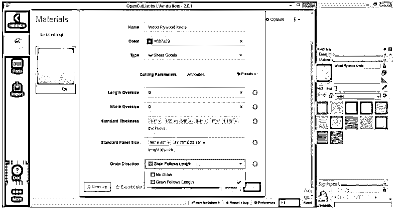

点击“应用”按钮后，转到该对话框的“零件”选项卡，该选项卡位于该对话框左侧的“材料”选项卡下方。

在此选项卡中，单击生成按钮以生成说明列表。

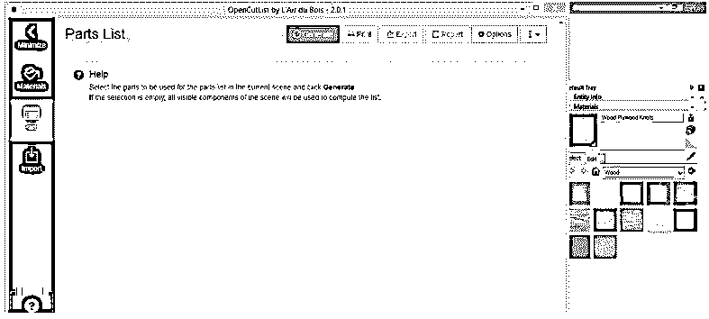

你将有一个切割组件的参数列表。我们分配了一个材料，所以列表上只有一个。你看，有一个红色的标记是厚度不确定的。这意味着如果组件的尺寸与标准值不匹配，它会向您显示一个错误。

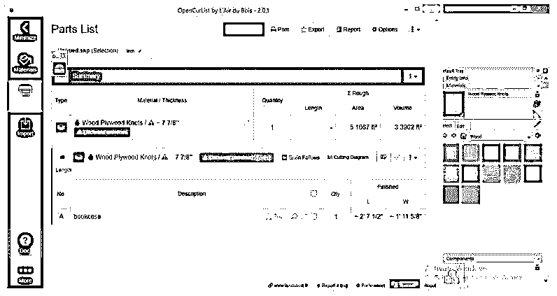

这表明您的绘图组件的厚度不是根据胶合板的标准厚度，因此请确保您设计的组件的参数是根据任何类型的木质材料的标准尺寸。

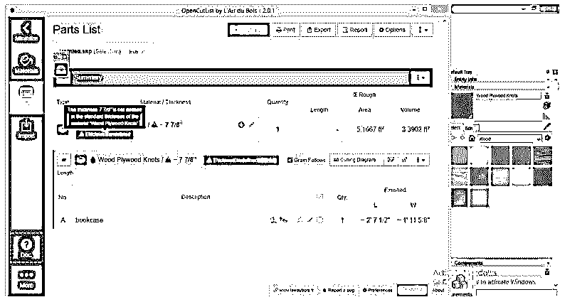

准确设置所有参数后，点击该对话框的切割图按钮。

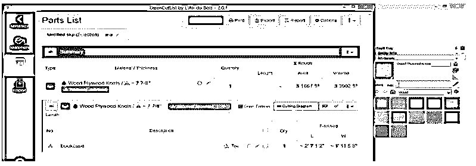

它将为你的部件生成一个切割布局，就像这样。

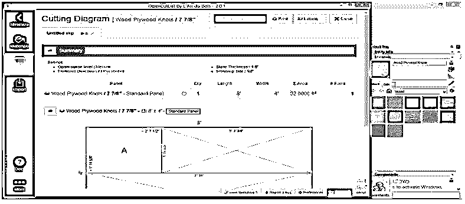

您可以通过向下滚动此窗口来查看此切割布局的详细信息。如果需要，您也可以打印该布局或保存它以备后用。

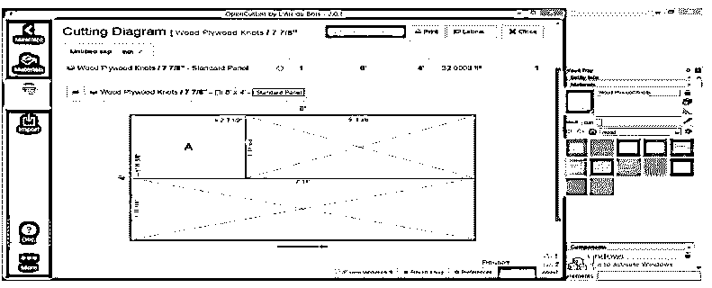

### 结论

这是关于这个软件的 CutList 扩展，现在你可以用它来创建 CutList 和布局来切割你的木制组件的一部分。在这里，我们看到了如何通过使用它的扩展来创建 CutList。但是，当然，您可以使用任何其他 CutList 扩展来实现这个目的。

### 推荐文章

这是 SketchUp CutList 的指南。这里我们分别讨论简介以及如何在 SketchUp 中创建和使用 CutList。您也可以看看以下文章，了解更多信息–

1.  [SketchUp 替代方案](https://www.educba.com/sketchup-alternative/)
2.  [SketchUp 旋转](https://www.educba.com/sketchup-rotate/)
3.  [SketchUp AutoCAD](https://www.educba.com/sketchup-autocad/)
4.  [融合 360 替代方案](https://www.educba.com/fusion-360-alternative/)

