# SketchUp 数组

> 原文：<https://www.educba.com/sketchup-array/>

## SketchUp 数组简介

SketchUp Array 是该软件中的一项技术，通过它，您可以围绕特定轴旋转模型的任何对象或组件，以制作该组件的多个副本。您还可以围绕设计模型中的任何其他对象旋转该组件。我们可以通过工具面板的不同工具做一些调整，在 SketchUp 软件中做一个数组。它还需要一些参数调整，以获得我们对任何特定组件的期望结果。我们将通过使用工具面板的旋转工具来理解阵列，并根据阵列组件所需的副本对旋转角度进行一些更改。所以让我们好好讨论一下这个话题。

### SketchUp 中如何使用数组？

您可以创建该软件的任何组件的数组，同时在任何项目上工作，只需遵循一些简单但令人兴奋的步骤。所以让我告诉你这些步骤在这个过程中涉及到什么。

<small>3D 动画、建模、仿真、游戏开发&其他</small>

在它开始告诉你这个命令/这个软件的特性之前，我想告诉你这个软件的用户界面的一些部分来理解我在这篇文章中的措辞。因此，在用户界面的顶部，有一个带有许多子菜单的菜单栏，通过它我们可以在该软件中进行许多设置和调整。在这个菜单栏下面，你可以找到一个工具栏/工具面板，你可以根据自己来调整。然后，在这个用户界面的中心，我们有我们的工作窗口，我们可以看到我们的工作。在这个窗口的左侧，有一些栏，如材料栏、组件栏等等，这些栏在这个软件中完成不同类型的工作。

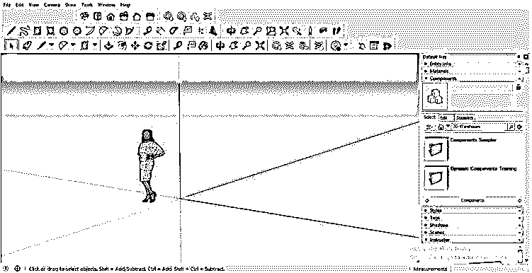

现在让我们理解这个软件中的数组，为此，我将创建一个圆形对象。你可以理解为圆形的中心桌。因此，从工具面板中选择圆形工具，或者你可以按 C 作为这个工具的快捷键。

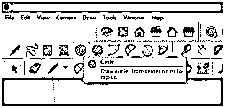

现在像这样画一个圆。我徒手画的，意思是没有特别的尺寸。可以用特定的维度画出来。

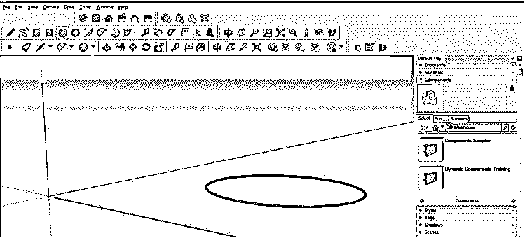

现在从工具面板中选择工具，点击选择这个圆。

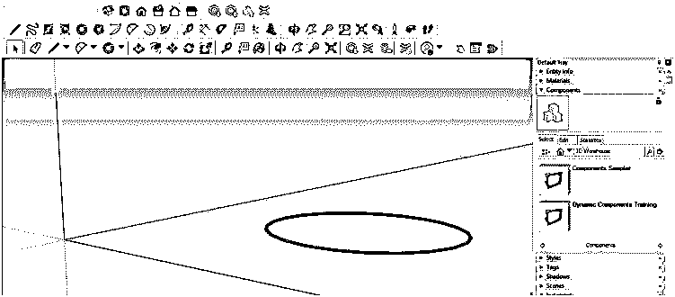

转到工具面板，使用推/拉命令，给这个圆增加一些高度，就像这样。

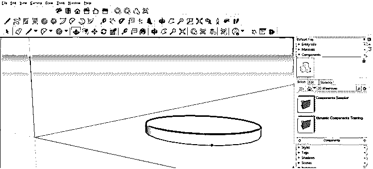

现在，我将使用工具面板中的移动工具，通过按住键盘上的 Alt 键来移动该组件的顶部曲面，以复制该曲面。

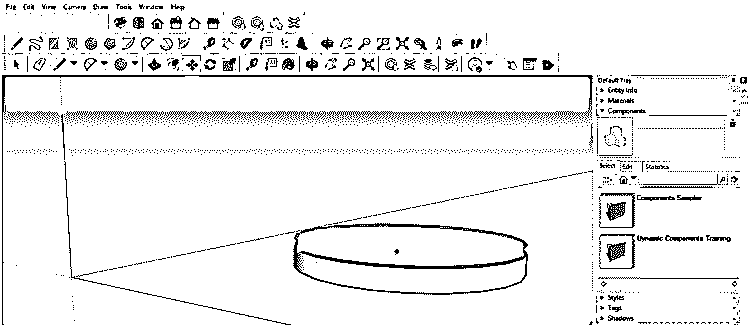

然后回到这个组件顶部的复制表面。

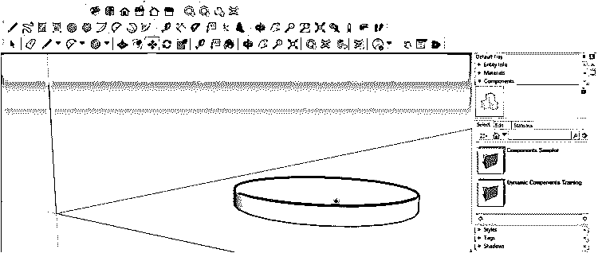

现在我的中间桌子就这样准备好了。

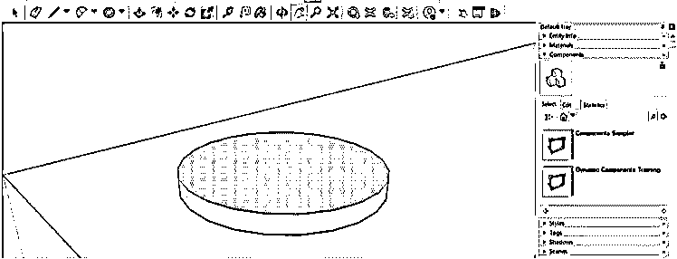

让我们填充木质材料，然后去工作窗口右边的材料栏。

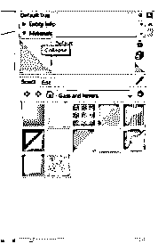

我会从材质栏的下拉列表中选择木头。

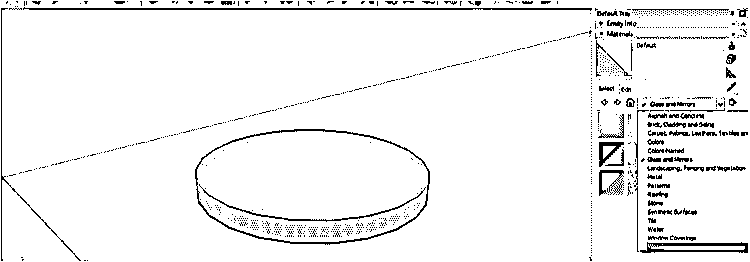

我把两种不同的木材加到这张桌子上，就像这样，一个接一个地选择这个部件的每一部分。

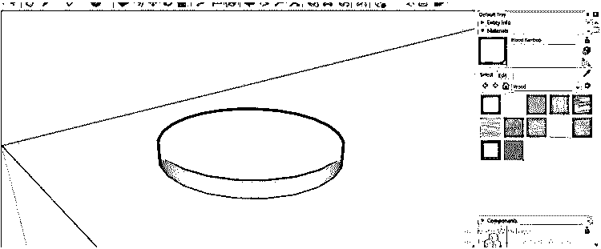

现在让我们有一把椅子，我将把它放在这张圆形桌子周围。我将复制这张椅子的许多副本，并使用一个数组将这些副本以相等的角度放置在这张桌子周围。因此，对于椅子组件，我会去这个软件的在线库 3D Warehouse，你会在菜单栏的窗口菜单的下拉列表中找到它。为此，您可以使用自己的组件。我只是使用在线组件向您解释阵列。

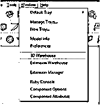

我将从这里挑选这一个。

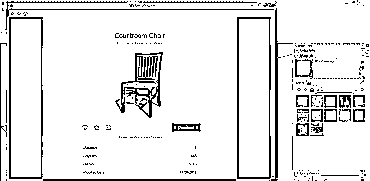

现在，我将通过点击把它放在地上的任何地方。

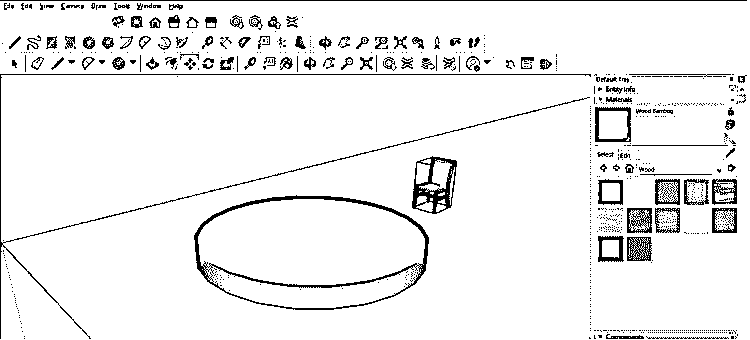

在进行阵列之前，非常重要的一点是，如果您希望阵列组件位于要围绕其旋转椅子组件的对象的同一圆周上，那么首先使用工具面板的移动工具来匹配两个组件的圆周。

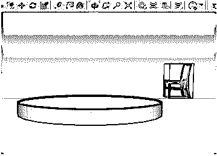

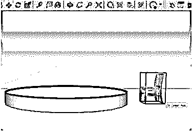

根据圆形桌子调整好这张椅子后，我会从工具面板里拿出一个铅笔工具，在这张桌子的中心画一条这样的线。

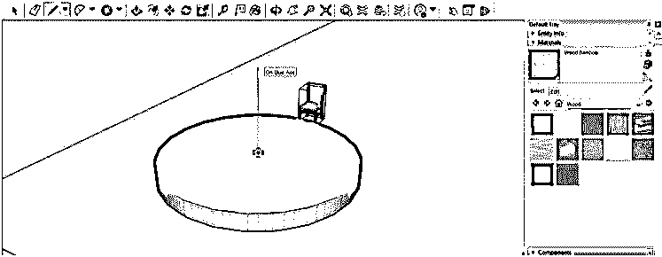

我将围绕这条中心线旋转这把椅子，所以从工具面板中选择旋转工具。

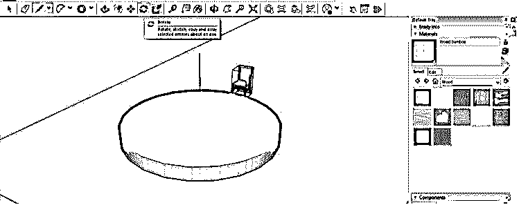

然后点击这个圆形桌子的中心，在那里我画了一条线来给旋转工具分配中心点。在指定旋转工具的中心之前，请确保选择了椅子。

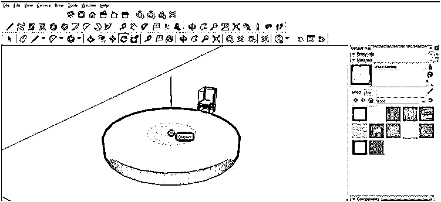

现在按住键盘的 Ctrl 键，将这把椅子旋转某个角度，或者可以在工作屏幕底部的角度框中输入角度值。

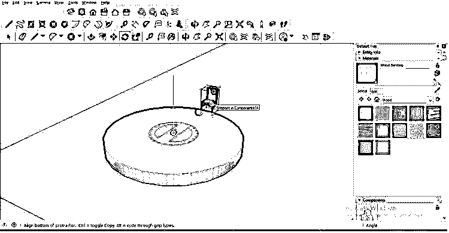

你可以看到它从某个角度复制了这张椅子。现在点击键盘上的回车键来复制这把椅子。

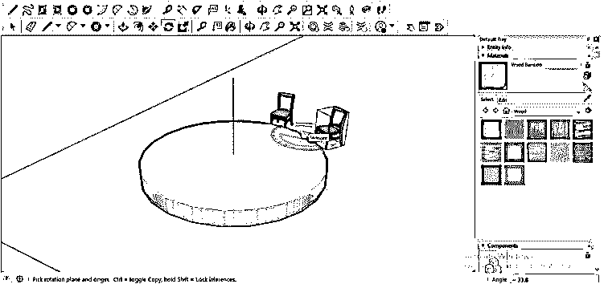

现在，我将在角度框中输入 360°值。

你可以看到复制的椅子在前一层的位置。

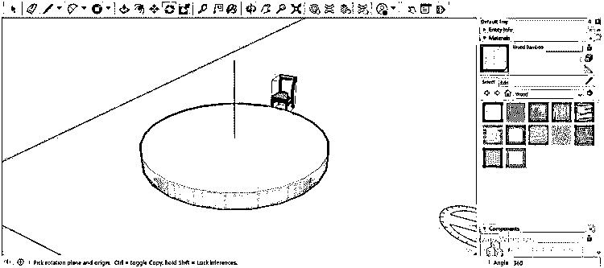

现在我想复制 8 张椅子，为此，我将在角度参数框中输入 8/因此，您只需在此框中输入您想要制作的组件的份数。

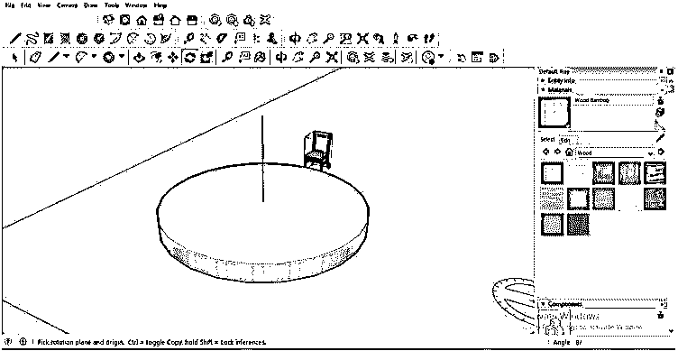

输入数值后，再按一下键盘上的回车键，它就会像这样在圆形桌子周围复制这张椅子。所以你可以看到 8 把椅子在相同的角度上；正如我在角度框中提到的，它的值是 8。

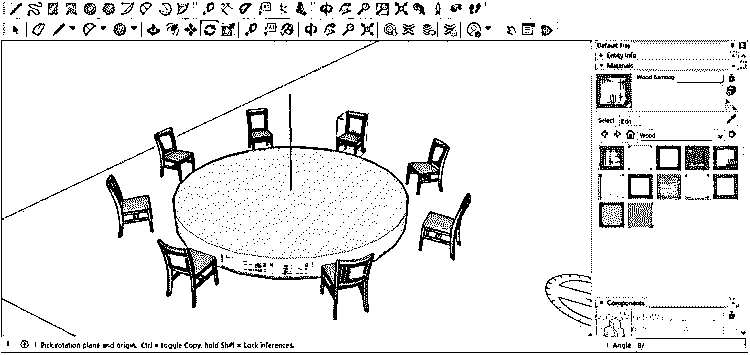

这样，您可以围绕不同形状的对象排列任何组件。你只需要指定一个中心点，围绕这个中心点你就可以排列你的组件了。

### 结论

现在，在 SketchUp 软件中，Array 将不再是你不认识的单词或特征。我相信你一定可以使用这个命令在任何物体上以相等的差异复制一些组件。所以，举例来说，你可以在线条、矩形和其他形状周围做一个数组。你只需要根据你想要做的数组的形状来改变参数。

### 推荐文章

这是一个 SketchUp 数组的指南。在这里，我们讨论如何在 SketchUp 中通过使用工具面板的旋转工具来使用阵列，并制作阵列组件的副本。您也可以看看以下文章，了解更多信息–

1.  [SketchUp 替代方案](https://www.educba.com/sketchup-alternative/)
2.  [SketchUp AutoCAD](https://www.educba.com/sketchup-autocad/)
3.  [SketchUp 旋转](https://www.educba.com/sketchup-rotate/)
4.  [融合 360 替代方案](https://www.educba.com/fusion-360-alternative/)

