# SketchUp 调整组件大小

> 原文：<https://www.educba.com/sketchup-resize-component/>

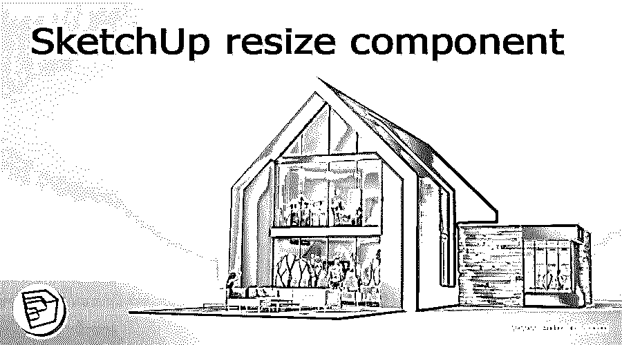

## SketchUp Resize 组件简介

SketchUp Resize Component 是一个过程，通过该过程，您可以在该软件中更改任何组件的大小，但在该软件中调整大小时，您必须记住一些要点，因为有一些调整组件和任何模型的一部分的技术。我们知道，要在这个软件中工作，我们必须创建一个组和组件来分离任何对象的各个部分。因此，在将它们组成组件或分组后，我们必须保持对某些术语的控制，以便我们可以在不影响另一个对象的情况下轻松调整该对象的大小。所以让我们好好讨论一下这个话题。

### 如何在 SketchUp 中调整组件大小？

这是这个软件的一个非常重要的特性，当我们在不同的项目中创建小的和大的模型时，我们必须执行这个特性。所以让我来告诉你如何为你自己的工作做到这一点。

<small>3D 动画、建模、仿真、游戏开发&其他</small>

从工具面板中选择矩形工具，或者使用快捷键，即键盘上的 R 键。我会画一个这样的正方形。我没有为此使用任何特定的维度。

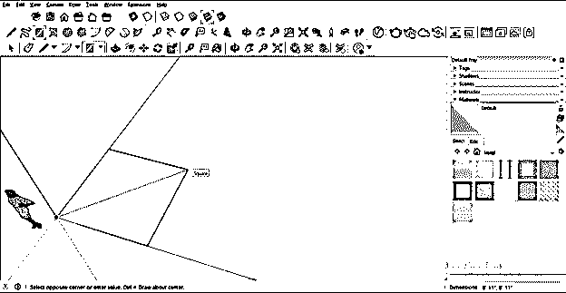

现在从工具面板中选择推/拉工具，通过使用推/拉工具，我将增加这个正方形的高度。

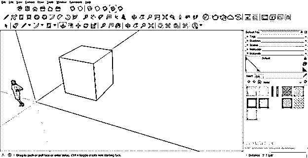

现在，您可以调整任何组件大小的第一种方法是缩放它们，为此，我们将使用缩放工具，但缩放可以按比例显示尺寸。因此，选择这个对象后，从工具面板中选择缩放工具。我没有将这个对象分组或作为一个组件，所以我将从右向左拖动鼠标光标来选择整个对象。

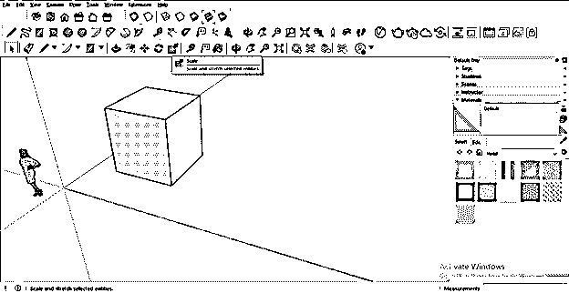

一旦你从工具面板中选择了缩放工具，这个对象的边和面上将会有缩放锚点。

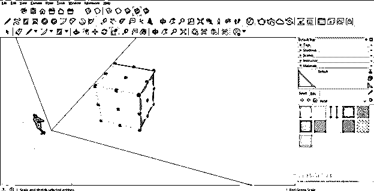

如果你按住这个对象的角点并向上或向下缩放，那么它将像这样按比例缩放。您也可以输入一个值来缩放它；例如，如果我想将这个对象的大小调整为它的一半尺寸，那么我将输入比例值 0.5。

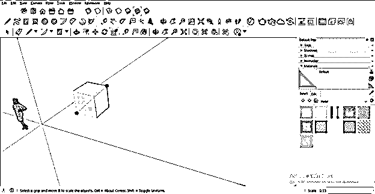

如果你从这个对象的任意边的中心点开始缩放，那么你可以在宽度或高度方向上改变它的尺寸(比例)。

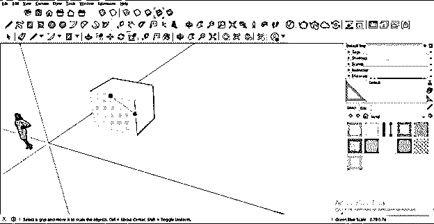

现在让我们通过另一种方法来调整这个对象的大小，在这种方法中，您可以通过输入它们的值来调整它的尺寸。首先，选择对象，并从工具面板中选择卷尺测量工具。

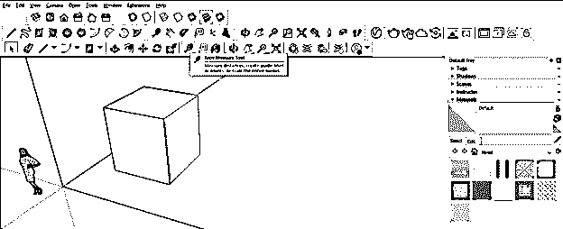

现在点击该点，为该工具指定第一个点。例如，指定要开始测量尺寸的第一个点和要结束尺寸的最后一个点。

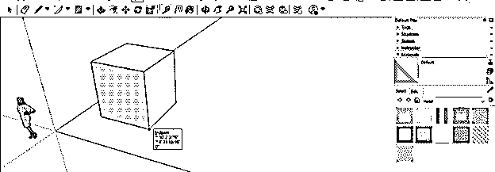

并单击该边的端点。你可以看到这条边的尺寸。

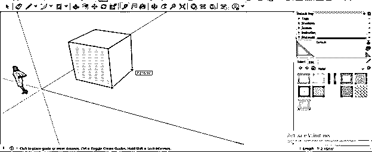

现在我去把这个边的尺寸改成了 5 '，所以在做了一个点击之后，我会在这个软件的用户界面左下角的测量框里输入 5 '。

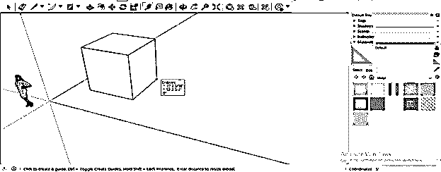

输入值后，会显示一个确认对话框，询问您是否要调整大小。所以点击这个框的是按钮。你还可以看到，这里有一个注释，也意味着如果你从外部资源获取了模型，那么你不能用这个方法来调整它的大小。您可以使用其他方法来调整这些导入模型的大小，我将在后面的步骤中告诉您这些方法。

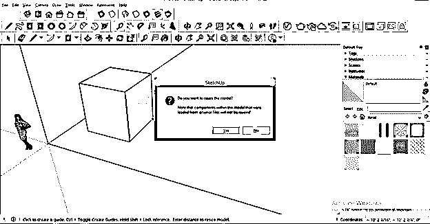

单击“是”按钮后，它会将您想要的尺寸应用到该对象。

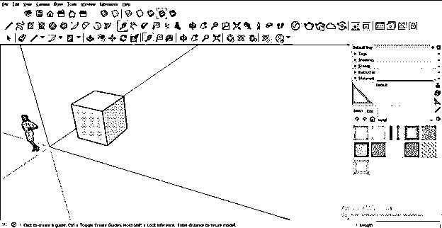

现在让我们复制这个对象，我将第一个对象分组。首先，选择整个对象，右键单击进行分组，并从下拉列表中选择“进行分组”选项。(注意:您可以在任何对象上单击三次，以选择该对象的整个边以及面。

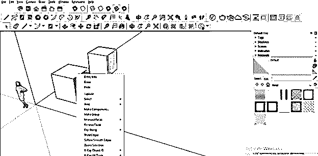

我将复制的对象作为一个组件。通过按住键盘上的 Ctrl 键，使用移动工具复制移动任何对象。右键单击，这一次，从下拉列表中选择“制作组件”选项，以制作该对象组件。

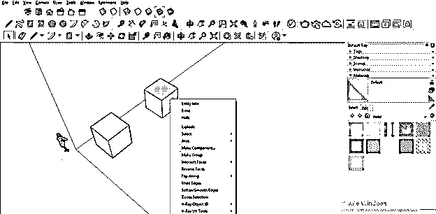

一旦你点击了 Make 组件，它将要求你命名所选择的组件。根据你来命名它，这样如果你的项目中有多个组件，那么你就可以很容易地识别出任何特定的组件。

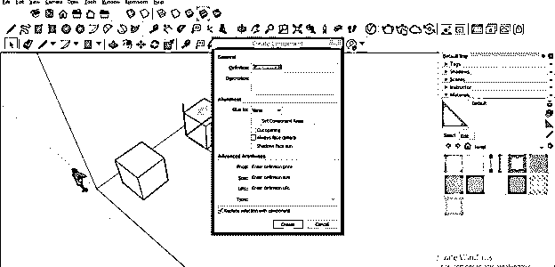

现在我将创建一个摸索对象和组件对象的副本。

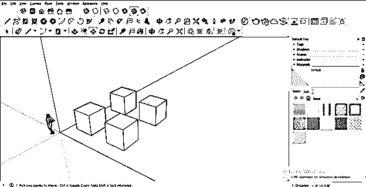

现在让我们以另一种方式调整第一个对象的大小。因为它是分组的对象，所以我们必须双击它进行修改。我想挤压这个物体的左面，所以我将使用推/拉工具，像这样挤压它。这样，您可以调整任何成组对象的大小。我想告诉你一件事，你可以注意到这个分组对象的复制对象不受我们在源分组对象中所做的改变的影响。

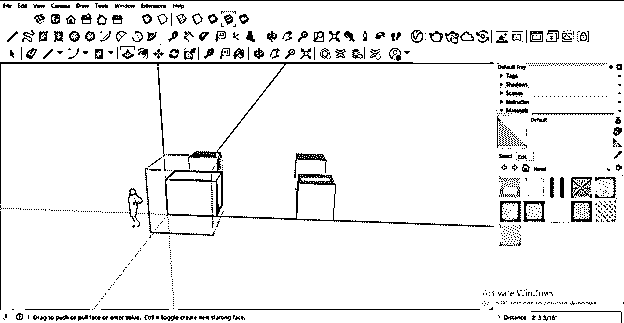

现在让我们移动到组件对象，我将双击它来调整它的大小。现在，我也将在这个组件对象中执行相同的挤出过程，同样，您可以调整组件对象的大小，但重要的是，复制的组件对象也会受到此调整大小的影响。

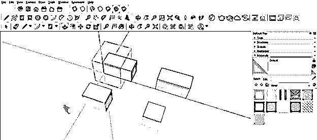

如果您只想调整特定选定组件对象的大小，请选择该组件对象并单击鼠标右键。然后，从下拉列表中选择“使唯一”选项。

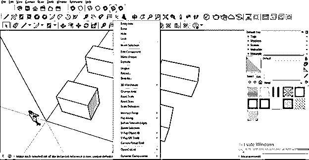

现在，当您调整它的大小时，复制的组件将不受这种调整的影响。

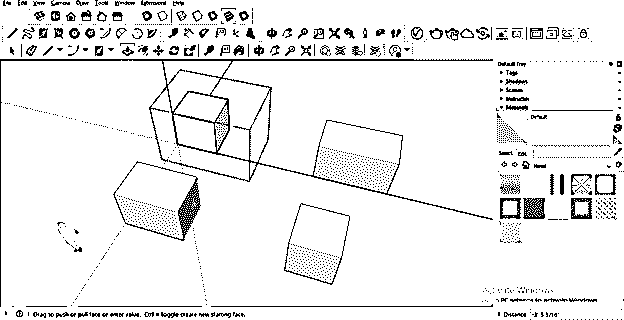

这样，您可以在 SketchUp 中根据特定对象所需的调整大小类型的要求来调整组件的大小。

### 结论

我相信你已经学习了很多关于调整组件大小的东西，比如如何调整分组对象的大小，如何调整组件对象的大小，以及很多其他的东西。因此，我会建议你开始研究上面讨论的所有方法，这样你就可以找到你必须在哪里使用哪种方法。

### 推荐文章

这是一个 SketchUp resize 组件的指南。这里我们讨论如何在 SketchUp 中调整组件的大小，以及如何调整分组对象的大小。您也可以阅读以下文章，了解更多信息——

1.  [SketchUp 替代方案](https://www.educba.com/sketchup-alternative/)
2.  [SketchUp 旋转](https://www.educba.com/sketchup-rotate/)
3.  [SketchUp AutoCAD](https://www.educba.com/sketchup-autocad/)
4.  [建筑设计类型](https://www.educba.com/architecture-design-types/)

