# SketchUp 甲板设计

> 原文：<https://www.educba.com/sketchup-deck-design/>

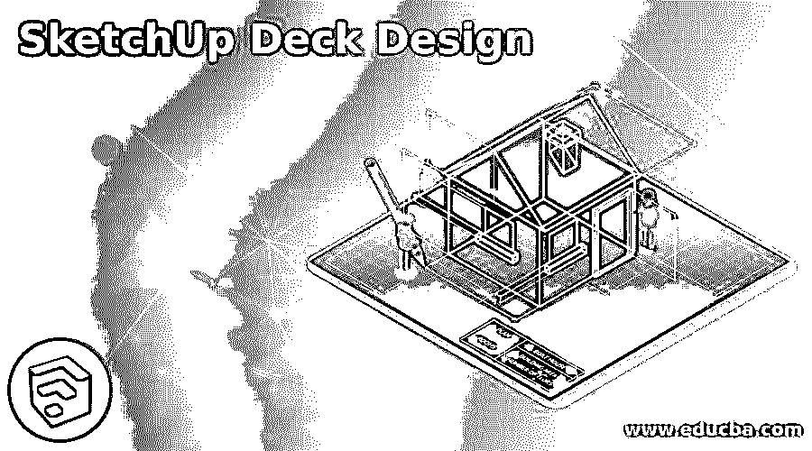

## SketchUp 甲板设计介绍

SketchUp 甲板设计是三维建模的一种，通过它我们可以设计出甲板的三维模型，这是建筑设计模型的一部分。甲板可以在建筑设计的任何部分，甲板设计取决于您在模型中如何设计它的想法。我们可以使用 3d 模型设计的基本工具来创建不同的组件以及甲板设计的元素。在甲板的设计过程中，你应该记住甲板的具体尺寸，这样设计才能准确无误。所以让我们讨论一下在这个软件中我们能做些什么来设计甲板。

### 如何在 SketchUp 中创建甲板设计？

为了创建甲板设计，我们将采取该软件最常用的工具，如矩形，直线，移动，推/拉等。我们已经从 3D Warehouse(Sketchup 的在线图书馆)下载了这个房子模型，向您解释甲板设计。这是这个房子模型的美丽景色。

<small>3D 动画、建模、仿真、游戏开发&其他</small>

我们将在房子的这一侧创建一个甲板设计。假设这个窗户是去甲板的门。

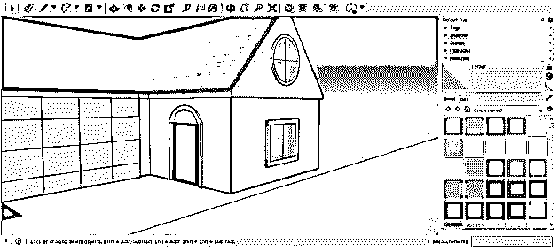

现在我们将为甲板设计的基础做一个布局，为了制作它，我们将使用矩形工具画一个矩形，就像这样。矩形的大小取决于你的甲板设计的基础的大小。我们没有采取任何具体的标准尺寸。

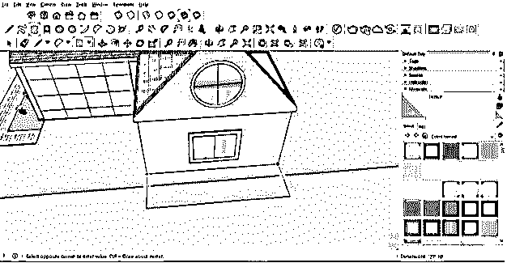

现在，在这个矩形上双击三次，然后右键单击并选择“Make group”选项以将其作为一个组，一旦将其作为一个组，它就不会在甲板的设计过程中干扰其他组件。

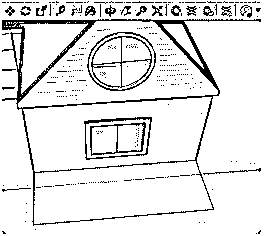

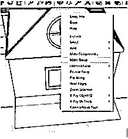

现在把它移动到你想要为你的房子做一个甲板的高度。要移动此底座，请使用移动工具并选择一个移动点，然后输入平台的高度值。

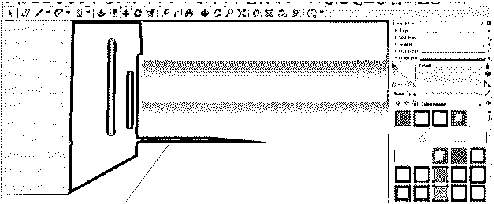

现在使用矩形工具，用同样大小的木板制作一个矩形，它将创建甲板的底部，在制作矩形后，我们将使它成为一个组件，因为我们将为制作底部制作一个副本。所以双击选择这个矩形，然后右键单击并从下拉列表中选择 Make Group 选项。

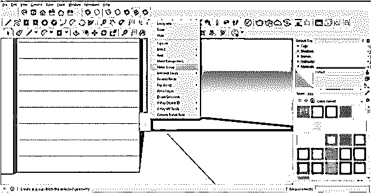

现在，再次右键单击并从下拉列表中选择“制作组件”选项。一旦你点击这个选项，它会要求你指定该组件的名称。我们将其命名为基板，然后单击此对话框的创建按钮。

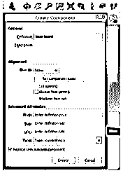

现在，我们将双击编辑这个组件，并在推/拉工具的帮助下挤出它的这一边。根据的设计或您的牌组输入此基板的挤出值，或者您可以简单地将它带到基础布局的末端。

现在选择这个组件，移动一点点，在甲板底部的横条之间添加一些间隙。酒吧之间的差距取决于你的甲板设计尺寸。

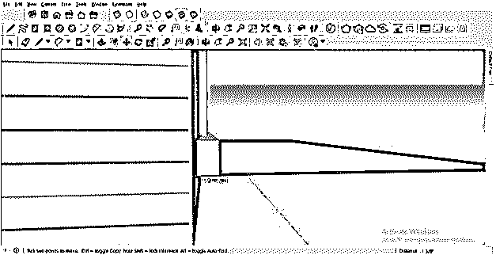

现在，我们将再次使用移动工具，并在墙上选择一个移动点，这样当我们通过移动它来复制这个杆时，房子的墙壁和这个杆之间的间隙将添加一个杆的副本。所以我们将通过按住键盘的 ctrl 键来移动它一段距离。

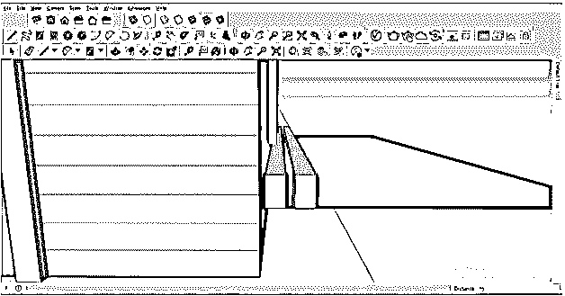

我们希望以这种方式复制它，以便复制覆盖基本布局。因此，要制作副本，请在用户界面按钮上的测量框中键入*和副本数量。我们将把这个值输入为*13。

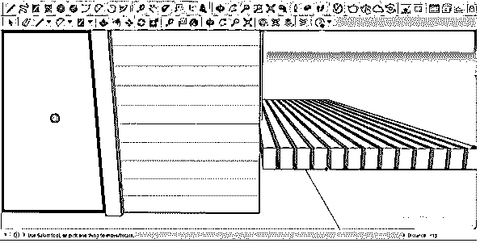

它将涵盖像这样的甲板布局。

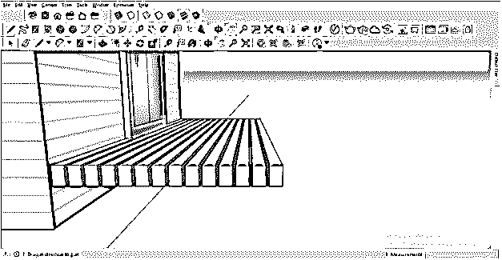

现在，我们将为这个平台底座制作较低的支撑，我们将制作一个这样的矩形。根据您的甲板设计输入支撑杆的值。

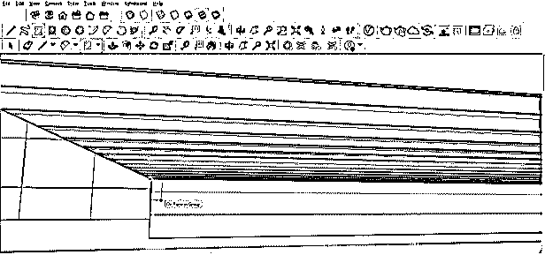

用和上一步一样的方法使它成为组件。

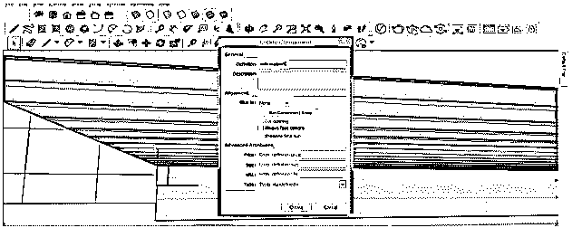

我们将像这样沿着这个面挤压它。因此，为了挤出它，双击它，这样我们就可以编辑这个组件，然后使用推/拉工具。

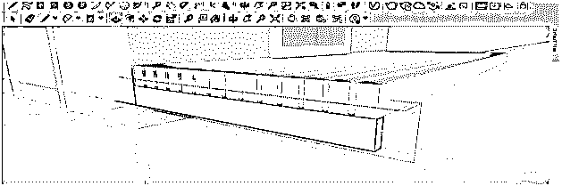

我们将绘制与支撑杆相同厚度的线。

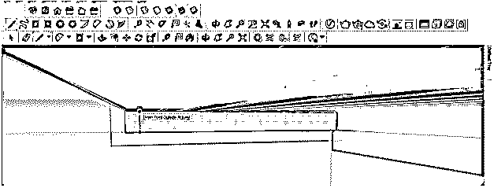

像这样挤压它。

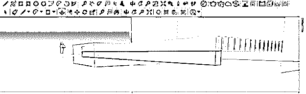

我们将为甲板的另一边做同样的事情。

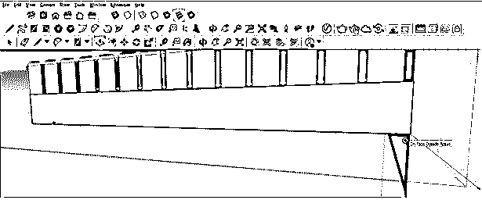

所以你可以看到甲板的下部支撑已经准备好了。

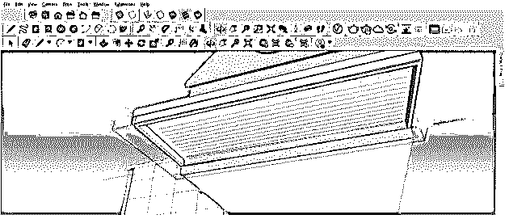

我们还得在墙边加一根支撑杆，做一根和其他下撑一样粗细的支撑杆。

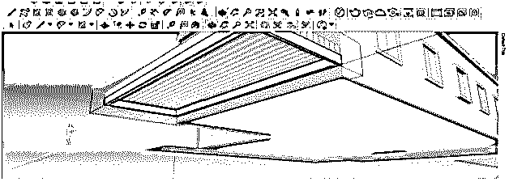

现在检查是否有不需要的行，然后选择它们并通过按键盘上的删除按钮删除它们。

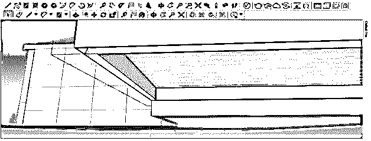

现在让我们为这个平台底座做支柱支撑，为此，我们将做一个像这样的正方形，然后把它做成一个组件。

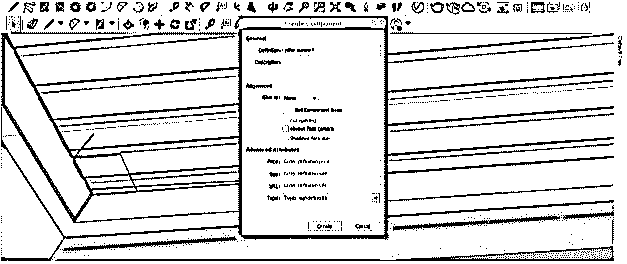

使用推/拉工具，增加这个支柱的高度。柱子的高度取决于你的甲板离房子地面的高度。

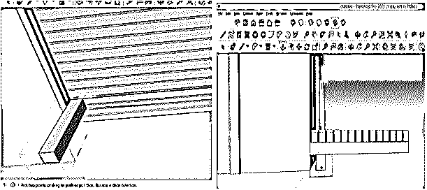

现在，我们将从工具面板中选择移动工具，按住键盘上的 Ctrl 键，将此支柱移动到此平台底座的下一端。我们按住键盘上的 ctrl 键，这样它就可以复制它。

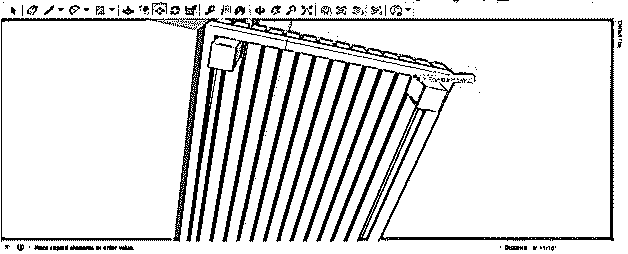

我们想复制 3 份，因此我们将在测量框中输入/3。

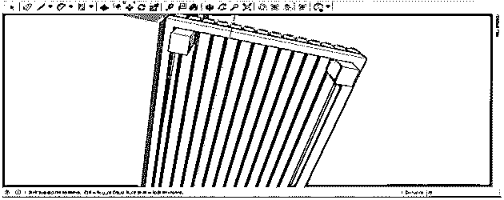

它会复制像这样的柱子。

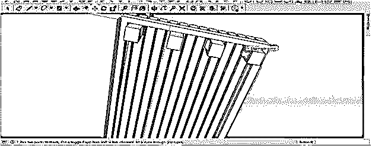

同样，我们将围绕这个平台的整个基础复制这个支柱。

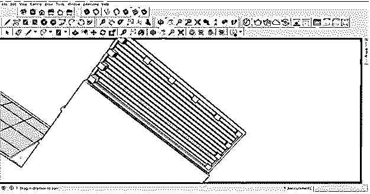

现在甲板的底部准备好了。

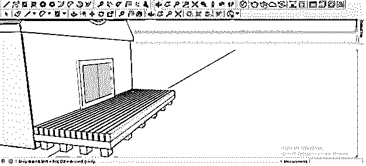

现在，用同样的方法，你可以根据你的想法用你的甲板设计制作栏杆边界。我们使用相同的工具和功能制作了这个简单的栏杆设计。

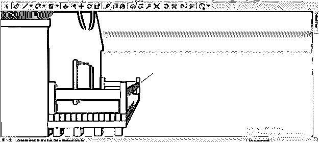

这是任何房屋模型设计的基本步骤。

### 结论

现在，您可以尝试通过我们今天在本文中讨论的相同过程为您的 3D 房屋模型创建您自己的甲板设计，因为这是设计甲板的基本布局。你只需要遵循你的设计的适当参数和尺寸，这样你就可以创建一个没有错误的甲板模型。

### 推荐文章

这是一个 SketchUp 甲板设计指南。在这里，我们已经讨论了如何使用 SketchUp 中的一些过程来创建 3D 房屋模型的甲板设计。您也可以阅读以下文章，了解更多信息——

1.  [SketchUp 替代方案](https://www.educba.com/sketchup-alternative/)
2.  [SketchUp 旋转](https://www.educba.com/sketchup-rotate/)
3.  [SketchUp AutoCAD](https://www.educba.com/sketchup-autocad/)
4.  [CorelDRAW 标志设计](https://www.educba.com/coreldraw-logo-design/)

