# GIMP 刷子

> 原文：<https://www.educba.com/gimp-brushes/>

## GIMP 笔刷简介

在任何设计工作中，画笔都是一个非常好和有效的艺术和插图工具。和 GIMP 一样，我们将画笔用于许多不同的目的，例如在图像处理中，包括隐藏任何图层的某些区域，制作图案化的线条，或者只需单击一下就可以制作任何特定的形状或艺术品，等等。像其他软件工具一样，我们有这个工具的一些参数，通过改变它们，我们可以在这个笔刷工具的工作中有很多变化。所以，我想你现在很兴奋，因为你分析了画笔工具的这些特性，可以很好地动手操作。

### 如何在 GIMP 中使用画笔？

工作特性和使用这个工具非常简单，因为您只需简单地点击几下就可以使用它，所以让我们看看这些点击是什么。

<small>3D 动画、建模、仿真、游戏开发&其他</small>

转到工具面板，你会有画笔的名称油漆刷子工具，所以点击它或简单地按下 P 按钮作为快捷键。

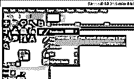

也可以从菜单栏的“工具”菜单的“绘画工具”选项中使用“画笔”工具。

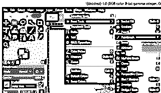

一旦你激活了这个工具，你就会在你的屏幕上看到这个圆形虚线光标。

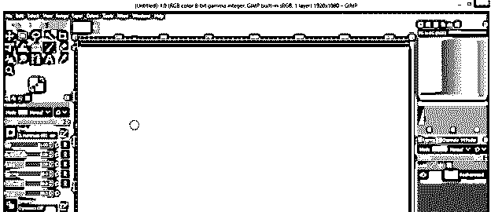

您只需通过单击文档区域的任意位置或从您想要开始的位置选择第一个点，然后按住鼠标拖动鼠标。这样，你可以使用任何画笔工具。这不是很简单吗？

现在让我们来看看画笔的参数。

*   **笔刷工具参数:**

我们在笔刷工具中有许多参数，包括不透明度、硬度、大小、纵横比、角度和其他一些参数。

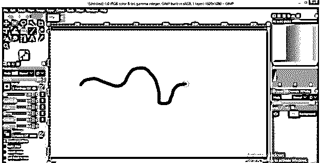

*   **硬度**

硬度是指使用画笔工具的画笔笔尖绘制的形状的边缘有多硬。我用 50%的硬度画这个。

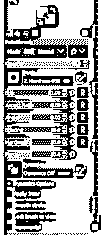

现在改变硬度为 100%，从预设的笔刷中选择。

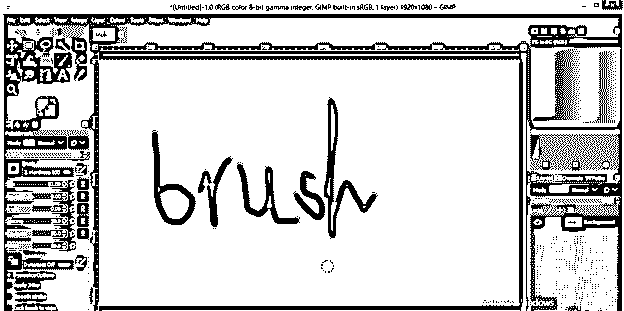

然后再画一遍。你可以看到两者的区别；第二个有硬边，因为刷尖 100 %的硬度。

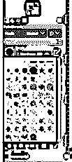

*   **图案:**

你也可以从这个列表中选择任何预设的图案，当你用画笔绘制任何东西时，你会得到你选择的图案笔画，就像这样。

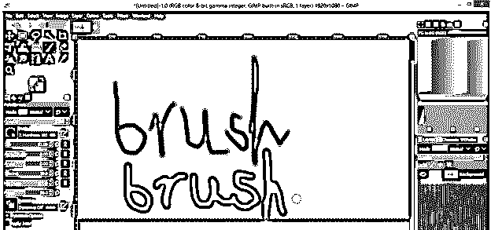

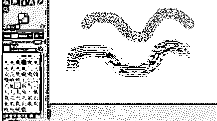

*   **大小:**

大小是指画笔笔尖的大小。你可以随时根据你的需要增加或减少它。

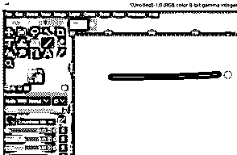

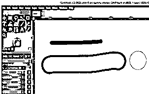

*   **长宽比:**

纵横比是指刷子尖端的宽度和高度之间的比率。如果你增加这个比例，你会得到这种类型的画笔笔尖，与正常的画笔笔尖相比，它有一个椭圆形。

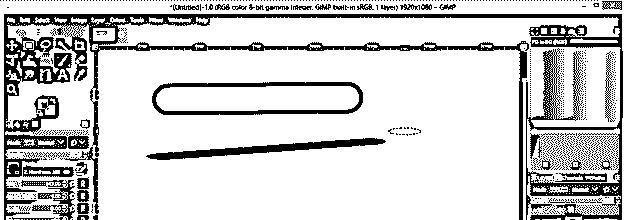

*   **角度:**

通过改变角度，你将改变画笔笔尖的角度。看看两种笔触的区别。第一个在 0 度，第二个在 55 度。

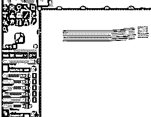

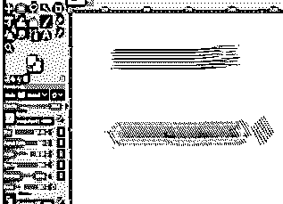

*   **间距:**

它定义了画笔绘制的图案之间的距离。笔刷上面一笔是 10 间距画的，下面两笔是 91 间距画的，所以我想你看到这个就明白什么是间距了。

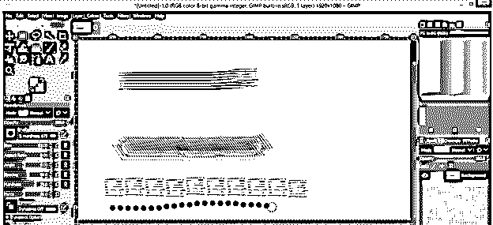

我们已经在上面讨论了硬度，这是我们这里的下一个参数；您可以根据自己的选择给出硬度值。

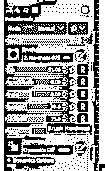

这是画笔的几个重要参数。现在让我们学习如何在 GIMP 中定制画笔。

### 如何在 GIMP 中创建自定义画笔？

首先在这个软件中放置你想要制作笔刷图案的图像。所以转到开放选项，并把它放在这里。

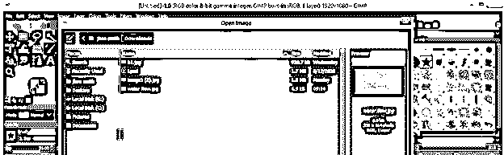

我要拍这张水流照片。现在右键点击这一层，并选择添加阿尔法通道选项。

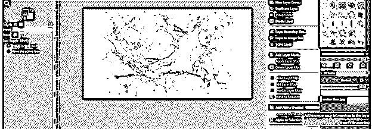

转到图像菜单，将其模式改为灰度。

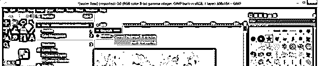

现在点击颜色菜单的曲线选项来调整水流图像的阴影和高光。

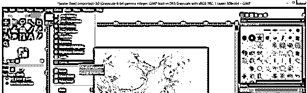

增加阴影以使曲线中的暗区域变暗，并调整高光以使亮区域变亮。

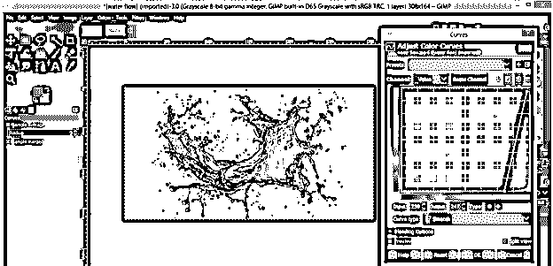

现在拿一个画笔，设置白色为前景色。现在在这个图像的不需要的区域上绘画来隐藏它们。

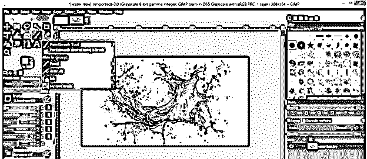

点击“编辑”菜单中的“复制可见”选项来复制此图像。

**T2】**

 **创建一个新层。

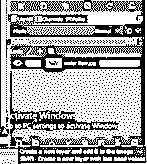

在打开的对话框的“填充”选项中选择背景选项。确保你有黑色作为背景色；否则，如果前景色中有黑色，就选择前景色。

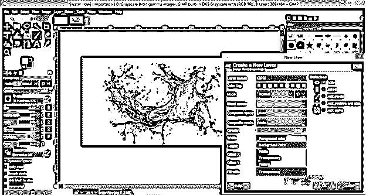

通过点击眼睛按钮使图像层不可见。

现在右键点击这个黑色填充的图层，点击添加图层蒙版选项，为这个图层添加蒙版。

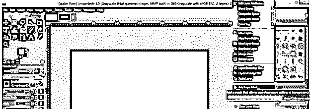

在打开的“添加图层蒙版”对话框中选择黑色(全透明)选项，点击添加按钮。

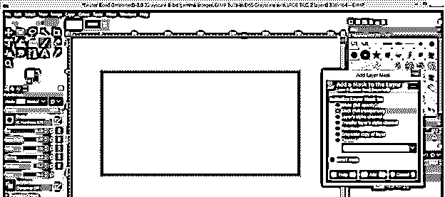

现在点击编辑菜单的粘贴按钮，你将有你的水流粘贴在这里。

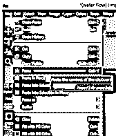

点击颜色菜单的反转选项。

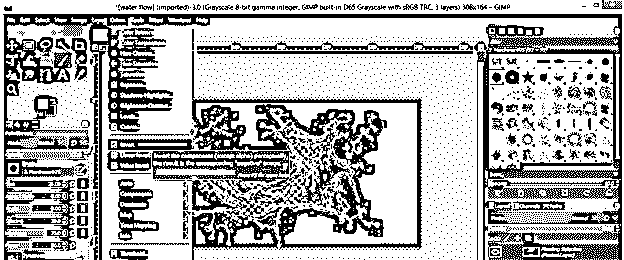

黑色会填满你的水流痕迹。现在点击图层面板底部的锚按钮，为黑色填充图层添加一个上部浮动选区。

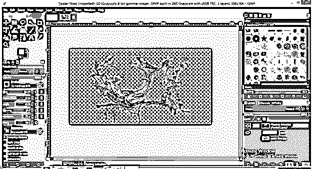

再次右击该层，选择应用图层蒙版选项，将蒙版应用到该层。

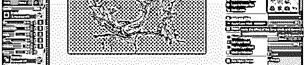

现在用裁剪工具从这张图片中剪下多余的区域。

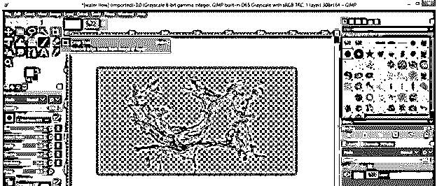

根据自己的形象裁剪。

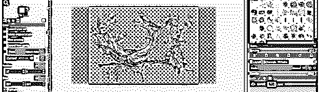

现在将它作为文件菜单的一个选项导出。

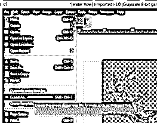

将文件名保存为。gbr 格式并点击导出按钮。

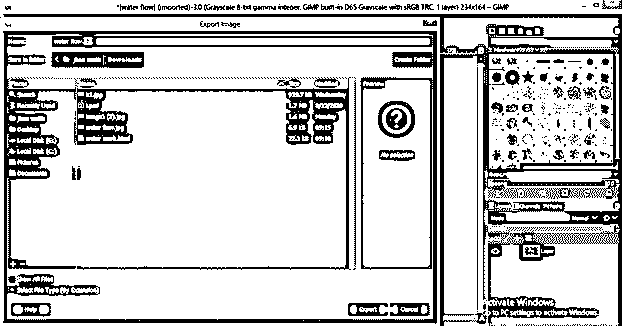

再次点击导出按钮。

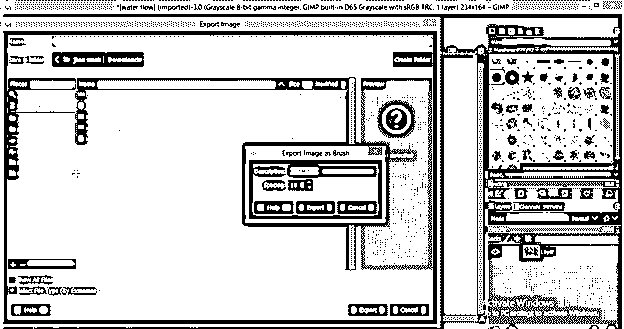

现在复制这个文件并转到 c 盘的 Program Files 文件夹–GIMP 2–Share 文件夹。

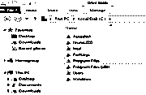

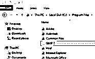

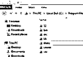

然后 GIMP–2.0–笔刷文件夹。

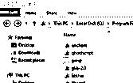

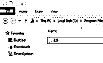

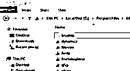

用打开任何文件夹。gbr 文件格式。我现在将打开纹理文件夹。

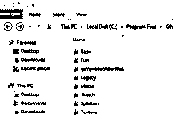

将你复制的自定义笔刷文件粘贴到这里。

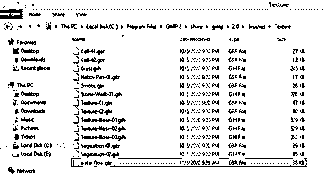

现在你不需要重启你的 GIMP 软件；只需点击画笔的刷新按钮。

**T2】**

 **你将在这里拥有你的定制画笔。

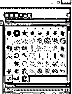

现在使用你的自定义笔刷作为这个软件的笔刷。

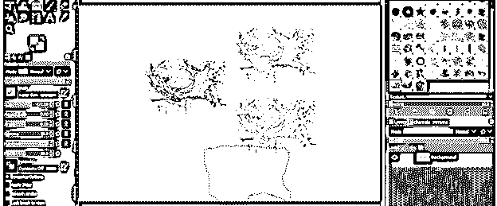

### 结论

在这篇文章的结尾，你获得了很多关于笔刷的知识，并且学会了如何创建自己的笔刷并在工作中使用它。你可以通过分析 GIMP 软件的笔刷参数来做很多事情。

### 推荐文章

这是 GIMP 笔刷指南。在这里，我们讨论如何创建自己的 GIMP 笔刷，以及如何在工作中使用它们。您也可以看看以下文章，了解更多信息–

1.  [GIMP 替代方案](https://www.educba.com/gimp-alternatives/)
2.  [Adobe Photoshop 替代品](https://www.educba.com/adobe-photoshop-alternatives/)
3.  [安装 Adobe Photoshop](https://www.educba.com/install-adobe-photoshop/)
4.  [Photoshop 小抄](https://www.educba.com/photoshop-cheat-sheet/)

****