# GIMP 线条工具

> 原文：<https://www.educba.com/gimp-line-tool/>

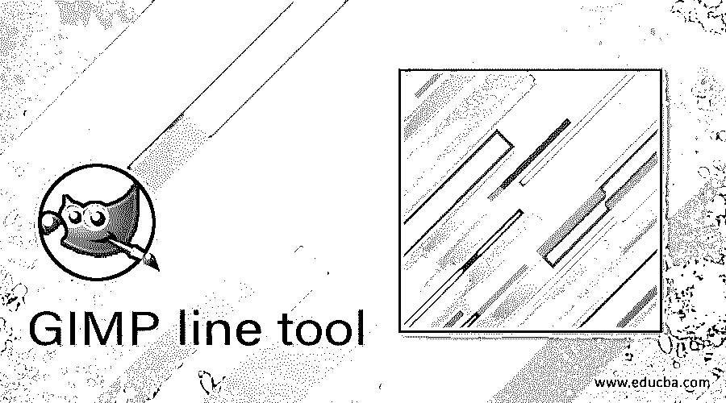

## GIMP 中的线条工具介绍

线条工具指的是一种工具，通过它你可以画出不同类型的线条，但是 GIMP 并没有提供任何特定的名为线条工具的工具。代替这个特定的工具，我们有许多其他的工具，通过对它们的参数进行微小的调整，我们可以用许多方法画线。GIMP 中用于绘制线条的工具有画笔工具、铅笔工具、喷枪工具、墨水工具、路径工具和矩形选择工具。那么让我们看看如何使用这些工具来画线？

### 如何在 GIMP 中画线？

首先，创建一个新文档，然后使用我们的第一个工具。

<small>3D 动画、建模、仿真、游戏开发&其他</small>

#### 画笔作为线条工具

现在拿画笔工具或者按 P 作为快捷键。

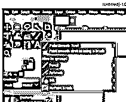

现在，单击文档区域中的任意位置作为线条的起点，然后按住 Shift 键向另一个方向拖动鼠标光标作为线条的终点。当你把它往另一个方向拖，按住 shift 键，它会给你显示这样一条指引线。

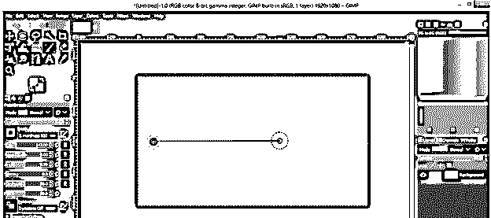

现在，在你想要的方向和距离上点击另一端。这样做你会得到一条线。这条线是一些软边，因为我们选择了一个软刷。可以选择 100 %硬度的笔尖。

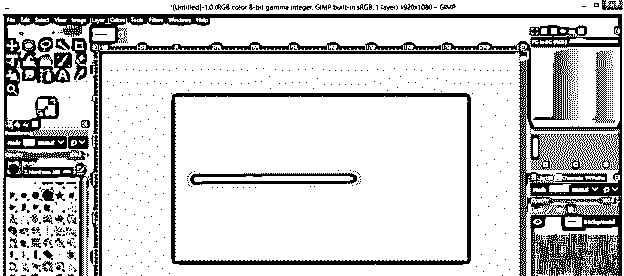

现在你可以用和上一步一样的方法画出硬边缘线。

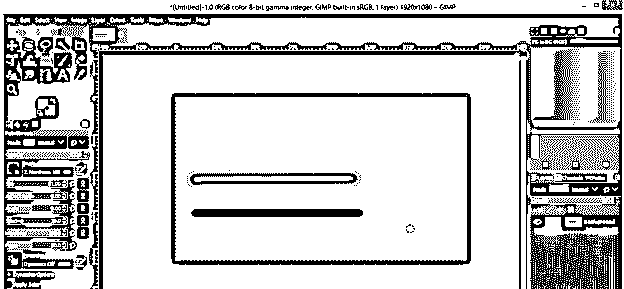

#### 铅笔作为线条工具

使用铅笔工具或按 N 键作为快捷键。

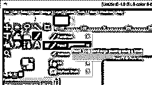

使用与我们使用画笔工具相同的方法绘制线条，你将得到这种类型的线条。

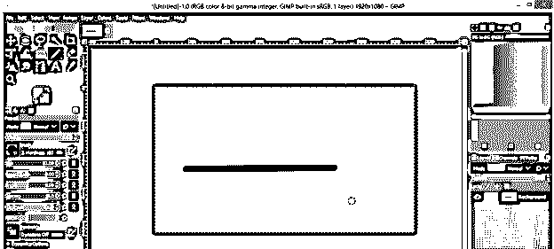

#### 画笔和铅笔画的线的区别

这两种工具绘制的线几乎没有区别。使用这两种工具一个接一个地画一条线。上面的线是用画笔画的，下面的线是用铅笔画的。

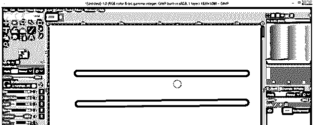

现在放大，你可以看到上面一行没有扭曲的像素，下面一行有像素化。所以我想你明白他们之间的不同之处。

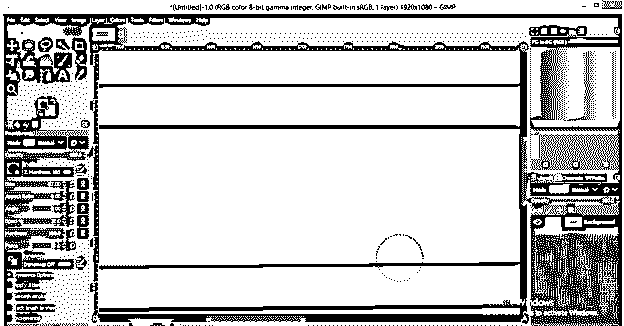

#### 作为线条工具的空气画笔工具

现在拿画笔工具或者按 A 作为快捷键。

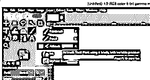

用这个工具绘制线条的方法也是一样的，但是用这个工具你会得到一条不透明度更小的线条。在线的末端也会有点。

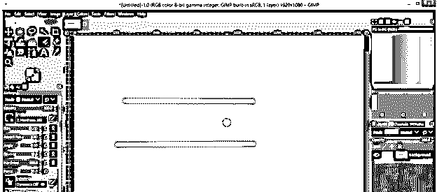

线条末端的颜色强度取决于您将此工具的光标放在该点上多长时间；这意味着点击起点，并保持点击几秒钟，你会得到这种类型的黑点。

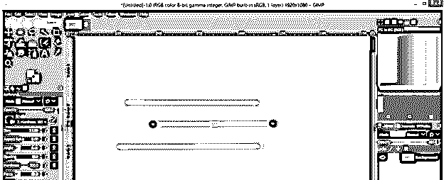

您可以使用此工具通过使用线条来制作这种类型的形状。

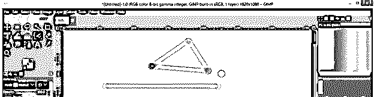

#### 作为线条工具的墨迹工具

现在使用墨迹工具或按 K 键作为快捷键。

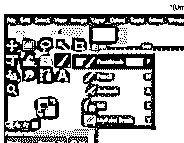

现在画一条线，用这个工具你会得到一条两边粗细不同的线。

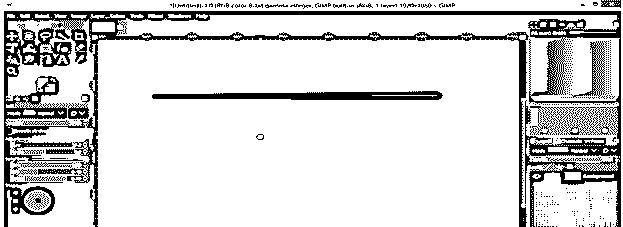

您可以将此工具用作线条工具来绘制这种类型的形状。

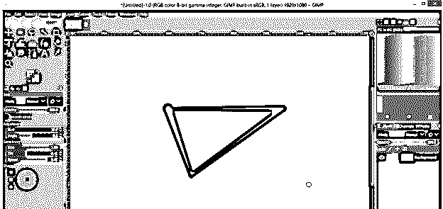

如果要更改线条起点和终点的形状，请从该选项中选择一个形状。这次我会选择菱形。

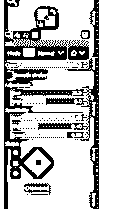

现在，再用它画一条线，你可以看到变化。

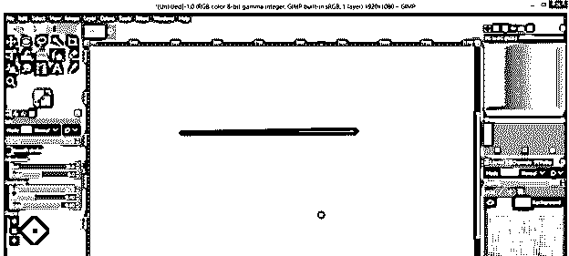

也可以通过此选项更改线的透视平面。在白色平面上移动正方形以改变透视平面。我会像这样改变它。

现在再次画这条线，你可以看到它会画在你选择的平面上。

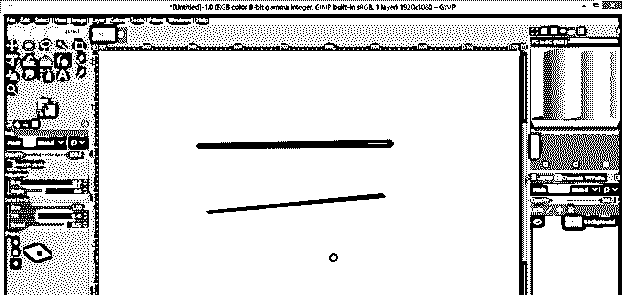

#### 矩形选择工具作为线条工具

使用矩形选择工具或按 R 键作为快捷键。

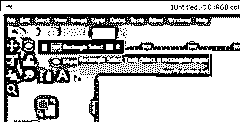

用这个工具画出这种矩形，然后右击它。点击用 FG 颜色填充来填充矩形选区的颜色。你可以根据自己的选择改变它的颜色。

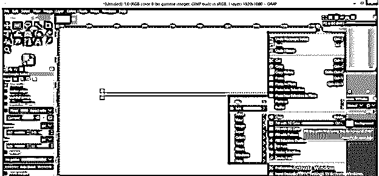

当我们选择这个填充选项时，它将填充前景。

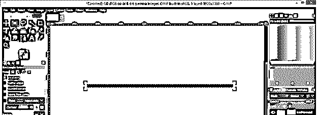

现在通过点击选择菜单中的“无”选项来禁用选择。

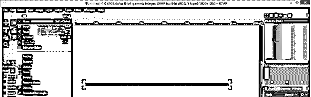

你的线准备好了。

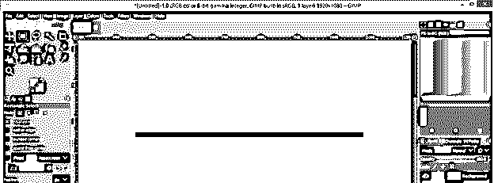

#### 作为线条工具的路径工具

使用路径工具或按 B 键作为快捷键。

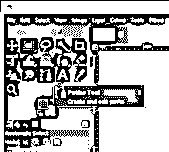

现在点击文档区域的任意位置，并再次点击您想要的方向。你将有一个符合这个工具的路径。

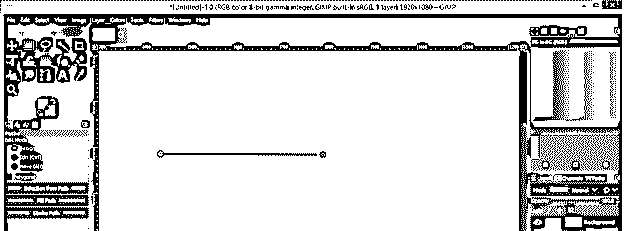

现在点击路径工具的描边路径选项，让 stork 在这个线条路径上。

点击纯色选项，在笔画中填充纯色，然后选择线条的宽度，点击笔画按钮。

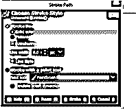

你会有你的台词。

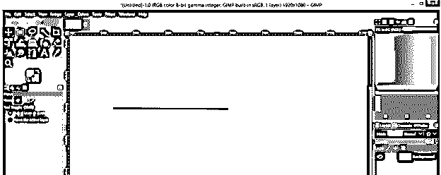

现在让我们来看看用这些工具可以画出的不同形式的线。

#### 直线

您可以使用上面讨论的任何工具来绘制直线。我将用画笔工具向您展示它，所以单击线条的起点，然后按住 shift 键绘制线条，按住 Ctrl 键绘制直线。当你按住 Ctrl 键的时候，它会把你的直线拉向你选择的方向。

#### 倾斜线

为此，您也可以使用上面讨论的所有工具。画斜线的话，只要按住 Ctrl 键和 shift 键，把光标往斜的方向移动就可以了；然后，你将有自动倾斜的线，每次移动相差 15 度。您可以在文档区域的按钮上看到角度的变化。

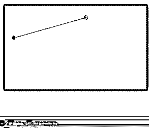

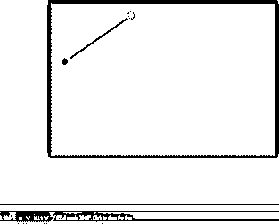

通过将路径工具用作线条工具，可以绘制任意角度的斜线。

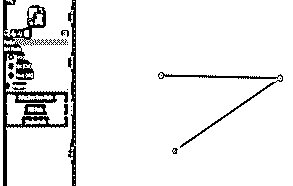

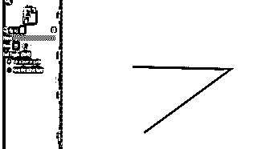

#### 曲线

路径工具是绘制曲线的最佳选择。只需单击起点，然后在另一个方向单击下一个点，然后拖动鼠标而不释放鼠标按钮。对下一条曲线做同样的操作。这样，你就可以画出一条曲线的路径。

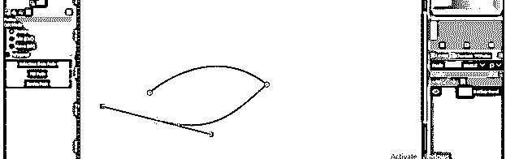

用笔画填充。

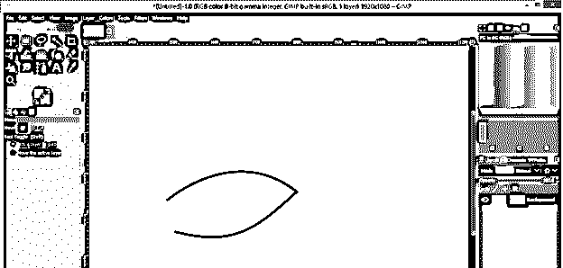

### 结论

这是关于你可以用作线条工具的不同软件工具，因为 GIMP 没有提供任何特定的工具作为线条工具。现在浏览所有的工具，分析哪一个对你来说更适合用作线条工具。

### 推荐文章

这是 GIMP 线工具的指南。在这里，我们讨论这个软件的不同工具，因为 GIMP，你可以用它作为一个线工具。您也可以看看以下文章，了解更多信息–

1.  [最佳平面设计软件](https://www.educba.com/best-graphic-design-software/)
2.  [GIMP 替代方案](https://www.educba.com/gimp-alternatives/)
3.  [Illustrator 中的平滑工具](https://www.educba.com/smooth-tool-in-illustrator/)
4.  [什么是平面设计？](https://www.educba.com/what-is-graphic-design/)

