# GIMP 混合工具

> 原文：<https://www.educba.com/gimp-blend-tool/>

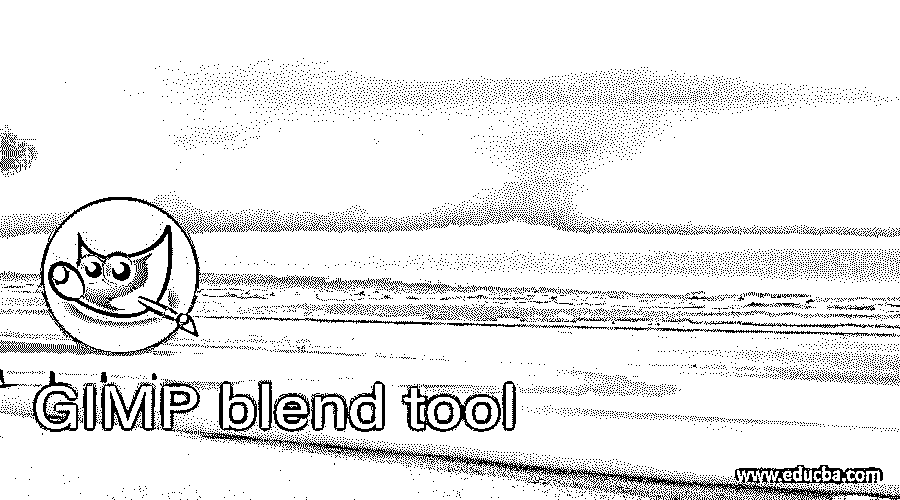

## GIMP 混合工具简介

混合工具可以被视为 GIMP 中的渐变工具，允许您混合两种以上的颜色，以获得不同目的的令人兴奋的颜色网格。在以前版本的 GIMP 软件中，您会在工具面板中找到这个名为“混合工具”的工具，但在最新版本 10.2 中，您会发现它的名称为“渐变工具”。我们也可以使用混合工具来混合两个图像。今天在这篇文章中，我们将讨论这个工具的不同参数，并了解如何根据我们的要求编辑它。

### 如何使用 GIMP 中的 Blend 工具？

我们可以在很多方面使用混合工具，比如我们可以制作一个很好的颜色混合背景，混合两个图像用于他们的操作目的，以及其他一些事情。所以让我们通过一些例子来理解这个软件的工作原理。

<small>3D 动画、建模、仿真、游戏开发&其他</small>

现在创建一个新文档来学习这个主题。为此，请转到文件菜单并单击它。单击下拉列表中的新选项。

在创建文档的对话框中，您将有不同的预设尺寸。你可以选择其中任何一个。

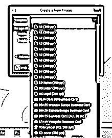

或者您可以输入自己的文件尺寸值。现在转到高级设置选项，从“填充”选项中选择透明度选项。

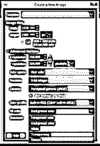

现在我们在这个软件的图像或者文档窗口中有了一个透明的背景。现在从工具面板中选择渐变工具，这是一个混合工具。也可以按键盘的 G 键作为快捷键。

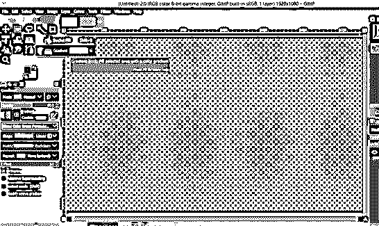

现在从这个列表中选择一个预设的渐变。我会选择抽象 1 选项。

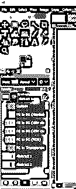

和绘制渐变混合工具，只需点击左边的文件开始，然后拖动到对面。

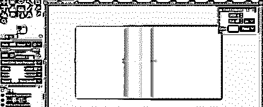

当你在选择的方向前进时，混合工具的颜色将会混合。

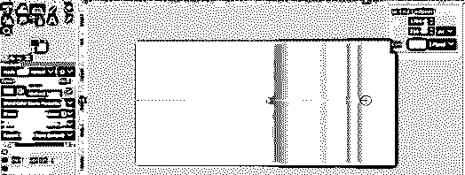

你也可以走出文件区的混合效果。

现在让我们采取另一个预设，FG 到 BG (Hardedg)，这意味着你将有一个硬的颜色混合边缘。

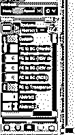

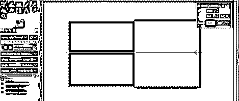

您可以在此绘制渐变的混合线上的任意位置添加一个或多个混合色点。要添加一个点，请将光标移动到这条线上，您将看到圆形光标的加号。

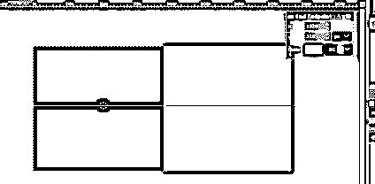

然后在那个地方点击一下，混合色点就在那个地方了。一旦您添加了它，您将在这个文档的右上角看到一个名为 stop 1 的对话框。通过此框，您可以更改添加点左右两侧的混合颜色。

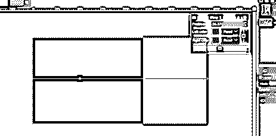

所以点击左边的颜色框，你会看到这个“改变停止颜色”框。从这里选择你想要的颜色。

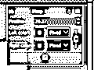

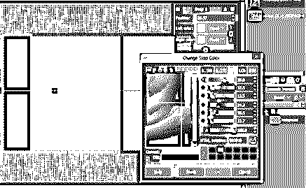

您将在左右颜色选项中获得相同的颜色，因为 chain-link 按钮处于打开状态。

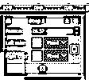

点击此链接按钮，将两种颜色分开，您可以为正确的颜色选择不同的颜色。

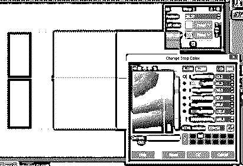

您可以随时拖动添加的选项来增加或减少所选的颜色区域。

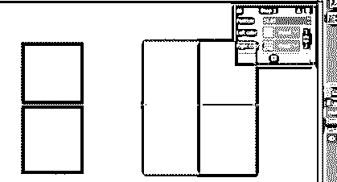

如果你想改变结束颜色，然后点击结束光标上的加号。

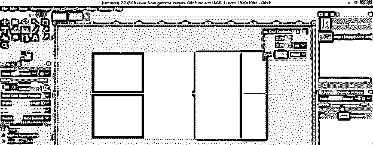

并从颜色框中改变颜色。

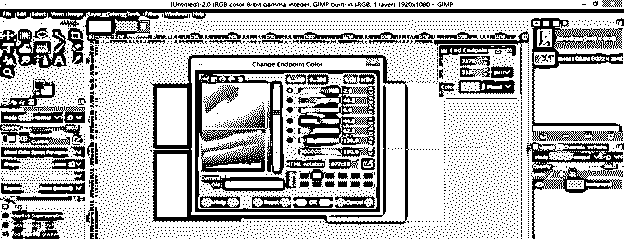

你可以用第一种颜色做同样的事情。

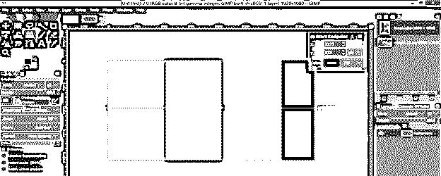

现在让我们切换到这个梯度预置。

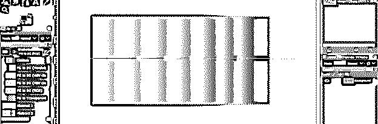

改变它的颜色。

如果您在添加的混合色点的两侧使用两种不同的颜色，您也会得到硬边。

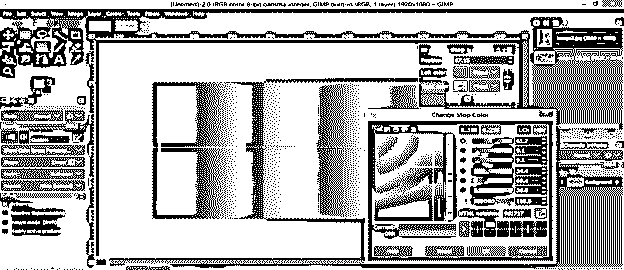

我们有一个不同类型的渐变混合工具的形状在这个列表中。

如果你选择径向选项，你会得到这种类型的渐变效果。

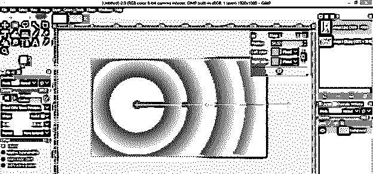

在灵性的形状中，你会得到这个。

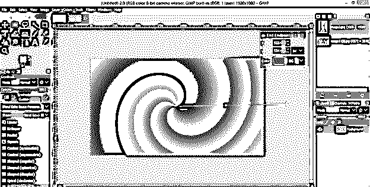

如果你想从渐变线中删除任何添加的点，那么只需按住鼠标左键点击它，并向上/向下拖动，当你看到颜色已经离开该点，然后释放鼠标按钮。

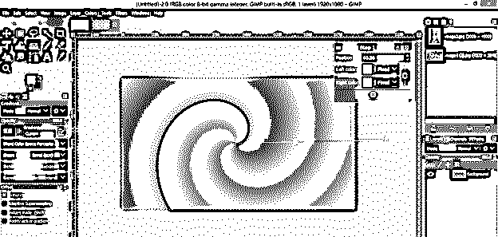

您也可以通过移动渐变线的起点和终点，沿对角线方向绘制渐变。

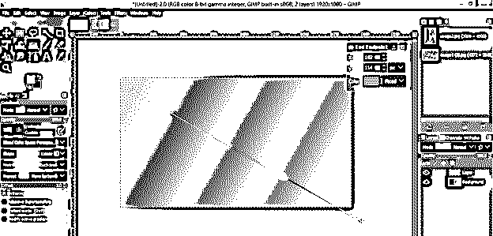

### 如何编辑混合工具绘制的渐变？

这是很难编辑绘制的梯度后，在一个新的层进行不同的工作。但是我们可以为了编辑的目的做另外一件事。

让我们有一个新的层，并画一个圆，就像这样。

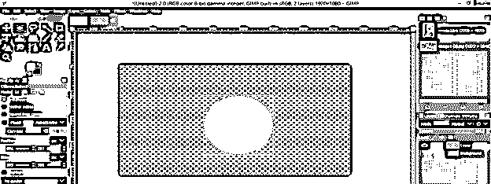

现在去你的渐变层，当你使用混合工具来编辑你绘制的渐变时，你将能够做到这一点。在编辑的地方，它会像这样画一个新的渐变。

所以为了编辑，点击这个按钮。

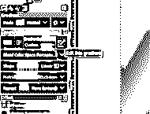

在文档区域的右侧会有一个渐变编辑框。

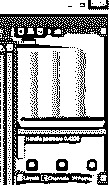

右键点击这个框，你会看到一个不同的选项来改变它的颜色。

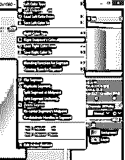

选择你想要的颜色。

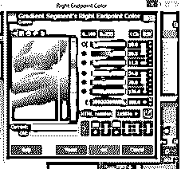

或者你可以去窗口菜单，然后一个可停靠的对话框选项，并从下拉列表中选择渐变选项。

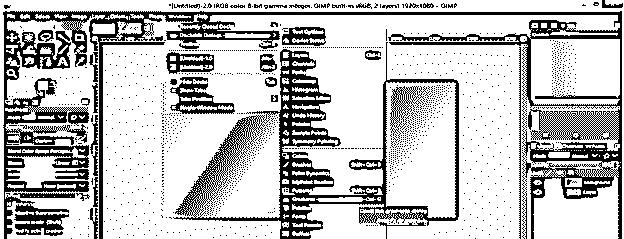

现在你将有不同的梯度预置在这里。只需选择其中任何一个，然后点击复制按钮复制它供您使用。

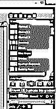

现在设置好颜色后，你可以在图层上重画渐变。我建议你在混合的时候为你的渐变选择合适的颜色，这样将来就不需要那么多的编辑了。

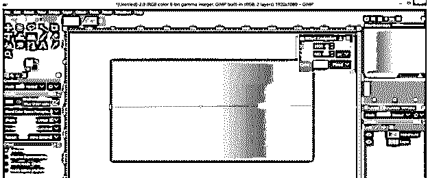

### 如何在图像操作中使用混合工具？

我们也可以在图像操作中使用混合工具，所以让我们来讨论一下。

为此，我将拍摄这两张图片。

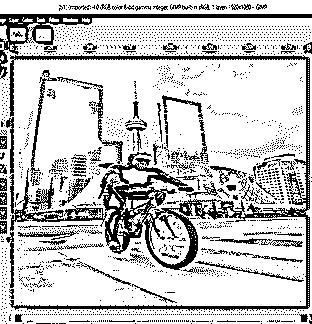

将两张图片合成一张，在顶层添加图层蒙版。

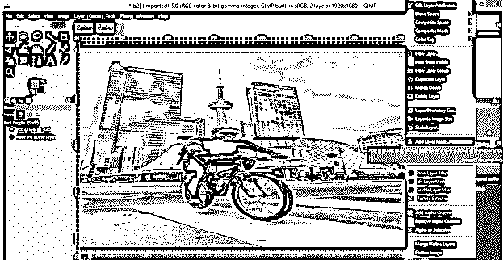

现在选择从 FG 到 BG 的渐变，确保颜色框中有黑色作为前景色，白色作为背景色。

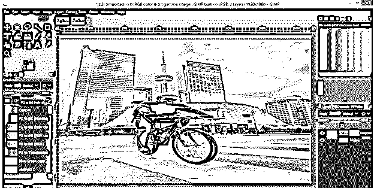

然后在图层蒙版上绘制渐变，你会得到这两个图层的这种类型的混合效果。根据您的需要调整渐变，以便更有效地混合图像。

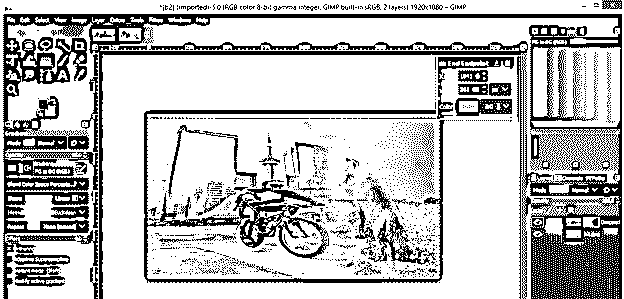

### 结论

现在你已经很好的掌握了混合工具以及不同操作参数的命令。你也可以在阅读完这篇文章后编辑你的渐变，并通过混合工具渐变的不同形状和参数在你的图像处理工作中使用它。

### 推荐文章

这是 GIMP 混合工具的指南。这里我们讨论如何在 GIMP 中使用 Blend 工具，以及如何在图像处理中使用它。您也可以看看以下文章，了解更多信息–

1.  [GIMP 替代方案](https://www.educba.com/gimp-alternatives/)
2.  [最佳照片编辑](https://www.educba.com/best-photo-editors/)
3.  [Adobe Photoshop 替代品](https://www.educba.com/adobe-photoshop-alternatives/)
4.  [插画替代方案](https://www.educba.com/illustrator-alternatives/)

