# GIMP 克隆工具

> 原文：<https://www.educba.com/gimp-clone-tool/>

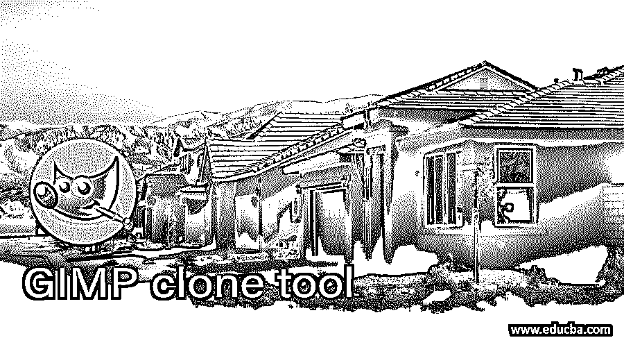

## GIMP 克隆工具简介

GIMP 中的克隆工具用于克隆任何特定图像的任何对象，或者您可以通过克隆另一个区域来替换与该图像的背景或图案匹配的对象，从而从图像中删除任何不需要的对象。在 GIMP 中，我们有两种克隆工具:简单克隆工具和透视克隆工具。两者也有大部分相同的参数，但不同的工作技术。我们可以通过改变这两个克隆工具的参数来做很多克隆的事情。因此，让我们玩他们的参数来获得一些令人兴奋的东西。

### 如何使用 GIMP 中的克隆工具？

我们可以在所有类型的光栅图像上使用克隆工具，因为它扫描对象的选定区域的像素，然后将这些像素粘贴到图像上的所需位置，以克隆该对象。这难道不是一件非常令人兴奋和有趣的事情吗？你还在等什么？让我们开始学习这个话题吧？

<small>3D 动画、建模、仿真、游戏开发&其他</small>

我们需要 GIMP 中的这个任务的图像。所以去文件菜单，点击它，然后点击打开选项，向下滚动列表。

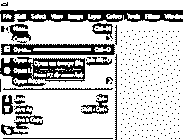

将会打开一个选择图像的对话框。转到您的图像的保存位置，然后在选择该框的打开按钮后选择它。您也可以在这个框中看到所选图像的预览。

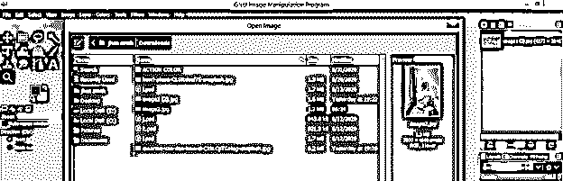

现在点击新对话框中的 Convert 按钮，将你的图片放到 GIMP 中。

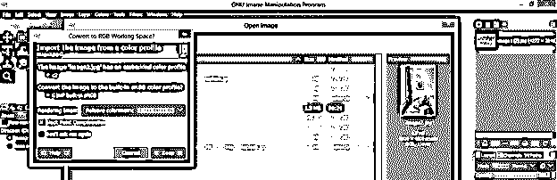

这是我们选择的图像。

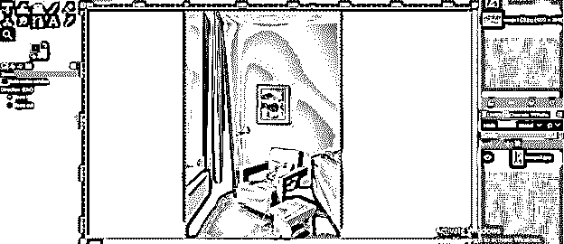

这是克隆工具的图标。这里我们有一个克隆工具和透视克隆工具。

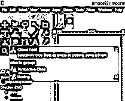

现在首先点击克隆工具，或者你可以按键盘的 C 键作为快捷键。

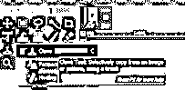

单击后，该工具的参数将在工具的参数部分打开。

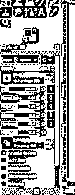

首先在图层面板中选择要克隆的图层。现在让我们给这个工具分配一个区域，我们希望选择它作为克隆区域。为了选择一个地方，克隆工具的笔刷的圆形光标在那个区域上，然后按住键盘的 Ctrl 键进行点击，当你对你的选择满意时，松开 Ctrl 键并点击。

我将在这些图像的这个风景上选择这个区域。

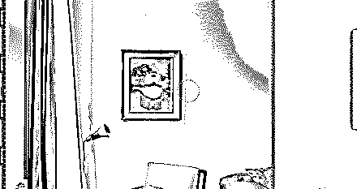

现在转到您的图像上您想要克隆它的地方，用鼠标左键单击，并按住左键拖动所需的位置。当你移动光标时，你会注意到你选择的光标也会在你选择的区域周围移动，所以在克隆过程中，要注意这个克隆工具的游戏，以便进行正确的克隆。

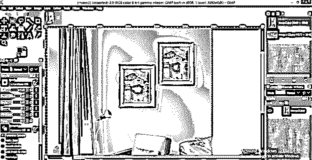

现在让我们分析一下该工具的一些重要参数，以便更好地使用该工具。您可以根据克隆对象的大小，通过其参数的“大小”选项来增大和减小笔刷的大小。

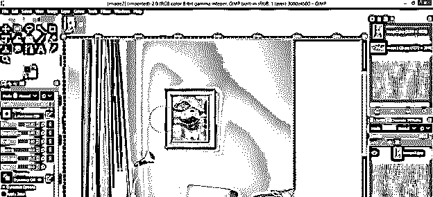

您可以通过“不透明度”选项降低克隆对象层的不透明度，当您克隆对象时，它将使用您选择的不透明度值进行克隆，如下所示。这里我选择了不透明度值为 50%。

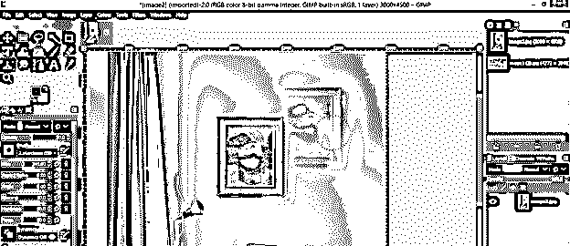

您也可以从该列表中选择克隆层的模式。例如，我选择颜色擦除模式，然后看看克隆后会发生什么？

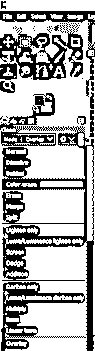

可以看到 mode 的效果。

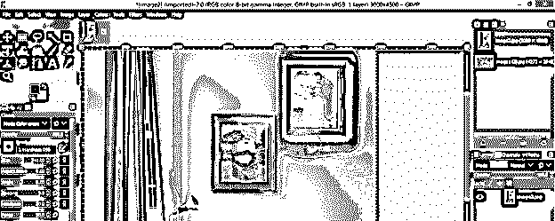

现在来到参数框的底部。这里我们有一个源选项，您可以在其中为克隆工具选择源，这意味着克隆工具会考虑图像中的选择区域。如果您在源中选择了图像选项，或者如果您选择了图案选项，则您可以选择任何图案作为克隆工具的选择区域。我们已经看到了上面的图像源选项，所以现在让我们看看模式。

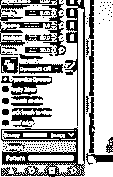

选择图案选项，然后点击图案框的图标，这里就会有一些图案了。点击选择你想要的。

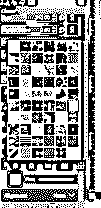

现在只需将光标移动到您想要复制该图案的区域。我选择这个图案，我想把这个图案加到墙上，所以我把克隆光标这样移动到这面墙上。

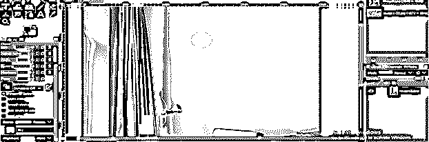

现在为了理解下一个选项，让我们有一个新的层，所以点击新层按钮。

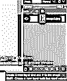

现在检查克隆工具的样本合并选项。

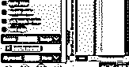

现在用克隆工具进行克隆，你会看到你的克隆对象也在一个新的空层上被克隆。

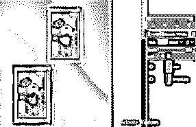

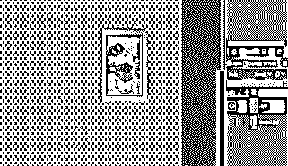

现在取消选中样本合并选项，在新的地方再次克隆，并在新的图层上选中这个新的克隆对象。你可以看到它不会被克隆，所以你可以使用样本合并选项在一个新的层上克隆对象。

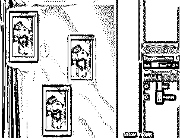

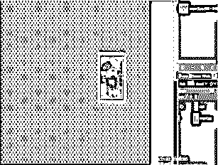

现在让我们来看一下透视克隆工具，从工具面板中点击这个工具。

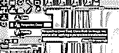

现在点击单选按钮来修改该工具参数的透视选项。

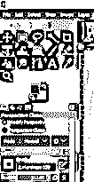

点击图片，你会在图片周围看到这种透视边框。

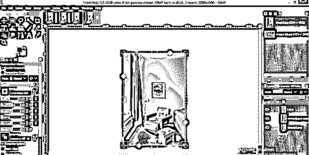

通过移动该结合框的锚点，为透视克隆工具设置一个平面。我会像这样设置它。

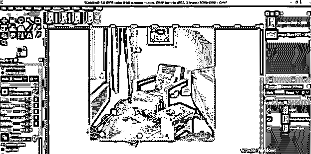

现在转到参数部分，单击该工具参数的透视克隆选项的单选按钮。

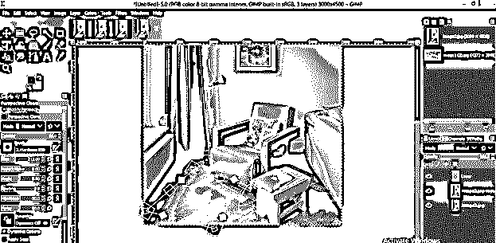

你会得到这样一个透视平面选择。现在用这个工具选择你想要克隆的区域。

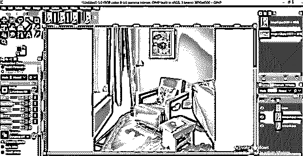

并在映像中您想要克隆该对象的任何位置开始克隆。这将像这样在你选择的透视平面上克隆。

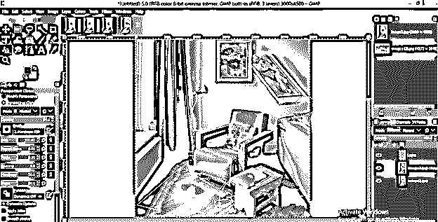

透视克隆工具的其他参数与克隆工具相同，所以看看它们并尝试它们以便更好地处理。

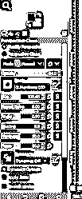

这都是关于 GIMP 的克隆音调和透视克隆工具的学习。

### 结论

我认为这是一次关于 GIMP 软件的克隆工具的很好的谈话，你获得了许多关于这个工具的参数处理的重要东西。现在你可以毫不犹豫地在你的专业工作中自由使用这个工具，并从中获得很多好处。

### 推荐文章

这是 GIMP 克隆工具的指南。在这里，我们讨论如何使用 GIMP 中的克隆工具以及参数或获得一些令人兴奋的东西。您也可以看看以下文章，了解更多信息–

1.  [Illustrator 中的平滑工具](https://www.educba.com/smooth-tool-in-illustrator/)
2.  [最佳平面设计软件](https://www.educba.com/best-graphic-design-software/)
3.  [GIMP 替代方案](https://www.educba.com/gimp-alternatives/)
4.  [最佳平面设计软件](https://www.educba.com/best-graphic-design-software/)

