# GIMP 魔墙工具

> 原文：<https://www.educba.com/gimp-magic-wand-tool/>

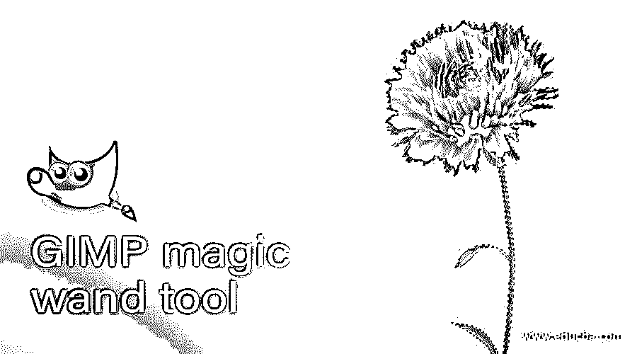

## GIMP 魔棒工具简介

魔棒工具用于快速选择任何图像中相同颜色范围的区域，通过它，您可以从图像中剪切特定区域，或者通过更改该工具的参数以及使用该软件的其他选项来移除所选对象的背景，但是在 GIMP 中，您会发现该工具的名称为模糊选择工具。在本文中，我们将学习模糊选择工具和工作算法的不同用途，因为该工具对图像的任何区域以及其他一些参数有不同类型的选择方法。

### 如何使用魔棒工具？

您可以非常容易地使用这个工具，因为它有非常方便的参数和它们的值。所以让我们来分析一下。

<small>3D 动画、建模、仿真、游戏开发&其他</small>

你可以在这里找到模糊选择工具，这个带有 U 的图标是快捷键。

一旦您选择了这个工具，您将在 GIMP 的参数部分获得模糊选择工具的这些参数。

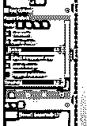

现在让我们打开一个图像，我们将使用模糊选择工具。我拍了这张花的照片。如果背景和图像的主要对象之间有很好的对比度，模糊工具将准确地工作。

### 魔术棒工具的使用

一旦你选择了这个工具，你将拥有一个类似光标的魔法棒。现在用这个工具点击你想要选择的区域，你会有一个和这个颜色范围相同的选择被激活。

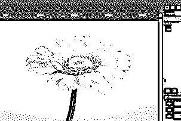

*   **模糊选择工具的参数:**

现在，让我们了解该工具的每个重要参数，这些参数都显示在参数框中。

*   **选择模式:**

我们在选择中有四种模式，第一种是替换当前选择。

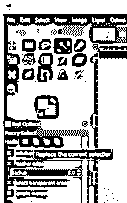

启用此选项并点击图像的所需区域。我将点击这些花的花瓣，并有这个选择。

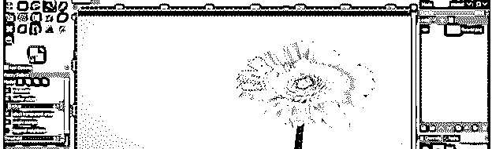

现在点击另一个区域，你会注意到之前的选择会自动删除。因此，使用此选项，对于每个新的选择，先前的选择将自动删除。

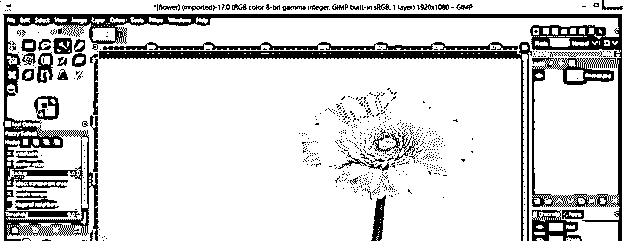

下一个模式是添加到当前选择。现在再一次，像这样在花上选择一个区域。

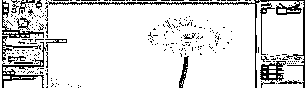

并再次点击以进行选择。在这里你会发现新的选择增加了前一个。因此，它将继续添加每个新的选择与前一个选择。我们通常在选择过程中使用这种模式。

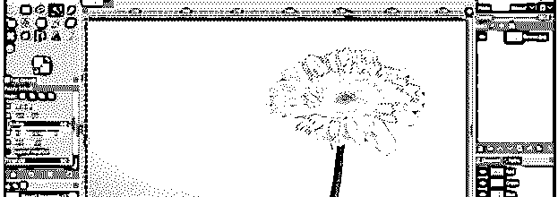

下一步是从当前选择中减去。这有助于移除你不需要的选择。只需点击不想要的选择。为此，您可以多次单击。

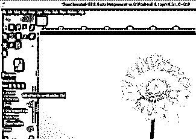

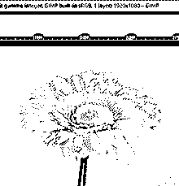

*   **绘制蒙版**

如果你想在点击区域之前看到选择区域，那么启用绘制蒙版选项。

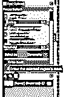

只需点击你想要的区域，并保持点击看到选择区域。它会像这样用洋红色高亮显示。

一旦你释放它，点击它，使你选择周围的地区。

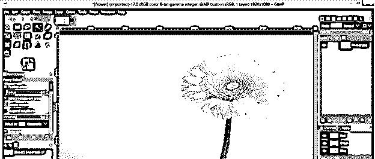

*   **阈值:**

阈值是该工具的一个非常重要的参数。在选择过程中，我们必须选择合适的阈值来进行正确的选择。

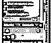

例如，增加阈值的值，并在这个花图像的背景上单击，您将有这种类型的选择。

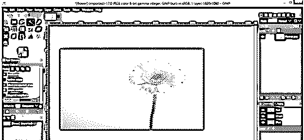

现在减小阈值的值，再次进行选择，您会注意到通过改变阈值的值，选择已经改变。

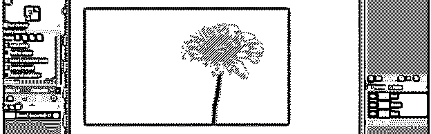

所以像这样检查你选择的值。正确选择的阈值随着每幅图像而变化。

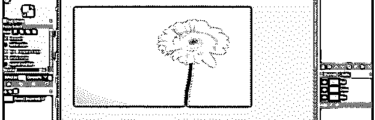

你可以看到这个选择在这个阈值上非常好。

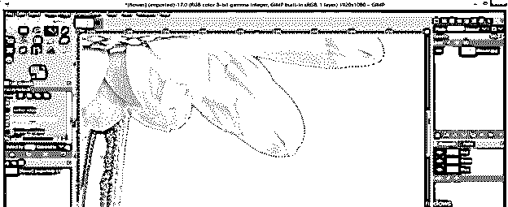

现在让我们从图像上剪下这朵花。这个选择在背景上，因为我们点击了背景。现在反转这个选区，围绕这朵花进行选择。所以转到选择菜单，点击向下滚动列表的反转选项。

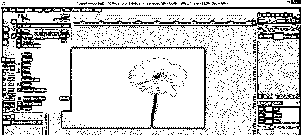

现在你可以注意到花周围的选择。你可以通过图片背景周围的黄色虚线来识别它。这条黄线表示图像的画布区域。

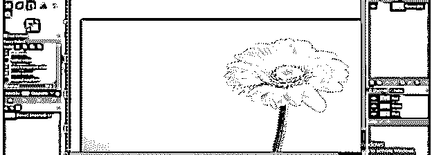

现在点击创建新层按钮。

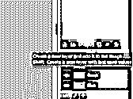

在此对话框中选择透明度作为该层的填充，然后单击确定。

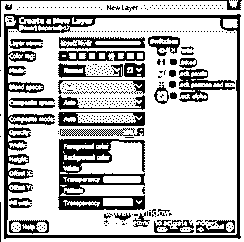

现在来看看你原来的花层，复制你的选择。要复制它，进入编辑菜单，点击复制选项。

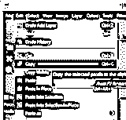

现在转到透明图层，点击编辑菜单的粘贴选项，将这朵花粘贴到这个图层上。

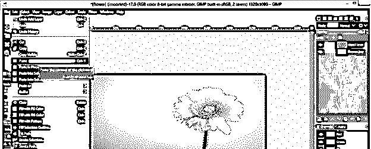

现在你将有一个浮动选择层在透明层上，所以点击锚按钮梳理这些层。

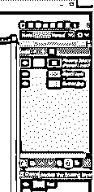

现在你将有花粘贴在这一层。

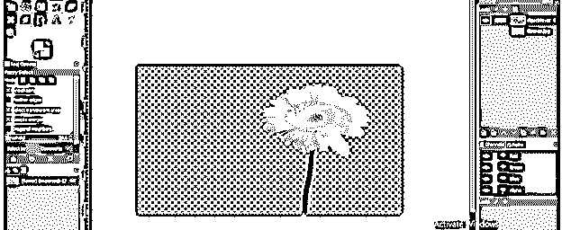

现在再次，有一个新的层填充白色。

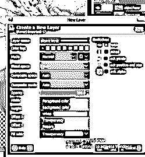

现在你将有一个白色的背景粘贴花。缩小它以查看选择的准确性。边缘会不太清晰。

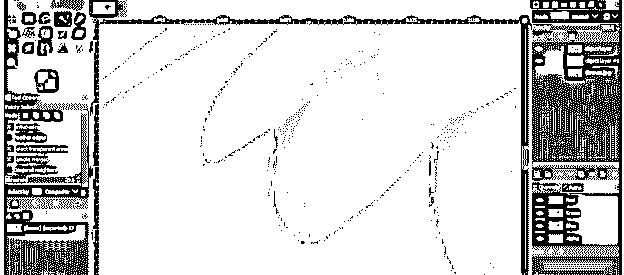

现在让我们为更好的结果做一些事情。

*   **羽化边缘:**

现在启用此选项以确保选择的准确性。它将细化边缘。

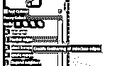

现在取这个选项的半径的最大值，在这个值上你可以在这朵花的周围做一个选择(重复我们之前做的所有选择过程)。

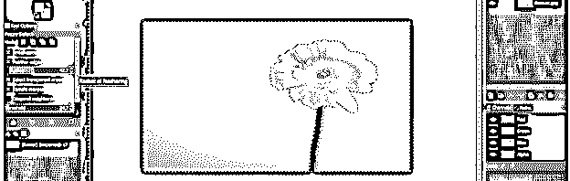

并将你的花粘贴到一个新的透明图层上。

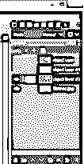

把它放在白色层上面，你可以看到边缘有一根羽毛。我认为这是羽毛的高价值，这使得边缘非常模糊。

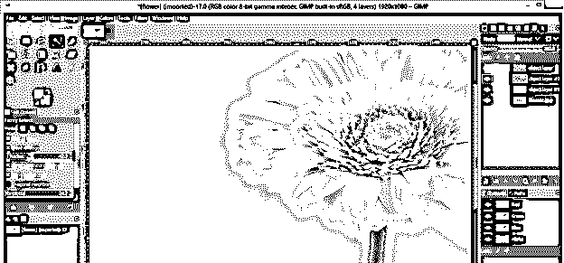

现在，再次选择，这一次采取羽毛半径为 5。

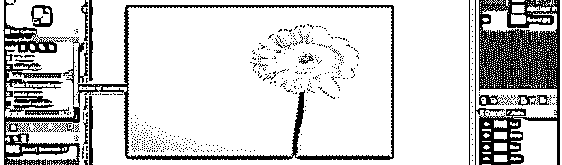

粘贴您的选择在一个新的透明层，并看到它在白色背景。

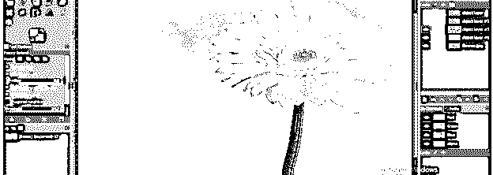

在这里，你会有完美的选择边缘。

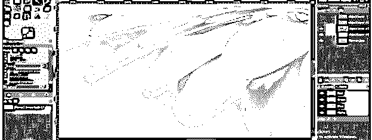

现在，你可以找到所有三个图像之间的差异。

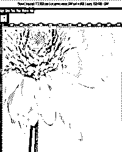

没有羽毛

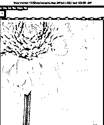

具有最大羽化值

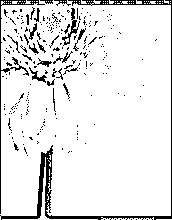

具有最小羽化值

现在你可以把这朵花用在另一个图像上。

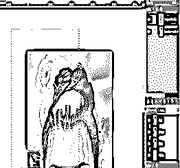

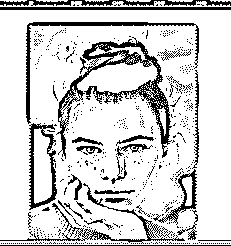

### 结论

我认为从这篇文章中学习这个主题对您来说是一次很好的经历，现在您可以在工作中非常准确地使用这个工具。您可以更改此工具的参数，以了解选择过程和其他功能的变化。

### 推荐文章

这是 GIMP 魔棒工具的指南。这里我们将详细讨论模糊选择工具和工作算法的不同用途，因为该工具有不同的选择类型。您也可以看看以下文章，了解更多信息–

1.  [GIMP 替代方案](https://www.educba.com/gimp-alternatives/)
2.  [Illustrator 中的倒影](https://www.educba.com/reflection-in-illustrator/)
3.  [Adobe Photoshop 替代品](https://www.educba.com/adobe-photoshop-alternatives/)
4.  [Illustrator 中的平滑工具](https://www.educba.com/smooth-tool-in-illustrator/)

