# GIMP 层

> 原文：<https://www.educba.com/gimp-layers/>

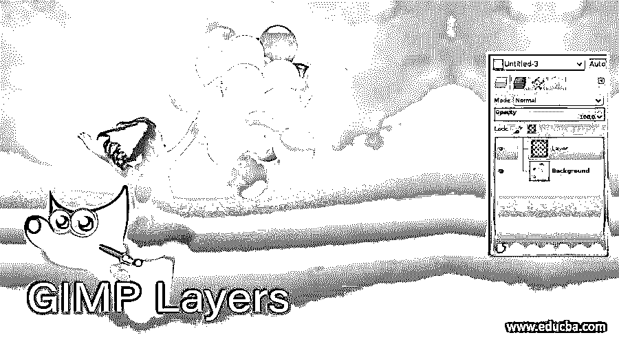

## GIMP 层介绍

无论您在 GIMP 的文档区域添加什么，都会在该软件的图层面板中创建一个图层，这意味着图层可以被定义为项目书中任何纸张的切片，每个图层上都有不同的文档。在 GIMP 中，我们可以有一个导入的图像层、文档层和形状层&我们在这个软件中绘制或创建的所有东西都会在图层面板中有一个图层。你将从这篇文章中学到一些独立图层的基本参数，这样你就可以理解在这个软件中拥有一个包含许多图层的图层面板的机制。

### 如何在 GIMP 中使用图层？

我们可以使用层来调整不同的特征，以及改变该层的对象的参数。该对象可以是图像、文档、形状或任何设计。在学习如何使用图层之前，让我们先来看看图层面板的位置和恢复。

<small>3D 动画、建模、仿真、游戏开发&其他</small>

默认情况下，您会在用户屏幕的右侧找到图层面板。

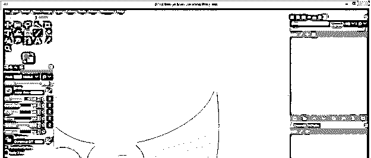

由于面板是可停靠的，您可以将它放在用户屏幕的任何地方。

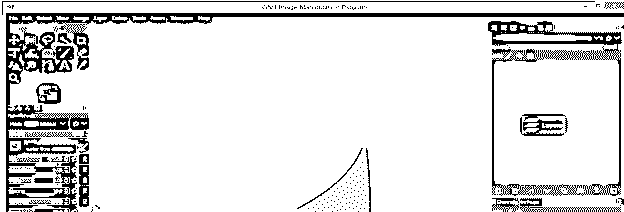

或者你可以根据自己的适合程度这样移动。

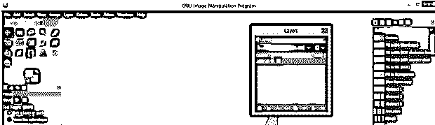

如果你不小心关闭了图层面板，不要担心，只要进入窗口菜单，点击它。进入可停靠对话框，点击新列表的图层选项，或者按 Ctrl + L 作为快捷键。

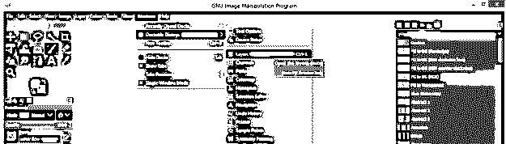

如果你在 GIMP 的文档区域什么都没有，那么你的图层面板将是空的，没有图层。

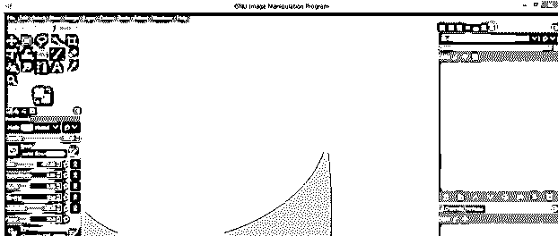

现在让我们创建一个新的文档，一旦你创建了它，这个文档的一个图层将作为背景图层添加到图层面板中。你可以在图层面板中设置多个图层，因为 GIMP 在图层面板中设置一个图层的容量是无限的，这取决于你的计算机容量。

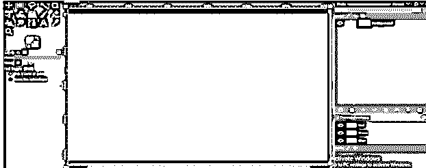

就像你在 GIMP 中打开任何图像一样，它在图层面板中也有自己的图层。

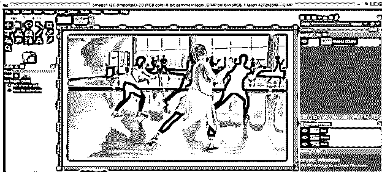

您可以更改任何层的名称，只需双击层的名称，并写下您想要的名称。

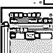

为了理解图层面板的下一个选项，让我们将界面的主题改为灰度。在这里，我们必须在层面板中的层，你可以看到，如果你选择了任何层，它会变得突出。

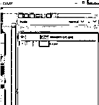

您将首先看到图层序列中的顶部图层。在这里，我们有女孩层在顶部，所以我们只能看到这一点，它下面的层只能看到当有任何差距或上层有较少的不透明度值。

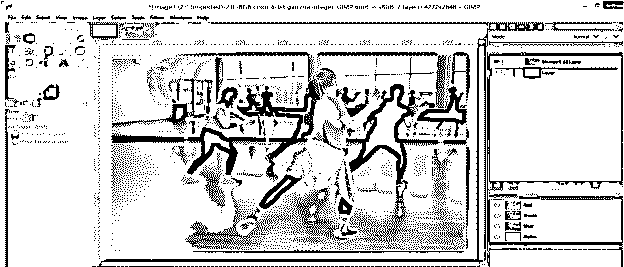

你可以点击任何层的眼睛按钮，使其不可见。

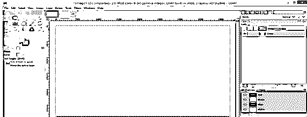

下一个是链接按钮，如果你在两层都点击它。

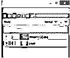

然后，您在任何一个图像上应用的任何变换或更改都将应用到两个图层上。例如，我缩小这个绿色层。

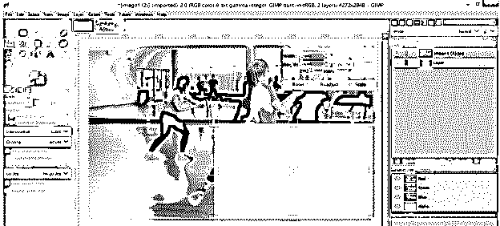

当我按下回车键来应用这个缩放变换时，它将被应用到两个图层上。

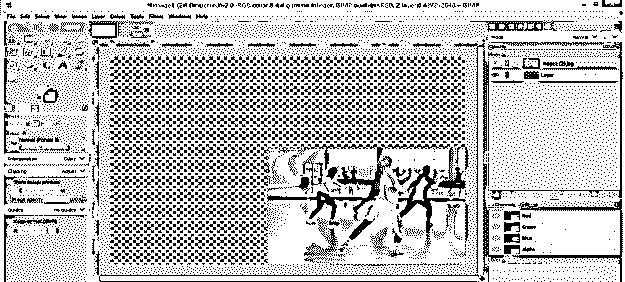

但是，如果链接按钮只在一个层上启用，那么它将锁定该层，您只能在未链接的层上进行更改。例如，我启用了女孩层的链接按钮，然后改变了绿色层的比例。

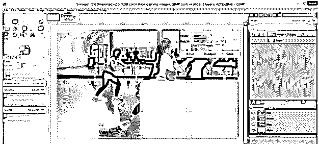

进入后，只有绿色层会发生缩放变换。

接下来是锁定像素按钮。

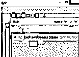

我用画笔工具在女孩图层上画出这个星星。

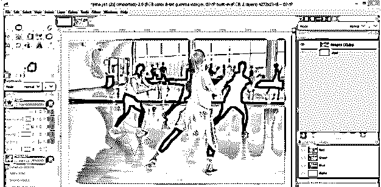

现在启用锁定像素按钮，再次用笔刷工具在女孩图像上绘制星星。你会发现你画不出来。因此，如果你启用了锁定像素按钮，那么你不能在你选择的图层上绘制任何东西。

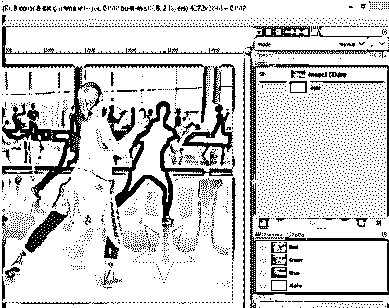

接下来是锁定位置和大小按钮。通过启用此按钮，您将无法移动或调整所选层的大小。

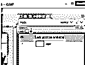

现在把绿色层放在女孩层上面，用鼠标点击移动它。

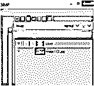

我们在图层面板中有模式选项。从列表中选择任何一种模式。我会选择柔光选项。

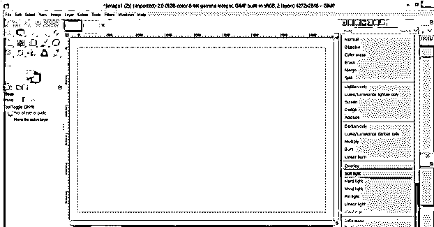

你的上层将和下层混合，给你一个这样的混合效果。

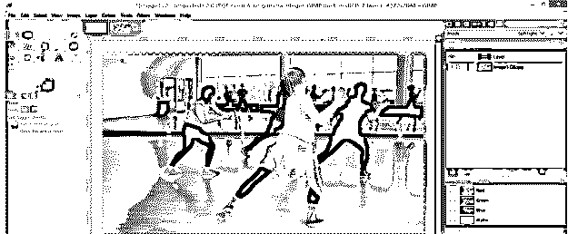

通过“不透明度”选项更改不透明度值，可以增加或减少任何层的不透明度。不透明是指任何特定事物有多不透明吗？

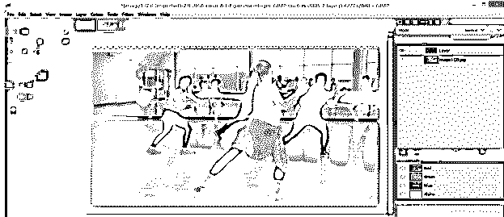

无论在“图层”面板中选择了哪个图层,“移动工具”都首先作用于上层。例如，如果选择底层，然后使用移动工具来移动该层。

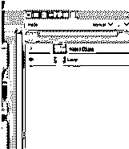

然后它通过自己选择来移动上层。

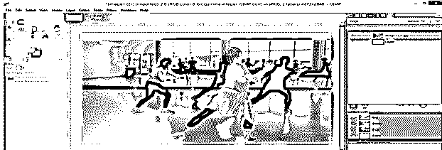

一旦你这样做了，自动回到你原来选择的层。

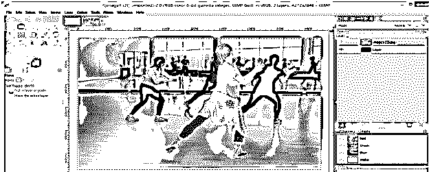

我们在图层面板的底部有一些标签或按钮，所以让我们也来讨论一下。第一个选项卡用于创建新层。

单击此选项卡后，您将看到此对话框。您可以在这里命名您的层。

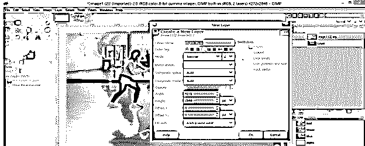

通过颜色标签选项选择图层的标签颜色。

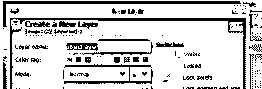

您也可以在这里根据自己的工作需要设置图层的大小。

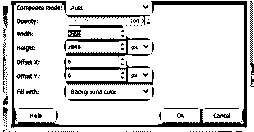

你可以用不同的选项填充图层。您可以选择前景色、背景色、白色、任何图案或透明度进行填充。

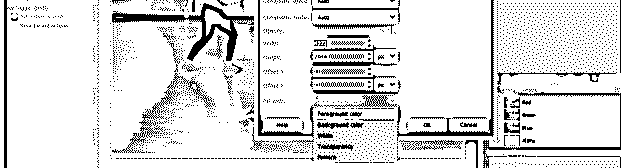

我将选择透明度选项有一个透明层，并点击确定。

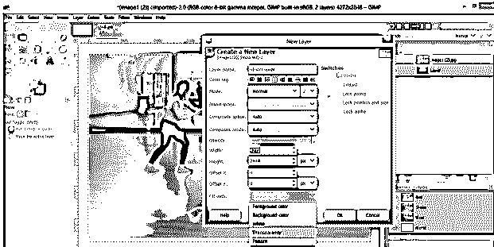

在图层面板中你将会有一个你想要的设置的新图层。

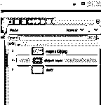

这是一个透明层。

如果你想填充颜色，那么进入编辑菜单，点击任何填充选项。

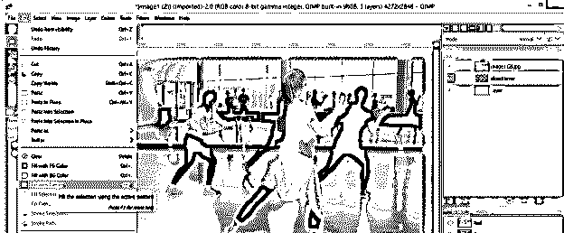

如果你想复制任何一层，点击这个按钮。

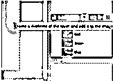

你将有一个你选择的层的副本。

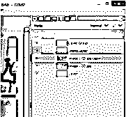

要添加一个遮罩到任何层，点击这个按钮。

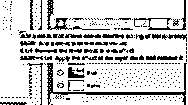

单击后，您将看到此对话框，在此进行所需的设置，然后单击“添加”按钮。

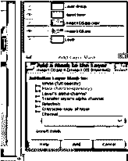

和遮罩将添加到您选择的层。

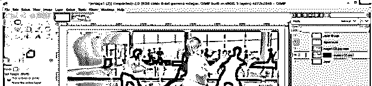

你可以删除任何层只需选择该层，并点击删除按钮。

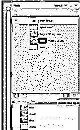

### 结论

我们已经讨论了 GIMP 软件图层面板的所有重要参数和特性，现在你可以理解理解 GIMP 图层面板有多重要了。现在，您可以轻松地使用图层面板的功能，以更好的方式处理您的工作。

### 推荐文章

这是 GIMP 层的指南。这里我们讨论一下 GIMP 中的介绍和如何使用层？.您也可以浏览我们的其他相关文章，了解更多信息——

1.  [MP4 转 GIF Photoshop](https://www.educba.com/mp4-to-gif-photoshop/)
2.  [Photoshop 金色渐变](https://www.educba.com/photoshop-gold-gradient/)
3.  [Photoshop 中的夜间效果](https://www.educba.com/night-effect-in-photoshop/)
4.  [Photoshop 中的透视校正](https://www.educba.com/perspective-correction-in-photoshop/)

