# GIMP 工具箱

> 原文：<https://www.educba.com/gimp-toolbox/>

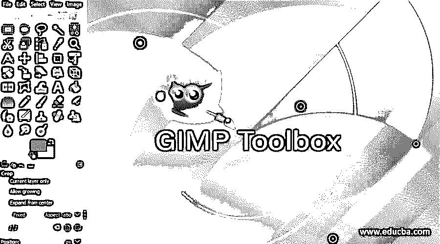

## GIMP 工具箱简介

在本文中，我们将学习 GIMP 中的工具箱。工具箱是您需要对图像和对象执行的所有操作所在的地方，默认情况下位于 GIMP 窗口的左上角。GIMP 为我们提供了许多定制选项，让我们可以根据自己的需要移动和放置工具箱。除此之外，工具箱还具有各种分组选项，以便您可以将经常使用的工具分组，并根据您的用途设置工具的顺序。不仅如此，如果您想要更复古或现代的外观，甚至可以更改图标主题。

**步骤 1:** 如果您不喜欢原来的设置，我们先自定义工具箱。我们的目标是像 photoshop 等其他应用程序一样，在左侧对齐工具。首先，拖动工具选项，直到它看起来像一个浮动窗口。

<small>3D 动画、建模、仿真、游戏开发&其他</small>

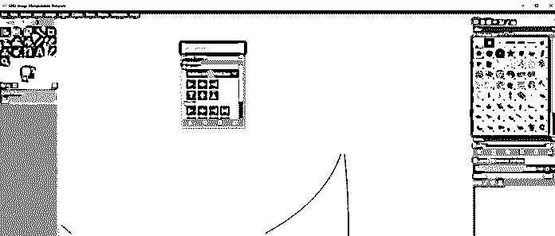

**步骤 2:** 现在在窗口内拖动工具选项标题，直到一条蓝线出现在其他面板的右边。现在它应该停靠在右侧。

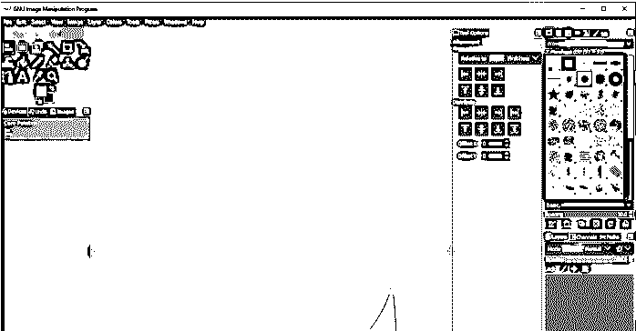

类似地，我们可以从左向右拖动所有其他面板，如图所示。

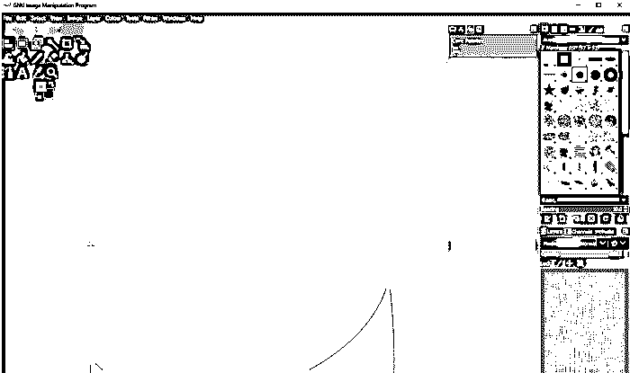

步骤 4: 我们将得到一个类似下图的结构，带有工具选项和其他面板。

**步骤 5:** 现在我们可以拖动三个点的角，直到我们得到一条直线上的所有工具，现在我们有一个单列工具箱。现在，默认情况下，当您将鼠标悬停在任何工具组上时，它会显示所有工具。

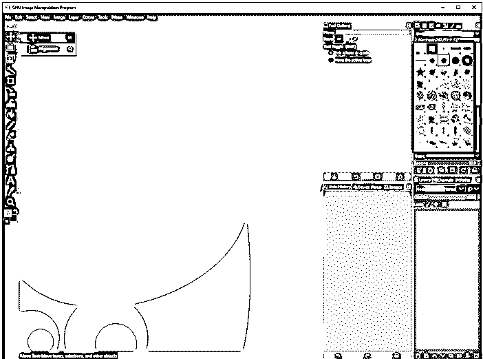

**步骤 6:** 现在我们将从编辑- >偏好设置中做一些额外的定制。

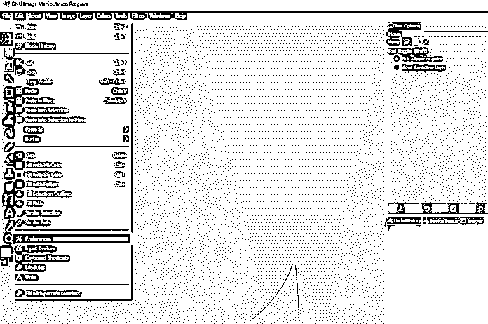

**第七步:**进入工具箱部分进行自定义。

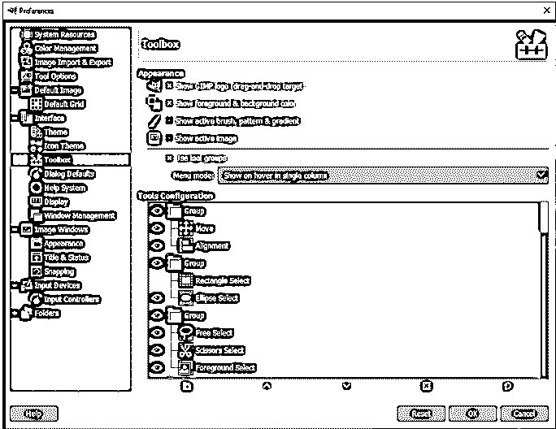

**步骤 8:** 首先关闭显示活动组，这将删除分组并按顺序显示所有工具。

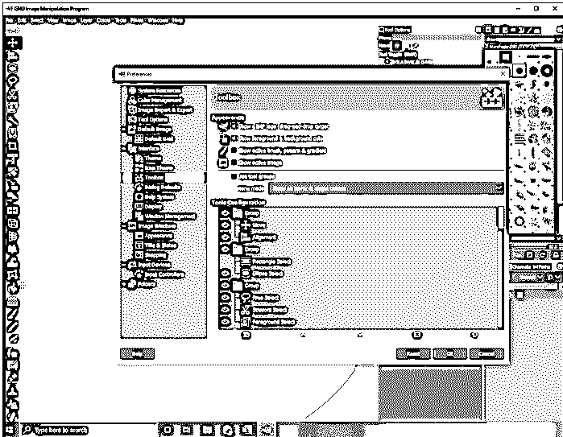

**第 9 步:**如果您看不到工具箱中的所有工具，您可以再次拖动这三个点，工具箱将在双栏中显示。

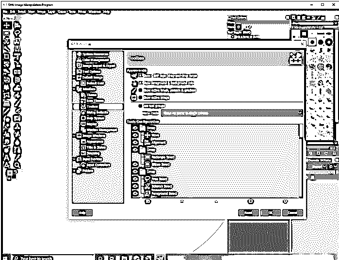

**步骤 10:** 现在，我们将通过使用工具组打开分组，菜单模式设置为在单个列中悬停时显示，该列可以更改为单击时显示。这是 GIMP 默认布局的默认行为。另一个选项是在悬停时显示，这将在悬停时显示一组工具，而不管工具箱的任何列布局。

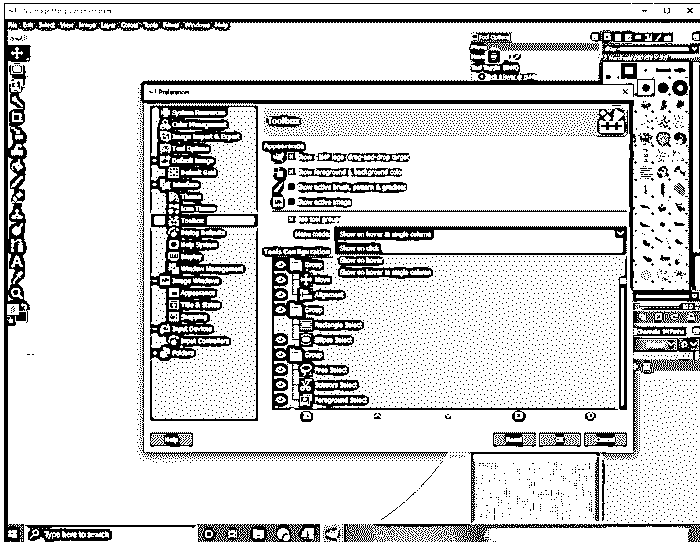

**步骤 11:** 在刀具配置中，您可以通过点击并拖动刀具到另一组来选择和更改刀具的组。您也可以通过单击眼睛图标来切换工具的可见性。除此之外，还有创建新组、重新排序组、删除组或将整个工具顺序和可见性重置为其原始状态的选项。

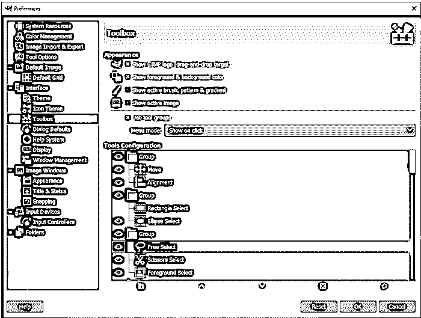

**第 12 步:**接下来你可以改变图标的主题，这将影响工具箱项目。目前，默认情况下，它设置为符号，但您可以更改为颜色或传统。

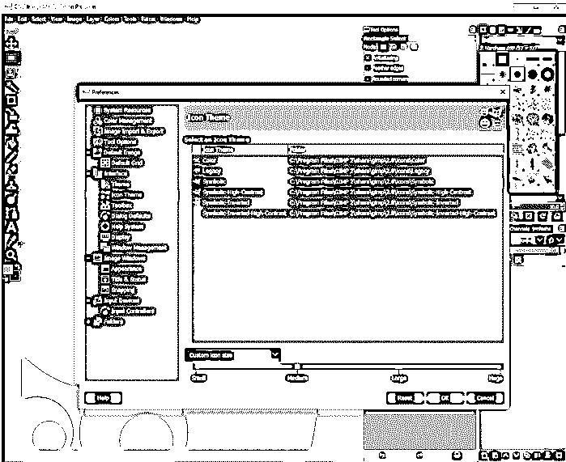

步骤 13: 正如我们所见，颜色主题为所有图标赋予了颜色。

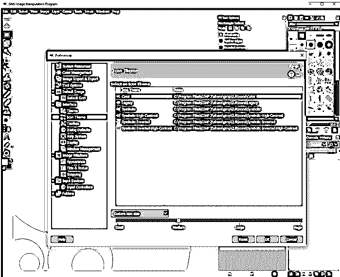

步骤 14: 如果你使用类似符号反转的东西，那么你想为 GIMP 使用一个浅色的主题，这将与图标形成很好的对比。

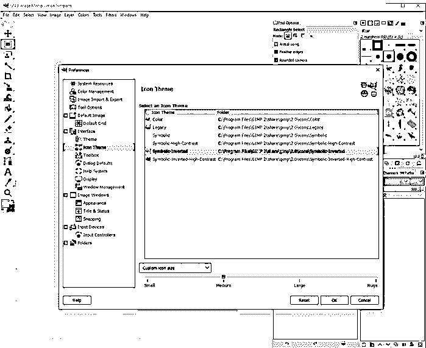

第 15 步:然后在底部有你想要的图标大小的选项，可以是小、中、大、大，或者你可以根据显示器的分辨率来设置，或者让主题来设置图标的大小。

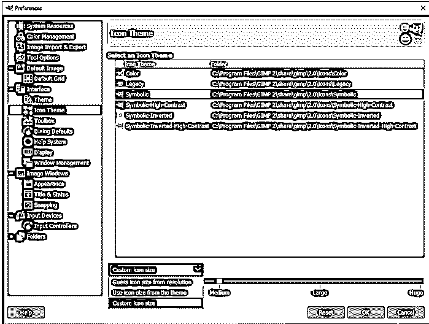

**步骤 16:** 如果您想将整个窗口位置重置为原始值，则进入窗口管理，并将保存的窗口位置重置为默认值。当您重新启动 GIMP 时，您的窗口将会停止工作。

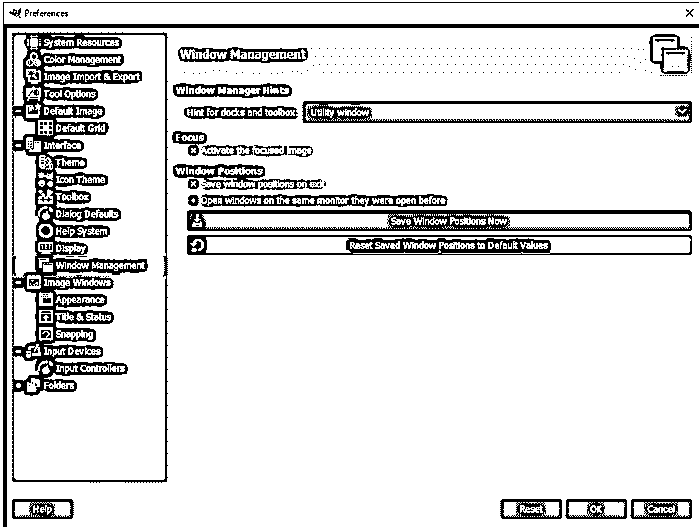

**第 17 步:**现在我们来看看工具箱里的一些基本工具。让我们从移动工具开始。使用这个工具，我们可以移动任何选定的层。除此之外，还有其他选项来移动选择或移动路径。

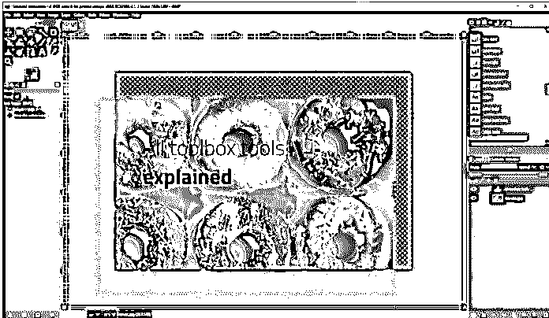

**步骤 18:** 使用对齐工具，我们可以相对于第一个项目、图像、选区等对齐各个层。

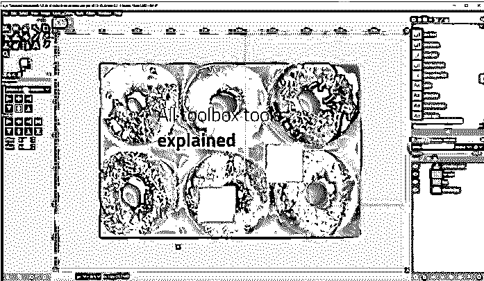

步骤 19: 我们已经对准了目标的中心，如图所示

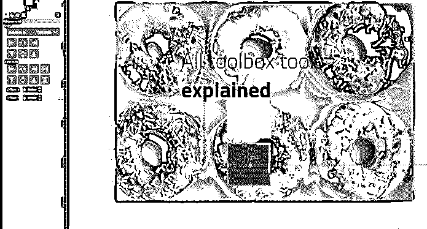

**步骤 20:** 使用椭圆选择工具，你可以用羽化边缘和其他选项做一个圆形选择来调整选择。

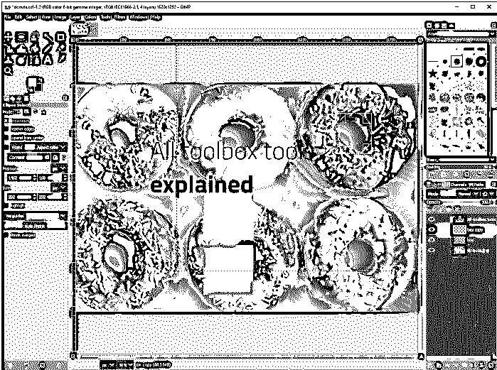

**步骤 21:** 然后有一个自由选择工具，可以通过拖动或点击来选择多边形形状，但它提供了自由，但缺乏精确性。

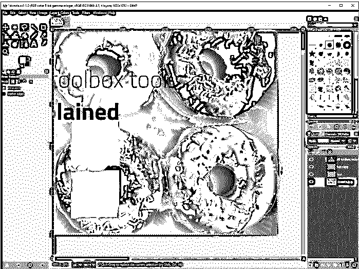

**步骤 22:** 然后是剪刀选择工具选项，使用智能边缘拟合选择形状。只需点击选择，GIMP 将猜测可以在以后调整的边缘。

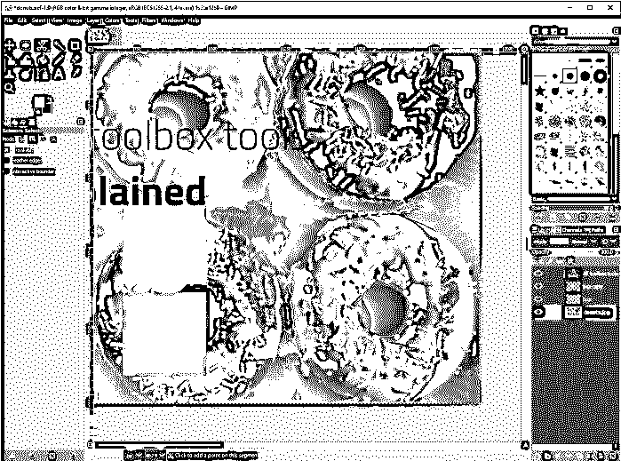

**步骤 23:** 现在使用一个模糊选择工具，你可以点击并向下拖动来增加基于颜色的选择，或者向上拖动来减少选择。这种类型最适用于带有渐变的背景，如日落。

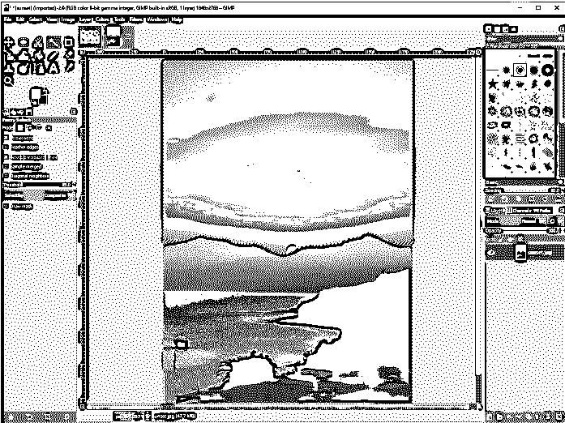

**第 24 步:**接下来，在通过颜色工具选择中，您可以通过点击颜色进行选择，类似的颜色将被选择，您可以拖动以增加该颜色的阴影。

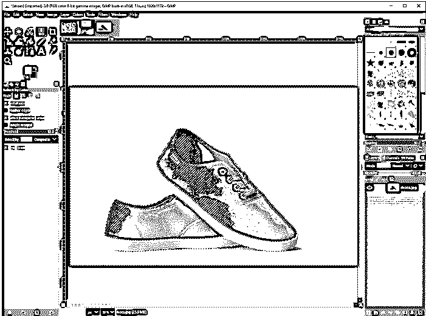

**步骤 25:** 接下来是裁剪工具，可以用来裁剪图像的某一部分，刚好重新定义了文档的边缘。如果您愿意，您可以只裁剪当前图层，也可以删除裁剪的像素。

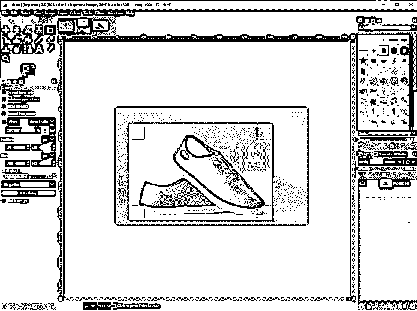

**步骤 26:** 接下来，旋转工具允许围绕轴旋转单层上的对象和图像，轴可以放在我们想要的任何地方。只需单击并拖动图层进行旋转，或按 shift 键锁定 15 度的旋转增量。如果移动圆形十字准线，旋转的位置也可以改变。

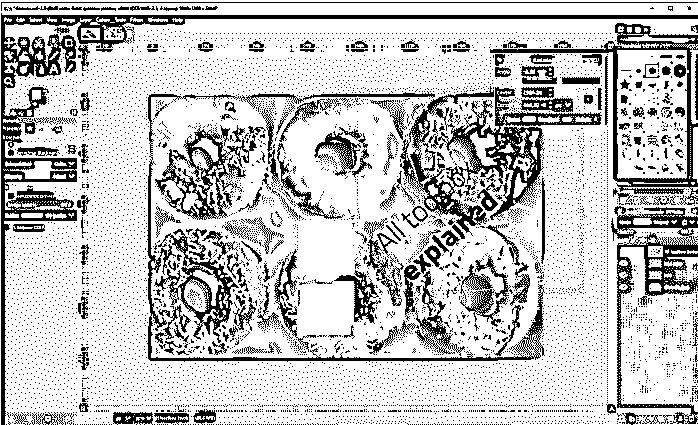

### 结论

在本文中，我们学习了 GIMP 中的工具箱。首先，我们开始定制它的位置，然后我们为整个工具箱创建了一个单列布局，就像在其他照片编辑应用程序中一样。然后，我们已经看到了排序和工具箱的其他首选项以及主题，并总结了一些基本工具的使用。

### 推荐文章

这是一个 GIMP 工具箱的指南。这里我们介绍一下，使用 GIMP 工具箱的步骤。您也可以看看以下文章，了解更多信息–

1.  [Inkscape vs GIMP](https://www.educba.com/inkscape-vs-gimp/)
2.  [Adobe Photoshop vs GIMP](https://www.educba.com/adobe-photoshop-vs-gimp/)
3.  [最佳在线照片编辑](https://www.educba.com/best-online-photo-editor/)
4.  [GIMP 替代方案](https://www.educba.com/gimp-alternatives/)

