# GIMP 中的模糊效果

> 原文：<https://www.educba.com/blur-effect-in-gimp/>

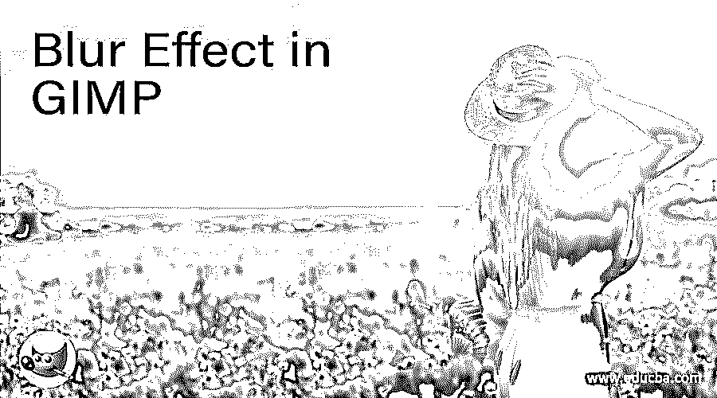

## GIMP 中的模糊效果介绍

GIMP 中的模糊效果是我们在 DSLR 相机中拍摄照片时产生的一种效果，这意味着相机会使我们的主要对象或焦点以外的背景模糊。在 GIMP 中，你可以使用这个软件的不同工具和功能来创建一个模糊效果，给你一个背景模糊的图像，而不会干扰你的主要对象。模糊任何图像中的任何区域完全取决于你，这意味着你可以自由选择你想要模糊的区域和你想要聚焦的区域。所以，让我们来看看如何做到这一点？

### 如何在 GIMP 中创建模糊效果？

在 GIMP 中创建模糊效果对我们来说并不是一件非常困难的事情，因为在学习了这篇文章中的操作步骤后，你会觉得非常方便。那你还在等什么，让我们一起经历吧。

<small>3D 动画、建模、仿真、游戏开发&其他</small>

这是 GIMP 2.10 版本的用户界面，在顶部我们有一个菜单栏和一些菜单标签，如文件、编辑等等。在这下面，你会发现左侧的工具面板和它下面的属性部分。在中心，有一个显示窗口向我们展示我们的工作，在这个窗口的右边，我们有一个图层面板，上面有一些其他的标签。

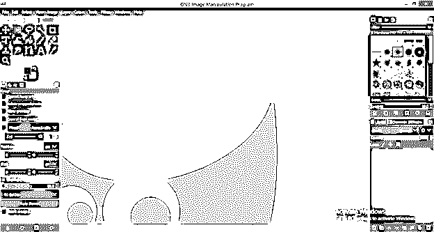

现在让我们放置一个图像，我们在上面创建一个模糊效果，打开你想要的图像的文件夹，从那里选择它，然后拖动到你的计算机屏幕任务栏上的 GIMP 图标。

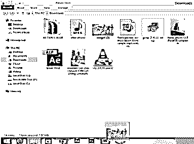

并在进入 GIMP 软件后释放鼠标键。松开按钮后，此对话框将会打开。它会问你，你想使用 RGB 颜色工作空间，然后点击转换按钮，否则你可以选择保留。在这里，我将点击转换按钮。

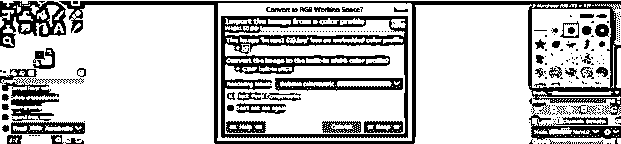

这是我们的形象，这里我的主要焦点是前面的女孩，我将使背景模糊除了这个女孩。现在选择原始图层，点击复制按钮，复制这个图层。

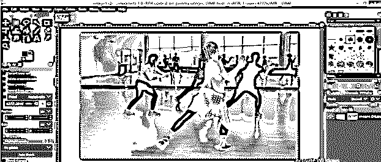

现在选择一个复制层，点击它，进入菜单栏的过滤器菜单，然后点击它。转到下拉列表的模糊选项，然后从模糊选项的新下拉列表中选择高斯模糊选项。

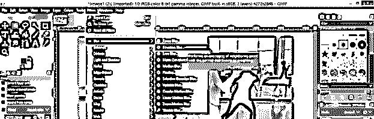

为了设置模糊强度的参数，将打开一个高斯模糊对话框。如果您有预设，那么您可以直接从预设选项中选择它。

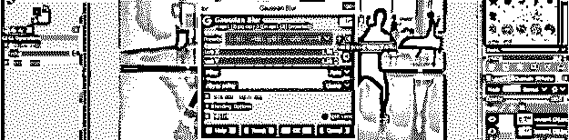

点击这个对话框的分割视图按钮，这样你就可以比较你的原始图像和模糊图像。

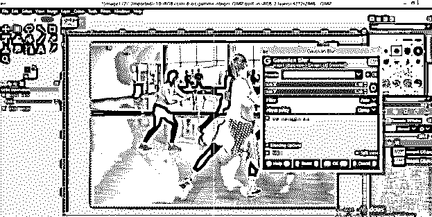

现在移动尺寸 X 选项上的滑块光标，在 X 方向模糊像素。由于链接按钮处于打开状态，您为 x 方向选择的值将自动填入 Y 方向(尺寸 Y 选项)。

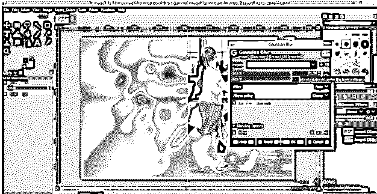

您也可以通过键盘输入该值。我将设置 40 作为它们的值，你可以在图像的分割窗口中看到模糊的效果。

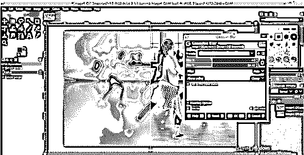

这是我们的模糊图像。现在点击这一层的眼睛按钮隐藏它。

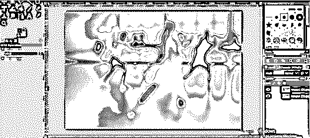

我们将使用工具面板的自由选择工具在原始图层上围绕这个女孩进行选择。

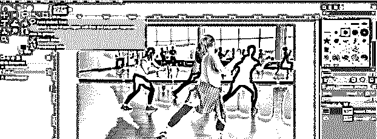

像这样做一个选择。如果你做了一个正确的选择，那将是好的，如果有一些完美选择的要求，那么我们将在后面的步骤中做。

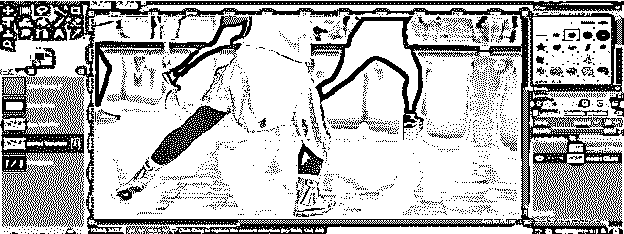

一旦你用这个工具关闭了路径，你的选择就会像这样围绕着这个女孩。

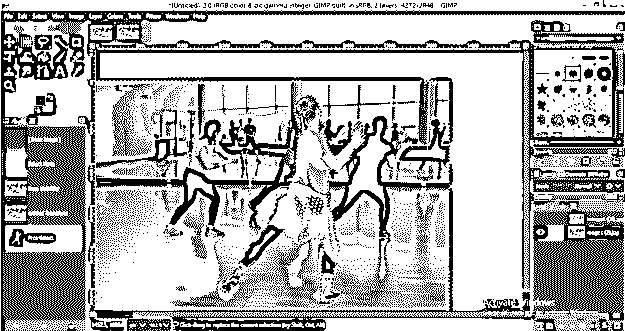

对于软选择添加一些羽毛。进入选择菜单，点击羽化选项。

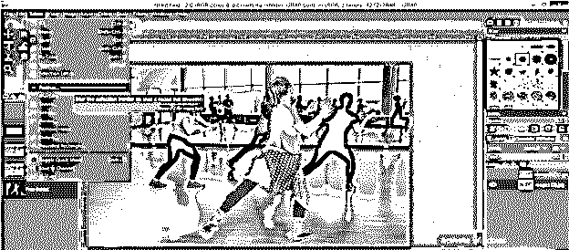

在这个盒子里给出羽毛的价值。我会给它 5 英镑。

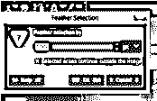

现在再次点击这个图像的模糊层的眼睛按钮取消隐藏，然后右键点击这个层，然后点击添加图层蒙版选项为这个层添加一个蒙版。

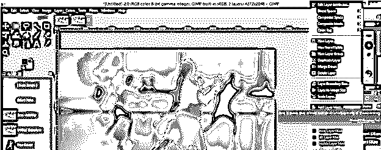

现在，在打开的对话框中点击添加按钮，不影响该对话框的其他选项。

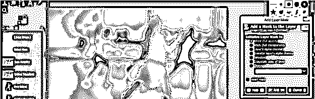

现在创建所选区域的蒙版需要工具面板中的画笔工具。

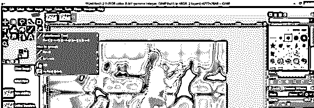

拿一把硬度 050 的刷子。

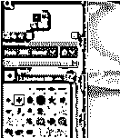

根据您选择的对象增加画笔大小。

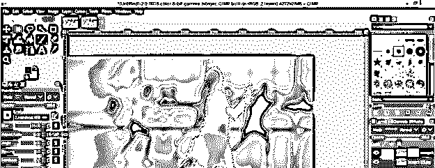

不透明度应为 100%。

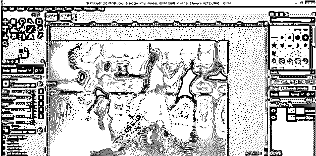

现在用画笔在选定的区域上绘画。不要担心选区以外的区域，因为笔刷只对选定的区域有效。

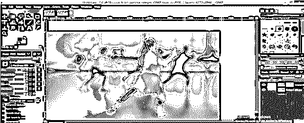

你会得到这种类型的非模糊区域。

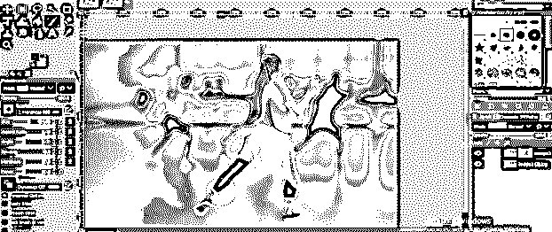

现在点击“选择”菜单中的“无”选项取消选择。

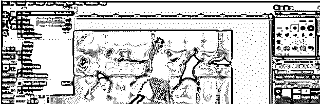

如果你有这种问题，不要担心。

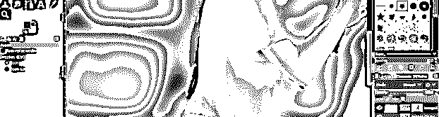

使用笔刷工具，根据你想要修改的区域设置大小，切换到白色作为前景色。

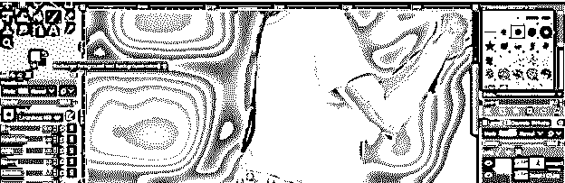

现在用画笔在一个不需要的地方画画，就像这样。

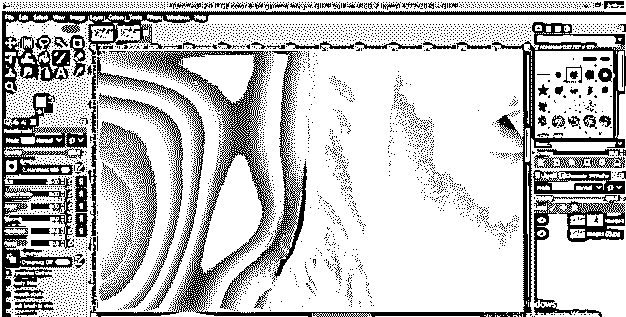

如果你在这项工作中扰乱了你主要对象的某些区域，那么不要再担心了。

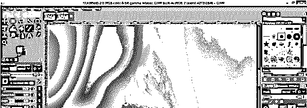

切换到黑色作为前景色，并涂掉干扰区。

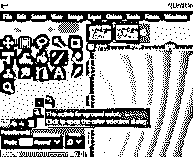

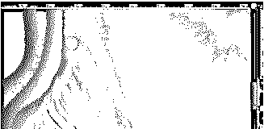

现在，为了给这个模糊效果图像添加一个更自然的外观，我们必须让这个女孩的附近区域清晰可见，而不是模糊。所以选择渐变工具。

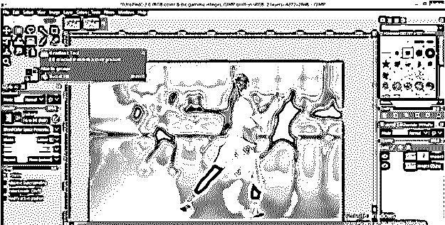

以黑色为前景色。

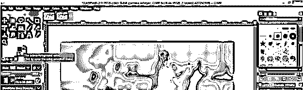

不透明度为 60%。

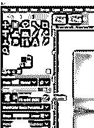

从列表中选择前景到透明选项。

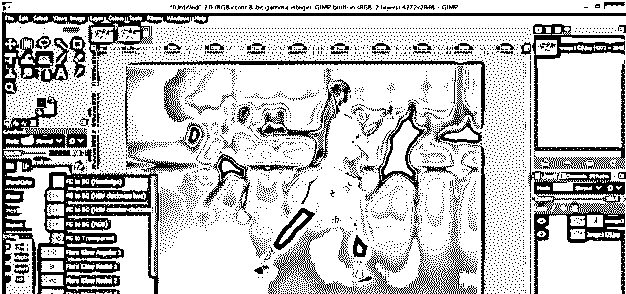

从下向上拖动渐变光标。

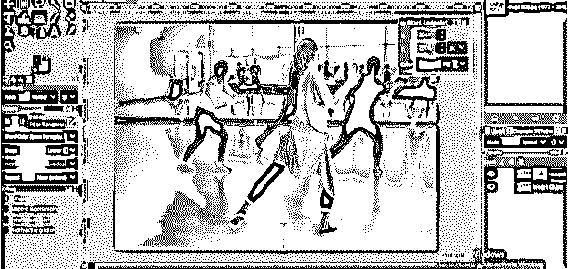

也从该列表中选择前景色(透明)选项。

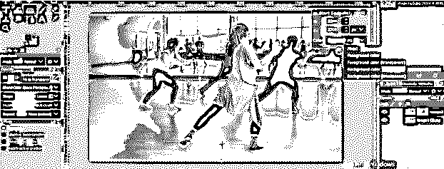

现在你将在这张图片的地板上有一个清晰的区域。

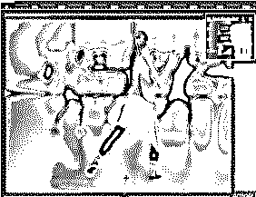

如果你想增加地板区域的透明度，再次使用笔刷工具，将不透明度设置为 45%。

把刷子移出你想清理的地板区域。

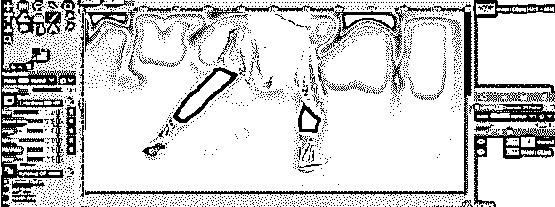

现在右击模糊层，选择应用蒙版层选项，将蒙版应用到你的图像。

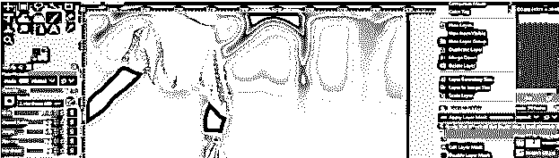

现在，您可以看到两幅图像之间的差异。

**在**之前

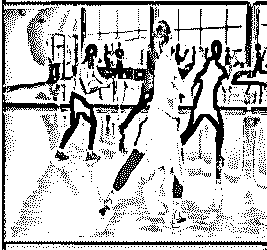

之后

 **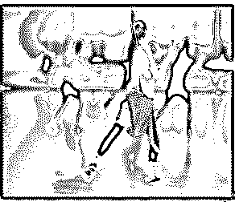

### 结论

那么你对这篇文章中的学习模糊效应有什么看法呢？我认为你学习这个主题的经验是很好的，现在你可以用你的图像做这件事，非常有趣和精确。使用模糊选项并分析其参数以获得更好的效果。

### 推荐文章

这是 GIMP 中模糊效果的指南。这里我们讨论一下介绍以及如何在 GIMP 中创建模糊效果？.您也可以浏览我们的其他相关文章，了解更多信息——

1.  [Illustrator 中的图章效果](https://www.educba.com/stamp-effect-in-illustrator/)
2.  [Illustrator 中的金属效果](https://www.educba.com/metal-effect-in-illustrator/)
3.  [Photoshop 中的鱼眼效果](https://www.educba.com/fisheye-effect-in-photoshop/)
4.  [Photoshop 中的发光效果](https://www.educba.com/glow-effects-in-photoshop/)

**