# GIMP 更改背景颜色

> 原文：<https://www.educba.com/gimp-change-background-color/>

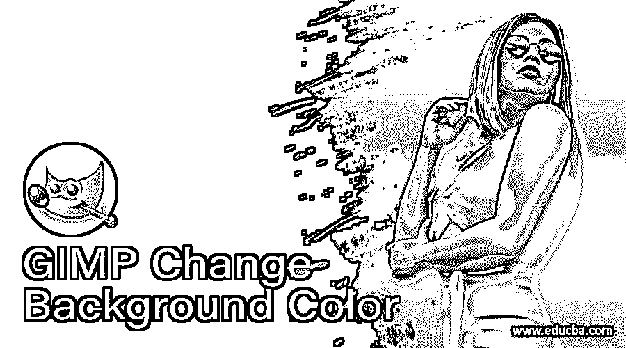

## GIMP 改变背景颜色简介

在这篇文章中，我们将学习如何在 GIMP 中改变背景颜色。你需要改变背景的原因有很多。就像你想把一个主题放到另一个图像中，或者你想把现有的自然背景改变成更具图形或矢量类型的背景。改变背景的主要目的是保持图像的真实性，我们将在这篇文章中讨论如何使用图层蒙版、酷炫效果和一些调整。改变背景的另一个用途是在主体和背景之间带来更多的对比。

<small>3D 动画、建模、仿真、游戏开发&其他</small>

第一步:首先，我们需要一些库存图片，你可以从任何库存图片网站如 Unsplash 或 pixels 下载。

**步骤 2:** 让我们从打开一张图片开始，进入文件菜单，然后打开或按 Ctrl + O

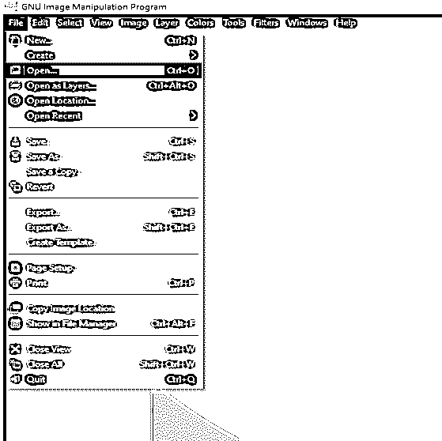

**步骤 3:** 然后导航到下载的图像并在 GIMP 中打开

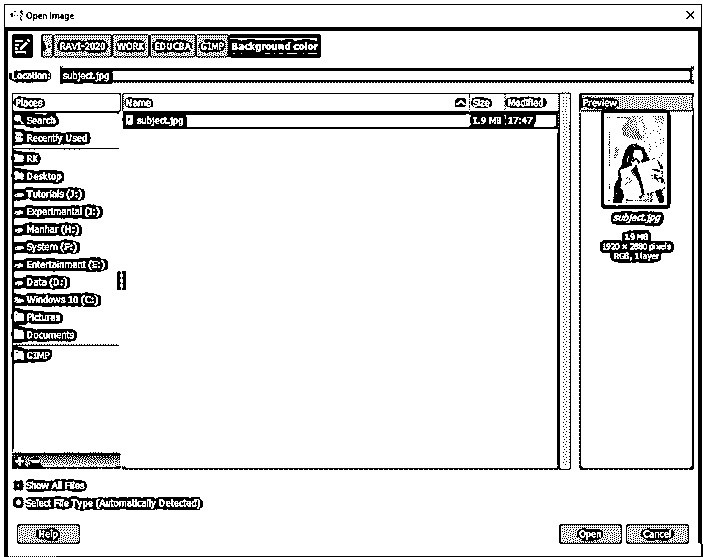

**步骤 4:** 如果要求转换到 RGB 工作空间，则转换。在这种情况下，这个图像已经嵌入了一个颜色配置文件，它将被映射到 GIMP 内置的 sRGB 空间。

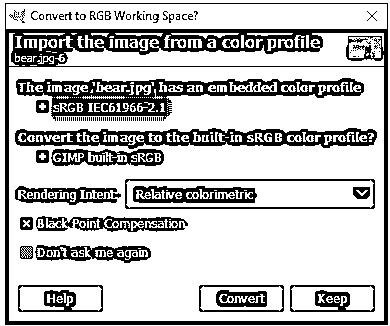

打开图像后，我们要做的是去除背景。首先，我们将添加一个阿尔法通道来增加一些透明度。

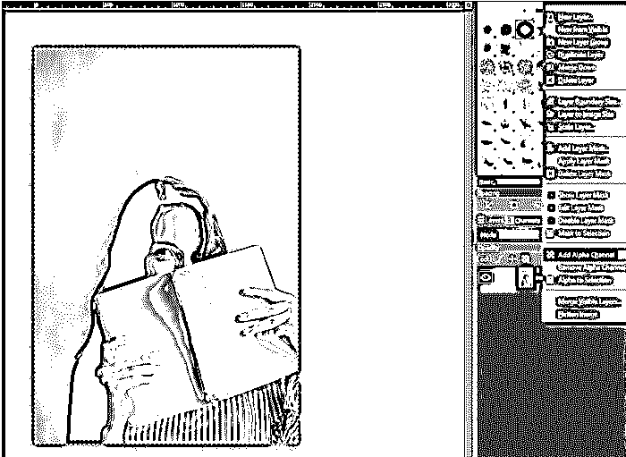

第六步:然后使用前景选择工具，确保羽化边缘是打开的，并有一定的半径，这有助于物体相互融合。现在给你的主体画一个粗略的轮廓，这是我们的前景，它将帮助我们把它从背景中分离出来。

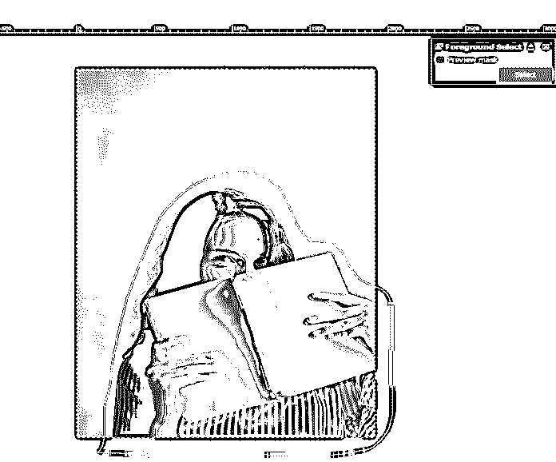

**第七步:**现在我们可以改变笔刷的大小和绘制模式来绘制前景。然后粗略地画出主题，它不需要完美。如果图画是蓝色的，那么你可能不小心选择了背景，所以确保选择了前景模式。然后，确保引擎是马丁莱文和水平和积极的水平设置如图所示，一旦你准备好按下回车键，你会看到算法计算像素分离前景和背景。

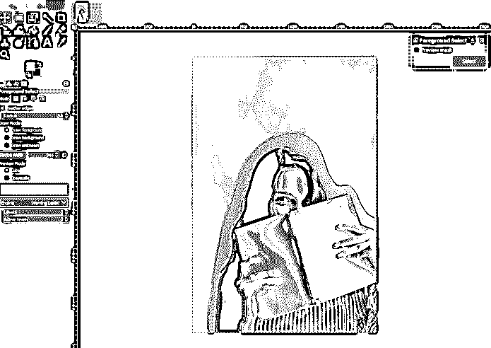

第八步:这个算法已经做得相当不错了，但是还有一些地方我们可以进一步改进。

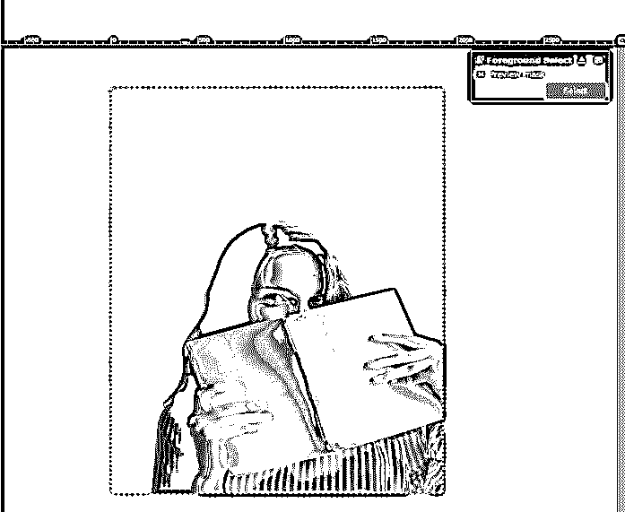

**第九步:**你可以缩放并画出你想要包含在前景中的主体区域。选区可以在下一步清理，所以不要担心使它完美。然后按回车键进行选择。

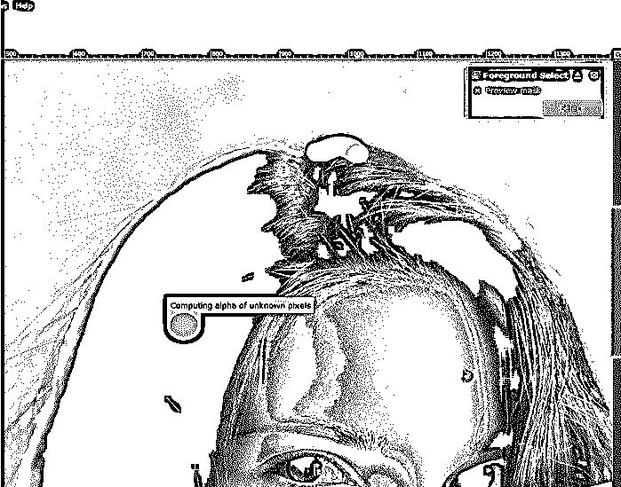

**步骤 10:** 现在去你的路径面板，如果它没有打开，然后从窗口- >可停靠对话框>路径中打开它。然后在“路径”面板的底部会有一个“选区路径”按钮，单击它可以从选区创建一个路径。

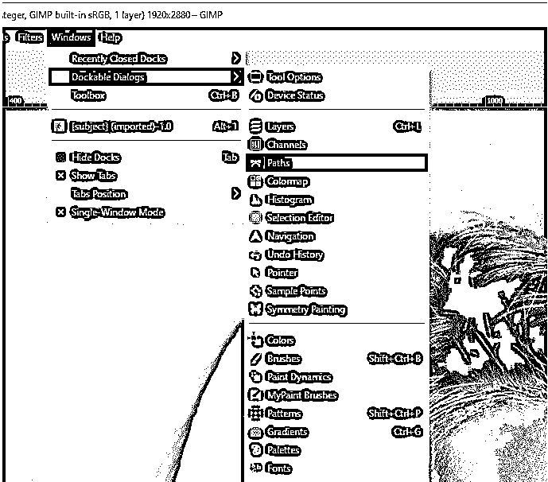

**步骤 11:** 现在在路径面板中做了一个选择，然后通过按 Ctrl + Shift + A 取消选择。然后使路径在路径面板中可见，这样你就可以用路径工具选择它。

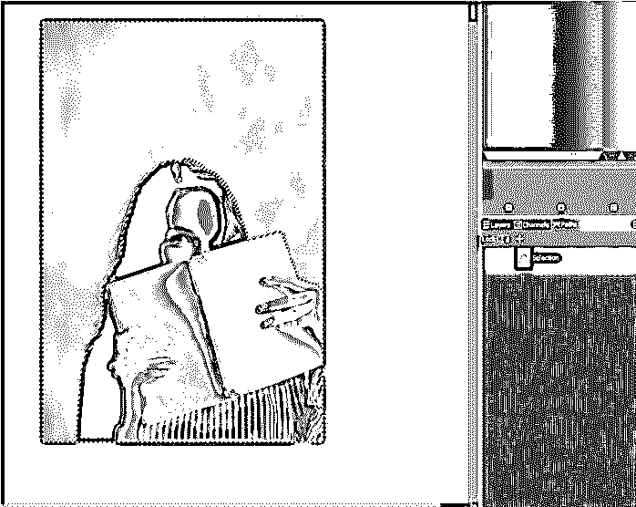

**步骤 12:** 现在使用路径工具或按 B 键，然后选择路径，当光标悬停在所选路径上方时，该路径将由手形图标指示。您可以看到选择需要多少个节点。

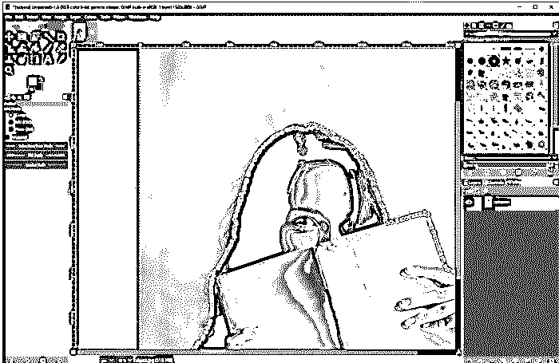

**步骤 13:** 一旦选择了路径，你可以通过拖动节点进行一些微调。如果您单击 ctrl 并拖动该点，它将创建一个手柄。如果您单击 ctrl 并单击线段，将会创建一个节点。

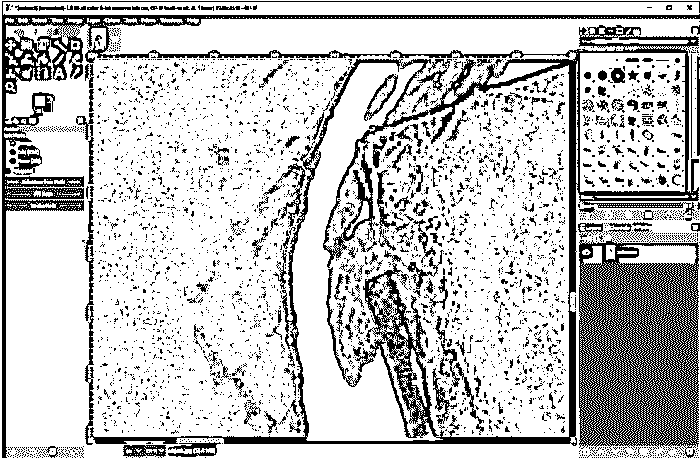

**步骤 14:** 然后添加图层蒙版。

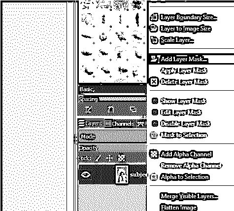

**第十五步:**将其初始化为选择并添加。

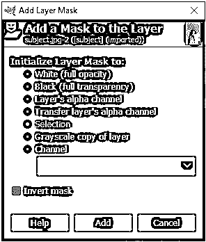

步骤 16: 现在我们可以隐藏路径了。

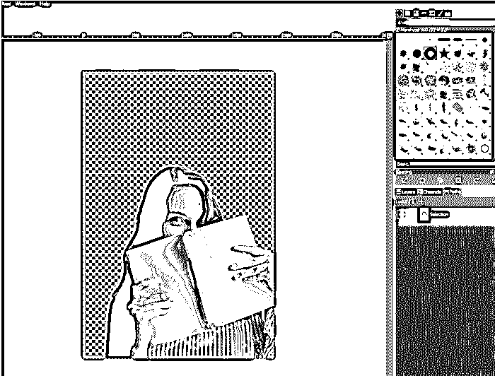

**步骤 17:** 然后确保背景色和前景色设置为默认值，然后使用画笔工具进行绘制。黑色会隐藏，白色会显露。确保降低刷子硬度。

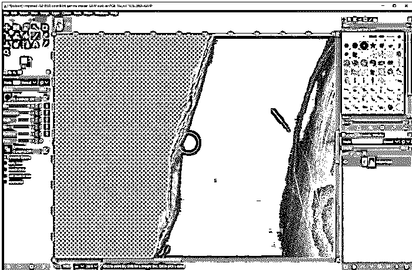

步骤 18: 然后我们将在图层面板中创建一个新图层，并把它拖到第一个图层的下面。

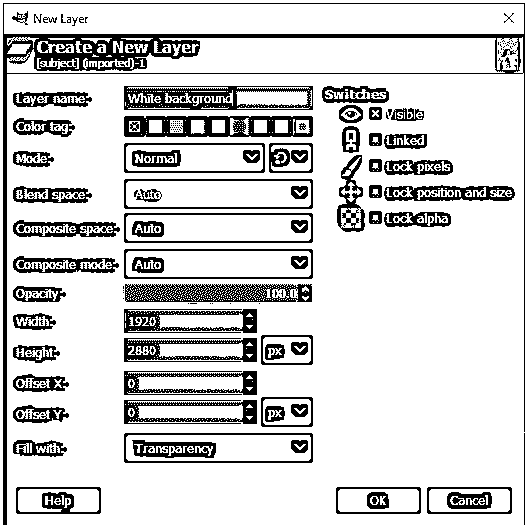

**步骤 19:** 然后用任意两种颜色创建径向渐变。通过使用渐变工具，您还可以交换颜色。根据需要调整渐变。

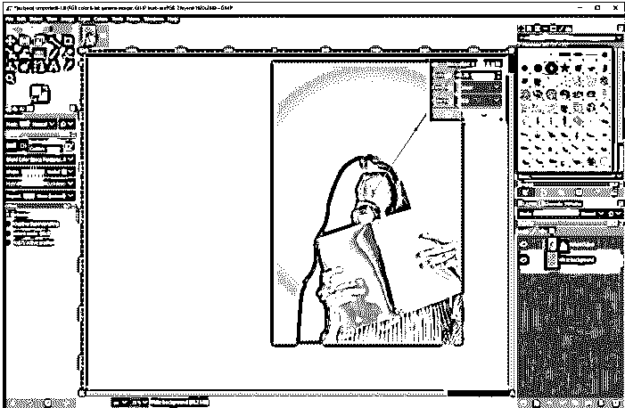

步骤 20: 接下来我们改变渐变中的一种颜色。

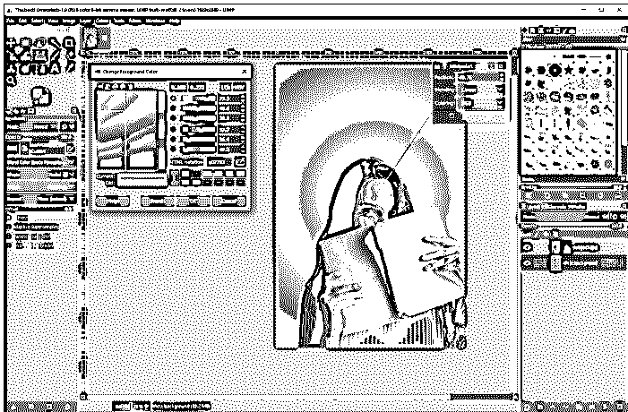

第 21 步:我们还可以添加一些阴影来创建一个逼真的效果。首先，我们将转到路径面板并选择选择，然后单击路径到选择，这将为我们提供主题选择。

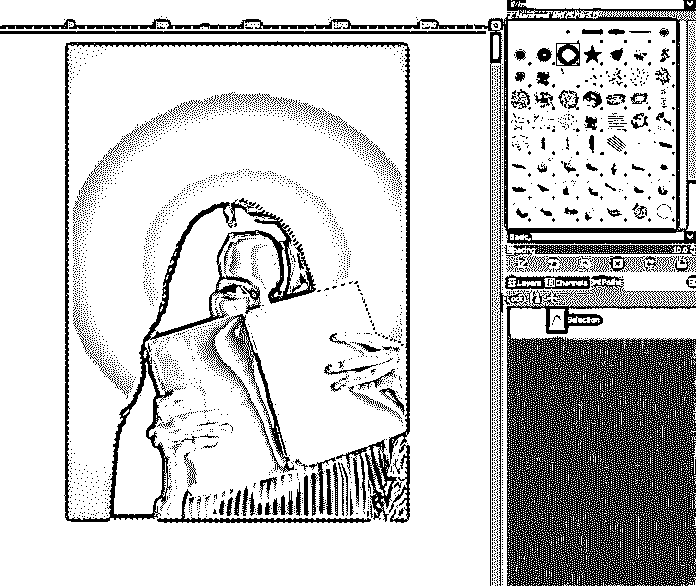

步骤 22: 然后给阴影新建一层。

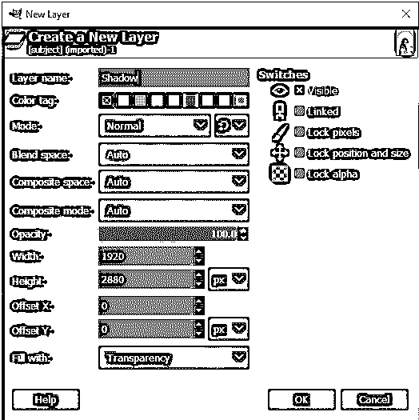

步骤 23: 现在将阴影放在主图层上，切换到桶填充工具，或者按 Shift + B，填充黑色，同时确保前景是黑色的，然后用 Ctrl + Shift + A 取消选择。

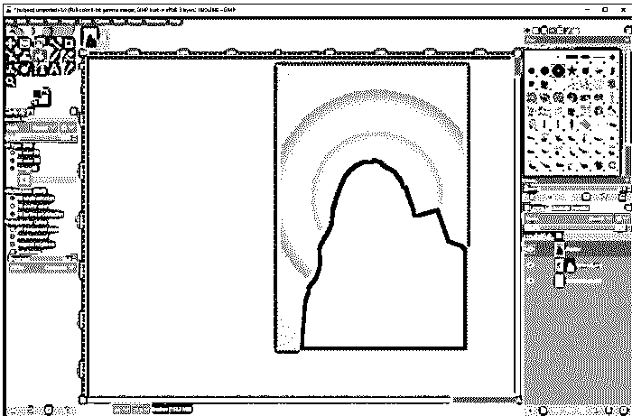

**步骤 24:** 然后用移动工具偏移一点然后拖动阴影层到主层下面。然后我们将使用高斯模糊让它看起来更真实。

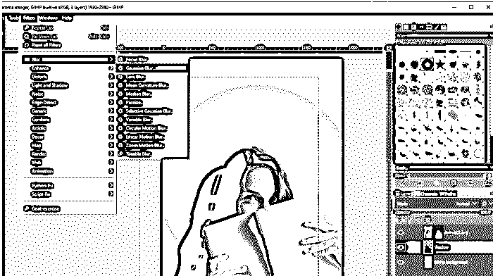

**步骤 25:** 设置 x 和 y 的模糊程度。

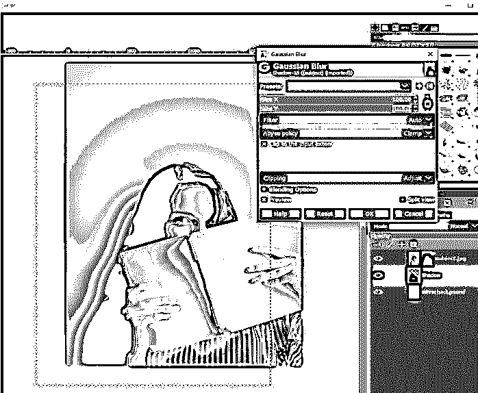

**步骤 26:** 你还可以缩放阴影使其远离主体，降低阴影层的不透明度使其看起来逼真。

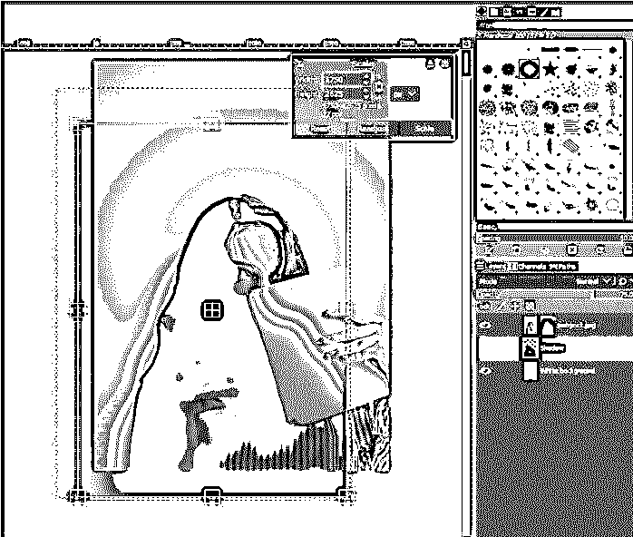

现在我们可以使用减淡/加深工具来混合阴影和主体。首先，在较暗的一侧使用加深工具，然后如果需要，可以使用减淡工具来突出显示。

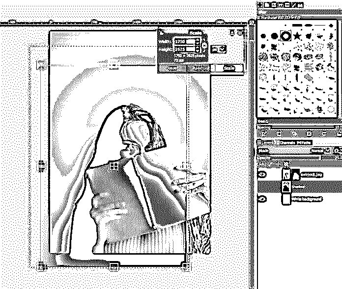

**第 28 步:**最后从文件菜单中导出。

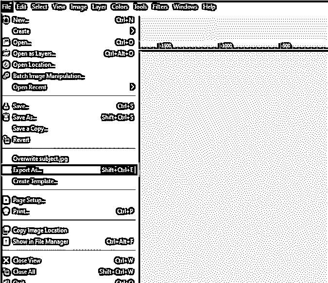

**第 29 步:**这是完成的艺术品，可以明显地进一步改进，但技术将保持不变。

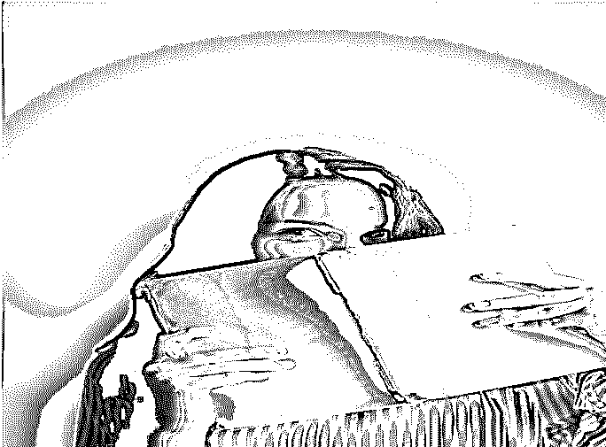

### 结论

在本文中，我们学习了如何在 GIMP 中改变背景颜色。首先，我们已经看到了如何使用前景选择工具来选择主题，然后我们看到了遮罩，然后改变背景，这是基本的步骤，除此之外，你可以添加阴影和一些更巧妙的模糊，以获得主题与背景的真实融合。

### 推荐文章

这是一个 GIMP 改变背景颜色的指南。这里我们讨论应用 GIMP 改变背景颜色的介绍和各个步骤。您也可以浏览我们的其他相关文章，了解更多信息——

1.  [在 Illustrator 中更改背景颜色](https://www.educba.com/change-background-color-in-illustrator/)
2.  [如何在 Illustrator 中更改画板尺寸？](https://www.educba.com/how-to-change-artboard-size-in-illustrator/)
3.  [Photoshop 中的模板](https://www.educba.com/templates-in-photoshop/)
4.  [Photoshop 阳光效果](https://www.educba.com/photoshop-sun-effect/)

