# GIMP 作物

> 原文：<https://www.educba.com/gimp-crop/>

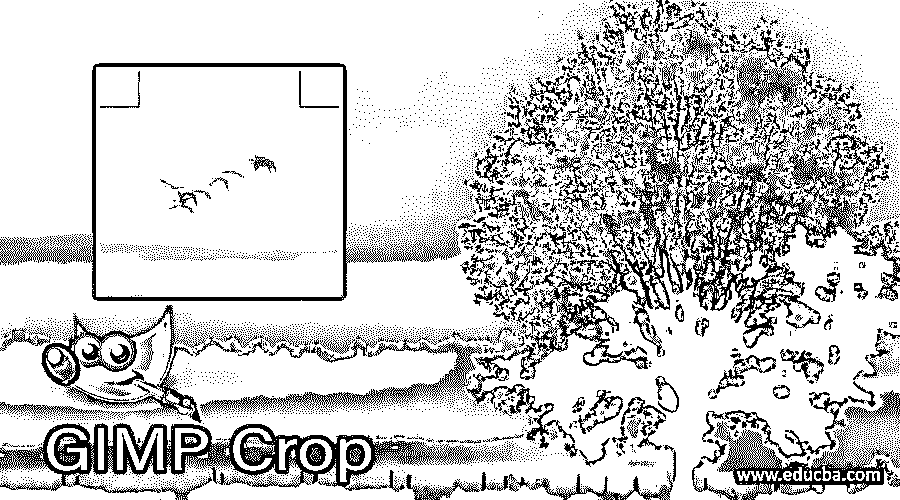

## GIMP Crop 简介

裁剪用于通过使用 GIMP 的裁剪工具从任何图像中剪切您想要的区域或从图像中删除不需要的区域，或者我们也可以通过使用 GIMP 软件菜单栏的不同菜单中的一些选项来裁剪该区域。我们需要裁剪我们的图像，因为大多数时候，我们在拍摄图像时没有得到我们想要的视角，或者可能有一些其他的小错误。我们也可以使用裁剪工具在 GIMP 中对图像进行其他操作。让我们来看看裁剪工具的这些特性和参数。

### GIMP 里怎么做 Crop？

我们可以在 gimp 中通过使用裁剪工具以及菜单栏中图像菜单的一些选项来进行裁剪。我们将在本文中逐一了解这两者。因此，为了开始我们的学习，让我们有一个我们想要根据我们来裁剪的图像。

<small>3D 动画、建模、仿真、游戏开发&其他</small>

要在 gimp 中打开一个图像，进入菜单栏的文件菜单，它在用户屏幕的顶部，点击它。点击向下滚动列表的打开选项，或者按 Ctrl + O 作为快捷键。

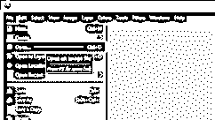

现在选择你想要的图像，你想从这个对话框中裁剪，一旦你选择了它，点击打开按钮。

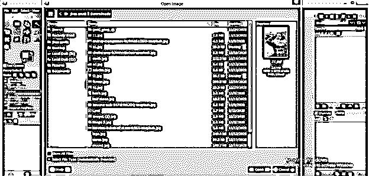

我会选择这个漂亮的模特形象。您可以在 gimp 的工具面板中用这个图标来标识裁剪工具，它位于用户屏幕的左侧。您也可以按 Shift + C 作为此工具的快捷键。

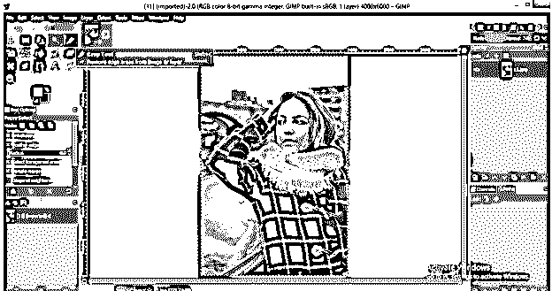

现在转到显示窗口区域中的图像，像这样拖动裁剪工具的鼠标光标，并选择您想要裁剪的区域。

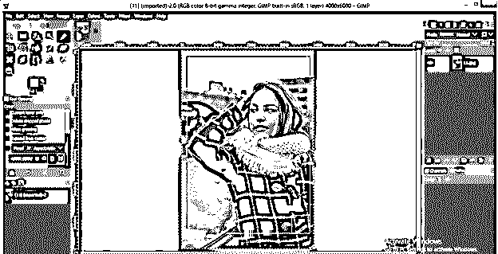

拖动此选择框后释放鼠标按钮时，此框之外的区域将变得不太可见或具有较小的不透明度值，并且在裁剪后将被删除。

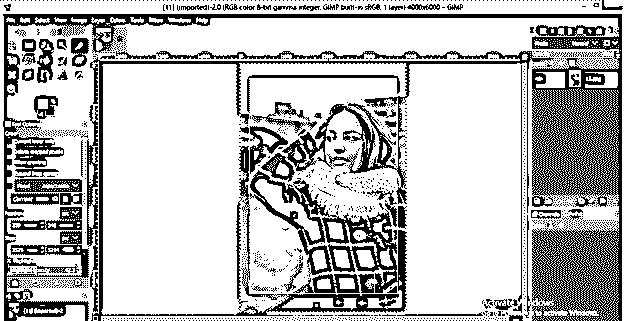

点击键盘上的回车键来应用裁剪，它会像这样裁剪你选择的区域。

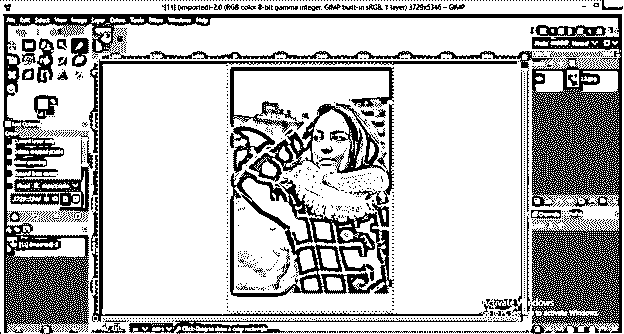

现在，让我们了解裁剪工具的参数，以便更好地了解该工具。这是这个工具的一些参数。

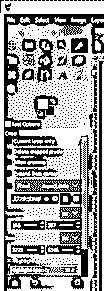

为了学习第一个参数，让我们创建一个新的层。创建一个新层，点击层面板的新建按钮。

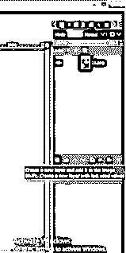

创建一个用任何颜色填充的图层。我将用白色填充它。

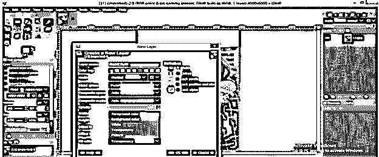

转到图层面板，并把它放在下面的图像层。

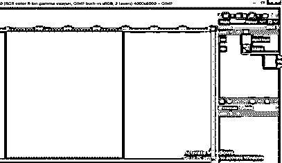

现在用裁剪工具裁剪这张图片，你会注意到图层面板的所有图层都将在一次点击中被裁剪掉。

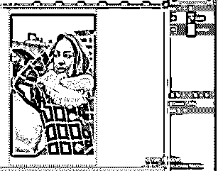

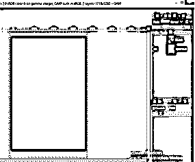

但是如果你不想用你选择的层来裁剪其他层，那么在这个工具的参数部分启用“仅当前层”选项。

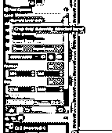

现在，这一次，它只裁剪你选择的层像这样。你可以看到下面的层没有被裁剪到图像层下面，填充颜色为白色。

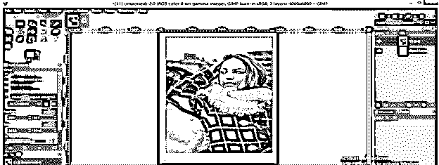

现在让我们转到参数部分的另一个选项，即“删除裁剪像素”，这意味着它将在裁剪图像后删除画布的额外区域。

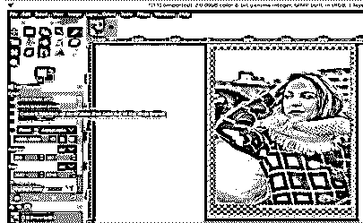

现在通过启用此选项再次裁剪此图像，这样裁剪后会删除多余的空间。

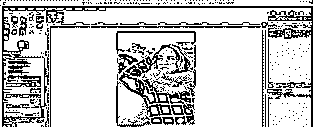

现在启用下一个选项，“允许增长”，看看它对你的形象的魔力。

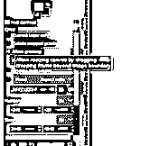

使用裁剪工具进行选择，通过启用此选项，您将根据您的选择在图像区域之外增加一个画布区域。

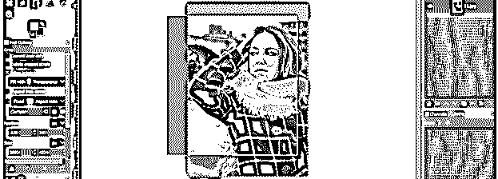

点击键盘上的回车键查看其效果。在图像的左侧添加了一个额外的画布区域。为了充分利用它，你可以用任何颜色或图案填充它。

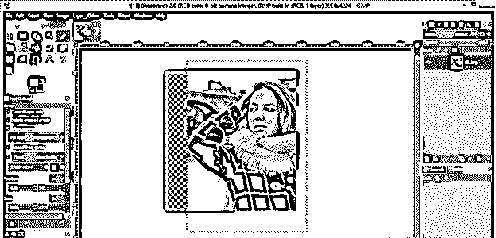

下一个选项是你想要的裁剪选择框的大小，用来裁剪你想要的图像大小。请从列表中选择大小选项并启用它。

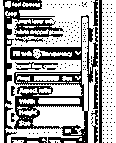

并根据您的要求给出尺寸值。我将 2000 x 2000 像素作为裁剪工具选择框的大小值，并得到这次裁剪工具选择框的准确大小。

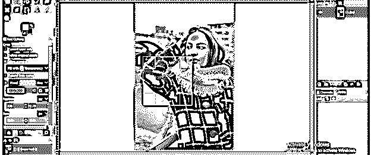

从“突出显示不透明度”选项中，您可以通过增加或减少滑块上的值来增加或减少裁剪工具选择框以外区域的不透明度。

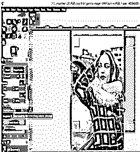

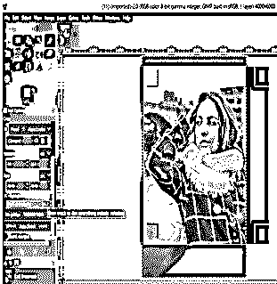

如果需要，您也可以在裁剪工具的选择框上设置参考线。您可以从该列表中选择任何类型的指南。例如，如果我选择中心线，它将在选择框的中心给出水平线和垂直线。

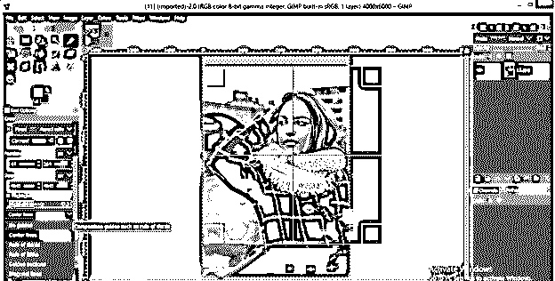

现在让我们分析一些菜单栏的图像菜单的裁剪选项。为此，首先，让我们增加画布的大小。为此，进入图像菜单，点击下拉列表中的画布大小选项。

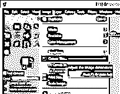

将画布的尺寸增加到比图片大一点，点击这个框的调整大小按钮。

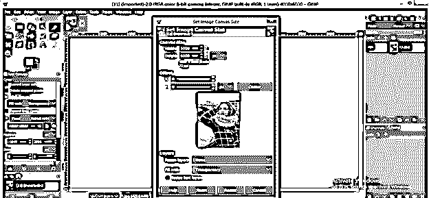

现在再次进入图像菜单，这次点击菜单下拉列表中的“裁剪到内容”选项。

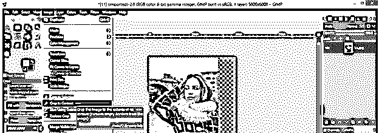

它会根据你的图像大小来裁剪你的画布。

现在用矩形选择工具选择图像上的任何区域，就像这样。

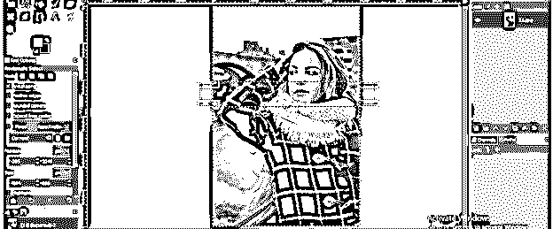

点击键盘上的删除键来删除所选区域。

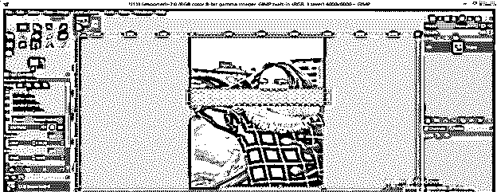

取消选择选择菜单中的“无”选项，现在再次进入图像菜单，然后单击下拉列表中的“积极裁剪”选项。

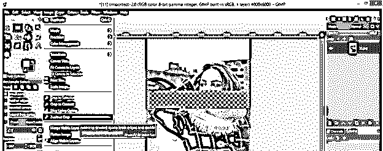

它会像这样把图像的两个独立部分连接起来。

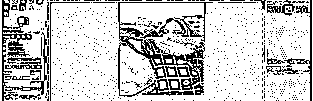

转到选择菜单，点击下拉列表中的“无”选项，禁用选择框周围的选择，它看起来就像一个图像。

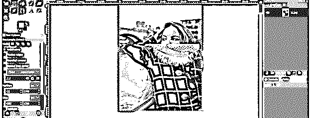

这些都是 gimp 的裁剪工具的重要参数和特性。

### 结论

在今天的这篇文章中，我们讨论了裁剪工具的一些重要方面，现在您可以很容易地理解它的机制，以便很好地掌握它。您可以开始使用 gimp 的这个工具来简化您的图像处理工作。

### 推荐文章

这是一个 GIMP 作物指南。这里我们讨论裁剪工具的重要方面，你可以很容易地理解它的机制。您也可以看看以下文章，了解更多信息–

1.  [GIMP 替代方案](https://www.educba.com/gimp-alternatives/)
2.  [最佳照片编辑](https://www.educba.com/best-photo-editors/)
3.  [3ds Max 室内设计](https://www.educba.com/3ds-max-interior-design/)
4.  [用 HTML 设计网页](https://www.educba.com/design-web-page-in-html/)

