# GIMP 过滤器

> 原文：<https://www.educba.com/gimp-filters/>

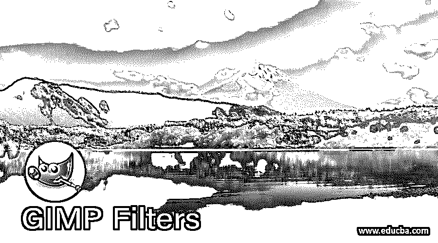

## GIMP 过滤器简介

滤镜是带有一些可编辑数据的预设计效果，有助于 gimp 软件的图像处理和图像编辑工作，您可以在该软件中对图像或几何形状或文本使用滤镜。我们在 gimp 中有几个滤镜，不同的效果，不同的用途。我们有投影滤镜、长阴影滤镜、新打印滤镜等等，我们将在本文中讨论。您可以在菜单栏的“过滤器”菜单中找到过滤器。所以让我们分析一下 gimp 的一些最常用的过滤器。

### 如何在 gimp 中使用过滤器？

您可以在菜单栏的过滤器菜单中找到过滤器，该菜单位于用户屏幕的顶部。列表滤镜菜单里有很多滤镜，列表的每个滤镜都有几个滤镜效果。因此，首先，让我们为此创建一个新文档或新图像。进入菜单栏的文件菜单，点击下拉列表的新选项，或者按键盘上的 Ctrl + N 键作为快捷键。

<small>3D 动画、建模、仿真、游戏开发&其他</small>

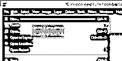

现在，在“创建新图像”对话框中设置新图像的所需参数，并点击该对话框的“确定”按钮。

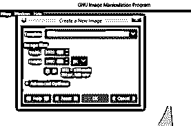

现在转到菜单栏的过滤器菜单并点击它。这是这个菜单的下拉列表中 gimp 的过滤器数量列表。

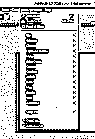

现在转到 gimp 的工具面板，它在工作屏幕的左边，从这里拿走文本工具或者按下键盘的 T 键作为它的快捷键。

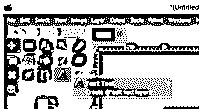

并在文档区域输入您想要的文本。我会键入 EDUCBA，这是我们的正式名称。你可以选择你想要的字体风格。

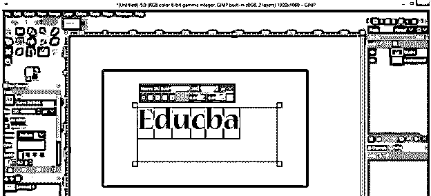

现在点击文本工具的颜色框，在文档区域，改变文本的颜色，从“改变所选文本的颜色”框中选择白色，点击“确定”按钮。

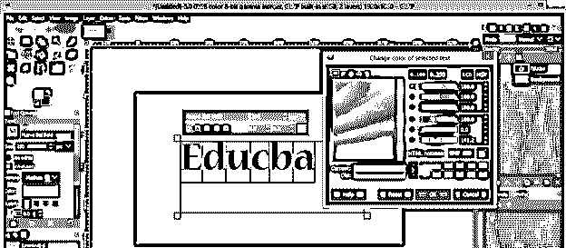

现在转到菜单栏的滤镜菜单，然后转到“光影”滤镜或向下滚动列表，然后选择“投影”滤镜效果的新的向下滚动列表。

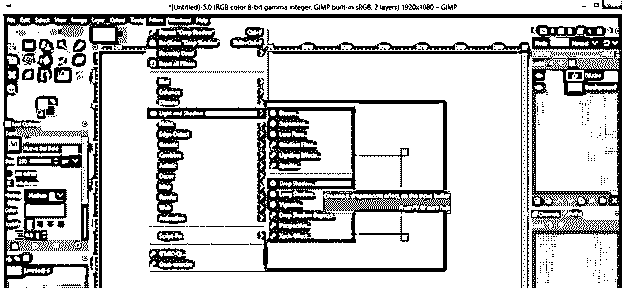

你的文字后面会有这样的阴影。

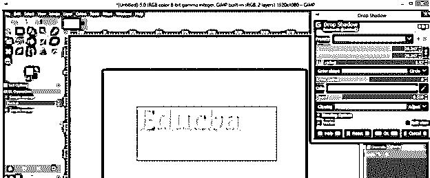

您可以通过此投影参数框更改阴影。

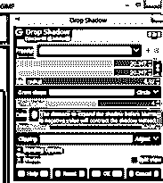

通过更改此对话框的“不透明度”选项的值，可以增加阴影的强度。

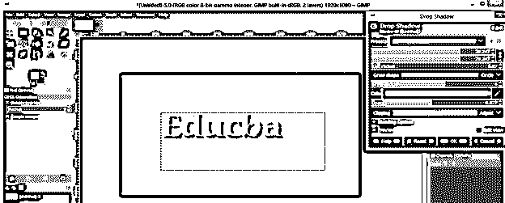

您也可以通过更改此对话框颜色框的颜色来更改阴影的颜色。只需点击颜色选项的颜色框，从“颜色”对话框中选择您想要的颜色，然后点击“确定”按钮。

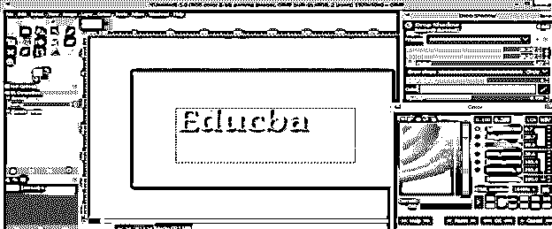

现在让我们将一个过滤器应用于任何图像。所以为了在 gimp 中有一个图像，点击菜单栏的文件菜单，然后点击向下滚动列表的打开选项。

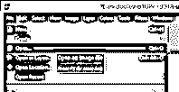

然后从这个对话框中选择您想要的图像。一旦你选择了你想要的图像，然后点击这个盒子的打开按钮。

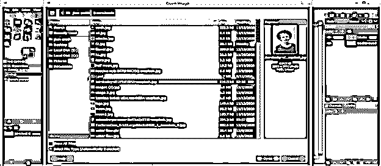

我会像这样删除这个图像的背景。如果你不知道如何在 gimp 中删除背景，你可以阅读我们的文章“删除背景”

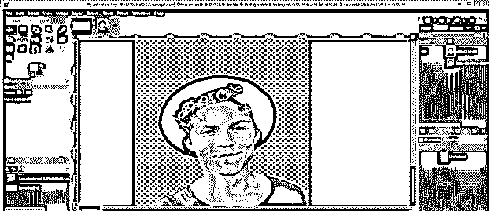

现在点击图层面板的创建新图层按钮来创建一个新图层。我有一个前景色填充层。根据你的图像对象，你可以为你的层选择任何颜色。现在点击这个框的 Ok 按钮。

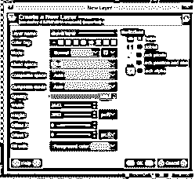

在 gimp 的图层面板中，把你创建的图层放在这个家伙的图片下面。

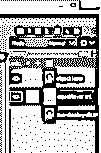

现在，再次进入滤镜菜单的光影滤镜，在光影滤镜下拉列表中选择长影滤镜。您也可以将投影滤镜应用到此图像。

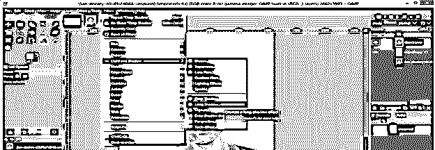

首先，在长影对话框的颜色框选项中改变长影的颜色。

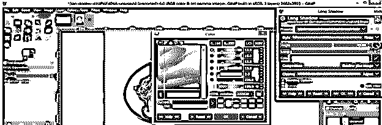

你会在这个人的背后看到这种类型的阴影效果。

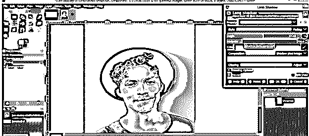

改变阴影的角度，得到一个漂亮的阴影效果，就像这样。

您可以从该对话框的合成选项列表中选择任何一个选项。如果你选择“仅阴影图像”选项，它将只给你图像的阴影。

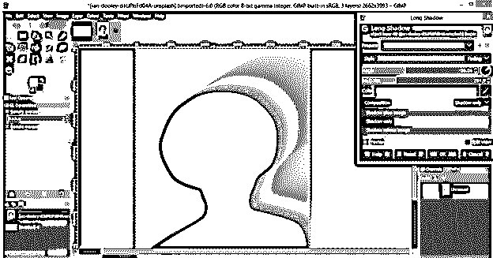

如果你选择'阴影减去图像'选项，那么它将删除主图像，阴影将保持这样。你可以用自己的想法玩这些东西。

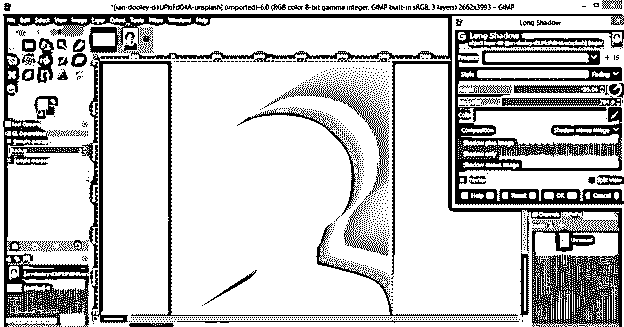

现在让我们理解另一个过滤器，它是扭曲的。所以去扭曲过滤器，然后点击镜头扭曲的下拉列表中的这个过滤器。

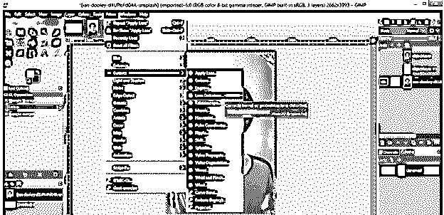

你的图像会有一个镜头效果，你可以改变这个滤镜的参数来得到好的效果。

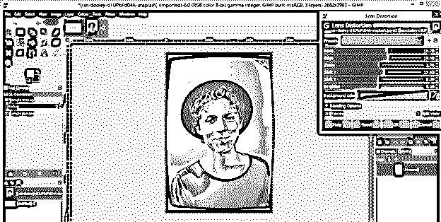

下一个过滤器是新闻纸，你也可以在扭曲过滤器列表中找到。

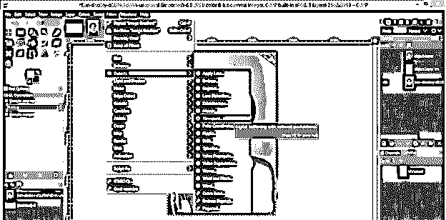

一旦你把这个滤镜应用到你的图像上，它会给你的图像一个报纸印刷的效果。这意味着图像看起来像是由像素构成的。

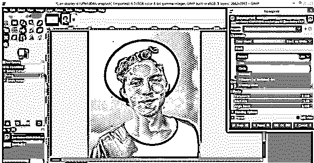

默认情况下，此滤镜会给你一个黑白效果，但是你也可以使用 RGB、CMYK 模式，所以如果你从列表中选择 RGB 颜色模式。

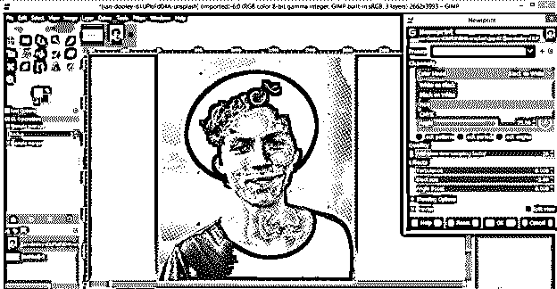

那么你就会有这种效果。实际上，不同颜色模式的效果会根据您的图像而变化。在我的图像上，我用 RGB 模式实现了这个效果。

如果我从列表中选择 CMYK 颜色模式。

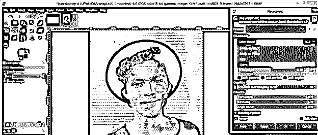

然后它会给出这种类型的效果。因此，根据您的图像或要求，您可以选择列表中的任何颜色模式。

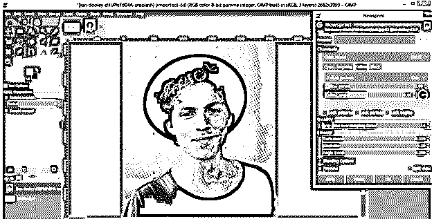

gimp 中有更多的过滤器；你可以通过每一个过滤器来了解他们。

### 结论

在这里，我们讨论了 gimp 的一些重要过滤器，现在你可以很好地了解什么是过滤器？以及如何使用过滤器菜单列表中不同过滤器的参数，在图像处理和图像编辑工作中获得创造性工作。

### 推荐文章

这是 GIMP 过滤器指南。这里我们讨论了 gimp 的重要过滤器，现在你可以很好的了解什么是过滤器了？.您也可以看看以下文章，了解更多信息–

1.  [GIMP 替代方案](https://www.educba.com/gimp-alternatives/)
2.  [CorelDRAW 标志设计](https://www.educba.com/coreldraw-logo-design/)
3.  [Photoshop 金色渐变](https://www.educba.com/photoshop-gold-gradient/)
4.  [Illustrator 中的平滑工具](https://www.educba.com/smooth-tool-in-illustrator/)

