# GIMP GMIC

> 原文：<https://www.educba.com/gimp-gmic/>

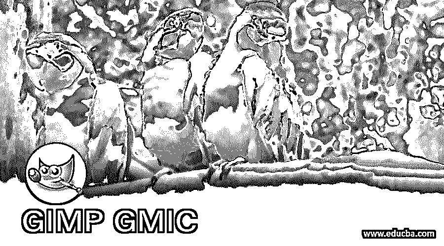

## GIMP GMIC 简介

GMIC 是插件软件，作为 GIMP 的附加软件。它有许多预先设计的过滤器，二维和三维形状的过滤器，用于在您的作品中添加它们，通过它们我们可以进行不同类型的图像处理工作。你可以在 gimc 插件中的过滤器中找到不同类型的阵列和平铺结构；你也可以将你的图像转换成黑白形式，并调整其中的红、蓝、绿颜色值。和这些事情一样，我们可以通过在这个软件中使用 gmic 插件做更多的事情。今天在这篇文章中，我们将了解 gmic 插件的一些重要特性，以便对它有一个好的了解。

### 如何在 GIMP 中安装和使用 GMIC？

GMIC 是一个插件软件，用于在 gimp 中对预置数据进行不同类型的操作。你可以从网上下载这个插件到你的个人电脑上。只需在任何浏览器上搜索 gmic，点击打开第一个链接。

<small>3D 动画、建模、仿真、游戏开发&其他</small>

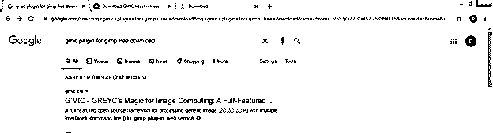

转到该页面的下载选项卡并单击它。

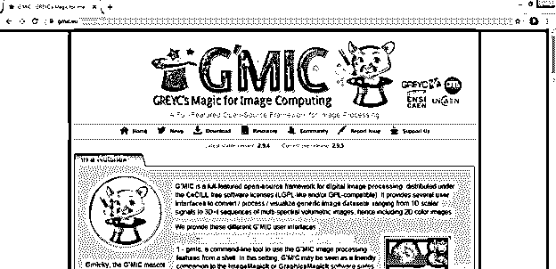

根据您计算机的兼容性，单击任何一个给定的链接。

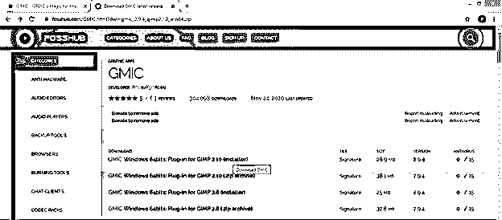

将 gmic 安装在 GIMP 的 plugin 文件夹中，您可以在 C-drive > Programs files > GIMP 2 > lib > GIMP > 2.0 > plug-in 中找到它。

在你的电脑上安装 gmic 后，重启 GIMP 软件，进入菜单栏的文件菜单，然后点击‘新建’选项。

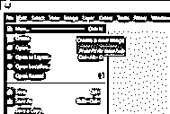

“创建新图像”对话框将会像这样打开。在此对话框的“填充”选项中选择透明度选项，保留其余选项，然后点击此对话框的“确定”按钮。

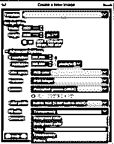

现在转到菜单栏的过滤器菜单，并点击它。进入下拉列表的 G'MIC 选项，这是 gmic 插件软件。只有在您的计算机上安装了此软件后，您才会在此下拉列表中看到此选项。

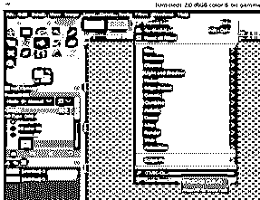

一旦你点击这个选项，一个插件对话框就会像这样打开。

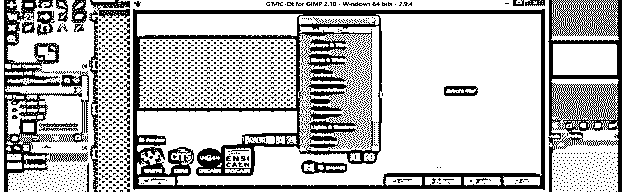

您可以在此对话框中找到许多操作图像的选项。

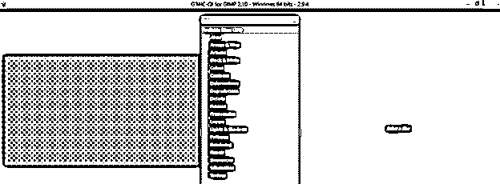

现在点击这个对话框的“渲染”选项的向下箭头。

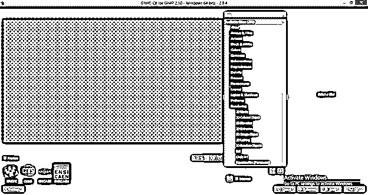

现在点击下拉列表中的树选项，你会看到这种类型的 3d 像一棵树。

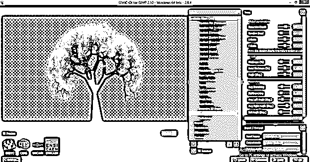

您会注意到在此对话框的右侧有一些此树形状的参数。你可以改变“全局参数”的“递归深度”选项的值来改变树叶的密度和分布，就像这棵树的结构一样。

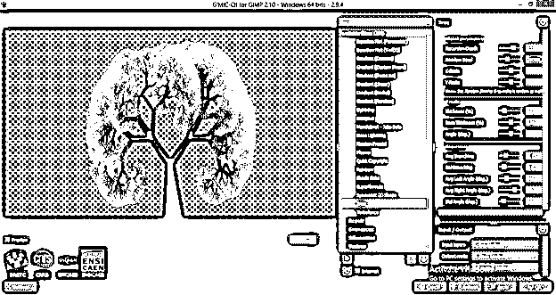

还可以通过更改此对话框中“树干”选项的不同值来增加或减少树干的粗细。

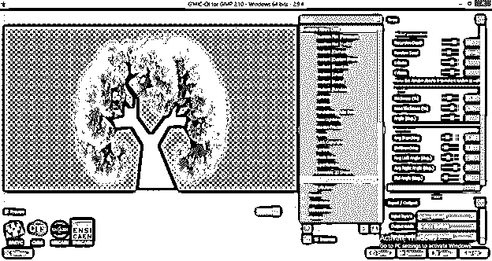

分析这个对话框的每一个参数，根据你的要求设计这个树。

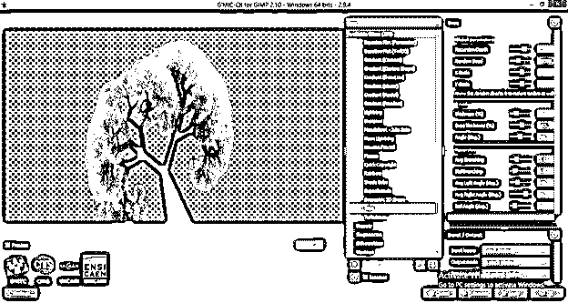

让我们分析一下 ab 镜像上的 gmic 插件。为此，请转到菜单栏的打开菜单并单击它。您将看到“打开图像”对话框。请从该对话框的保存文件夹中选择您想要的图像，并点击该对话框的打开按钮。

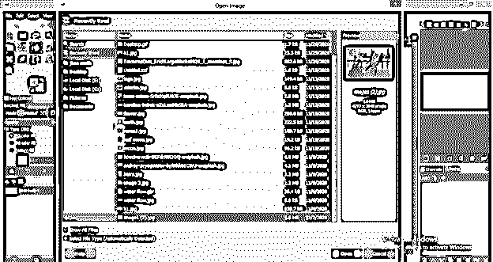

再次进入菜单栏的过滤器菜单，点击该菜单下拉列表中的 gmic 选项。

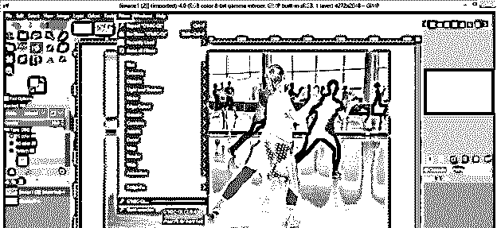

现在您将在这个 gmic 对话框中看到这个图像。

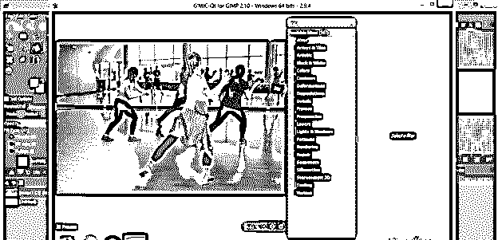

现在点击此对话框过滤器列表中“数组和图块”选项的向下箭头键。然后选择该阵列选项的任何一个子选项。我将点击它的“阵列(常规)”选项，我们将在我们的图像上获得这种类型的效果。它将我们的图像分割成四个窗口，每个窗口都有一个完整的图像。

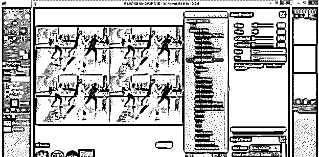

您可以通过更改此对话框的“阵列(常规)”选项的参数值来增加或减少此效果的窗口数量。

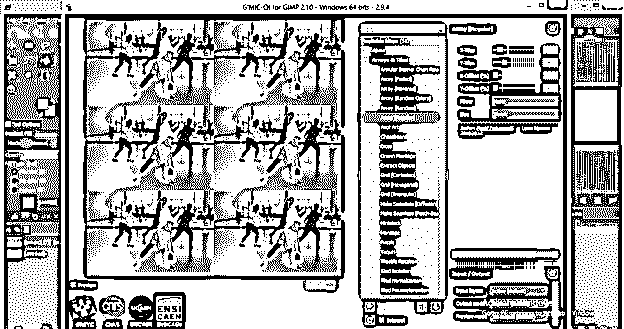

您也可以通过从该对话框的框架过滤器中选择所需的框架来为图像添加框架。我将从这个列表中选择镜架，你可以看到它对我的形象的影响。

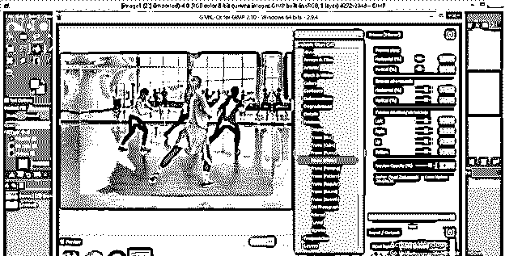

您可以对框架选项的参数进行不同类型的更改，以便对其进行操作。

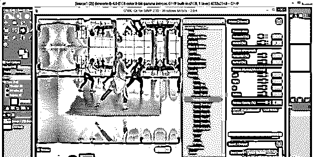

您也可以将此图像转换为黑白比例。为此，只需点击该列表黑白滤镜的下拉箭头键。

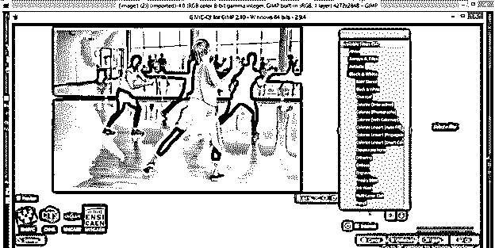

请从黑白滤镜列表中选择您想要的选项，或者您可以逐个点击每个选项来查看它们的效果。我将点击它的黑白选项。

它会给你不同的参数，也与这个黑白过滤器。我可以改变这个图像中红色级别的值并改变这个颜色的平滑度，或者我可以改变绿色级别及其平滑度或蓝色级别。您还可以保持过滤图像的亮度或对比度，因为我们在它的参数中有亮度和对比度选项。

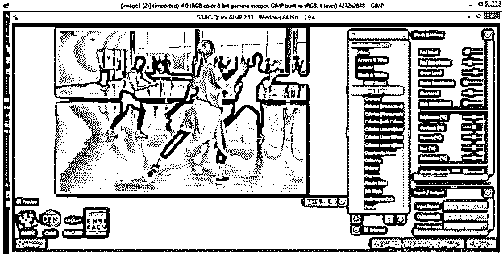

一旦你在你的图像中做了所有你想要的改变，点击这个对话框的应用按钮，在你的图像上应用你用过的滤镜。

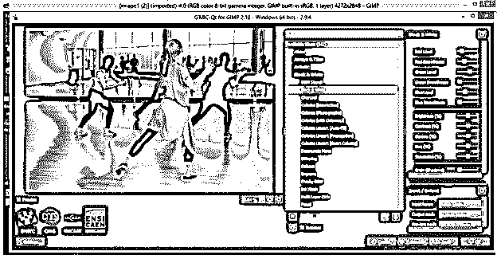

之后，点击确定按钮，准备好你的图像过滤器。如果您不想应用它，您可以单击此对话框的“取消”按钮。

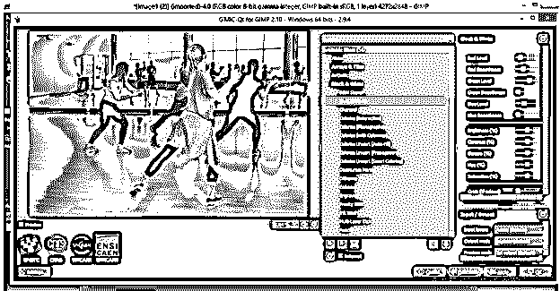

一旦你点击了 Ok 按钮，你的图像就会有这种平滑的滤镜效果，这是你用 GIMP 的 gmic 插件创建的。

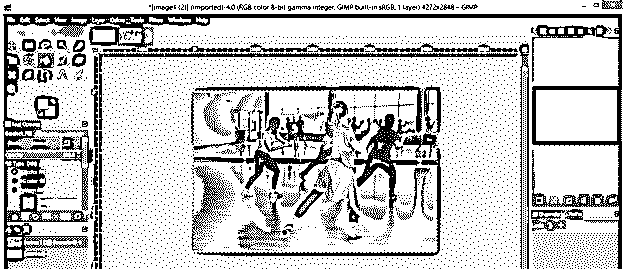

通过这种方式，你可以在 GIMP 中安装这个有效的插件，并在你的图形设计工作中快速流畅地使用它。

### 结论

我现在可以肯定，gmic 对你来说是一个非常熟悉的词，现在你可以很容易地掌握它。我建议你继续分析 gmic 插件的所有参数和其他过滤器，以获得更多的相关知识。

### 推荐文章

这是一个 GIMP GMIC 指南。在这里，我们讨论如何安装和使用 GMIC 在 GIMP 和 gmic 插件的参数和其他过滤器，以获得更多的知识。您也可以看看以下文章，了解更多信息–

1.  [GIMP 替代方案](https://www.educba.com/gimp-alternatives/)
2.  [面向功能的设计](https://www.educba.com/function-oriented-design/)
3.  [Photoshop 中的模板](https://www.educba.com/templates-in-photoshop/)
4.  [孙在插画](https://www.educba.com/sun-in-illustrator/)

