# GIMP 导入图像

> 原文：<https://www.educba.com/gimp-import-image/>

## GIMP 导入映像简介

导入图像是 GIMP 软件的一个过程，通过它您可以将任何图像放置在 GIMP 软件的用户界面上，用于不同类型的图像编辑和图像处理工作。有很多方法可以在 gimp 中导入图像。有些方法非常快速有效。您也可以使用快捷键来使用这些方法。今天在这篇文章中，我们将学习在 gimp 中导入或放置任何图像的所有可能的方法，以及一些必要的参数。所以让我们开始学习吧。

### 如何用不同的方式在 gimp 中导入图像？

在讨论这篇文章的主题之前，我认为你必须对 gimp 软件的用户界面有很好的了解，这样你就可以很容易地理解我们在这篇文章中使用的所有术语。

<small>3D 动画、建模、仿真、游戏开发&其他</small>

在 gimp 用户界面的顶部，有一个菜单栏，里面有很多菜单，比如文件、编辑、选择等等。在这下面，我们在左侧有一个工具面板，在中心有一个显示窗口，我们可以在其中看到我们的工作，在这个窗口的右侧，我们有一个图层面板和一些其他的导入面板。

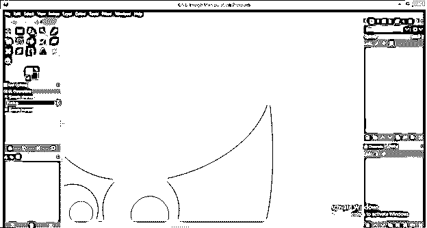

在 gimp 中导入图像的第一个也是最基本的方法是菜单的文件菜单。这里有一个打开选项，您可以通过它打开图像。所以去文件菜单点击它。点击此菜单后，将会打开一个下拉列表。点击打开选项的下拉列表，或者如果你不想去文件菜单，那么你可以按 Ctrl + O 作为这个选项的快捷键。

一旦你点击这个选项，一个名为“打开图像”的对话框将会打开。在这个框中，你会有一个最近打开的 gimp 图片列表；如果您想要任何以前使用过的图像，则从该列表中选择并点击该对话框的打开按钮。

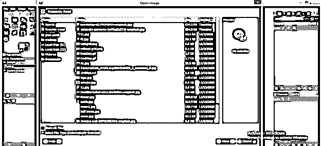

如果您想要打开一个新的图像，那么请转到您在计算机上保存它的位置或文件夹。

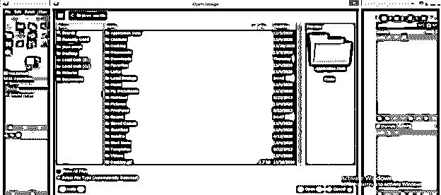

我将点击下载文件夹打开我的图片。对于打开，任何文件夹双击它。

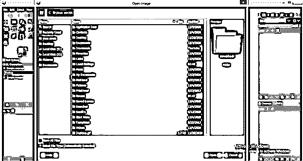

现在从你选择的文件夹的图像列表中选择你想要的图像。我会选择这个 EDUCBA 标志图像，这是我们的官方标志。一旦你选择了，然后点击打开按钮打开这个对话框。

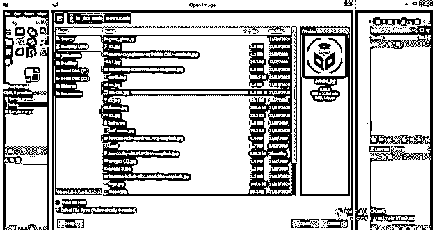

它将导入到 gimps 用户界面的新标签中。

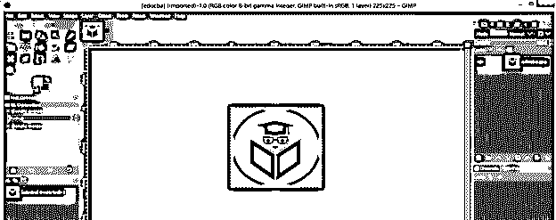

你可以用其他方法来做，就是打开你保存图片的文件夹，用鼠标左键从那里选择图片，不要释放鼠标键，然后把它拖到 gimp 的显示窗口区域，释放鼠标键。

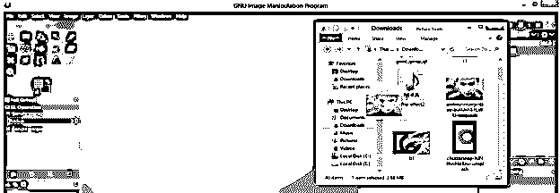

您的图像将在 gimp 的一个新标签上打开，如下所示。

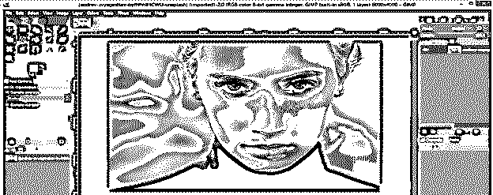

您可以同时打开多个图像。只需按住键盘上的 shift 键从您想要的文件夹中选择图像，并使用相同的拖放方法。

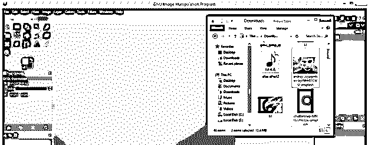

所有的图片都会像这样在不同的标签中打开。我选择了两个图像，所以我在 gimp 中的两个不同的选项卡上打开了两个图像。

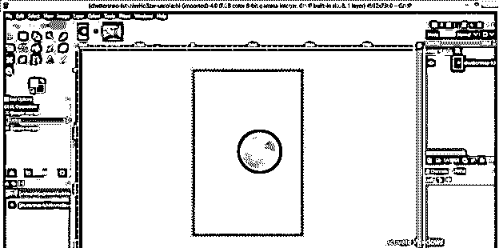

现在，如果已经在 gimp 中打开了一个图像，并且您使用文件菜单的打开选项来导入一个新图像，它将会像这样在一个新的标签中再次打开。

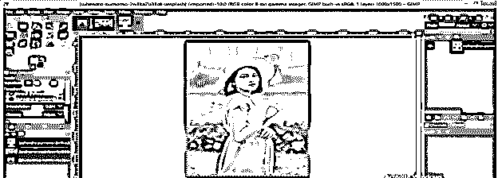

但是如果你用拖放的方法在一个已经打开的图像上拖动一个新的图像，它将会在一个不同的层上打开，但是和这个是同一个标签。

您可以使用缩放工具来调整新打开图像的大小。

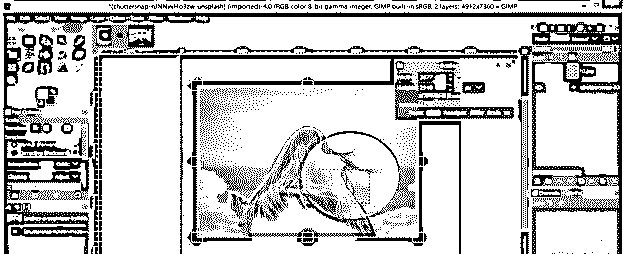

还有一种方法可以打开同一标签层上的任何图像。只要再次进入文件菜单并点击它，然后选择下拉列表中的“打开为层”选项，或者你可以记住快速访问的快捷键是 Ctrl + Alt + O。

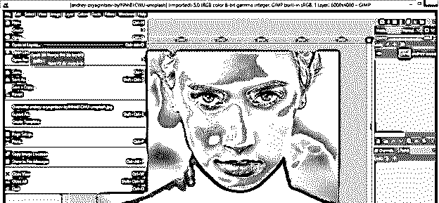

现在，将会打开与打开选项中相同的对话框。请从保存的位置选择您想要的图像，并点击此对话框的打开按钮。

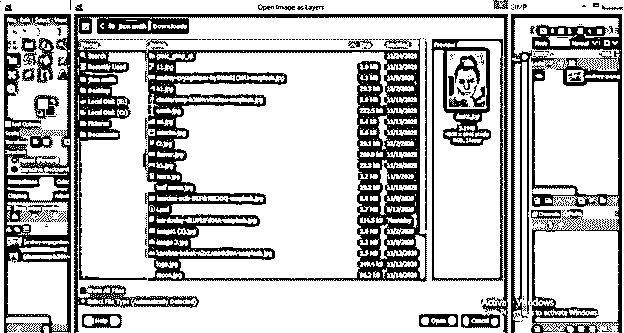

它会像这样打开。你可以缩放它，也可以根据你的需要进行任何操作。

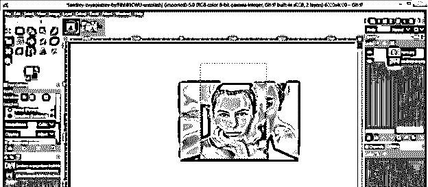

我们还有一种方法可以在 gimp 中导入任何图像。为此，只需转到您的计算机中有您的图像的文件夹并打开该文件夹，然后通过单击选择您想要的图像并右键单击它。将打开一个弹出列表。转到该列表的“打开方式”选项，并从“新建”下拉列表中选择 GIMP。

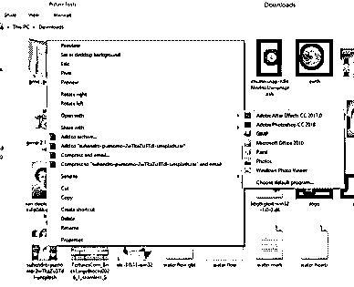

如果你能看到 GIMP 选项，点击“选择默认程序”选项来获得所有能打开图像的软件，在那里你也能找到 GIMP。

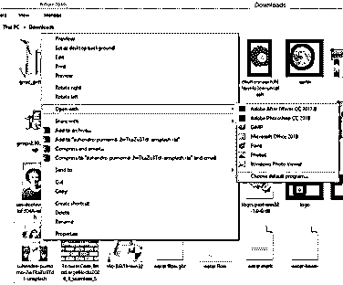

它将在 gimp 的一个新选项卡上打开，就像我们在前面的选项中所做的那样。

如果你想打开你最近使用过的 gimp 图像，那么再次进入菜单栏的文件菜单并点击它，然后进入这个菜单的下拉列表的‘打开最近的’选项。一旦你打开这个选项，它会显示你最近打开或使用过的所有 gimp 图像。你只需用鼠标点击你想要的图像。

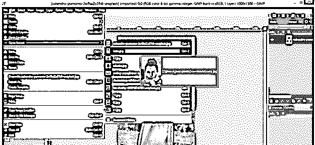

它会像这样在 gimp 的新标签页中打开。

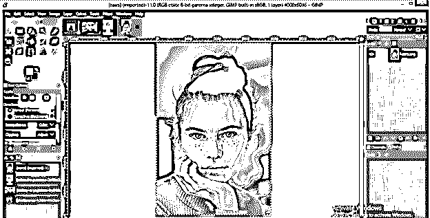

在这里，我们讨论了在 gimp 中导入图像的所有可能方式。

### 结论

通过阅读本文，您已经了解了在 gimp 中导入或放置图像的多种方法，并且可以在放置图像的过程中处理一些参数。你可以选择上面讨论的任何一种你认为最适合你的方法。

### 推荐文章

这是 GIMP 导入映像的指南。在这里，我们讨论如何使用它在 gimp 中导入或放置图像。您也可以看看以下文章，了解更多信息–

1.  [GIMP 替代方案](https://www.educba.com/gimp-alternatives/)
2.  [Adobe Photoshop 替代品](https://www.educba.com/adobe-photoshop-alternatives/)
3.  [在 Illustrator 中创建表格](https://www.educba.com/create-table-in-illustrator/)
4.  [面向功能的设计](https://www.educba.com/function-oriented-design/)

