# GIMP 替换颜色

> 原文：<https://www.educba.com/gimp-replace-color/>

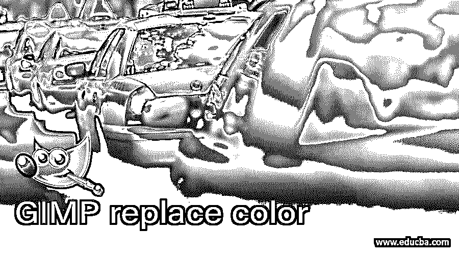

## GIMP 替换颜色简介

替换颜色是 GIMP 软件的一种方法或过程，通过它你可以改变任何图像中你想要的区域的颜色，以便对你的图像进行非常好的颜色处理。通过使用工具面板中不同类型的选择工具来选择某个区域，我们可以用我们想要的颜色来更改该区域的颜色。我们可以用许多方法来完成这个颜色替换过程，但是在本文中，我们将讨论其中的两种方法。在这两种方法中，我们将使用 GIMP 的工具面板的两个或更多的选择工具。那么让我们来看看这些方法。

### GIMP 中如何替换颜色？

有许多方法可以替换你想要的对象或图像中想要的区域的颜色，我们将分析其中的一些。为了学习这个主题，让我们在 GIMP 中有一个图像。要让图像转到菜单栏的文件菜单(在用户屏幕的顶部)并单击它，请单击向下滚动列表的打开选项或使用快捷键 Ctrl + O。

<small>3D 动画、建模、仿真、游戏开发&其他</small>

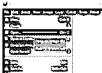

在此对话框中，通过单击从保存位置选择您想要的图像。我将为我们的学习选择这个鸟图像，并点击这个对话框的打开按钮。

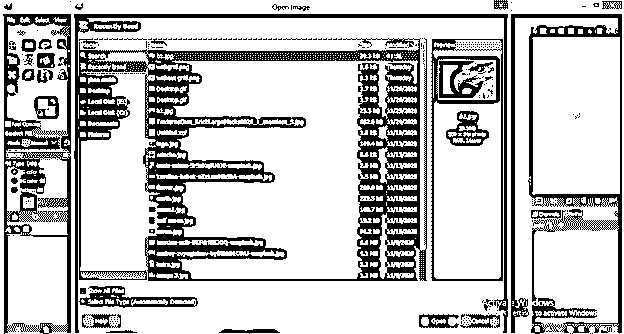

现在转到 GIMP 的工具面板，点击模糊选择工具激活它，或者你可以用一个快捷键，键盘的字母 U。

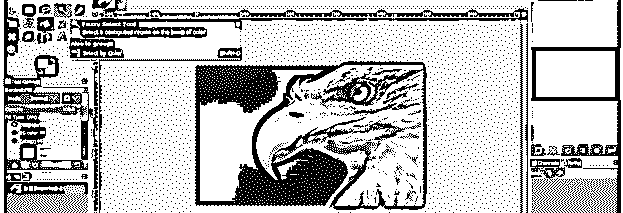

我想改变这只鸟喙的颜色。所以让我们围绕它做一个选择。用模糊选择工具点击这只鸟喙的任何区域，你会注意到如果你按住点击，一个选中的区域会用洋红色高亮显示。

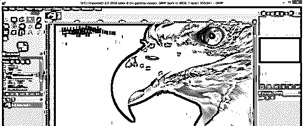

如果没有为选择高亮显示洋红色，请启用此模糊选择工具的参数部分的绘制蒙版选项。

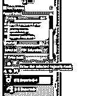

您可以通过多次点击来正确选择任何图像中您想要的区域。

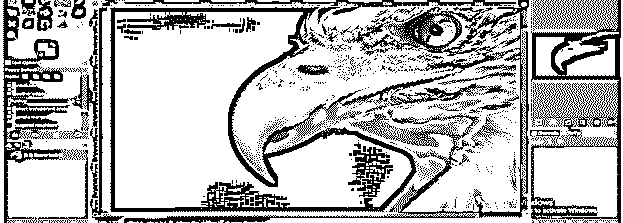

如果在你的选择过程中有一些不需要的区域被选中，那就不用担心了；我们也有解决方案。

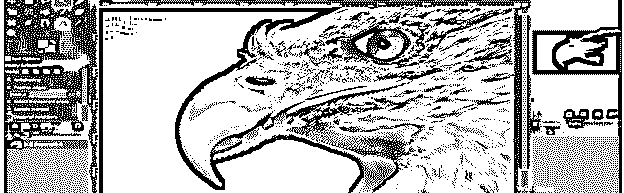

一旦你选择了你想要的图像区域，点击键盘上的回车键激活选择。现在转到图层面板，这是在工作屏幕的右侧，并点击创建一个新的层按钮有一个新的层。你可以在图层面板的底部找到这个选项。

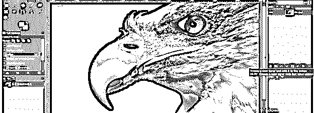

在“新建图层”对话框的“填充”选项中选择透明度选项，创建一个透明图层。

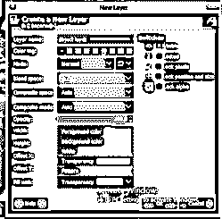

现在从“改变前景色”对话框中选择前景色框的颜色，你想用它作为这只鸟的喙的颜色。为此，我将选择橙色，并点击“确定”按钮。

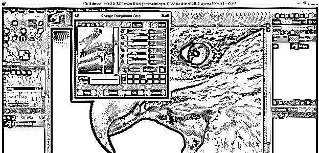

现在从工具面板中选择桶工具或者按 Shift + B 作为这个工具的快捷键。

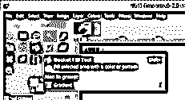

从桶工具的参数选项填充列表中选择 HSV 色调选项。

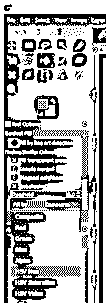

并使用桶工具在鸟喙的任何区域单击以改变其颜色。

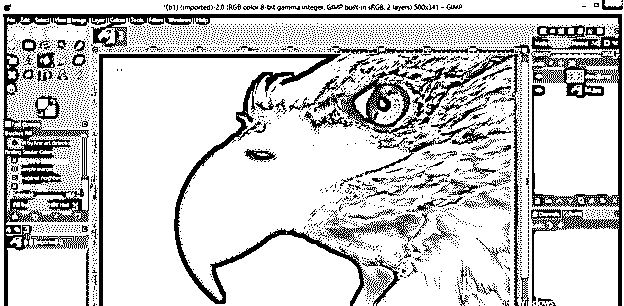

现在改变所选颜色的模式。要改变模式，进入图层面板，点击模式选项的向下箭头键，然后从下拉列表中选择 HSV 色调选项。

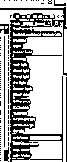

奇迹发生了。鸟喙的颜色会变成你想要的颜色。

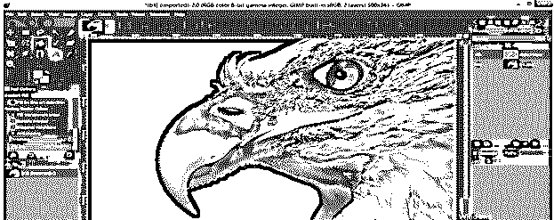

但是有一些不需要的区域也有改变颜色的效果，所以为了从不需要的区域擦除颜色，从工具面板中取出画笔工具或者按键盘上的 P 作为快捷键。

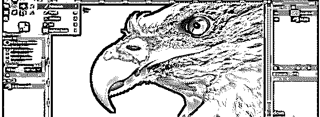

并在工具面板的颜色框中设置白色为前景色。

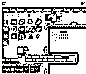

现在点击并拖动画笔笔尖到你想要去除颜色的地方。

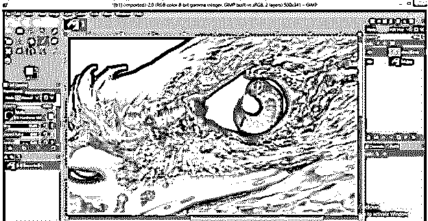

现在转到菜单栏的“选择”菜单，单击“无”选项来禁用此选择。

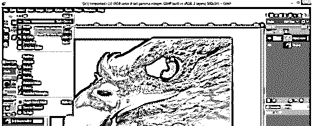

这个图像的漂亮的颜色处理已经准备好了。

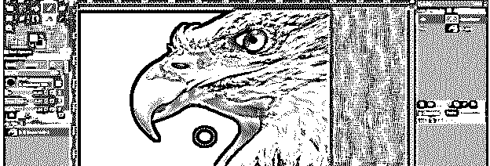

现在让我们学习另一种方法。为此，让我们有另一个形象的说法。

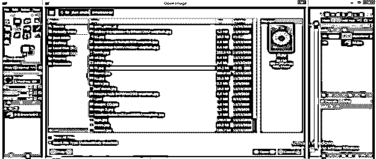

我们有这个花的图像来学习下一个方法。

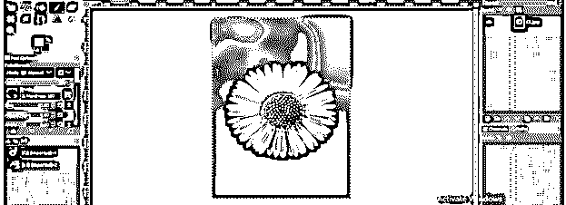

我想改变这朵花中心的颜色。所以从工具面板中选择前景选择工具。

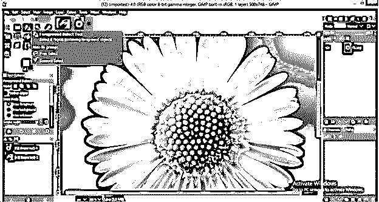

并围绕此花的中心区域的边缘进行选择。

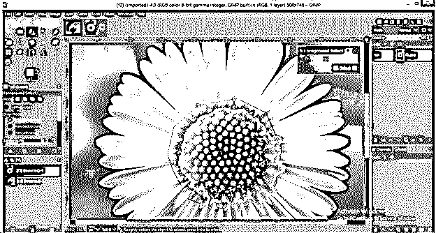

一旦选择准备好了，然后按键盘上的 Enter 键，它会像这样突出显示您选择的区域。蓝色区域是超出您选择的区域。

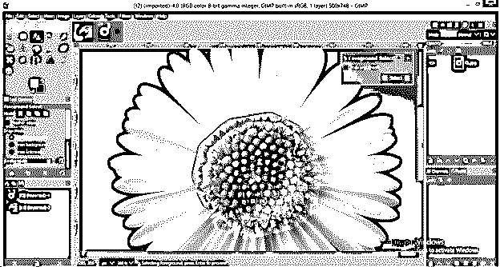

现在，根据您要使用的区域，增加该工具尖端的描边宽度。

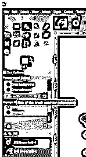

并像这样绘制选定区域。在所选区域内绘制一点点。没有必要精确地在边缘上绘画。它一定在边缘里面。

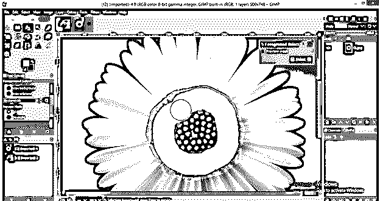

像这样填满它。

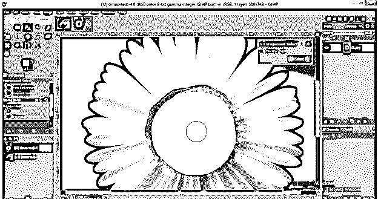

一旦你放开鼠标按钮，它会像这样改变你的颜色作为选择的标志。现在点击“前景选择”对话框的选择按钮。

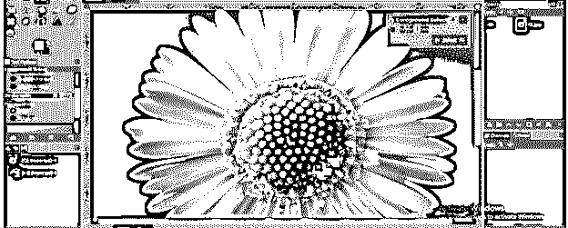

它会像这样围绕中心区域进行选择。

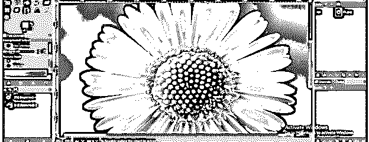

现在转到菜单栏的颜色菜单，从下拉列表中选择色调-饱和度选项。

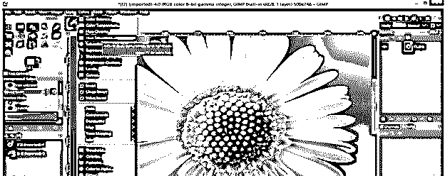

在此对话框中更改色调值，以更改所选区域的颜色，如下所示。

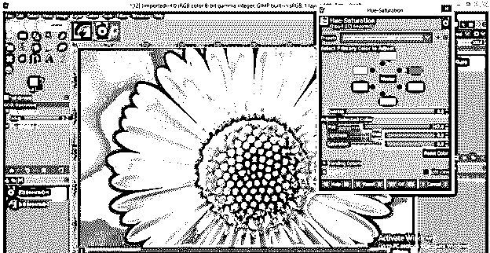

你可以把它变成任何颜色。

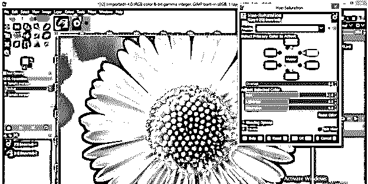

你也可以增加或减少它的亮度。当你对你的颜色满意时，点击确定按钮。

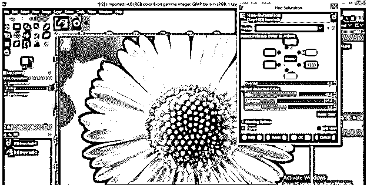

现在，再次转到“选择”菜单，单击下拉列表中的“无”选项以禁用选择。

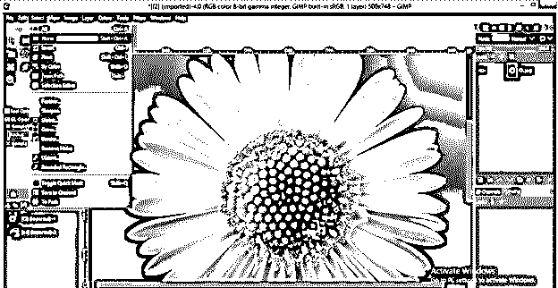

你替换这个图像的一个彩色区域就准备好了。

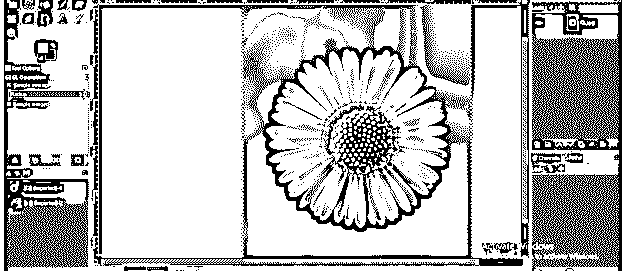

### 结论

在 EDUCBA 的这篇文章中，我们讨论了一些简单有效的方法来替换图像中任何区域或对象的颜色。现在你可以很容易地操纵你想要的区域的颜色，并且很好地掌握这个特性。

### 推荐文章

这是一个 GIMP 替换颜色的指南。这里我们讨论如何在 GIMP 中替换颜色，以及一些简单有效的替换任何区域颜色的方法。一些简单有效的替换任何区域颜色的方法。您也可以看看以下文章，了解更多信息–

1.  [GIMP 替代方案](https://www.educba.com/gimp-alternatives/)
2.  [孙在插画](https://www.educba.com/sun-in-illustrator/)
3.  [Photoshop 阳光效果](https://www.educba.com/photoshop-sun-effect/)
4.  [Photoshop 小抄](https://www.educba.com/photoshop-cheat-sheet/)

