# GIMP 文本轮廓

> 原文：<https://www.educba.com/gimp-text-outline/>

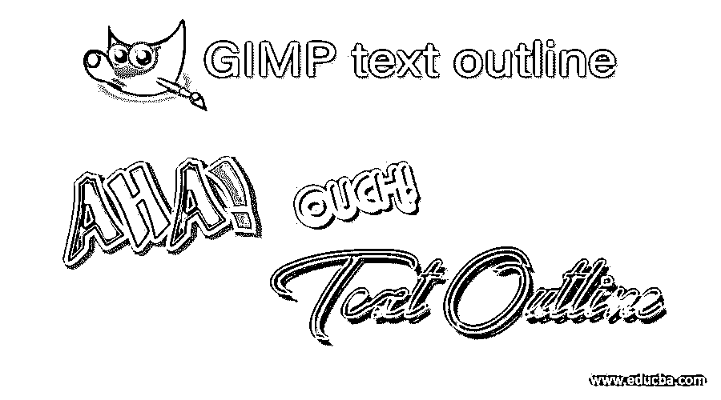

## GIMP 文本大纲介绍

文本轮廓是文本填充的笔画，这意味着我们可以为不同类型的操作工作以及排版在我们的书面文本周围创建一个轮廓。在 gimp 中，我们可以用多种方式围绕文本创建一个大纲，但是今天，在这篇文章中，我们将通过两种方式来做这件事，并学习如何在这些方式中做出改变，以在这项工作中获得最佳休息。使用这些方法，您可以创建任何宽度和任何颜色的文本轮廓。所以让我们好好讨论一下。

### 如何在 GIMP 中创建文本大纲？

今天，我们使用两种方法，通过这两种方法，我们可以创建一个我们想要的颜色和宽度的文本轮廓。我们一个一个地学习它们。因此，让我们首先创建一个新文档，在其上设置我们的文本。对于新文档，请转到菜单栏的“文件”菜单，通过单击打开它。然后选择此菜单下拉列表中的“新建”选项。

<small>3D 动画、建模、仿真、游戏开发&其他</small>

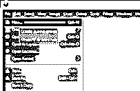

现在，在这个对话框中根据您的需要设置文档的大小。我使用这些默认设置，并点击这个框的确定按钮。

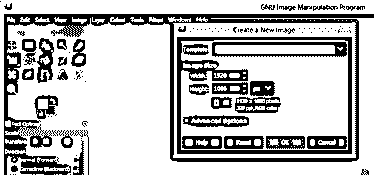

现在，从工具面板中选择文本工具，它位于工作屏幕的左侧，或者您可以按下键盘上的字母 T 来快速访问该工具，而无需转到工具面板。

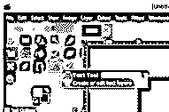

现在从文本工具的参数面板中选择你想要的文本样式。

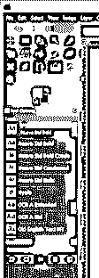

并在此键入您的文本。我会键入 EDUCBA，这是我们的正式名称。您可以为文本选择任何颜色。我会选择这种天蓝色。

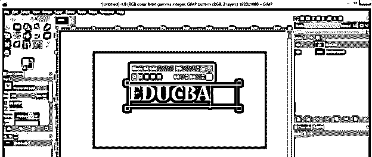

调整文档中央的文本。为此，请转到菜单栏的图像菜单，并转到下拉列表的参考线选项，然后单击新下拉列表的新参考线(按百分比)选项。

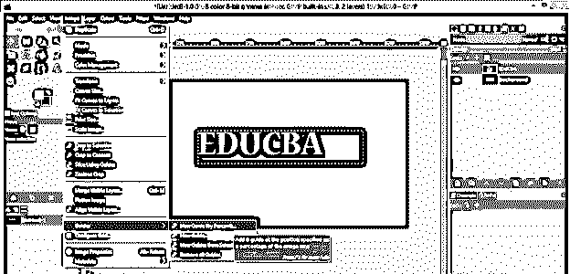

通过在此对话框的位置选项中给定 50 值，将水平导轨设置为 50 %，然后点击此对话框的确定按钮。

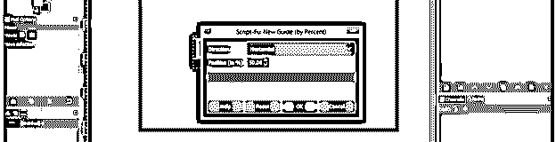

对垂直参考线进行同样的操作。

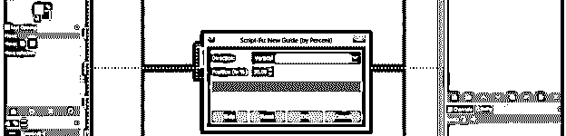

现在，在移动工具的帮助下，将文本移动到文档的中心。

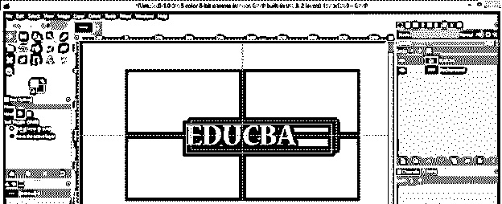

现在点击图层面板的创建新图层按钮，我在工作界面的右边创建一个新图层。

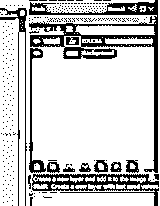

我将在这个对话框的“填充”选项中选择透明度选项，然后点击这个框的“确定”按钮，创建一个透明图层。

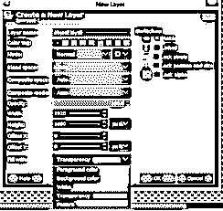

在鼠标左键的帮助下，将下面的图层移动到图层面板的文本图层。

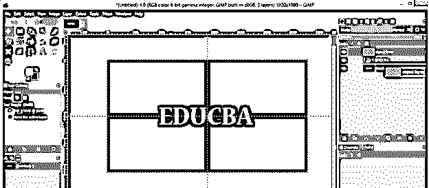

现在右击文本层，从下拉列表中选择“Alpha 到选区”选项。

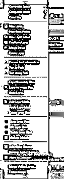

根据自己的选择，在 gimp 的前景颜色框中选择颜色，你选择的颜色就是文本轮廓的颜色。我将从这个框中选择一种黄色，然后点击这个颜色框中的 ok 按钮。

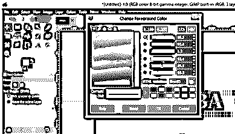

现在点击图层面板中的透明图层。

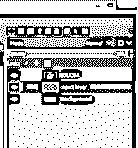

转到菜单栏的“编辑菜单”，然后点击下拉列表中的“笔画选择”选项。

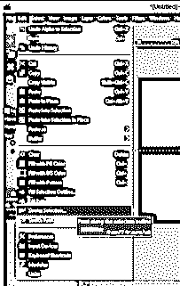

将打开“笔画选择”对话框。通过单击此选项的单选按钮，启用此对话框的“描边线”选项。

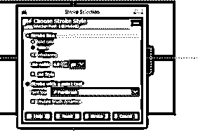

根据您想要的轮廓宽度，在线宽选项中输入您想要的值。

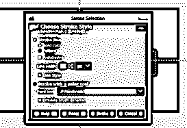

点击此对话框“线条样式”选项的加号按钮，查看更多选项。在这里，您可以选择轮廓的帽样式和关节样式。我将选择圆形选项，以在关节样式中获得平滑的轮廓。你可以选择任何帽子款式。

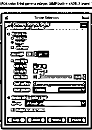

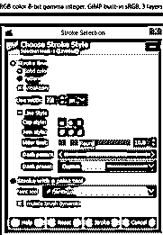

您可以为轮廓选择线条的图案，例如，您可以使用虚线、圆点和此列表中的许多其他图案。

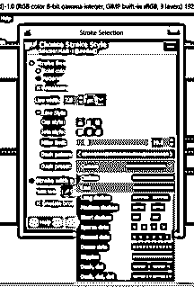

在完成你想要的设置后，点击这个对话框的笔画按钮。

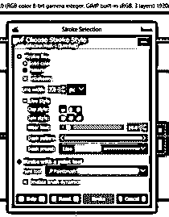

你的文字周围会有这种笔画。现在通过点击菜单栏选择菜单中的“无”选项来禁用文本周围的选择。

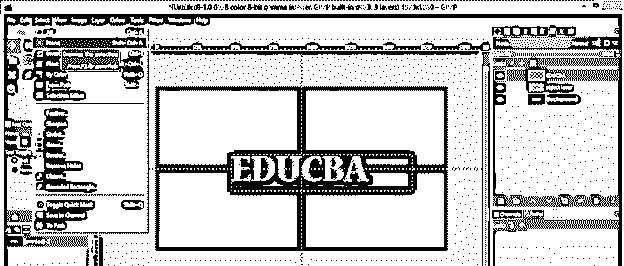

你会在你的文本周围得到这种类型的轮廓。

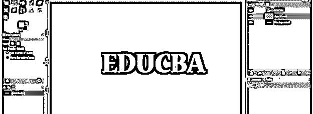

禁用文本层，点击该层的眼睛按钮，查看文本的轮廓笔画。

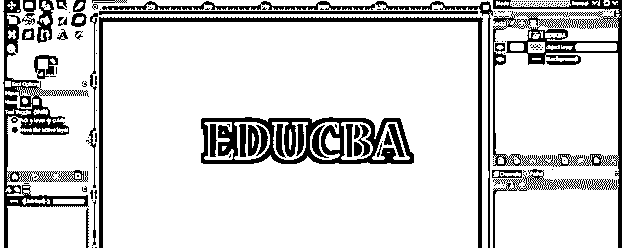

您也可以禁用背景层，方法是单击该层的眼睛按钮，查看带有透明背景的文本轮廓。

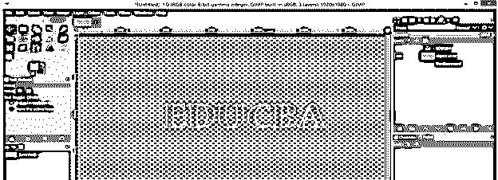

让我们讨论一下创建文本大纲的其他方法。转到图层面板，右键单击文本层，然后从下拉列表中选择“文本到路径”选项。

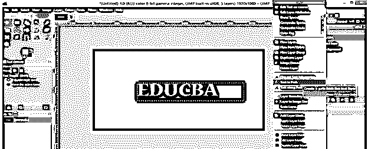

现在在图层面板中选择一个透明图层。

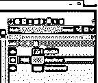

转到路径的标签，这是下面的图层面板在我的用户界面。您可以在您的用户界面中导航它。如果没有任何这种类型的选项卡，则转到菜单栏的窗口菜单，然后转到可停靠对话框，然后从下拉列表中选择路径选项。

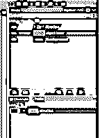

并在“路径”选项卡中的文本层的路径层上单击鼠标右键，然后从下拉列表中选择“描边路径”选项。

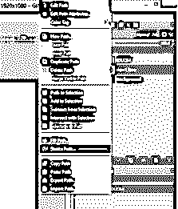

你会看到和第一个方法一样的对话框。该对话框中的所有设置与之前的相同。根据您的选择在此对话框中进行设置，并点击此对话框的“笔画”按钮。

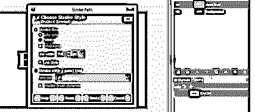

在点击这个框的描边按钮之前，我将把我的文本轮廓的前景色改为白色，当我点击描边按钮时，我将在我的文本周围得到这种类型的轮廓。

现在关闭文本层以及背景层，以查看您的大纲文本。

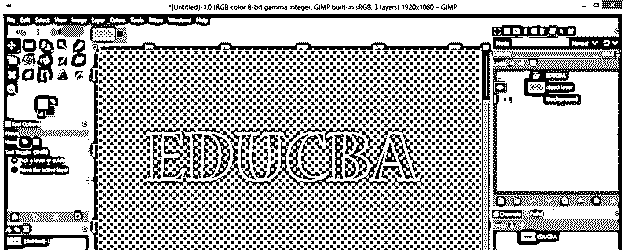

用第二种方法你会得到一个平滑的文本轮廓。

### 结论

还有更多其他方法可以创建任何文本的文本轮廓，但我们只讨论了其中两种，这是最简单快捷的方法。现在，在阅读完本文之后，您可以使用您想要的参数轻松地创建一个文本大纲。

### 推荐文章

这是 GIMP 文本大纲的指南。在这里，我们讨论如何在 GIMP 中创建一个文本轮廓，以及如何用您想要的参数轻松地创建一个文本轮廓。您也可以看看以下文章，了解更多信息–

1.  [GIMP 替代方案](https://www.educba.com/gimp-alternatives/)
2.  [UI 设计工具](https://www.educba.com/ui-design-tools/)
3.  [CorelDRAW 标志设计](https://www.educba.com/coreldraw-logo-design/)
4.  [3ds Max 室内设计](https://www.educba.com/3ds-max-interior-design/)

