# GIMP 视频编辑

> 原文：<https://www.educba.com/gimp-video-editing/>

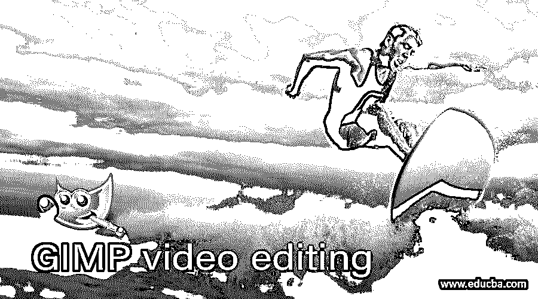

## GIMP 视频编辑简介

在这篇文章中，我们将学习如何在 GIMP 中进行视频编辑。虽然一般来说，GIMP 是图形编辑软件，主要用于光栅图像，但它可以与一些免费的视频编辑工具配合使用，以创建视频效果和编辑。一个这样的编辑是 cinemagraph，它可以在 GIMP 的帮助下完成，它就像静止的图像，但它有一些移动的部分作为 3D 图像。因此，我们可以从这个重复的剪辑中创建一个视频剪辑。因此，我们的目标是创建一个连续的无缝帧循环，给我们一种运动感。我们希望使用这种技术来描绘图像的运动和静止部分之间的对比。

### GIMP 视频编辑的步骤

下面是下面提到的步骤

<small>3D 动画、建模、仿真、游戏开发&其他</small>

首先，我们将下载一个名为 Olive 的免费软件，它将帮助我们完成一些视频编辑过程，这些过程将与 GIMP 一起完成。你可以去 https://www.olivevideoeditor.org/download.php 下载 Olive 并安装在 windows 或其他你正在使用的操作系统上。然后在打开应用程序后，我们将从项目面板创建一个新的序列。

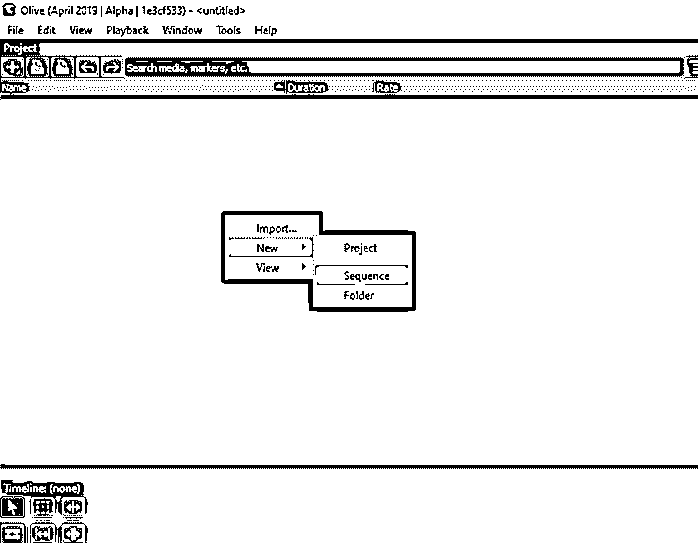

**步骤 2:** 在创建新序列时，我们将预设保持为 1080p，并更改序列的名称。

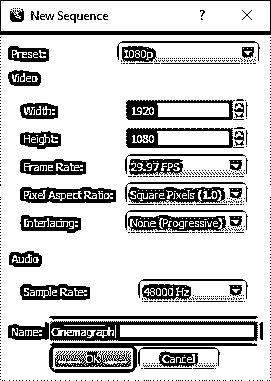

**步骤 3:** 要引入视频，我们将右键单击项目面板，然后单击 import

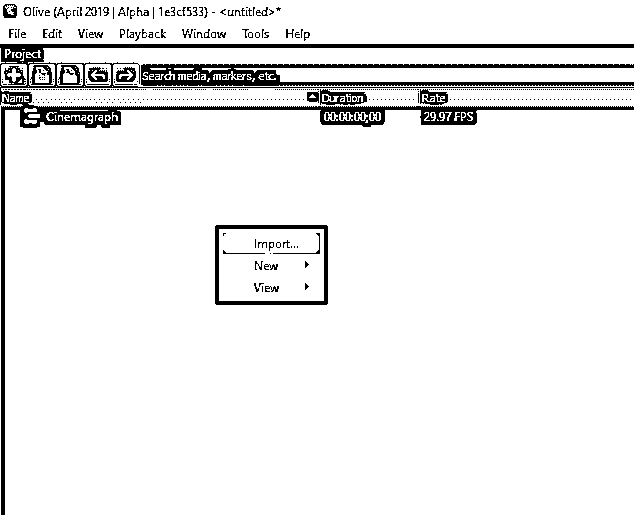

**步骤 4:** 导航至您想要编辑的视频，并确保它适合创建 cinemagraph。

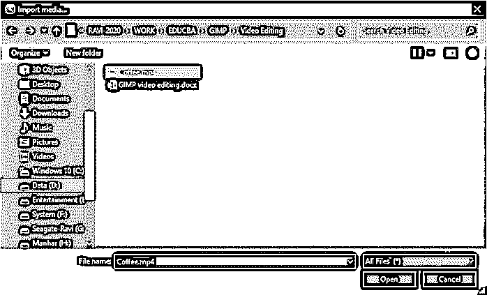

**步骤 5:** 为了组织文件，我们创建了一个名为 video 的新文件夹，并将我们的剪辑移动到其中。

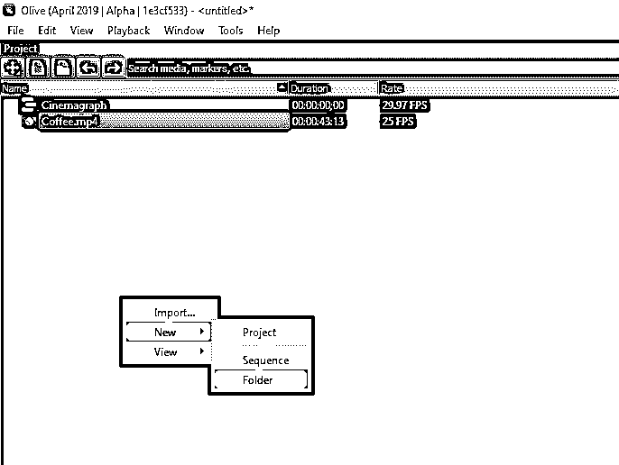

**第六步:**现在，我们将视频拖到时间轴上，你可以在序列查看器的底部看到片段的时长，大概是 14 秒左右。红色线是播放头，您可以拖动播放头，转到时间轴中视频的任何部分。如果您按空格键，那么视频将会播放。我们在这个视频中看到的是咖啡进入杯子的水流，对于 cinemagraph 来说应该是比较平稳的。

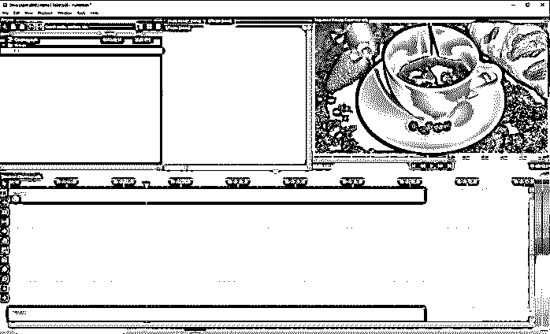

**步骤 7:** 现在，当我们看到咖啡流相对稳定时，我们希望只剪切剪辑中使用剃刀工具或按 C 键并在时间轴上按剪切键的那些部分。

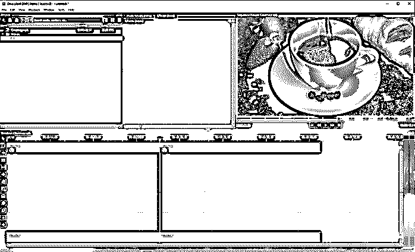

步骤 8: 然后，我们将从时间线中删除我们不想要的部分。

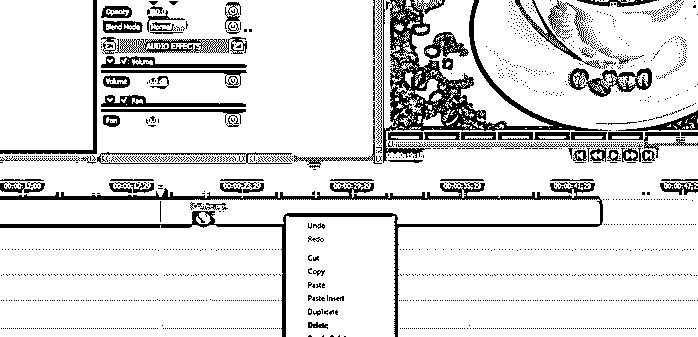

**第 9 步:**再次，我们将看到我们想要在水流稳定的地方开始剪辑，并使用剃刀工具进行另一次切割。

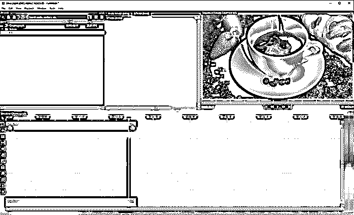

**步骤 10:** 然后，我们将波纹删除第一部分，这将删除剪辑以及空间。

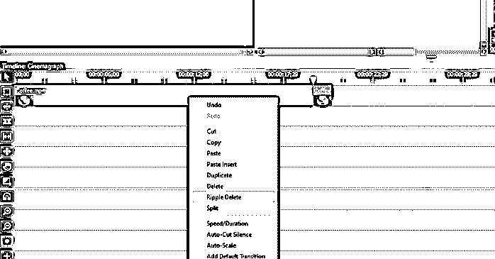

**步骤 11:** 在擦洗时间轴时，当你找到一个相对稳定的流时，然后在序列查看器上右击，将该帧保存为图像。

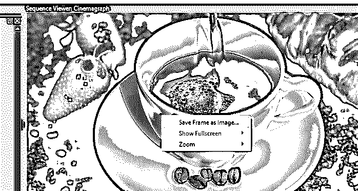

**第 12 步:**这将把文件保存为 png 文件。

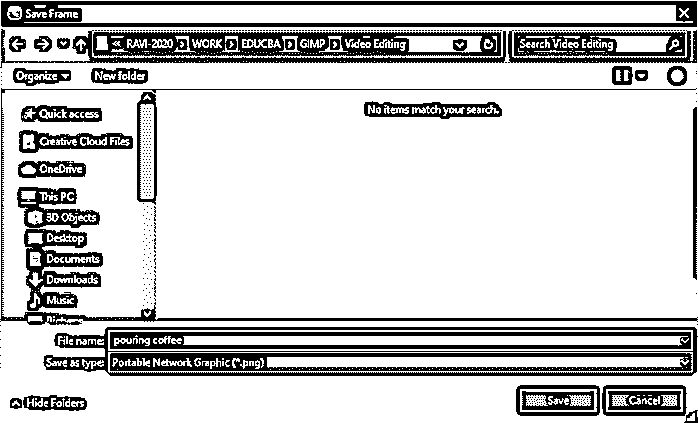

**步骤 13:** 现在用 GIMP 打开这个图像，在 GIMP 窗口中拖动它。

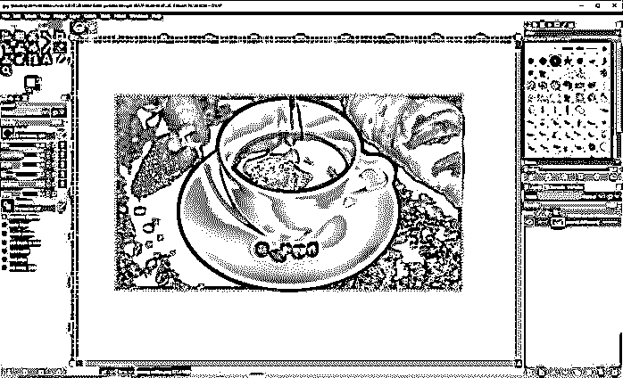

步骤 14: 现在按 Shift + Q 打开蒙版，然后使用画笔工具，设置合适的大小和硬度。将前景色设置为白色。

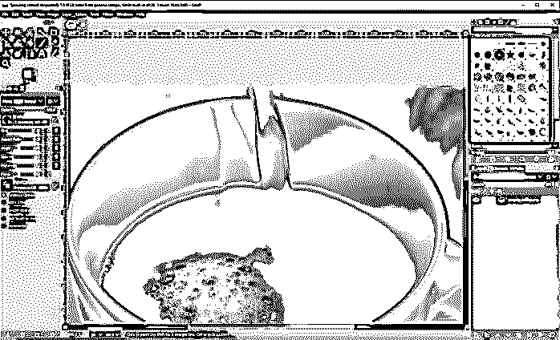

第 15 步:现在，在你移除组成流的部分后，它看起来会像这样，如果你愿意，你也可以通过将前景改为黑色来恢复蒙版。一旦我们关闭快速蒙版，流将被选中。

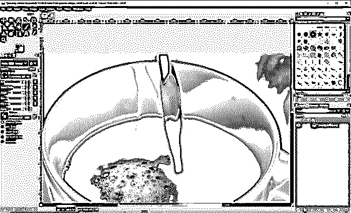

步骤 16: 然后在图层面板中添加图层蒙版。

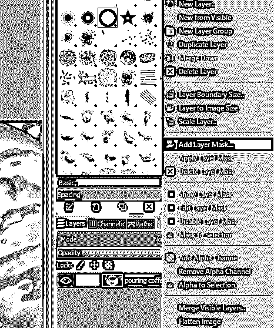

**步骤 17:** 确保选择已勾选，反转遮罩已设置。

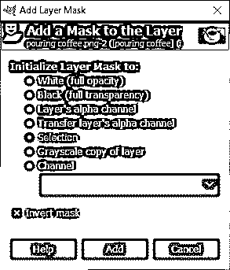

**步骤 18:** 现在，我们将从文件菜单中覆盖现有文件。

步骤 19: 现在将图像导入到 olive 中。

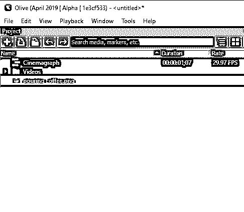

**步骤 20:** 然后拖到剪辑上方的时间轴上。

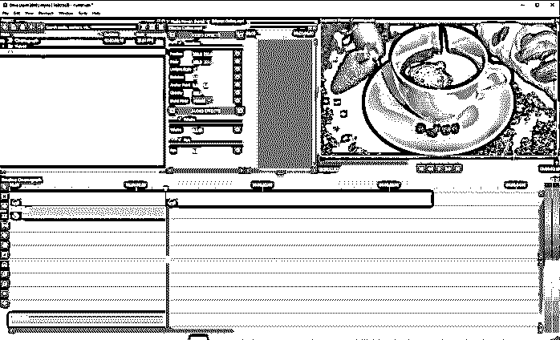

**步骤 21:** 修剪图像时间轴多余的部分，超出剃刀工具的剪辑部分，删除。现在我们擦洗时间线；我们可以看到图像的部分仍然需要一些工作。

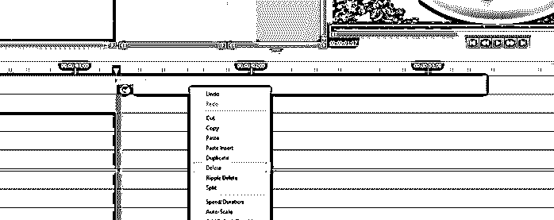

步骤 22: 然后再次进入 GIMP，我们可以在图层蒙版上工作

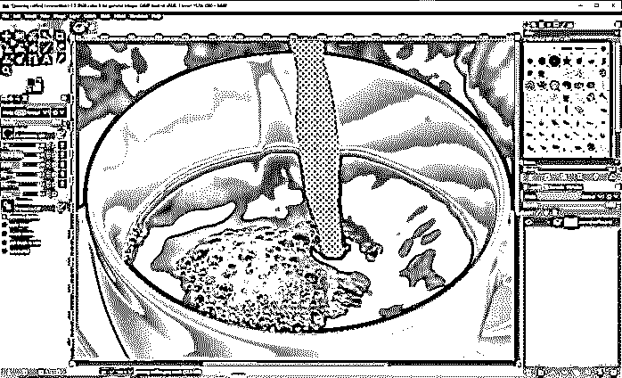

**步骤 23:** 再次覆盖文件，保存一个 png。

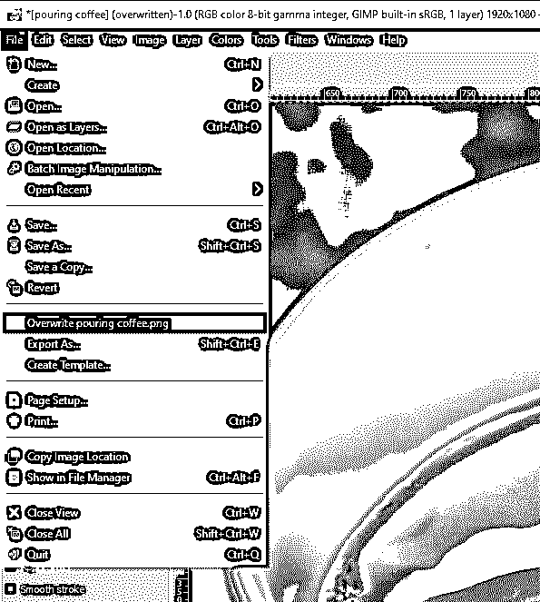

**步骤 24:** 要确保 olive 反映了更改，请右键单击图像并替换/重新链接媒体。

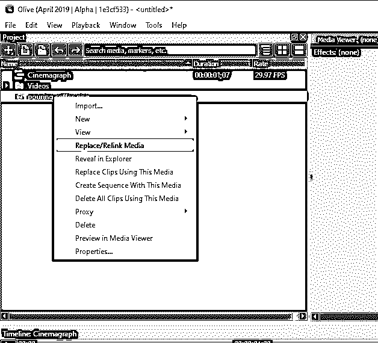

**步骤 25:** 导航到图像文件并打开它。

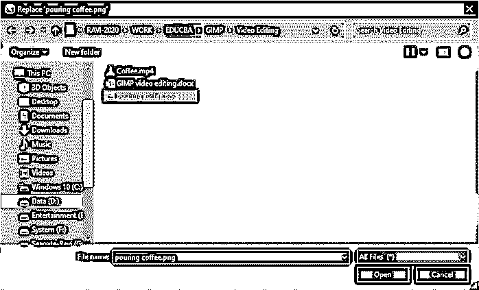

**步骤 26:** 选择剪辑并按 alt，拖动复制并扩展图像。我们将创建一个循环效果。

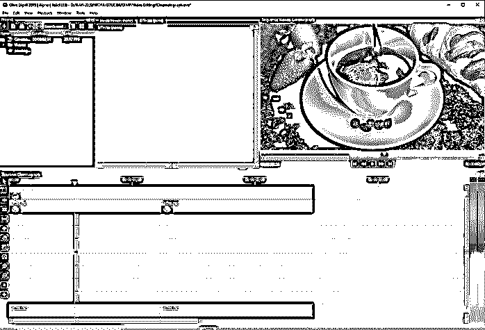

第 27 步:然后我们进入速度/持续时间

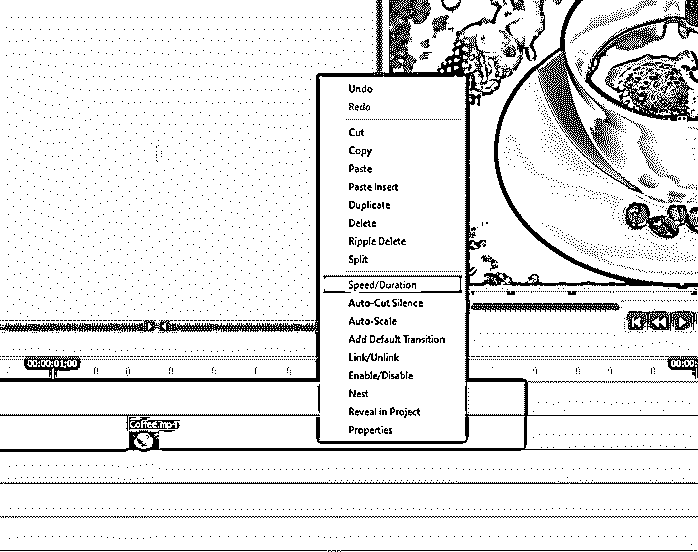

**步骤 28:** 然后反转方向

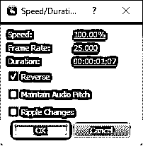

第 29 步:另一种方法是，我们在一个单独的时间线上复制它，并首先撤销之前的更改。

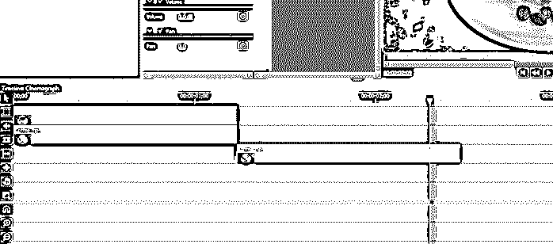

步骤 30: 现在，我们将在第二个剪辑的开头添加一个不透明度的关键帧，并在第一个剪辑的结尾将不透明度设置为 0。

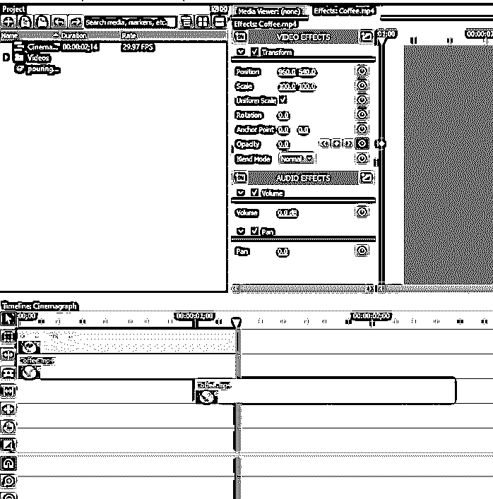

步骤 31: 再次使用剃刀工具，修剪掉多余的部分。

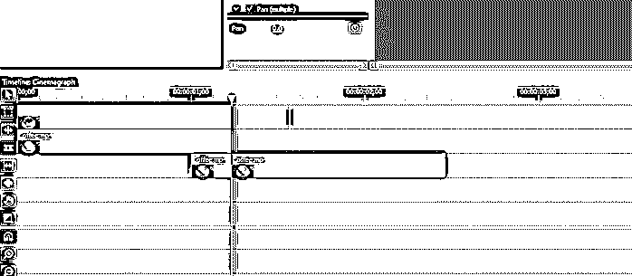

**步骤 32:** 从第二个剪辑中删除多余的部分。

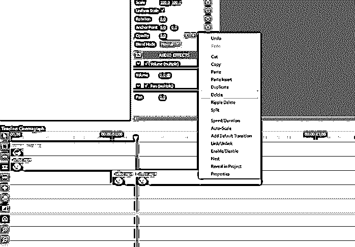

**步骤 33:** 现在从文件菜单把这个导出为 GIF 或者按 Ctrl + M，确保整个序列都被选中。

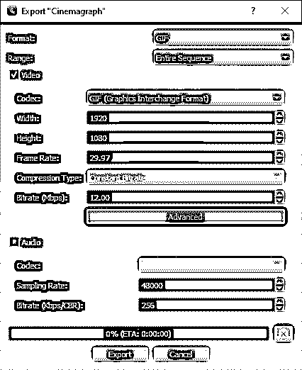

**步骤 34:** 选择保存文件为 gif 的位置。

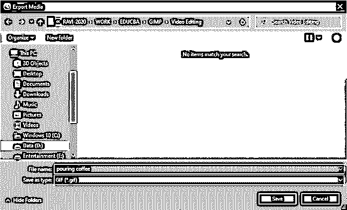

**步骤 35:** 我们的 gif 创建好了，但是有一个黑框弹出来了，我们会在 GIMP 中通过打开它来处理。

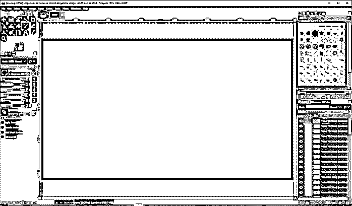

步骤 36: 现在删除所有空白层、黑色层和背景层。

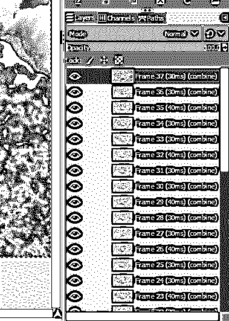

步骤 37: 然后将图像导出为 GIF 格式

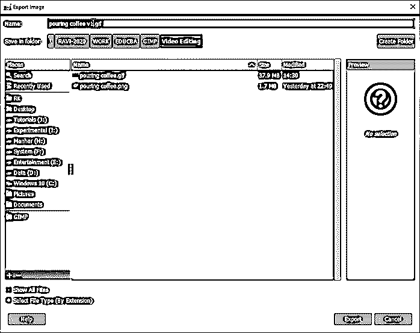

**步骤 38:** 然后，在 GIF 选项中，确保勾选了永远循环，点击导出。

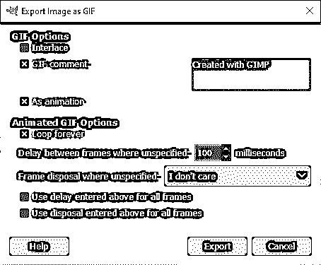

### 结论

在本文中，我们看到了如何在 GIMP 的帮助下进行视频编辑。首先，我们已经看到了如何使用 olive 和做一些视频操作，并获得我们在 GIMP 中编辑的稳定帧，并创建一个图层蒙版，允许我们想要保留的视频部分，并使另一部分仍然创建一个 cinemagraph。

### 推荐文章

这是 GIMP 视频编辑指南。这里我们讨论如何在 GIMP 的帮助下做视频编辑，以及如何使用 olive 做一些视频操作。您也可以看看以下文章，了解更多信息–

1.  [GIMP 替代方案](https://www.educba.com/gimp-alternatives/)
2.  [CSS 标题设计](https://www.educba.com/css-header-design/)
3.  [Illustrator 中的金属效果](https://www.educba.com/metal-effect-in-illustrator/)
4.  [孙在插画](https://www.educba.com/sun-in-illustrator/)

