# GIMP 文本阴影

> 原文：<https://www.educba.com/gimp-text-shadow/>

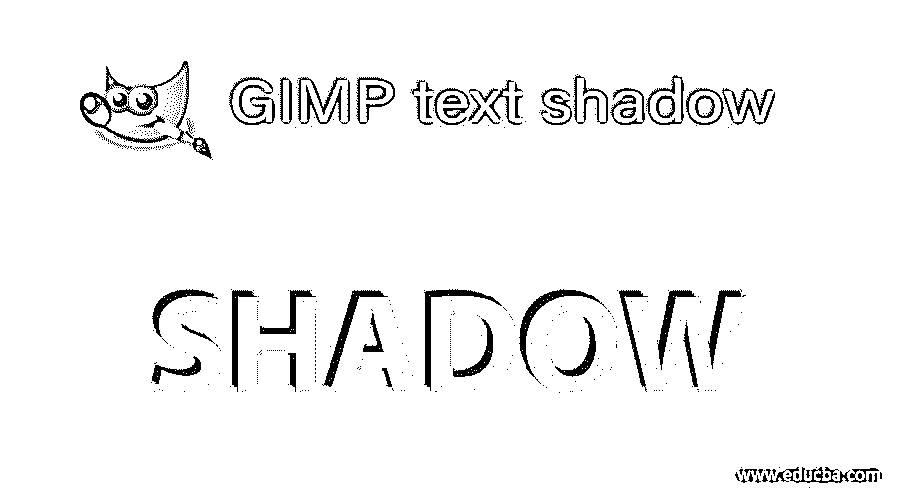

## GIMP 文本阴影介绍

文字阴影是一个非常有效的功能，可以在你的文字上为你的浏览者创造出 3d 的错觉，同时也给你的文字增加了很好的重量；在 GIMP 中，我们使用绘图工具、滤镜选项和 GIMP 软件的许多其他重要功能为文本添加阴影，这种阴影通常出现在文本后面，但是您可以根据自己的需要设置阴影角度。我们将为我们的文本手动创建一个阴影，并使用过滤器作为阴影的预设。所以让我们找出两种方法，通过这两种方法我们可以为我们的文本添加阴影。

### 如何在 GIMP 中创建文本阴影？

首先，让我们对我们的文本有一个非常漂亮的背景，因此，采取一个新的文件。进入文件菜单，点击“新建”选项。

<small>3D 动画、建模、仿真、游戏开发&其他</small>

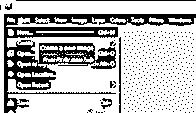

在此设定您想要的文件尺寸。我要 1920 x 1080 的。

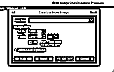

我们将对背景应用渐变，因此在工具面板的前景和背景色框中设置两种渐变颜色。我要这种深浅不一的蓝色。

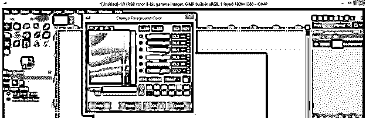

现在从 GIMP 的工具面板中选择渐变或混合工具。

在渐变参数中将 FG 设置为 BG 颜色模式，也采用径向渐变，然后将渐变光标从文档的中心向外拖动。

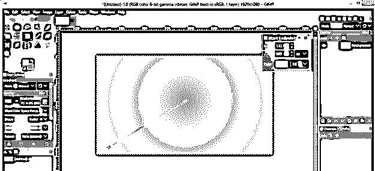

我将从渐变参数中反转我的渐变颜色，并在我的背景上获得这种渐变的平滑混合。

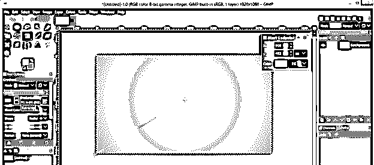

现在从工具面板中选择文字工具。

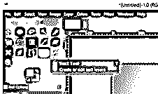

将文本的颜色更改为您想要的颜色，并从它的参数中选择一个好的字体样式。

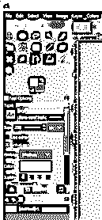

现在在这里输入你想要的文本。我会键入 EDUCBA，这是我们网站的正式名称。

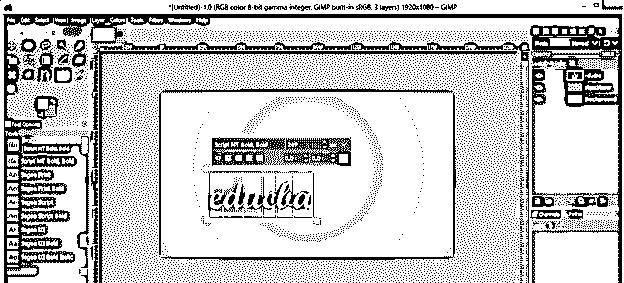

现在根据你的需要增加文字的大小。

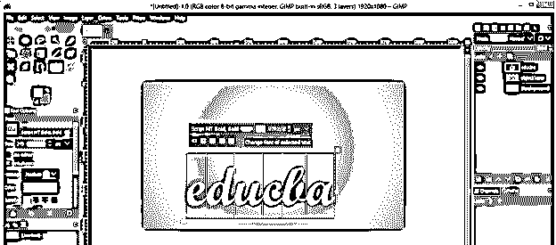

转到菜单栏的图像菜单，然后转到向下滚动列表的参考线选项，并单击新的参考线(按百分比)选项，在文档的中心设置垂直和水平参考线。

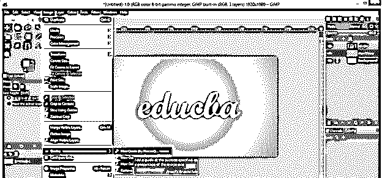

在文档尺寸的 50 %处选择水平导轨，然后点击确定。

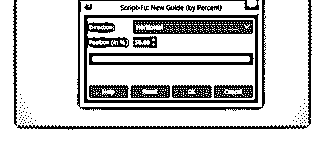

对垂直参考线进行同样的操作，您将在文档的中心获得参考线。现在，在移动工具的帮助下，将文本放置在参考线交叉处的文档中心。

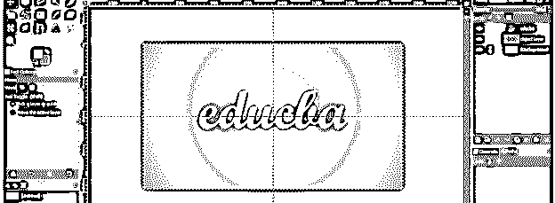

在工具面板的旋转工具的帮助下，旋转这个文本一点点，让你的文本有一个好的阴影效果。

现在右击文本层，点击下拉列表中的 Alpha to 选择选项来选择文本。

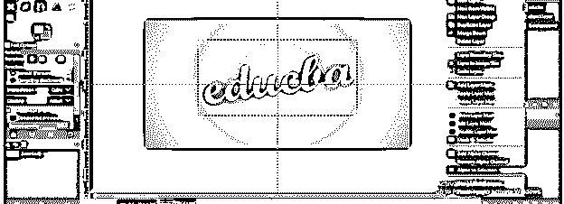

通过单击菜单栏的“编辑”菜单中的“复制”选项或按键盘上的 Ctrl + C 按钮来复制此选择。

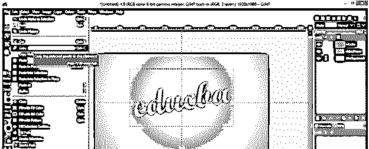

点击图层面板的新建按钮，在图层面板新建一个透明图层。

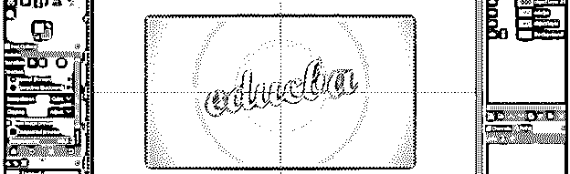

点击编辑菜单下拉列表中的粘贴选项，或者按键盘上的 Ctrl + V 键，将选区粘贴到新的透明图层上。

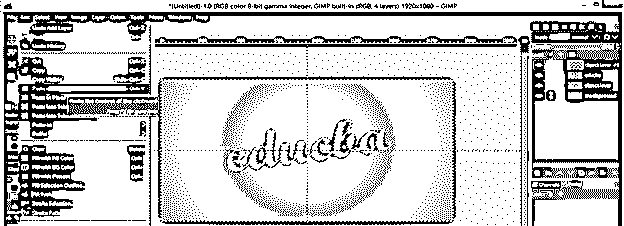

现在点击图层面板底部的锚按钮，为下面的透明图层添加浮动图层。

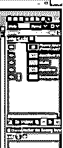

现在把下面这一层移到原来的层。

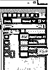

再次选择并设置黑色为颜色框中的前景色。通过点击图层面板中的眼睛按钮隐藏顶部原始图层。

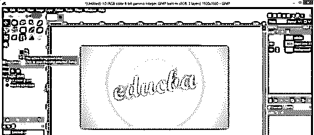

现在用桶工具点击选区填充黑色。

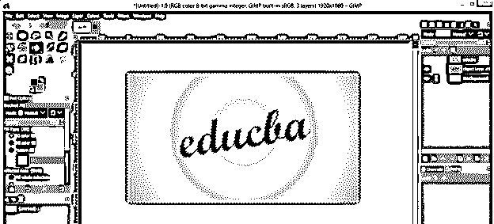

通过单击菜单栏选择菜单的“无”选项启用选择。

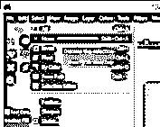

现在取消隐藏最上面的图层，将黑色文字图层向下移动一点，这样你的文字就会有一个很好的阴影效果。您可以降低黑色层的不透明度，以获得软阴影或硬阴影效果。

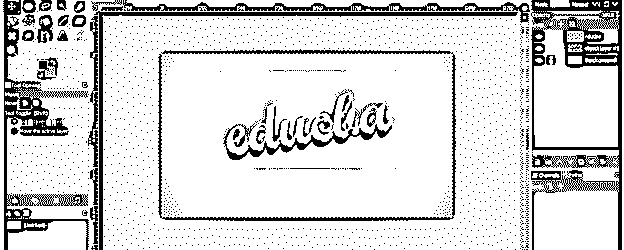

现在让我们使用 GIMP 的滤镜选项来制作文字阴影。为此，通过点击图层面板的创建副本按钮创建一个副本图层。

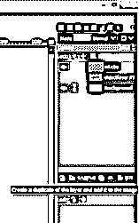

并将其移动到原始层的下方。

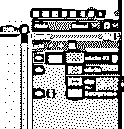

现在选择一个复制的图层，点击菜单栏的滤镜菜单。转到下拉列表的光影选项，然后点击新的下拉列表的投影选项。

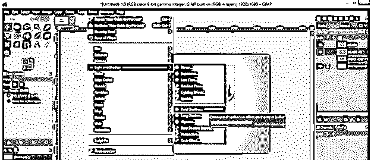

你会得到这个漂亮的阴影。我们有一个带有这个滤镜的投影对话框。您可以增加或减少模糊半径，以增加或减少阴影的暗度。

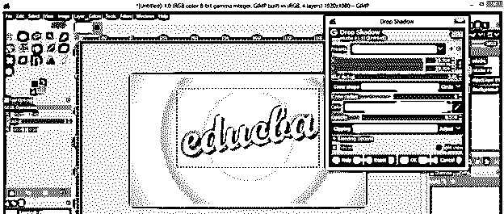

您也可以增加或减少发光半径来改变阴影的效果。

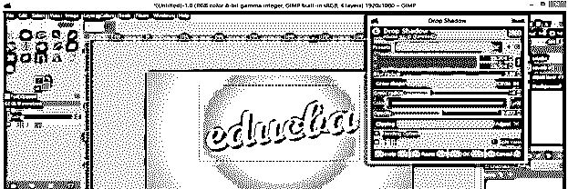

现在，让我们尝试另一个过滤器的阴影，使一个以上的原始层复制层，并将其移动到下面的原始层。

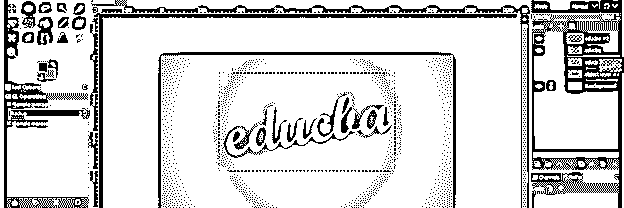

再次进入滤镜菜单，然后选择光影选项，并从新的下拉列表中选择长影选项。

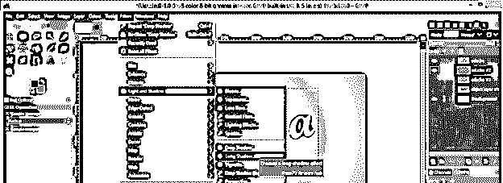

你会得到这种长长的阴影效果。

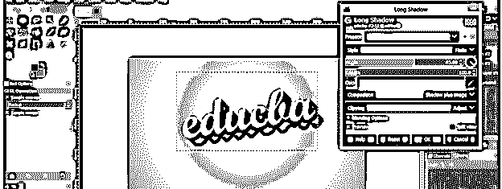

您可以从该对话框的“样式”选项中为长投影效果选择不同的预设选项。

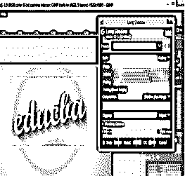

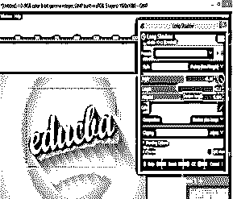

以上效果谁都可以去。在这里，我们也可以通过改变这个对话框的角度选项的值来设置阴影的角度。

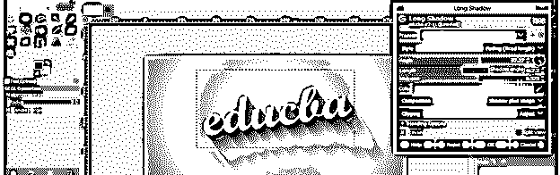

此对话框还允许您更改投影的颜色；只需点击色标并从颜色框中改变颜色。

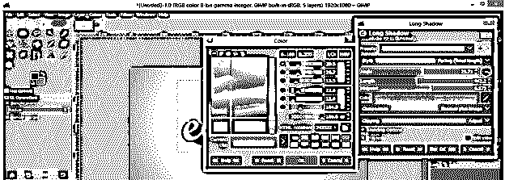

从该对话框的“合成”选项中选择“仅阴影”选项，以便在应用的文本图层上有唯一的阴影。

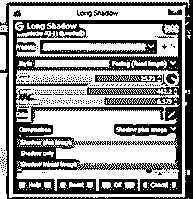

你可以通过点击顶部文字层的眼睛按钮来显示它。

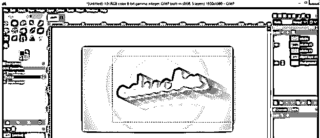

现在合并上面的图层和下面的阴影图层，使它们在一个图层中。为此，点击 GIMP 图层面板的合并按钮。

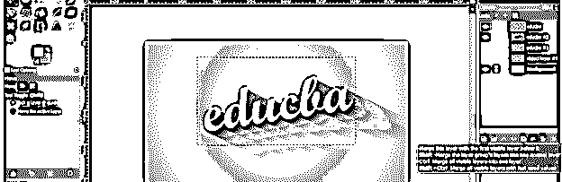

这样，你可以为你的文本创建一个漂亮的阴影。

### 结论

现在你可以在你的文本中使用阴影了，因为在这篇文章之后，你已经很好的了解了为文本创建阴影的参数。你可以使用我们上面讨论的任何一种方法，并命令他们在你的工作中获得最佳结果。

### 推荐文章

这是一个 GIMP 文本阴影的指南。在这里，我们讨论如何在 GIMP 中创建文本阴影，并找出两种方法，通过我们可以有阴影的文字。您也可以看看以下文章，了解更多信息–

1.  [GIMP 替代方案](https://www.educba.com/gimp-alternatives/)
2.  [Indesign 的替代方案](https://www.educba.com/alternative-to-indesign/)
3.  [3ds Max 室内设计](https://www.educba.com/3ds-max-interior-design/)
4.  [什么是平面设计？](https://www.educba.com/what-is-graphic-design/)

