# GIMP 调整图像大小

> 原文：<https://www.educba.com/gimp-resize-image/>

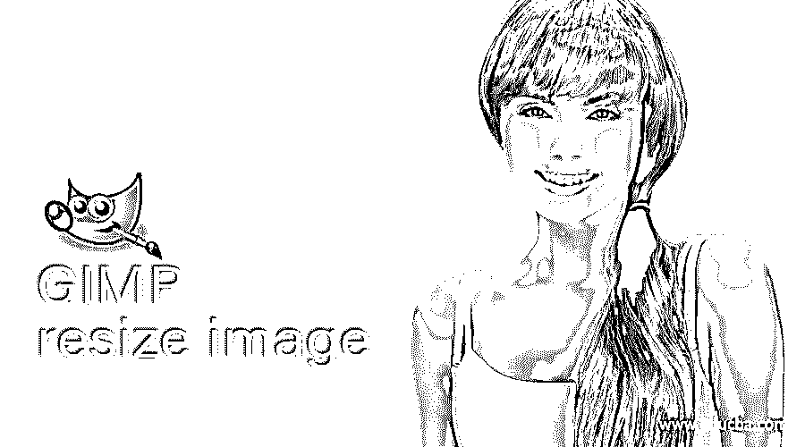

## GIMP 调整图像大小简介

“调整图像大小”这个术语可以理解为根据图像的不同类型的最终用途，按比例放大或缩小图像的宽度和高度。因此，在 GIMP 中，我们使用调整图像大小的功能和工具来调整图像的大小，同时无损图像质量。我们还将了解插值字，这是调整图像大小时一个非常重要的术语。我们调整图像大小有两个目的:有两个平台可以让你使用调整后的图像；第一个是在网页上，第二个是为了打印。两者都有不同的设置，所以让我们来讨论一下。

### 如何在 GIMP 中调整图像大小？

在本文的引言部分，您听到了一个新词，它就是插值。当您放大或缩小任何图像时，它会由于像素损失而损失一些质量，因此图像大小调整之间的过渡称为插值。我们将学习一些选项，通过这些选项，我们可以最大限度地控制图像质量，或者在调整大小时减少像素化效果。

<small>3D 动画、建模、仿真、游戏开发&其他</small>

现在用相机拍一张照片。你可以从网上下载。我拍这张照片。它有一个非常大的尺寸；您可以在用户屏幕的顶部看到图像的大小，为 4032 x 1908。

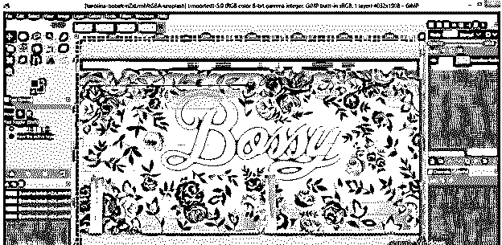

### GIMP 中调整图像大小的方法

在 GIMP 中，我们有两种方法来调整图像的大小。第一种方法是转到菜单栏的图像菜单，单击向下滚动列表的缩放图像选项。

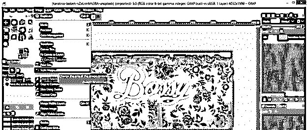

您将看到这种缩放图像对话框。您可以通过输入图像的宽度和高度值来更改它们的值。

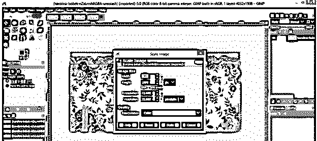

如果您想单独更改图像的宽度和高度，请取消选中链接。

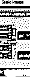

在此过程中，您可以从该选项中选择一个单位。

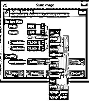

我们也有一个网络和打印目的的图像分辨率。我们通常在网页上使用 72 像素/英寸，在打印上使用 300 像素/英寸。对于打印，我们使用更多的像素来保持图像质量，而不是像素化。

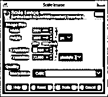

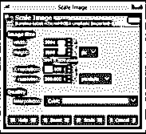

您也可以从该列表中选择分辨率单位。

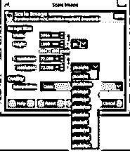

我将把 1920 x 1080 作为这个图像的比例值，然后点击 ok 按钮。

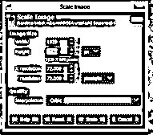

它会像这样缩小。

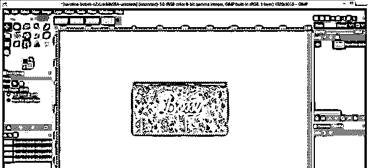

下一个方法是去工具面板，并采取缩放工具。

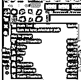

点击图片。单击图像后，您将在所选图像周围看到一个带有缩放参数框的缩放边界框。

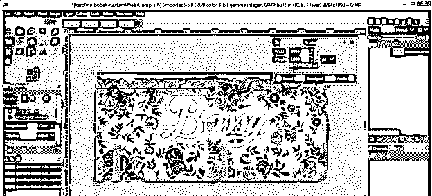

您可以通过键盘输入在这里输入任何值。

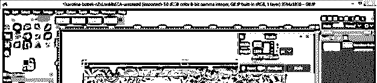

或者用鼠标按住边框的任意锚点，开始调整图像的大小。你可以放大或缩小它。图像的宽度和高度比例将保持不变，因为 chain-link 按钮处于打开状态。

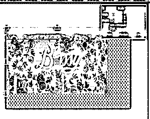

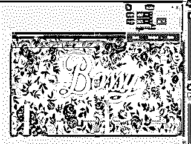

如果你想单独改变宽度或高度，那么关闭链节按钮。

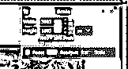

并根据您的需要改变宽度或高度。

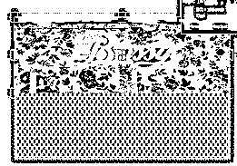

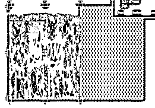

现在让我们有一个新的透明层上的这个图像的标志。我有这个 EDUCBA 官方 logo 就是为了这个目的，我想把它放在这个图片的角上，但是我怎么调整它的大小呢？让我们来找出答案。

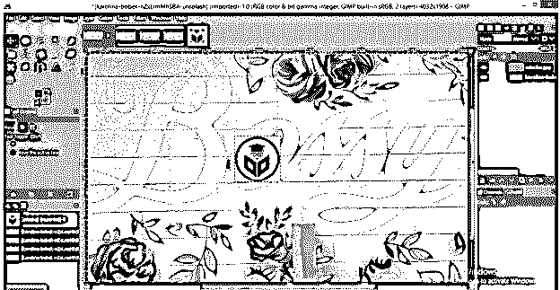

现在选择我们上面讨论过的任何一个调整图片大小的选项。

我将使用缩放工具点击徽标图像，但是你会注意到我们的 EDUCBA 日志周围没有任何调整大小的边框。事实上，它给了我们一个图像周围的边界框，尽管我们已经选择了我们的标志层。

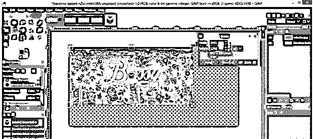

那么现在该怎么办呢？这只是一个简单的选择层选项，在缩放的参数面板。

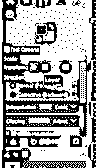

现在，再次点击图像，这一次，它将选择我们的标志调整大小。现在，我可以自由地调整我的标志。

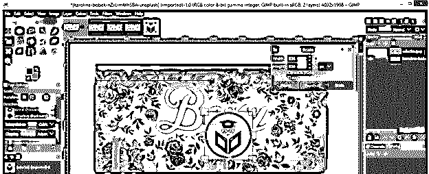

您也可以通过从菜单栏的图层菜单中选择缩放图层选项来完成此操作。

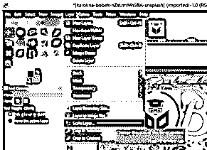

**无损调整图像大小:**

让我们看看如何在调整图像大小时保持图像的最高质量。现在从图像菜单中选择缩放图像选项，并选择此框的宽度和高度的单位选项中的百分比选项。

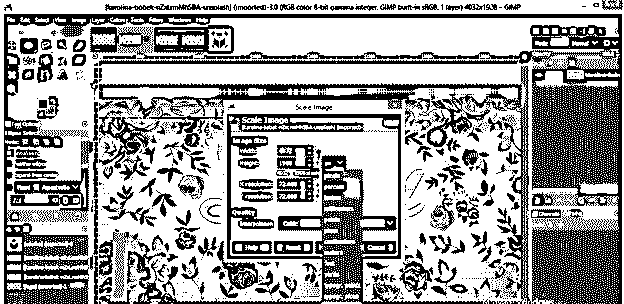

现在插值这个术语来了。我们有许多插值选项。在这个列表中，从上到下，每个选项都有更好的质量管理。所以让我们找出这个列表中每一个的效果。

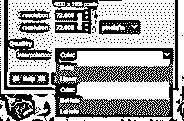

首先，选择“无”选项，我将把这张图片缩小到原始大小的 10%。

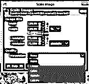

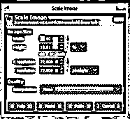

我将把 72 作为像素/英寸。

它会像这样缩小。

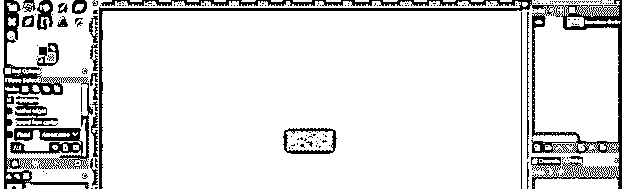

现在把它放大到 550 %,你可以看到它像素化了。

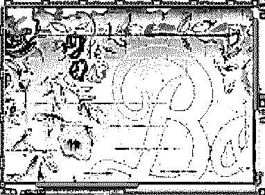

现在选择具有相同缩放百分比的线性选项。

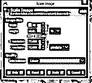

看，它比“无”选项质量更好。

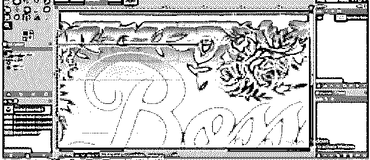

立方也会给你和线性几乎一样的效果。

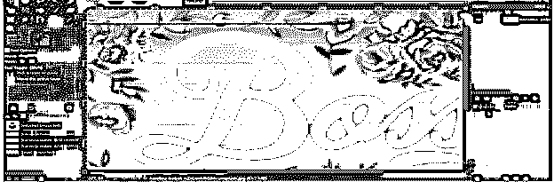

现在让我们看看 NoHalo 和 LoHalo 的效果。对这两个选项重复上述所有步骤，缩小 10 %，放大 550 %。这里你会发现两个选项的结果几乎相同，但是这两个选项会给你一个比上面三个选项好得多的结果。

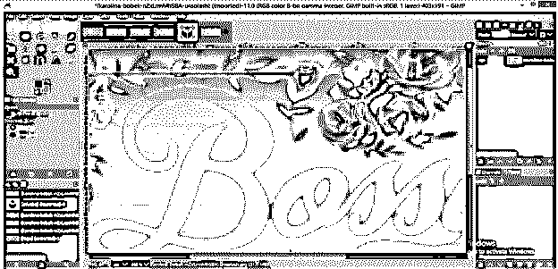

现在让我们放大 EDUCBA 徽标，看看 None 和 NoHolo 插值选项的效果。

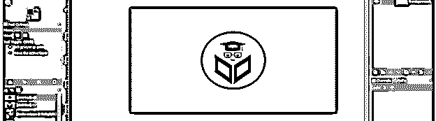

我会把它放大到原来的 200 %。

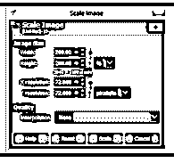

这是无选项放大该徽标的效果。它开始有点像素化，因为我们只取 200 %。缩放比例将取决于您的计算机系统空间。

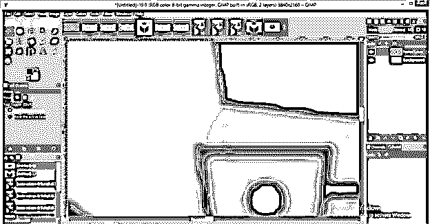

现在对 NoHalo 选项做同样的操作。

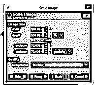

看效果。它有一个更好的结果。

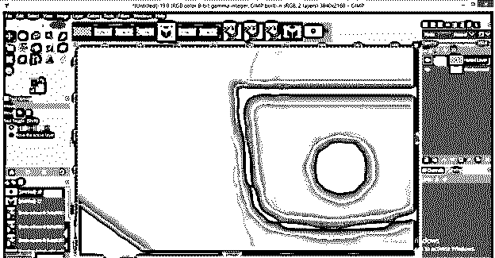

这样，您可以使用无损功能调整任何图像的大小以用于不同的目的。

### 结论

这难道不是 GIMP 软件的一个非常好的特性吗？因为它在许多方面帮助你在不同的平台上拥有一个完美的图像尺寸。现在通过调整图像大小工具的不同参数和这个软件的特点来获得更多的知识。

### 推荐文章

这是一个 GIMP 调整图像大小的指南。在这里，我们讨论调整图像大小工具的不同参数和这个 GIMP 调整图像的特性，以获得更多的知识。您也可以看看以下文章，了解更多信息–

1.  [GIMP 替代方案](https://www.educba.com/gimp-alternatives/)
2.  [最佳照片编辑](https://www.educba.com/best-photo-editors/)
3.  [用 HTML 设计网页](https://www.educba.com/design-web-page-in-html/)
4.  [CorelDRAW 标志设计](https://www.educba.com/coreldraw-logo-design/)

