# GIMP 像素艺术

> 原文：<https://www.educba.com/gimp-pixel-art/>

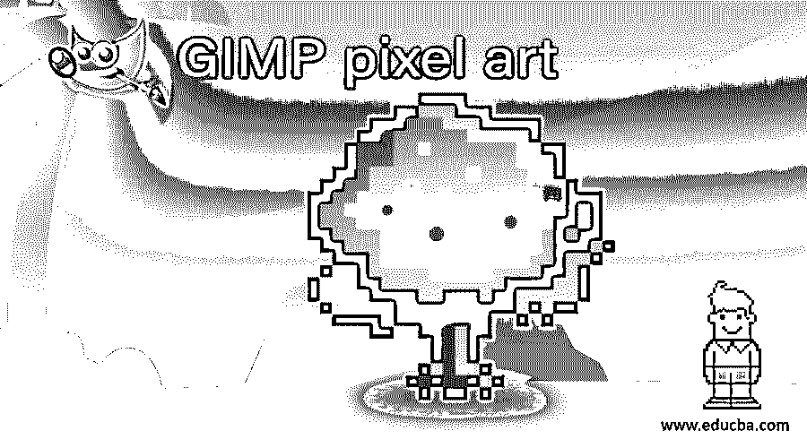

## GIMP 像素艺术简介

正如你从像素这个名字可以理解的，像素艺术是一种在任何文档区域的每个像素上创建的艺术，它通常用于设计视频游戏的角色和对象。我们有一个非常有限的颜色范围，从调色板使用它们来创建像素艺术字符和对象。在 GIMP 中，pixel art 也可以通过使用工具面板的一些工具来创建，我们还需要做一些设置来在文档区域获得 1 x 1 的像素。所以让我们好好讨论一下。

### 如何在 GIMP 中创建像素艺术？

让我们有一个制作像素艺术字符的文档，因为我们将通过设计字符来理解像素艺术。所以去菜单栏的文件菜单，点击它，然后点击“新建”选项，向下滚动列表。

<small>3D 动画、建模、仿真、游戏开发&其他</small>

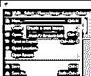

单击后，您将看到此对话框。此对话框的设置在像素艺术中起着主要作用，所以请注意。

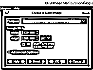

对于像素艺术，我们一般采用 60 x 60 或 64 x 64 的文档尺寸。你也可以拿小号的。我们这样做是为了让我们的文档上有像素，一旦我们有了像素，我们就可以轻松地一个像素一个像素地绘制艺术作品。我将把 60 x 60 作为我的文件尺寸。

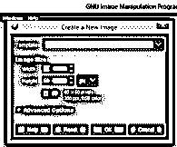

并确保选择以文档尺寸值为单位的像素。

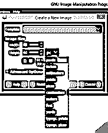

现在转到这个盒子的高级设置，设置分辨率为 72。

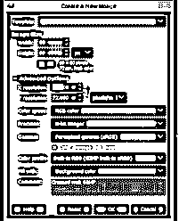

这些都是非常重要的设置。所以要非常小心。现在我们将得到这种类型的文档，它非常小。

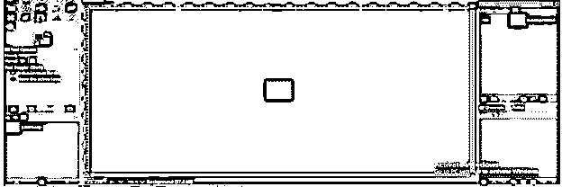

我们将在一个透明图层上创建我们的像素艺术，这样我们就可以在任何背景上使用它。所以点击图层面板的新建按钮，在这个白色填充的图层上新建一个图层。

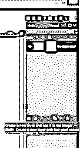

现在选择这个对话框中的透明度选项，点击确定。

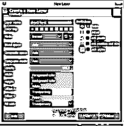

我们使用白色背景层只是为了在绘制像素艺术的过程中具有适用性。现在让我们放大一个文档，以便正确地看到它。

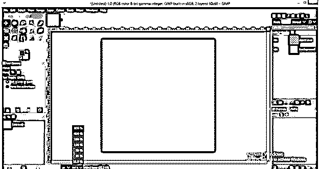

像素艺术有任何对象的对称设计，所以让我们有一个网格线将这个文件分为两半水平和垂直。因此，进入图像菜单，进入指南选项，然后点击新指南(按百分比)选项。

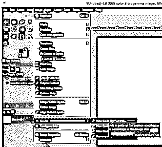

然后将水平导轨的位置值设为文件尺寸的 50 %,并点击确定。

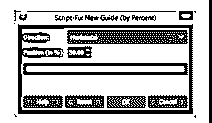

你现在会有这种类型的指南。

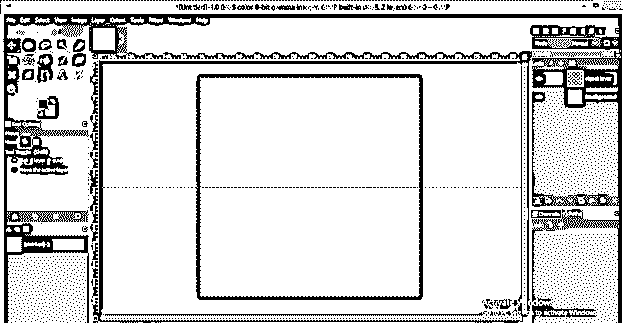

再次使用相同的选项，这一次，在这个框中选择垂直，50 %的值，点击确定。

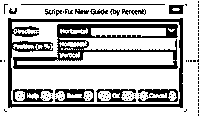

现在我们的对称向导准备好了。

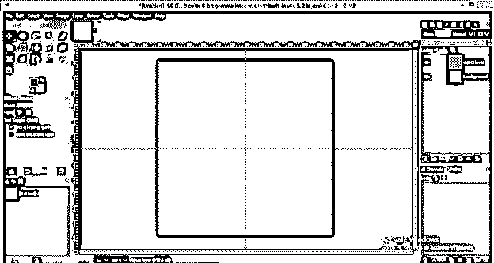

现在转到视图菜单，单击向下滚动列表的显示网格选项，在我们的文档上显示一个网格。

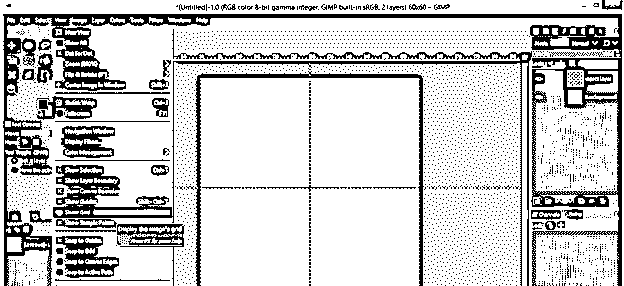

你会得到你的网格线。这不是像素艺术需要的网格大小。我们的要求是像素艺术的 1×1 像素大小，所以如果你得到这种类型的大指南。

然后转到编辑菜单的首选项选项。

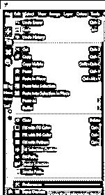

点击这个对话框的默认网格选项，设置水平和垂直值为 1，然后点击确定。

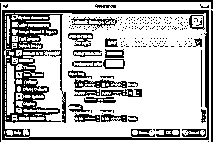

如果你没有得到你设置的网格值，那么关闭 GIMP 并重启它；然后，你将有这种类型的网格是 1×1 像素大小。

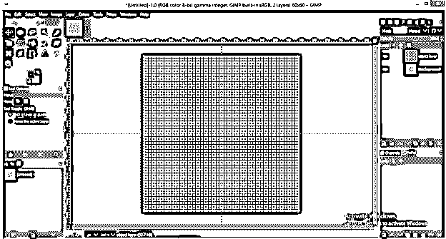

我们使用铅笔工具来绘制像素艺术像素艺术，因为如果你使用画笔工具，它会给你一个羽毛的笔画，这不会创建一个像素。所以拿个铅笔工具。

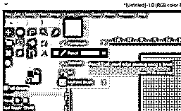

将铅笔尖的大小设为 1，这样我一次点击只覆盖 1 个像素。如果您增加铅笔尖的大小，它将根据大小一次覆盖多个像素。所以这是像素艺术工作中非常重要的一点。

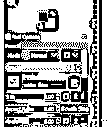

现在点击这个网格的方块。这些块表示像素。一个方块代表一个像素，一旦你用铅笔工具点击，它就会像这样画出来。

如果你想删除任何绘制的像素，然后采取橡皮擦工具。

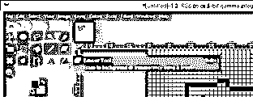

并点击不需要像素，但是你会注意到它不会一次点击就清除像素。它只是淡化它，当你一次又一次地重复时，点击那个像素，它就会从那个区域消失。

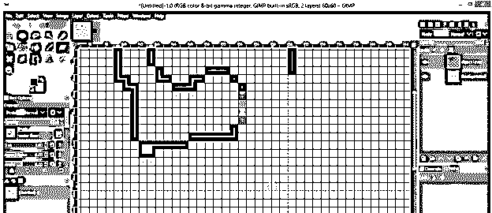

擦除一次点击擦除工具只需在橡皮擦工具的参数中进行一些设置。使其参数的渐变长度值为 0。

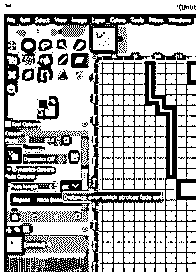

并启用“硬边”选项。

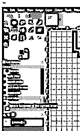

现在再一次，点击你想要移除的像素，这一次像素会在橡皮擦工具的一次点击中移除。

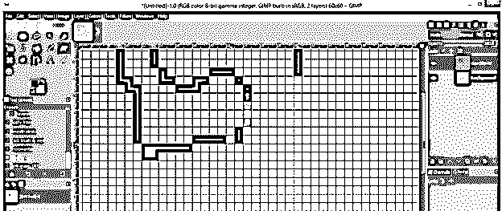

现在让我们用像素艺术的方法画一个字符。采取椭圆选择工具。

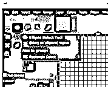

并启用此工具的抗锯齿选项，因为我们不需要像素艺术作品的平滑度。

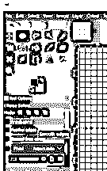

现在做这个圆，在网格交叉点的中心调整。

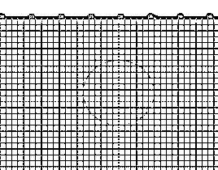

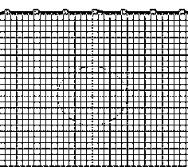

现在转到路径选项卡，点击路径选项卡的选择路径按钮，在这个圆上选择一个路径。

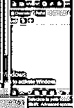

并启用路径选项卡中的眼睛按钮，以查看围绕此圆的路径。

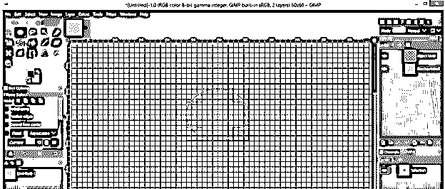

现在使用路径工具。

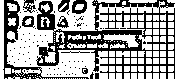

用此工具点击圆形路径，然后点击此工具参数的笔画路径选项。

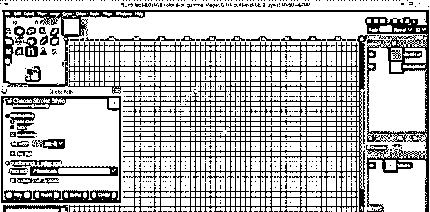

在绘画工具选项中选择铅笔。

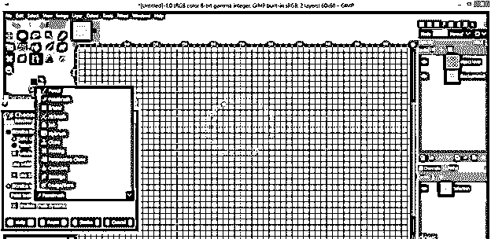

你可以在点击 Ok 之前选择你想要的颜色。

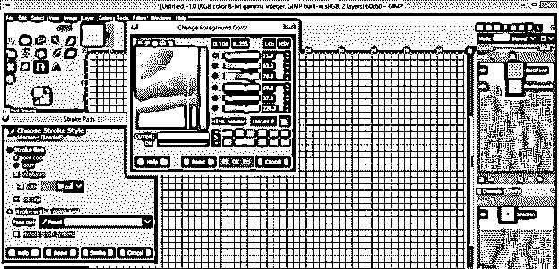

现在你会有一个像素的笔画，就像这样。

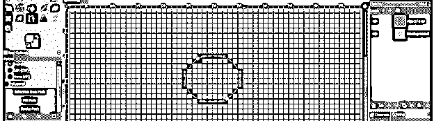

你可以注意到，除了一个像素之外，网格两边的像素数量相等；这是由于圆的曲线。可以删除，因为像素艺术需要对称。

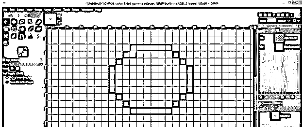

现在只需在像素上移动铅笔工具，通过保持对称性来填充颜色。

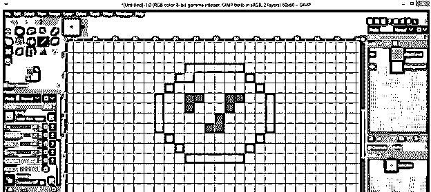

有时候没有两边做对称像素的选项，那就不用担心；在那里留下一个像素颜色。

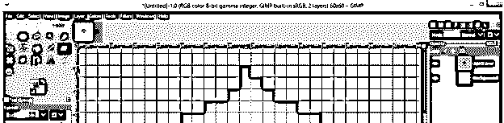

我用像素艺术的方法做了这个。

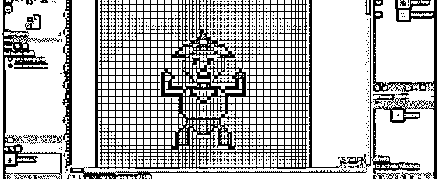

### 结论

你一定会在学习像素艺术中找到极大的乐趣，现在你很兴奋能在自己的 GIMP 软件中这样做，所以去尝试一下，以便很好地掌握 GIMP 的这个特性，因为通过这篇文章，你已经很好地了解了它的参数。

### 推荐文章

这是一个 GIMP 像素艺术的指南。在这里，我们讨论这个 GIMP 像素艺术的不同参数和特性，以获得更多的知识。您也可以看看以下文章，了解更多信息–

1.  [GIMP 替代方案](https://www.educba.com/gimp-alternatives/)
2.  [插画替代方案](https://www.educba.com/illustrator-alternatives/)
3.  [Photoshop 中的夜间效果](https://www.educba.com/night-effect-in-photoshop/)
4.  [Photoshop 金色渐变](https://www.educba.com/photoshop-gold-gradient/)

