# GIMP 反转颜色

> 原文：<https://www.educba.com/gimp-invert-colors/>

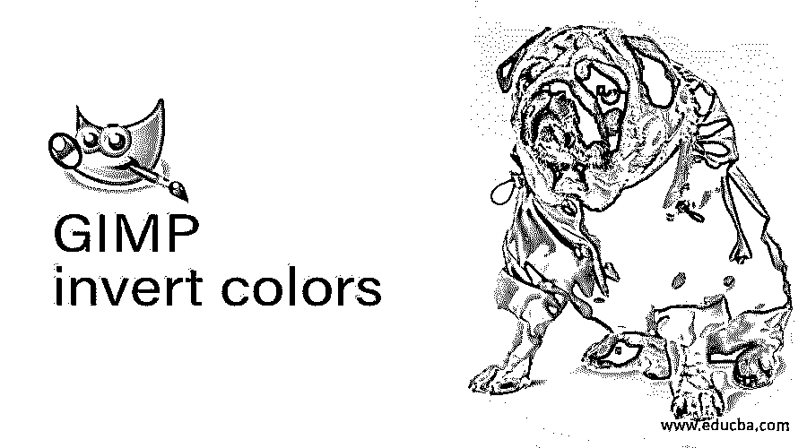

## GIMP 反转颜色简介

反转颜色是 GIMP 软件的一个非常有趣的特性，你可以把它看作是一个工具或者特性，通过它我们可以得到与图像中任何颜色完全相反的颜色。我们所说的相反颜色是指色轮上的相反颜色，例如，我们将青色作为红色的相反颜色，将黄色作为蓝色的相反颜色，将品红色作为绿色的相反颜色，通过反转选项，我们可以将任何颜色替换为其相反颜色，以使任何文本与背景之间具有良好的对比度，并用于许多其他重要的操作工作。所以让我们讨论一下这个反转颜色选项在 GIMP 中是如何工作的。

### 如何在 GMIP 使用反转颜色？

使用这个特性并不是很难，但是你必须理解色彩理论，以便在你的设计工作中很好地使用这个特性来获得有效的结果。但是在我们讨论这个特性之前，我想我们必须快速浏览一下这个软件的用户界面，这样你就可以很容易地理解我们在这篇文章中使用的术语。

<small>3D 动画、建模、仿真、游戏开发&其他</small>

GIMP 的用户界面分为三个主要部分，即用户界面左侧的工具面板及其属性面板。在这个面板的中间，我们有一个显示窗口，我们可以在其中创建我们的文档或放置一个图像来处理它，在这个显示窗口的右侧，我们有一些其他重要的选项卡，如层的面板，通道选项卡，路径选项卡和其他您想要的。在这三个部分的顶部，我们有一个菜单栏，它有许多菜单，比如文件、编辑、选择等等，这有助于我们在 GIMP 中进行不同的操作。

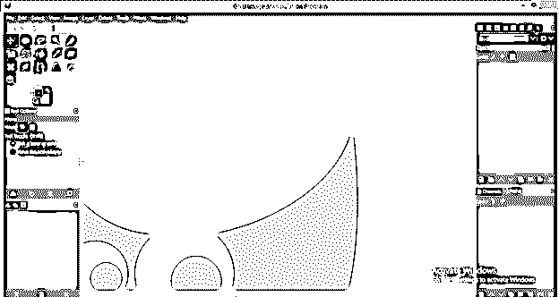

我想你现在已经很了解用户界面了。所以让我们有一个开始学习的图像。为此，请转到菜单栏的文件菜单并单击它。然后点击向下滚动列表的打开选项，或者你可以简单地通过移动按钮将图像从其保存的文件夹拖到 GIMP 软件中，然后释放它。我会有这个 EDUCBA 的标志图像，代表我们作为电子学习图形设计公司。

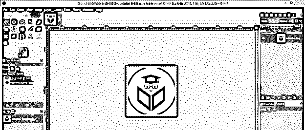

让我们先来看看最简单的反转颜色的方法。为此，在图层面板中选择这个徽标的图层，然后转到菜单栏的颜色菜单并单击它。这里会有一个向下滚动的列表；转到此列表的反转选项并单击它。

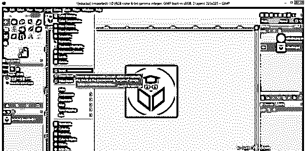

现在你将有相反的颜色后，你的图像颜色点击反转选项。在这里，您可以看到黑色转换为白色，蓝色调转换为黄色调，绿色调转换为洋红色调，这意味着根据任何图像中的颜色调，它将覆盖相反的颜色形状。

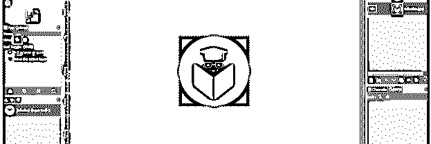

让我们撤销这个反转，并复制这个徽标图像，以了解 GIMP 的另一个反转选项。要复制一个副本，去图层面板，点击选择一个原始图层，然后去图层面板的底部，点击创建复制图层按钮。

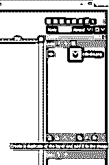

现在，再次进入菜单栏的颜色菜单并点击它。现在，这一次，点击向下滚动列表的线性反转选项。

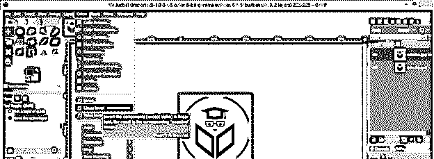

你会有一些不同的效果，用这个线性的反转选项。它会给你相反颜色的光的形状。

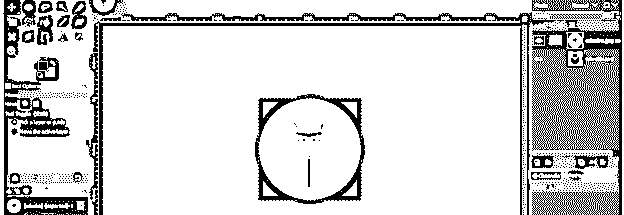

现在再一次，通过按下键盘的 Ctrl + Z 按钮来撤销这个线性反转，然后在图层面板中选择这个图层，或者如果你不干扰这个线性反转图层，你可以为下一个反转选项再次复制一个图层。现在再次进入菜单栏的颜色菜单，点击向下滚动列表的数值反转选项。

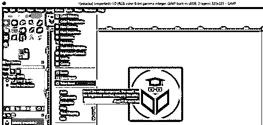

它将改变色轮上的颜色值，以给出这种类型的反转效果。

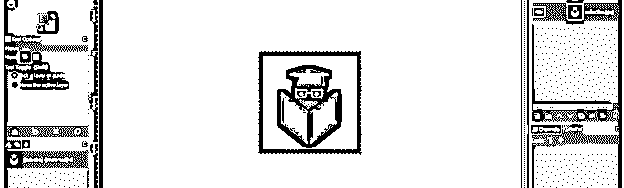

现在，让我们了解一下独立通道上的反转选项。为此，请转到工作屏幕右侧的频道标签。

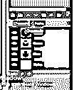

如果你的 GIMP 用户界面中没有频道标签，那么转到窗口菜单，然后点击它。转到可停靠对话框选项，然后单击新下拉列表中的频道选项。

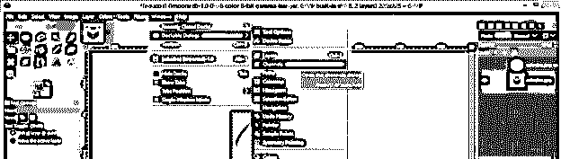

我们在一个通道中有三种颜色，即红色、绿色和蓝色。

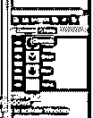

如果您无法通过点击眼睛按钮切换到红色通道，那么您的图像上将只有蓝色和绿色。

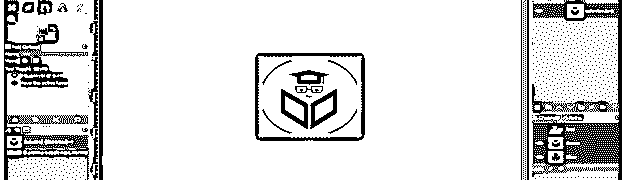

现在用和上一步一样的方法反转它，你会得到一个没有红色通道的漂亮的反转效果。

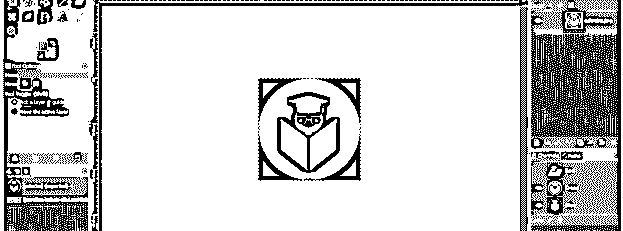

现在，通过点击蓝色通道的眼睛按钮，从通道面板关闭蓝色通道。

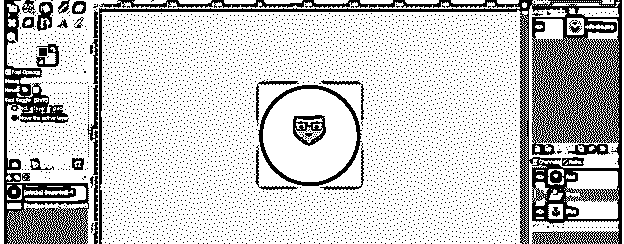

通过点击菜单栏颜色菜单的反转选项来反转它。根据你的选择，你可以选择任何一个反转选项，它会给你这种类型的反转效果。

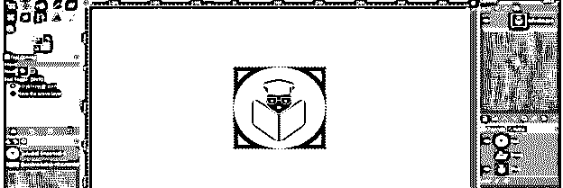

现在关闭蓝色通道，点击这个通道的眼睛按钮。

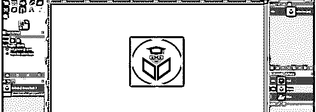

反转这个图层，没有蓝色通道，你可以看到这是反转颜色选项的另一个好效果。

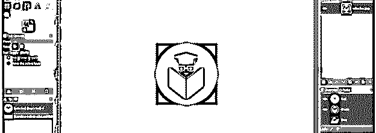

我会说尝试另一个选项:这一次两个通道，看到一个通道上的反转颜色选项。在这里，我将关闭红色通道和蓝色通道，点击两层的眼睛按钮。

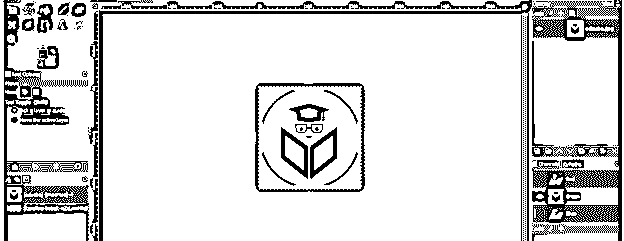

再次进入颜色菜单，点击反转选项；现在只看效果，是不是很酷的效果。

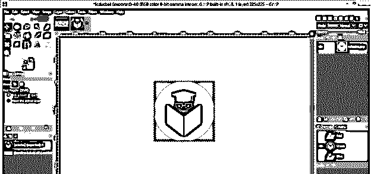

这样，你可以在你的图像上创建反转颜色的效果，以获得一个有效的结果。

### 结论

阅读完本文后，GIMP 软件的反转颜色功能对您来说将不再是一个新词，您可以轻松地分析它的参数，以便在您的图像上使用反转颜色。对于在图像的两个不同对象之间具有良好的对比度来说，这是一个非常好的特征。

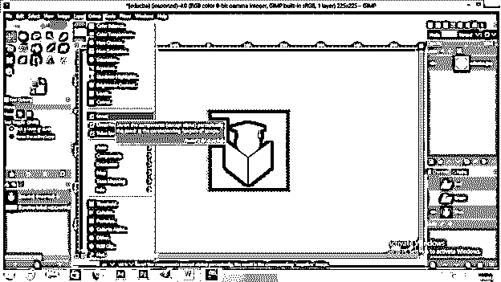

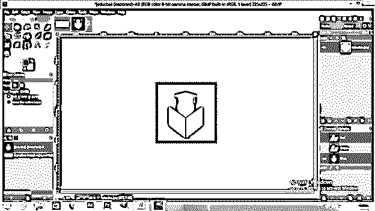

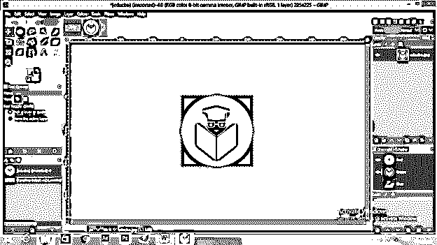

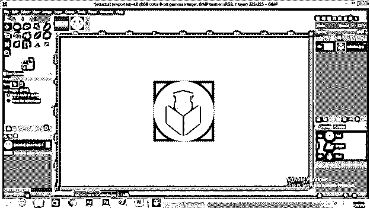

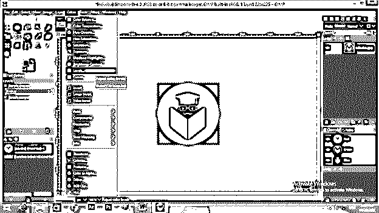

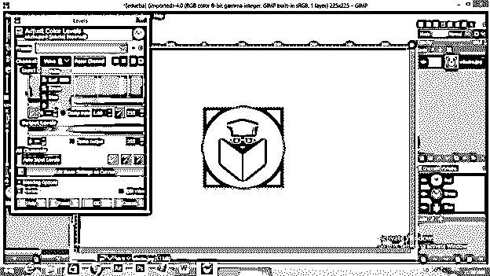

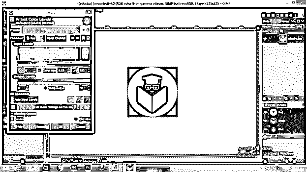

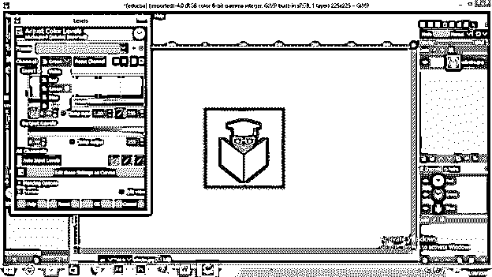

### 推荐文章

这是一个 GIMP 反转颜色的指南。在这里，我们讨论这个 GIMP 反转颜色的不同参数和特性，以获得更多的知识。您也可以看看以下文章，了解更多信息–

1.  [GIMP 替代方案](https://www.educba.com/gimp-alternatives/)
2.  [最佳平面设计软件](https://www.educba.com/best-graphic-design-software/)
3.  [Photoshop 中的夜间效果](https://www.educba.com/night-effect-in-photoshop/)
4.  [Photoshop 金色渐变](https://www.educba.com/photoshop-gold-gradient/)

