# GIMP GIF

> 原文：<https://www.educba.com/gimp-gif/>

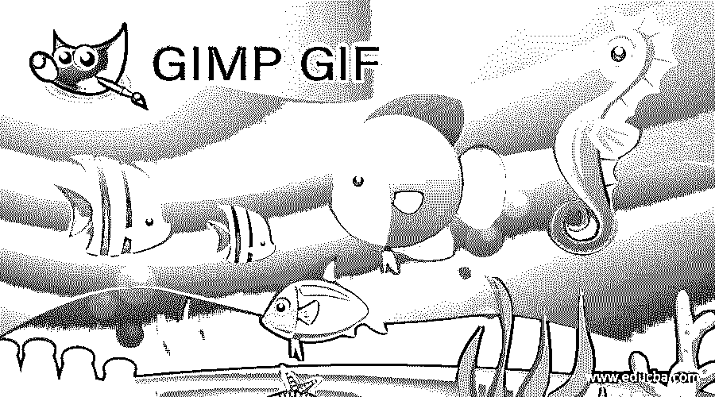

## GIMP GIF 简介

GIF 代表图形交换格式，它是一个视频文件，但文件扩展名是图像文件，这意味着当你打开它时，你会看到一个循环动画，而不是图像。在 GIMP 中，您可以通过将任何动画的场景按顺序排列在不同的层上来创建它，或者您可以通过将它们放在 GIMP 的不同层上来创建文本动画或形状动画。你只需要按照你想要在 gif 上显示的顺序来排列它们。我们还将了解导出参数及其特性，以便为我们的有序层创建 gif。所以让我们分析它的每一个方面。在这个主题中，我们将学习 GIMP GIF。

### 如何在 GIMP 中创建 GIF？

为了在 GIMP 中制作 gif，您可以在不同的图层上放置图像或绘制形状或文本。我们将通过在不同的层上创建一些不同颜色和大小的几何形状来理解它。因此，让我们有一个 200 x 200 像素大小的文件。我们采取较小的文件大小为 gif，所以它可以正常工作，没有大文件大小。

<small>3D 动画、建模、仿真、游戏开发&其他</small>

转到菜单栏的文件菜单，点击，然后转到下拉列表的“新建”选项，并在对话框中设置大小为 200 x 200，然后点击确定。

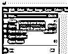

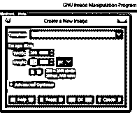

现在，我们将在这里得到所需大小的文档。我将用黑色填充背景层。你可以用你想要的颜色填充它。

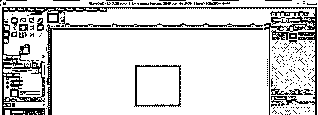

现在让我们有一个文件中心的指导方针。对于水平和垂直指南，进入菜单栏的图像菜单并点击它，然后进入指南选项并点击新的向下滚动列表的新指南(按百分比)选项。在对话框中选择 50 %的水平选项，并重复此操作，在“打开”对话框中选择 50%的垂直选项。

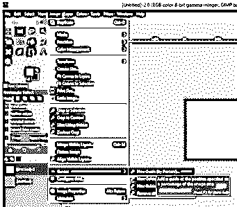

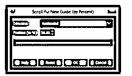

我们将在这里有我们的指导方针，并将文件的中心放在这两层的交叉处。现在从 GIMP 的工具面板中选择矩形选择工具，或者按 R 键作为快捷键。

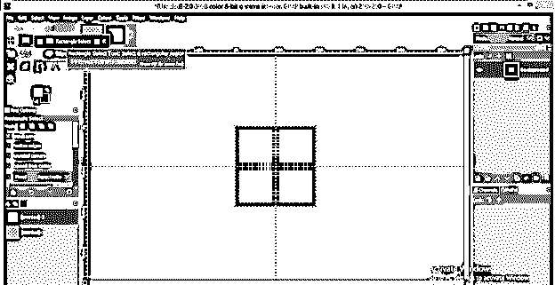

使用矩形选择工具画一个这样的正方形，并将其移动到文档的中心(参考线的交叉点)。

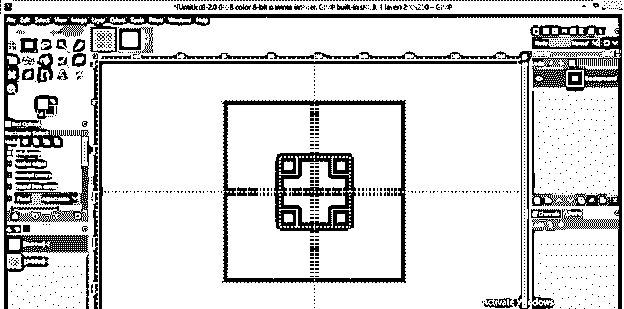

用白色填充这个矩形。为填充它，设置白色为颜色框的前景色，进入编辑菜单，然后点击向下滚动列表的填充 FG 颜色选项。

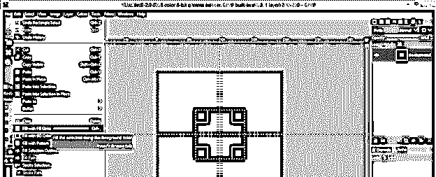

禁用此矩形周围的选择。为此，单击菜单栏选择菜单的滚动列表中的无选项。

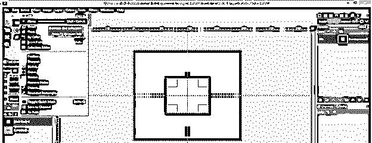

现在通过点击 GIMP 图层面板的创建副本按钮来复制这个图层，这个按钮在图层面板的底部。

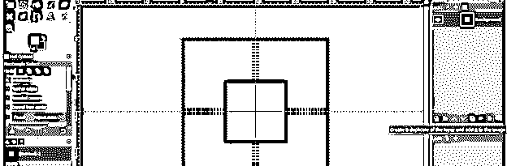

并从复制层中删除 square。要删除它，选择它并点击键盘上的删除按钮。现在从 GIMP 的工具面板中选择椭圆选择工具，或者按 E 键作为快捷键。

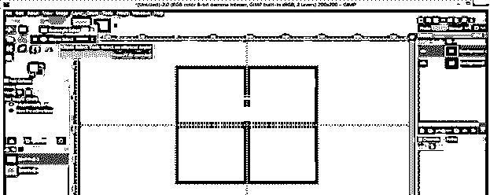

画一个和我们在上一层画的正方形差不多大小的圆，并把它移动到文档的中心。

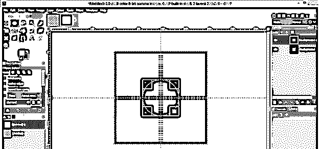

用白色填充它。您也可以使用工具面板的“桶”工具来填充圆形选区中的颜色。只需将你想要的颜色设置为颜色框的前景色，从工具面板中选择桶工具，然后用这个工具点击圆形选区来填充它。

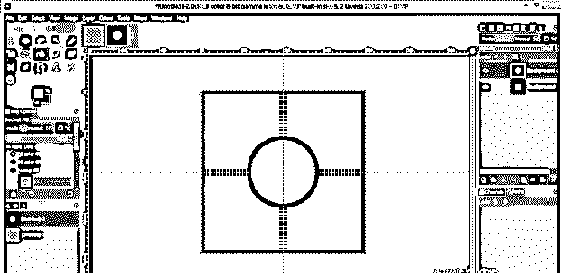

通过点击菜单栏的选择菜单中的无选项来禁用选择，再次通过点击创建复制按钮来复制一个图层。

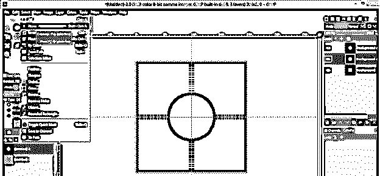

这一次，我们将使用相同的椭圆工具制作一个较小的圆，并用黄色填充。你可以用你想要的颜色填充它。

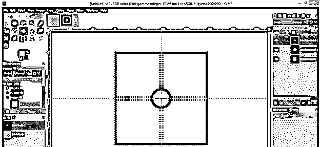

用同样的方法再复制一个图层，用黄色作为填充颜色，再画一个比之前的正方形小的正方形(使用矩形选择工具)。你也可以用另一种颜色。

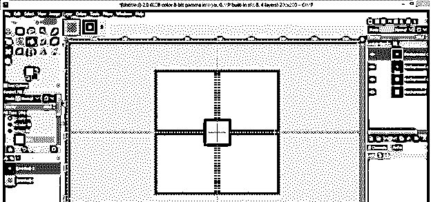

现在转到 GIMP 的图层面板，按照你想在 gif 文件中显示的顺序排列你的图层。在“图层”面板中从上到下排列它们。如果你有几层，你可以给它们一个像层名一样的数字，以便更好地排列它们。我将按照这个顺序排列我的图层。

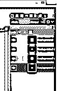

现在点击菜单栏的文件菜单，会打开一个下拉列表；然后单击下拉列表中的“导出为”选项或按 Shift + Ctrl + E 作为快捷键。

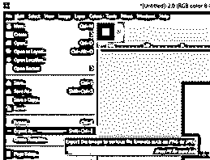

我们将有一个像这样的导出图像对话框。在这里，根据您的选择命名您的 gif 文件，并选择您想要在计算机上保存的位置。我会把它保存在我电脑的桌面上。

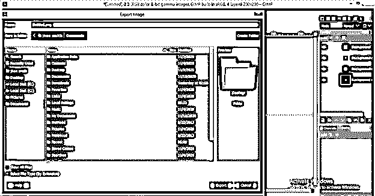

现在点击此对话框的“选择文件类型”选项，从文件类型列表中选择 gif 扩展名作为文件扩展名，然后点击此对话框的导出按钮。

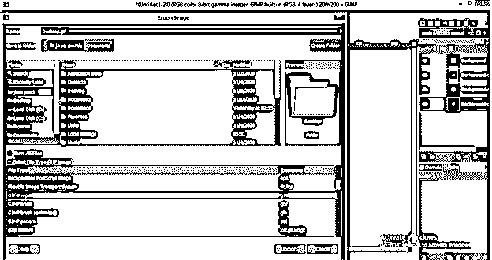

将会打开一个新的对话框。启用此对话框中的“作为动画”选项，制作所选图层的 gif 动画。

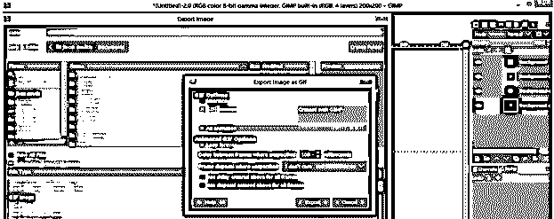

您可以选择顺序层的过渡之间的时间间隔。一旦你设置了这个框的所有参数，点击导出按钮。

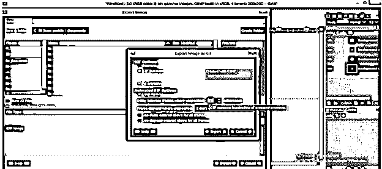

现在，当我们从保存的文件夹或位置打开 gif 文件时，我们将在 GIMP 的不同层上绘制的形状之间进行转换。它们之间的转换将是连续的，因为这是一个循环。

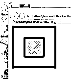

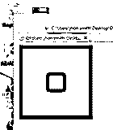

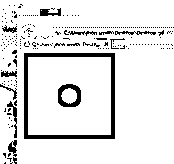

这样，您可以在 GIMP 中创建一个 GIF 文件，它是您自己的图像文件或任何带有您想要的过渡的形状文件。

### 结论

这是一个在 GIMP 中创建 gif 的例子，我想现在你可以理解如何通过在不同的图层上使用图像、形状或文本来创建 gif 了？您还可以对其参数进行一些更改，以便在此功能中获得更好的结果。

### 推荐文章

这是 GIMP GIF 的指南。这里我们讨论如何在 GIMP 中创建 gif，以及在 GIMP 中创建 GIF 的例子。您也可以阅读以下文章，了解更多信息——

1.  [灯箱的替代方案](https://www.educba.com/alternative-for-lightroom/)
2.  [Illustrator 中的动作](https://www.educba.com/action-in-illustrator/)
3.  [在 Illustrator 中创建表格](https://www.educba.com/create-table-in-illustrator/)
4.  Illustrator 中的[滤镜](https://www.educba.com/filters-in-illustrator/)

