# GIMP 法线贴图

> 原文：<https://www.educba.com/gimp-normal-map/>

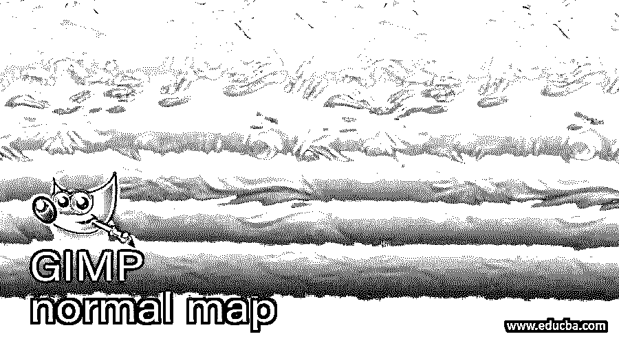

## GIMP 法线贴图介绍

法线贴图是 GIMP 的一个特性，通过它，我们可以增加任何普通纹理的细节，以便在该文本的材质上获得自然的高光，我们稍后将在其他 3d 设计软件的 3d 模型中使用它。在 GIMP 中，我们没有法线贴图的任何内置特性，所以我们必须为 GIMP 中的法线贴图获得一个插件。今天在这篇文章中，我们将了解如何使用一个法线贴图插件来增加大理石砖墙上的纹理细节，我们也将学习如何在 GIMP 中安装这个插件。那你还在等什么让我们开始吧。

### 如何在 GIMP 中执行法线贴图？

在学习如何使用法线贴图之前，我们必须在 GIMP 中有一个法线贴图的插件。所以先放开浏览器，搜索 GIMP 法线贴图插件’。

<small>3D 动画、建模、仿真、游戏开发&其他</small>

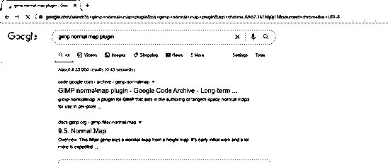

点击搜索的第一个链接，转到下载标签，然后根据你的电脑操作系统下载这个插件的设置。

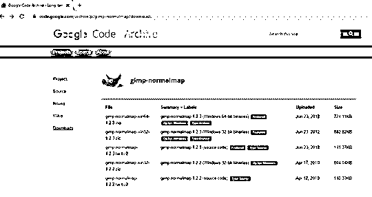

您将拥有这个插件的 zip 文件。

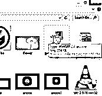

现在将它解压到 GIMP 的 Plugins 文件夹中。为此，进入 c 盘>程序文件> GIMP 2 > lib > gimb > 2.0 >插件，点击 Ok 按钮。

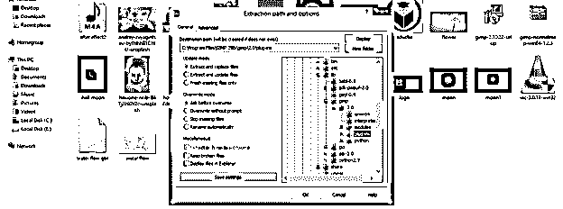

现在从 GIMP 的 plug-ins 文件夹中选择这三个文件并复制它们。

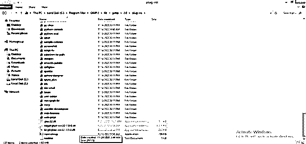

并粘贴到 GIMP 的 bin 文件夹中。

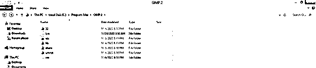

现在重启 GIMP 软件。

现在让我们有一个在浏览器上为纹理搜索纹理应用法线贴图的纹理。

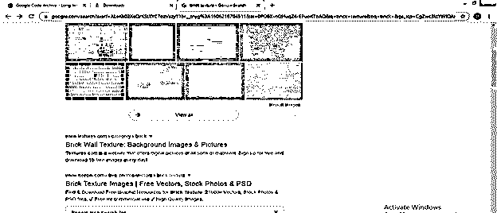

我将下载这个大理石砖块。

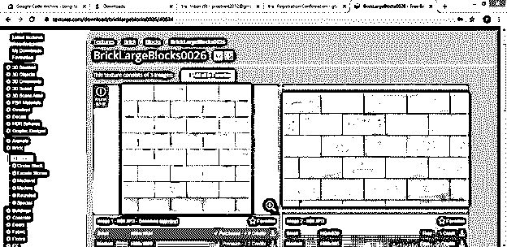

现在进入 GIMP 用户界面，点击菜单栏的 File 菜单。点击打开选项，在 GIMP 中打开这个纹理。

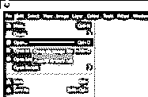

选择你想要的文件夹，然后点击打开按钮。

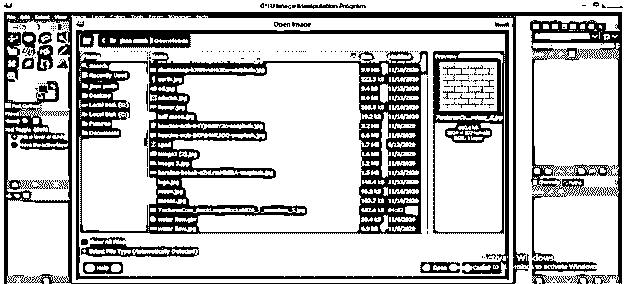

现在我们有了这个纹理。

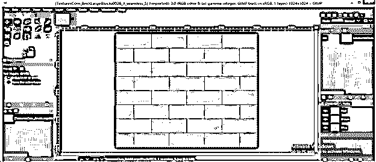

让我们把它弄得更黑更白，看看上面的法线贴图效果。转到菜单栏的颜色菜单，然后去饱和，并点击新的向下滚动列表的去饱和选项。

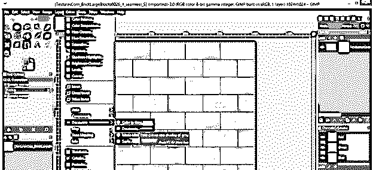

现在在去饱和对话框的模式选项中选择亮度选项，点击 ok。

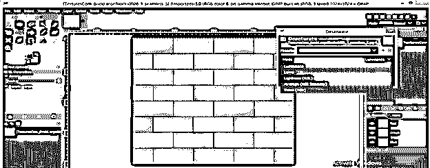

现在让我们使这个纹理图像的亮区更亮，暗区更暗。你可以选择任何一个选项来做这件事，那就是亮度对比度、色阶或曲线。我会选择曲线型。

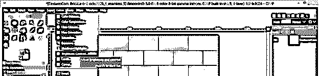

现在向上拖动曲线的这个区域，增加图像明亮区域的亮度。

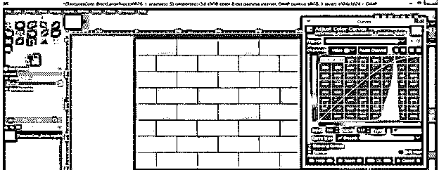

向下拖动曲线的左侧区域，使图像的暗区变暗。我们这样做是为了在这个图像的黑白颜色之间有良好的对比度。

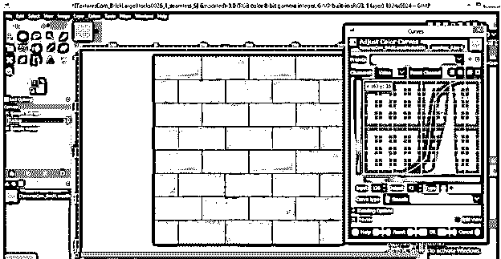

现在转到菜单栏的过滤器菜单和地图选项，然后点击新的向下滚动列表的法线地图选项。如果你已经在你的电脑上安装了这个法线贴图插件，你将只有在这个列表中有这个法线贴图选项。

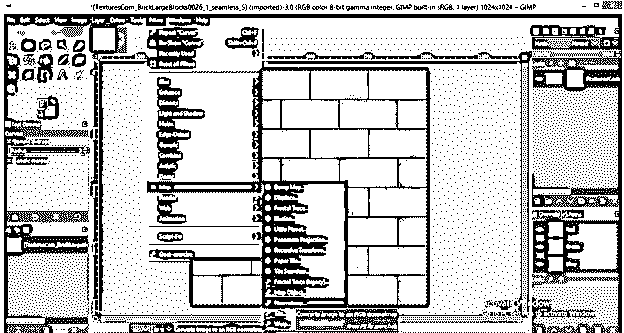

一旦你点击这个选项，你会看到这个法线贴图对话框。

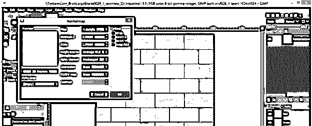

你可以看到 Alpha 通道和高度源选项在这个对话框中是禁用的，所以要启用它们，请转到 GIMP 的图层面板，右键单击纹理层，然后单击下拉列表中的添加 Alpha 通道选项。

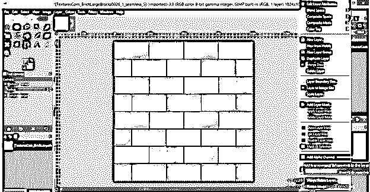

现在重新打开这个对话框，这一次您将像其他选项一样激活这两个选项。

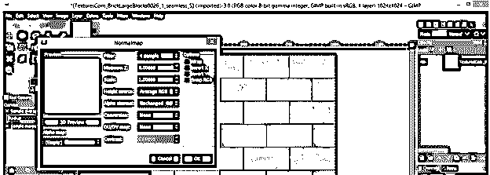

现在点击这个对话框的 3d 预览按钮来查看这个纹理的 3d 预览。

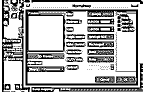

这是 3d 预览对话框。

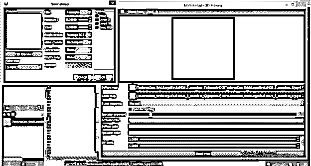

在 3d 预览框中按住该块并旋转，以查看该平面上的纹理。你可以看到在你的纹理平面上有一个砖块形状。

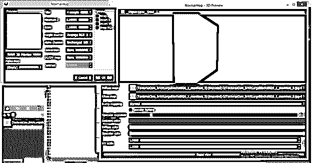

现在你可以使用这个列表中的任何一个法线贴图框的过滤器来增加纹理的细节。你可以看到这个列表的每一个滤镜在你的纹理上一个接一个的效果。

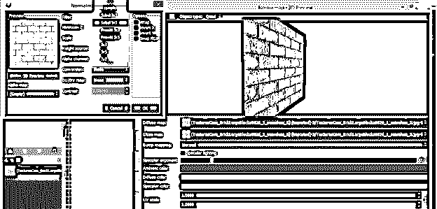

我将选择一个 3 x 3 的过滤器，它将调整这个纹理的 3 x 3 像素的 RGB 值，并对其细节进行浮雕。增加“缩放”值以增强更多细节。

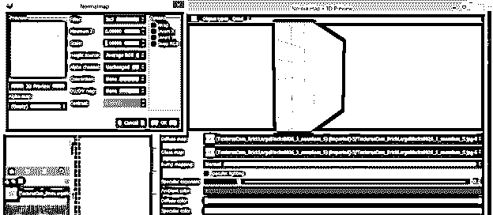

可以按住键盘的 Alt 键，然后做鼠标右键按住；然后移动鼠标在预览窗口中放大或缩小该对象。现在启用此对话框的反转 X 选项，并查看其对浮雕细节的影响。它将沿着平面的向内方向运动。

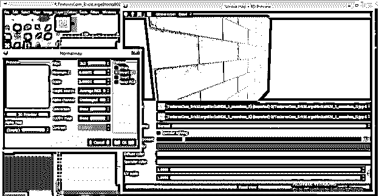

一旦你禁用了它，你可以看到它会从飞机的向外方向来。所以你可以根据自己的选择来选择这个选项。

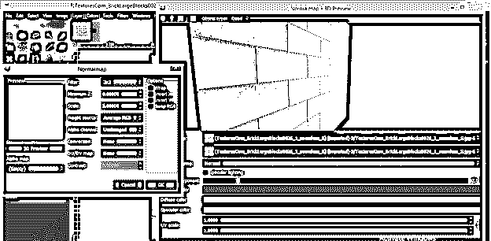

我们在这个预览窗口的顶部有一些选项。让我们也分析它们，以便在法线贴图上更好地处理。第一个按钮是“旋转对象”；点击启用它，你可以旋转你的纹理对象。

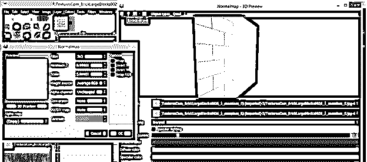

接下来是旋转灯按钮；点击它来选择它。

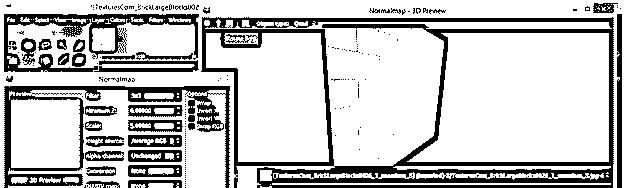

你可以在你的纹理上增加或减少光线。

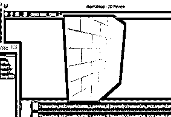

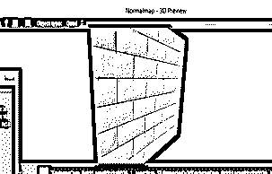

您也可以在另一个 3d 形状中查看预览。从列表中选择任何人。

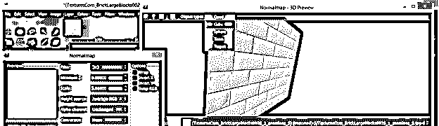

你可以选择立方体、球体或任何你想要的东西。它会让你知道当你在 3d 模型上使用它时会是什么样子。

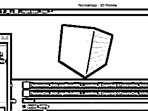

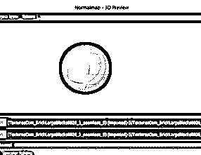

一旦你完成了所有你想要的设置，点击法线贴图对话框的 Ok 按钮。

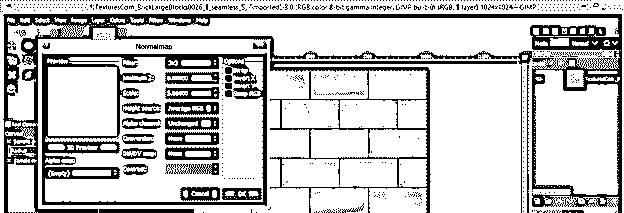

你将有你的法线贴图在你的纹理上，并且有你设置的法线贴图的参数。现在将它导出为 PNG 或 JPEG 文件，以便在任何其他 3d 建模软件中使用。为此，请转到菜单栏的文件菜单，然后单击导出为选项。

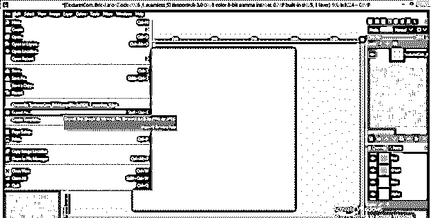

使用所需的文件扩展名将其保存在所需的位置。

### 结论–GIMP 正常图

在这篇文章中，你一定会发现法线贴图对于增强任何材质的细节都是一个非常令人兴奋和有用的特性，你将在 3d 模型上使用它作为材质。现在，您可以轻松地操作法线贴图的参数，以在您的纹理上获得有效的结果。

### 推荐文章

这是一个 GIMP 法线贴图的指南。在这里，我们讨论 GIMP 法线贴图对于增强任何材质细节的有用特性。您也可以阅读以下文章，了解更多信息——

1.  [最佳照片编辑](https://www.educba.com/best-photo-editors/)
2.  [什么是平面设计？](https://www.educba.com/what-is-graphic-design/)
3.  [GIMP 替代方案](https://www.educba.com/gimp-alternatives/)
4.  [变换工具 Photoshop](https://www.educba.com/transform-tool-photoshop/)

