# GIMP 删除背景

> 原文：<https://www.educba.com/gimp-remove-background/>

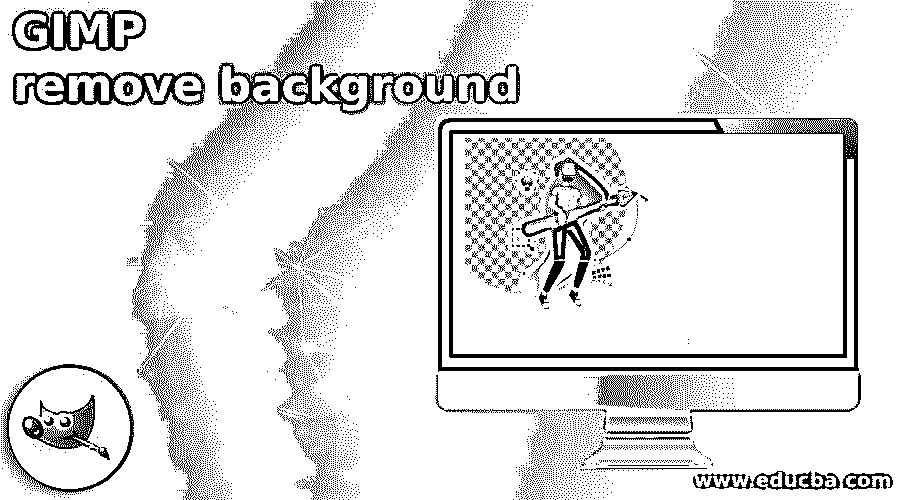

## GIMP 移除背景介绍。

去除背景对我们来说并不陌生。你可以通过删除任何图像的不需要的背景来理解它，因为在其他地方或其他参考中使用了它的主要对象。在 GIMP 中，我们可以通过使用不同的工具和特性以多种方式实现它。我们将使用模糊选择工具，路径工具，按颜色选择工具，并通过添加蒙版层到原始层。去除背景的不同方法的使用取决于图像的属性，例如图像的颜色对比度、物体的细节以及许多其他东西。因此，让我们找出哪种方法适合哪种图像。在这个主题中，我们将学习 GIMP 移除背景。

### 如何在 GIMP 中去除背景？

在 GIMP 中去除背景并不是一件非常困难的任务。你只需要根据图像的特征选择合适的方法来去除任何图像的背景。为了去除背景，我们必须围绕我们的主要对象进行选择，为了进行选择，我们在 GIMP 中有许多工具和方法。第一种方法是使用模糊选择工具。

<small>3D 动画、建模、仿真、游戏开发&其他</small>

**通过使用模糊选择工具。**

它将选择颜色像素进行选择，为了学习这种方法，让我们有一个 EDUCBA 的标志，它正式代表我们的形象。

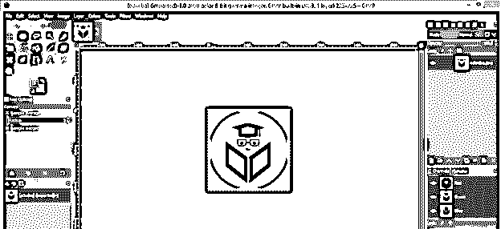

现在去工具面板，并采取模糊选择工具。

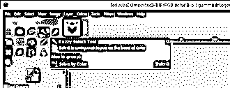

从该工具的参数面板中启用该工具的抗锯齿选项和绘制蒙版选项，以便它进行平滑选择，通过启用绘制蒙版选项，您可以在图像上看到带有洋红色的选择。

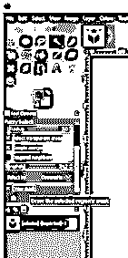

现在，在您想要移除的背景上单击并按住鼠标。您将看到您的选择洋红色。如果没有一次单击选择背景，您可以多次单击选择合适的背景。如果您想了解模糊选择工具，您可以阅读我们的模糊选择工具文章。

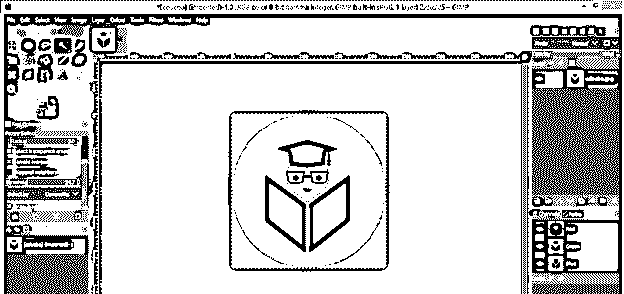

现在释放点击，你的选择就准备好了；为了有一个透明的背景，在图层面板中右键点击这个图层，然后点击添加 Alpha 通道选项。

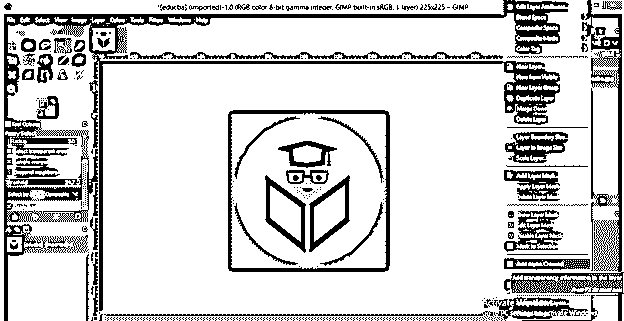

现在按删除按钮删除背景。

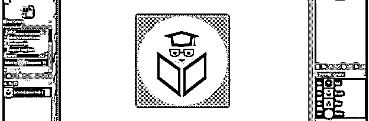

现在让我们用另一个图像来学习下一个方法。

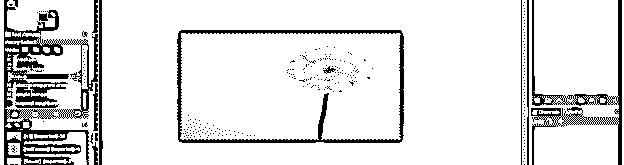

下一种方法是使用“按颜色选择”工具。

**使用颜色选择工具:**

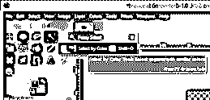

在“参数”部分启用该工具的抗锯齿、绘制蒙版和羽化选项。

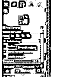

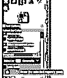

现在点击图像的背景，在背景周围拖动鼠标，选择合适的背景。您可以通过洋红色查看您的选择。

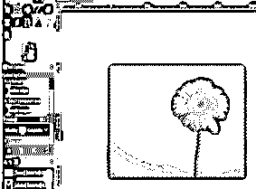

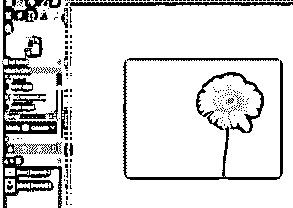

释放单击，您的选择就准备好了。现在去图层面板，右键点击这个图层，然后点击添加透明背景的 Alpha 通道选项。

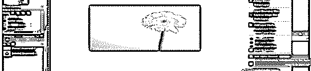

按删除按钮删除背景。

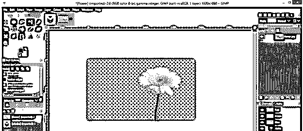

现在进入选择菜单，点击无选项来禁用对象周围的选择，你将有你的对象准备好了。

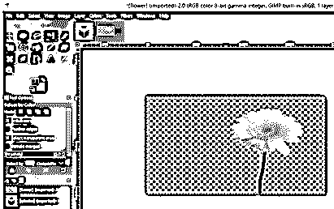

现在转到下一个方法，同样，我要拍一张新的照片。这次我将使用路径工具。

**使用路径工具:**

这是一个非常精确的选择，因为有了它，你可以在你的图像的主要对象的边缘创建一个路径，并做出一个好的选择。因此，从工具面板中选择路径工具。

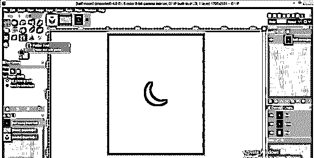

我想删除这个半月形的背景，所以通过点击这个月亮的边缘在它周围做一个选择。

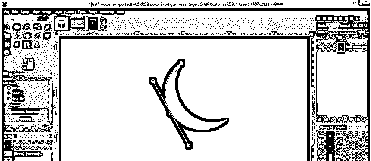

一旦你在你的对象周围创建了一个路径，按住键盘的 Ctrl 键并点击路径的起点来关闭路径。

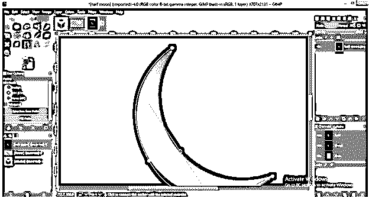

您可以稍后或在使用路径工具创建路径后调整对象的曲线。只需握住路径节点的手柄，并将其调整为合适的曲线。

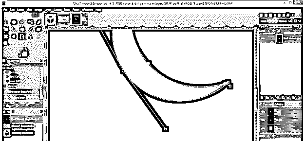

现在按回车键将路径转换成选择。

这个选区是围绕着一个物体的，我们想去掉背景，因此，进入选择菜单，点击反转选项，选区将围绕着背景。

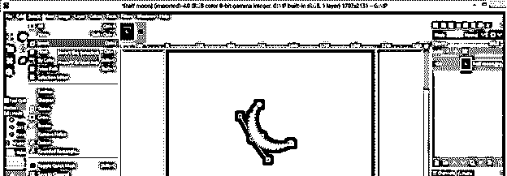

使点击添加透明背景的阿尔法通道选项。

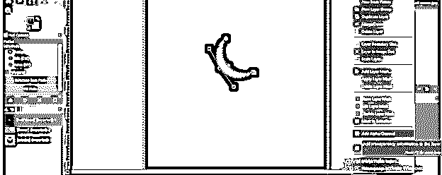

按键盘上的删除键，背景会删除。

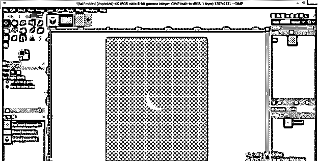

让我们来看看下一个方法，这是通过使用原始图像层制作图层蒙版。

**通过添加图层蒙版:**

通过这种方法，我们可以删除的背景，该对象有头发一样的结构或结构不能工作的选择，由路径工具。所以对于这个方法，我会取这个图像。让我们复制这幅图像。

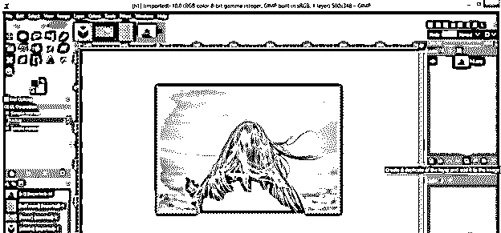

现在把你的图像变成黑白的。为此，请单击菜单栏中颜色菜单的饱和度选项。

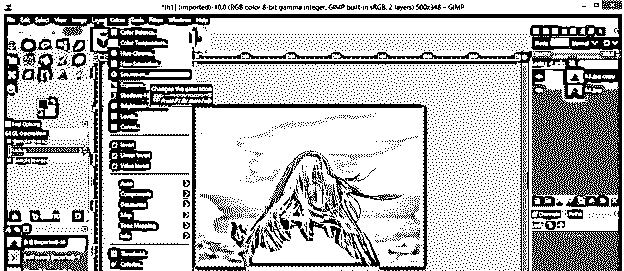

将比例值设为 0.00，然后点击该对话框的“确定”按钮。

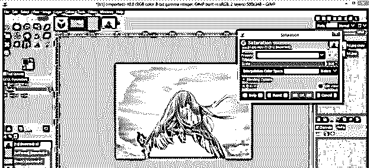

再次，去颜色菜单，点击向下滚动列表的曲线选项。

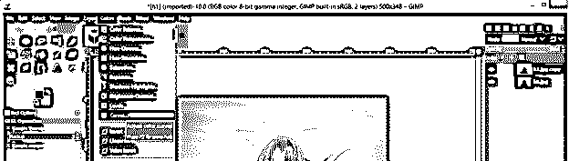

通过这条曲线调整图像的亮度和阴影。以这种方式调整它，使我们的对象覆盖更多的黑色区域。这种方法适用于对象和背景之间具有良好对比度的图像。

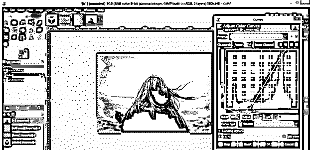

现在再一次，进入颜色菜单，点击反转选项来反转我们图像的颜色。

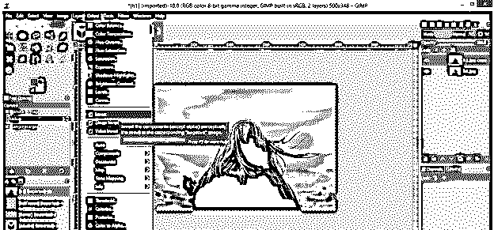

你将有你的选择在这样的反转颜色的形式。现在进入编辑菜单，点击复制可见选项。

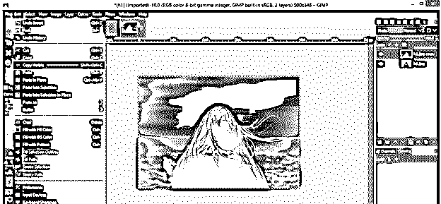

现在在图层面板中点击眼睛按钮隐藏这个图层。

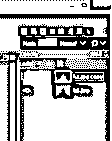

转到原来的层，右键点击它，然后点击添加图层蒙版选项添加一个蒙版到这个层。

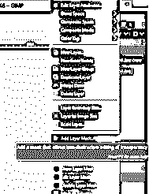

现在点击粘贴选项，将你复制的选区粘贴到这个蒙版层上。

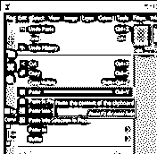

点击锚按钮添加这个浮动层和遮罩层。

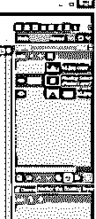

你将会得到一个去除了背景的物体。您可以使用画笔工具填充对象中未被占用的区域。就拿白色做前景色吧。

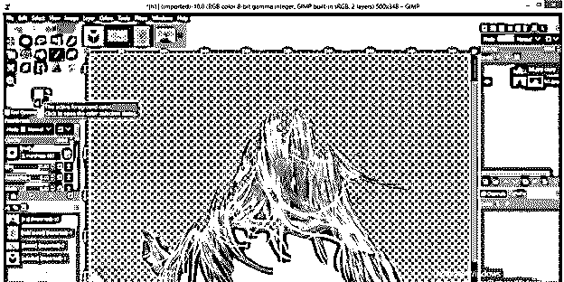

在你想要填充的地方移动画笔。

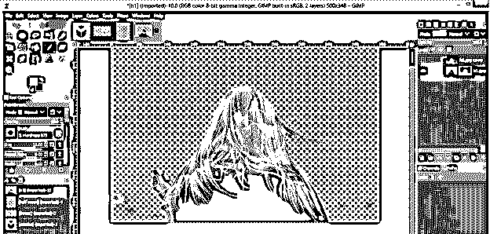

### 结论

这些是围绕你想要的对象进行选择的好方法，通过调整对象的参数来移除对象的背景。你可以练习每一种方法，以便掌握每一种方法。

### 推荐文章

这是一个 GIMP 去除背景的指南。这里我们讨论如何在 GIMP 中去除背景，并找出哪种方法适合哪张图片。您也可以阅读以下文章，了解更多信息——

1.  [GIMP 替代方案](https://www.educba.com/gimp-alternatives/)
2.  [插画替代方案](https://www.educba.com/illustrator-alternatives/)
3.  [Adobe Photoshop 替代品](https://www.educba.com/adobe-photoshop-alternatives/)
4.  [扭曲图像 Photoshop](https://www.educba.com/warp-image-photoshop/)

