# GIMP 旋转

> 原文：<https://www.educba.com/gimp-rotate/>

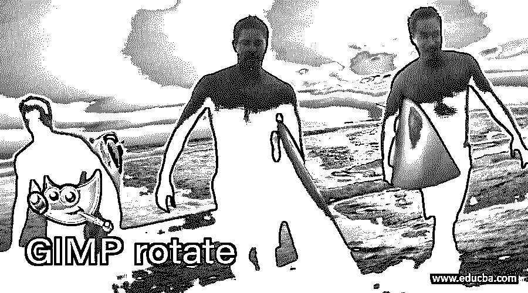

## GIMP 旋转简介

在这篇文章中，我们将学习如何使用 GIMP 中的旋转工具。旋转工具非常有用，因为它可以用来旋转图像和整个层。除此之外，你还可以旋转选区和路径。通过使用任何选择工具，如矩形或椭圆选择工具，旋转也可用于旋转图像的一部分。旋转图像有很多实际的应用，比如使地平线变直，这也可以调整视角。旋转工具与裁剪工具结合使用，因为有一个可以通过裁剪移除的透明区域。在 GIMP 中进行旋转时，另一个工具指南也很有帮助。

### GIMP 旋转的步骤

下面是下面提到的步骤

<small>3D 动画、建模、仿真、游戏开发&其他</small>

**第一步:**首先，我们将从使用一个图像开始。请访问以下网址并从 pixels 下载所需的图像，或者您可以随意使用自己的资源–https://www . pexels . com/photo/white-and-black-wood-board-963278/。

**第二步:**让我们从进入文件菜单打开一张图片开始，然后打开或按 Ctrl + O。

**步骤 3:** 然后导航到下载的图像并在 GIMP 中打开它

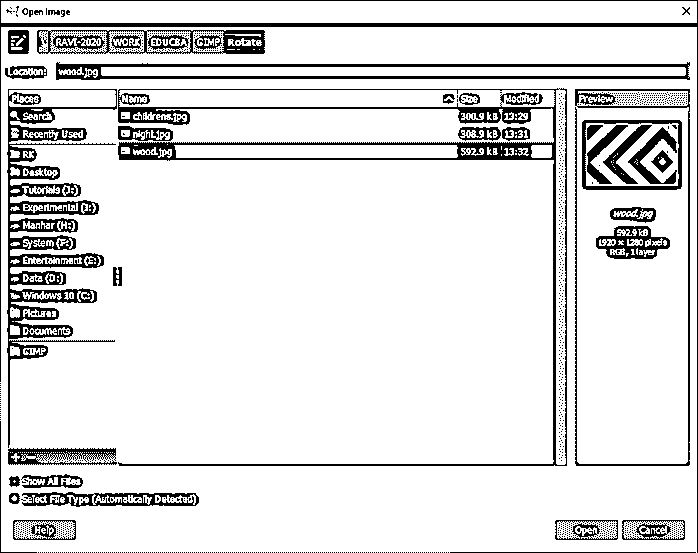

**第四步:**如果要求转换到 RGB 工作空间，那么就转换。在这种情况下，这个图像已经嵌入了一个颜色配置文件，它将被映射到 GIMP 内置的 sRGB 空间。

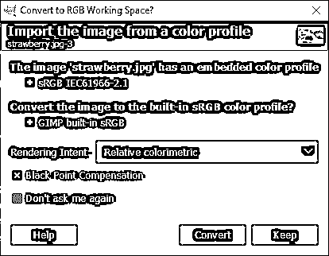

步骤 5: 现在我们已经打开了图像，我们将使用旋转工具旋转它。

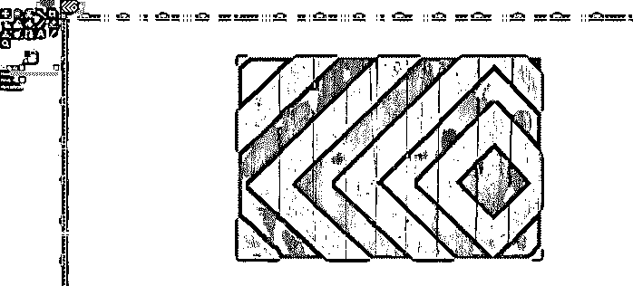

**步骤 6:** 根据你使用的工具，最后一个旋转工具可能在统一变换工具的下面。单击并按住以选择旋转工具或按快捷键 Shift + R

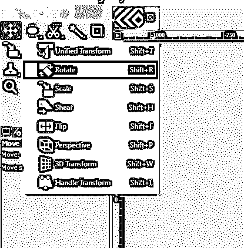

**第七步:**现在，您可以拖动并四处移动，直到您对旋转感到满意，然后在右侧的弹出菜单中单击旋转，这将完成旋转。

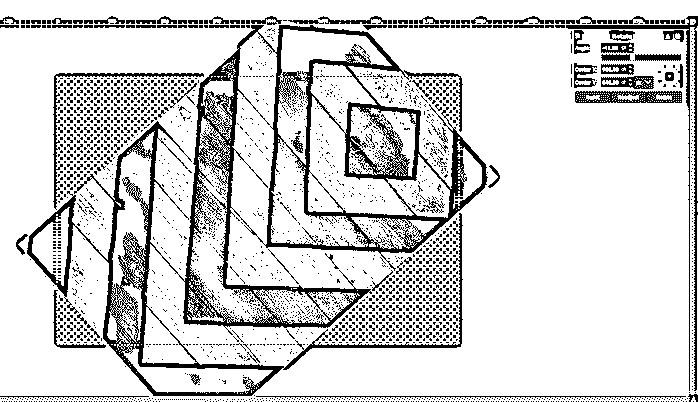

**第八步:**我们可以看到，图像是旋转的，我们有一些空间是透明的，图像并没有被剪切掉，只是构图会以这种方式被修剪掉。如我们所见，黄色边框代表图像的范围。

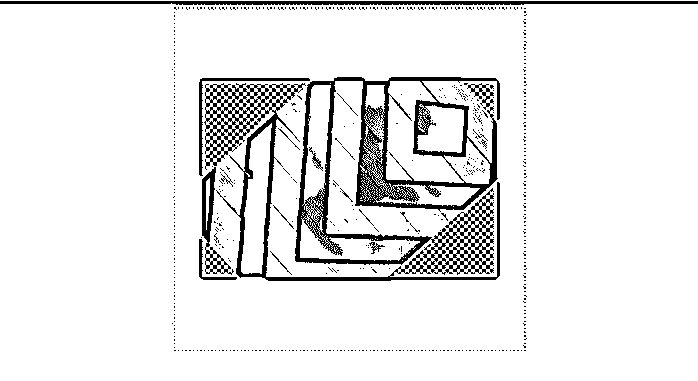

**第九步:**再次，当你点击旋转工具时，右边的弹出框出现，整个图像出现；现在，我们可以通过键入我们想要的角度或拖动角度值下面的滑块来调整到特定的角度，而不是拖动图像。我们还可以使用 x 和 y 坐标来改变旋转的中心，或者我们可以使用网格图标将中心与图像的角或边对齐。您甚至可以通过改变旋转中心来改变调整的单位。

**步骤 10:** 到目前为止，我们已经旋转了整个图像，但如果我们想旋转它的一部分，那么我们可以使用选择工具，如矩形选择工具或椭圆选择工具，并选择图像的一部分，如图所示。

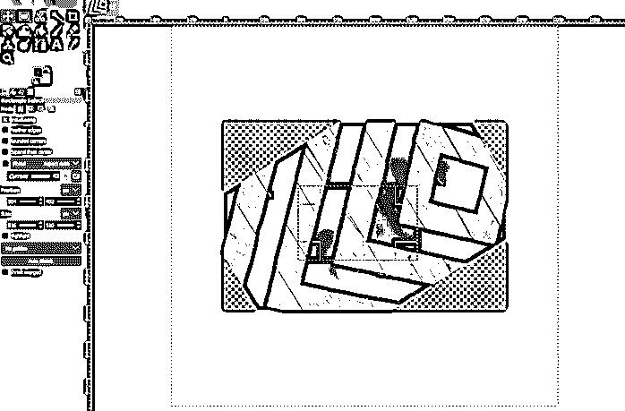

**步骤 11:** 现在，再次使用旋转工具或按 shift + R 旋转图像的一部分，并通过拖动或使用旋转对话框进行调整。

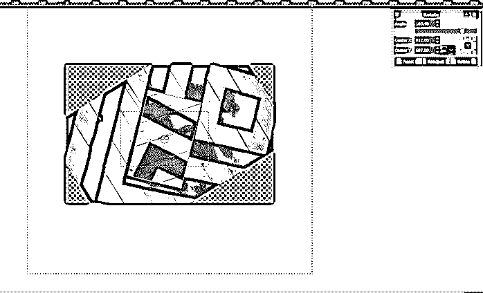

**第 12 步:**让我们打开另一个图像，我们可以看到建筑物与地平线不平行，因此我们可以旋转和裁剪图像，使其保持直线。

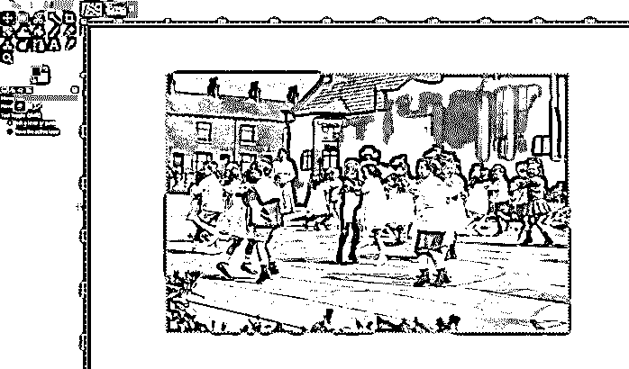

第十三步:一种方法是，你可以使用旋转工具和眼球的角度，或者你可以使用指南的帮助

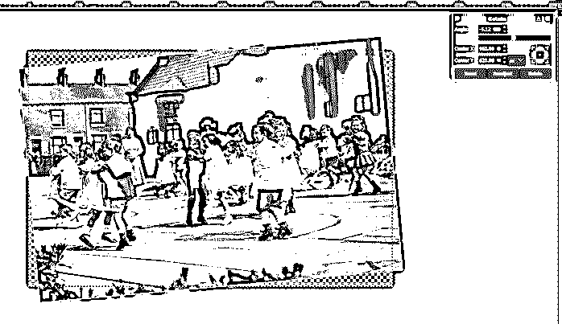

**步骤 14:** 从顶部拖动一条水平参考线，然后使用旋转工具将角度与参考线对齐。

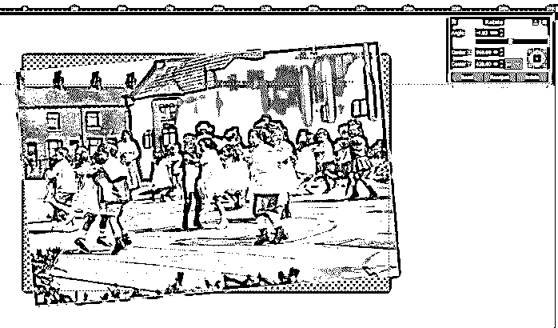

**步骤 15:** 然后用裁剪工具去掉透明区域，回车。

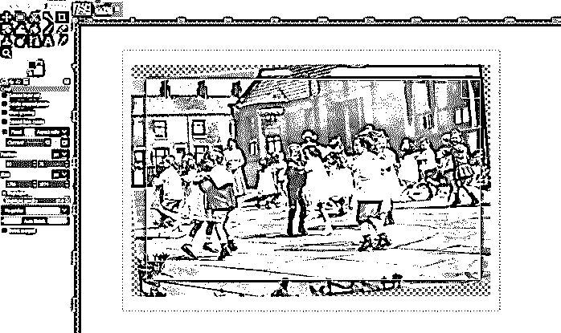

**步骤 16:** 所以，我们可以看到地平线是完美的，没有倾斜，这是旋转工具的另一种用法。

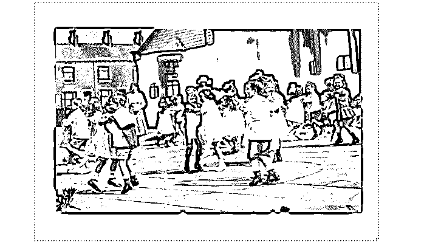

**第 17 步:**为了更高效，我们可以在一个步骤中同时执行旋转和裁剪。我们现在在旋转选项中有一个裁剪选项来调整，但我们将更改为裁剪结果。

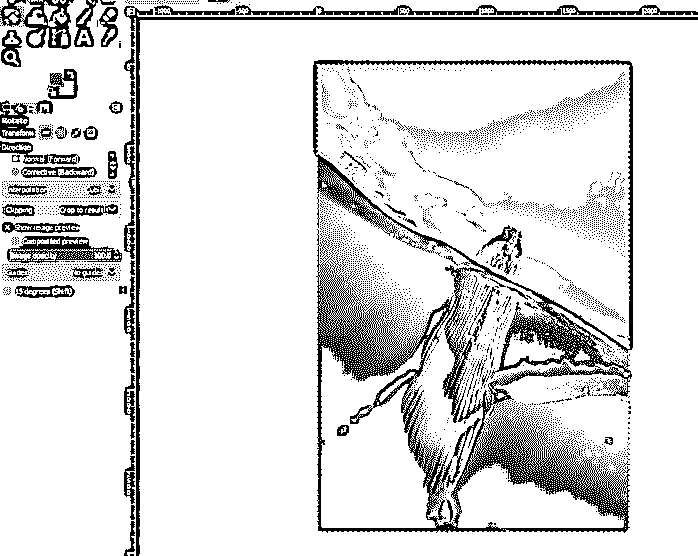

**第 18 步:**现在，当你将旋转图像时，它将被自动裁剪。

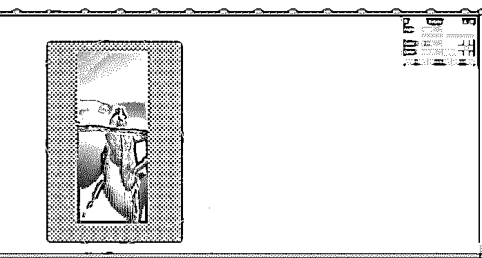

步骤 19: 现在，我们可以使用裁剪工具来裁剪图像中需要的部分。所以，这样一来，裁剪的过程就简化了。

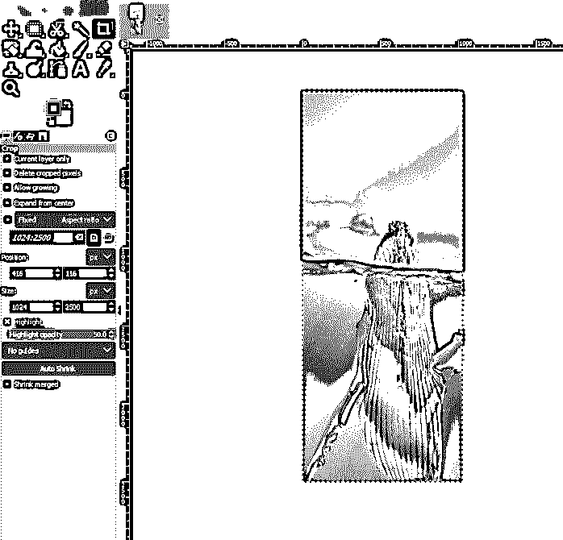

到目前为止，我们已经在图层上执行了旋转变换，但是我们也可以在选区上执行。正如你所看到的，我们现在已经在这个标志中执行了矩形选择；我们可以旋转它。

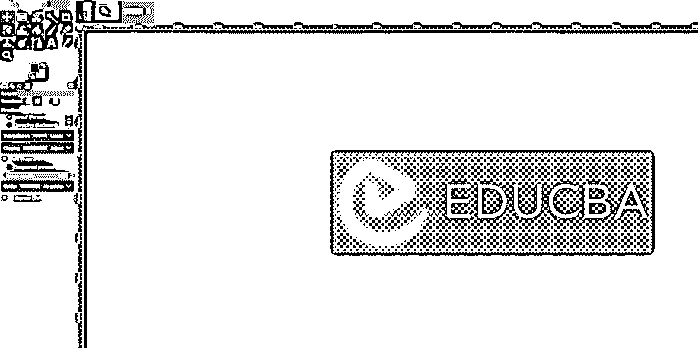

第 21 步:现在，我们可以旋转选择。一个提示是按下 shift 键会锁定旋转 15 度的增量，或者你可以点击左边的旋转选项。

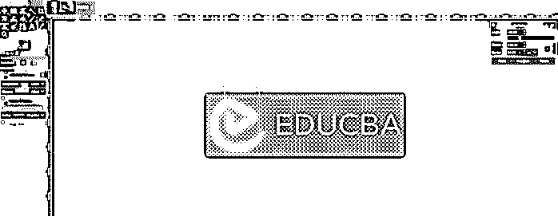

**第 22 步:**另一个选项是矫正向后，会向你拖动的反方向旋转。这是用来修复数字图像的。

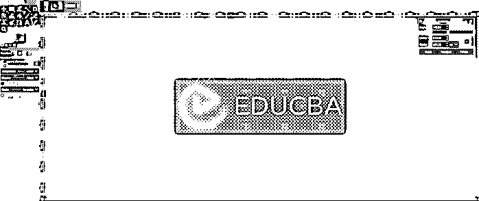

**步骤 23:** 现在，我们将看到图像旋转，这是第四个标签，如果它的工作类似于层，但在这里，我们已经打开了中心线的指南。

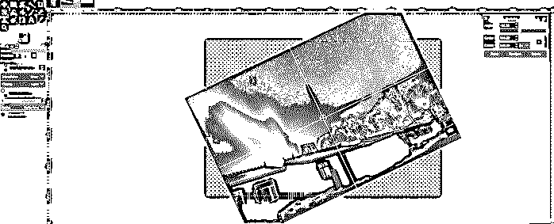

步骤 24: 如果你想那样调整构图，这是三分法的指南。

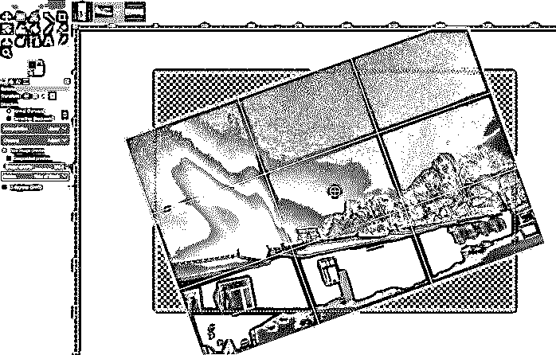

第 25 步:第五定律看起来是这样的。

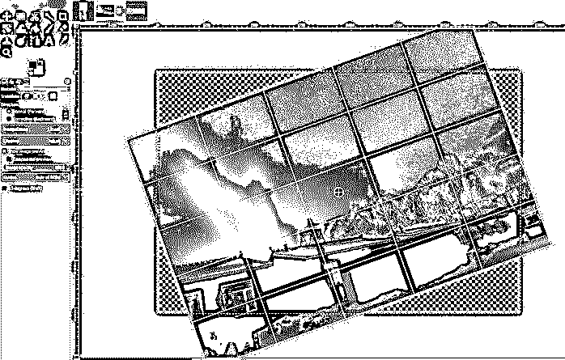

**第 26 步:**本指南代表黄金分割。

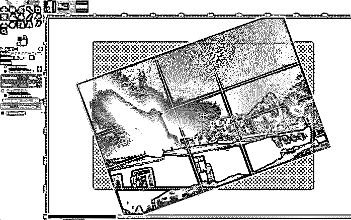

**第 27 步:**这代表导轨的对角线。

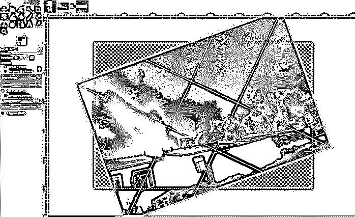

**第 28 步:**你甚至可以设置为自定义行数，根据需要设置行数。

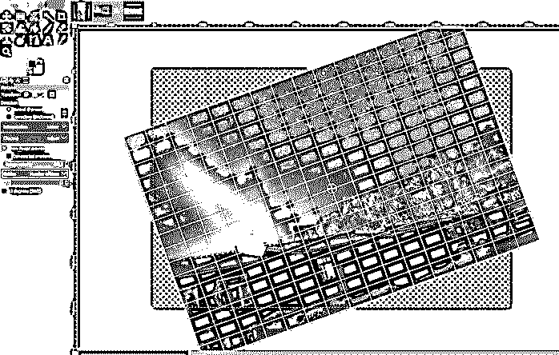

**第 29 步:**或者你可以设置行距，使导轨之间有适当的距离；如果我们增加距离，那么线条会减少，如果我们减少距离，线条会增加。

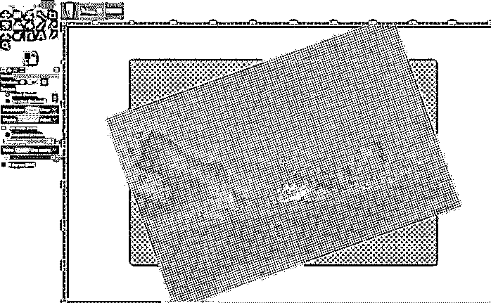

**步骤 30:** 如果图像预览的不透明度被选中，我们也可以改变它。您也可以关闭仅显示轮廓的预览。

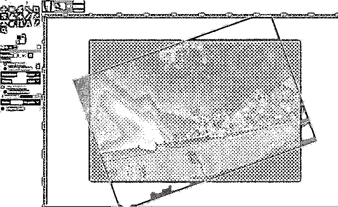

### 结论

在本文中，我们已经看到了如何在 GIMP 中执行旋转。首先，我们已经了解了旋转工具的工作方式以及可用的选项。然后，我们看到了旋转的一些实际应用，如限制图像视界；然后，我们看到了一些先进的旋转选项和使用指南，以更好地对齐图像。

### 推荐文章

这是一个 GIMP 旋转指南。这里我们讨论如何在 GIMP 中执行旋转，以及旋转工具如何与步骤一起工作。您也可以阅读以下文章，了解更多信息——

1.  [GIMP 替代方案](https://www.educba.com/gimp-alternatives/)
2.  [计算机图形学的应用](https://www.educba.com/application-of-computer-graphics/)
3.  [Indesign 的替代方案](https://www.educba.com/alternative-to-indesign/)
4.  [Illustrator 中的图形样式](https://www.educba.com/graphic-styles-in-illustrator/)

