# GIMP 网格

> 原文：<https://www.educba.com/gimp-grid/>

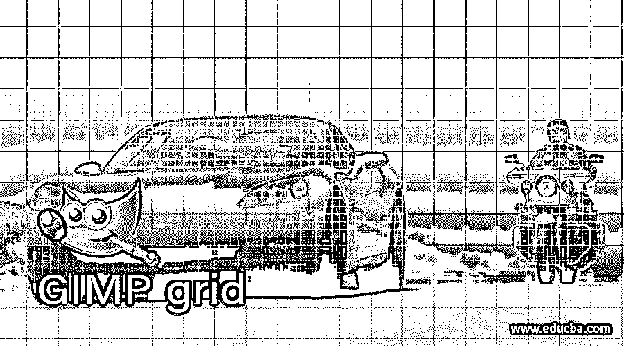

## GIMP 网格简介

网格就像指导方针，在任何图形设计软件中帮助设计和插图工作。当我们在 GIMP 中启用网格选项时，它会在我们的文档上给我们正方形的块，这些块通常是由垂直和水平方向的指引线构成的。网格有助于我们解决设计中的不精确测量，也有助于我们捕捉像素以获得正确的线条图形。在我们的工作中，我们可以使用网格作为参考指南，或者也可以通过对 GIMP 的网格选项的参数进行一些更改，将其导出到我们的最终工作中。所以让我们来分析这些参数。

### GIMP 中如何使用网格？

我们可以通过两种方式在 GIMP 中使用网格:首先，通过使用 grid 作为我们的参考指南，它给我们提供水平和垂直线条的方块，另一种是通过使用它们作为我们最终输出 GIMP 的艺术作品。我们将逐一了解这两种方式。

<small>3D 动画、建模、仿真、游戏开发&其他</small>

因此，为了了解它，让我们有一个图像或文件。要在 GIMP 中拥有一个文档，请转到菜单栏的 File 菜单的 New 选项，它位于用户屏幕的顶部。

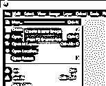

根据您在“创建新图像”对话框中的选择进行设置。我将使用这些默认设置，并点击该对话框的“确定”按钮。

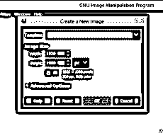

现在，要激活我们文档上的网格，请转到菜单栏的视图菜单，并单击视图菜单下拉列表中的显示网格选项。

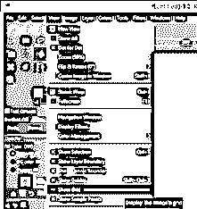

当我们启用网格选项时，我们将在文档区域获得这种类型的网格块。

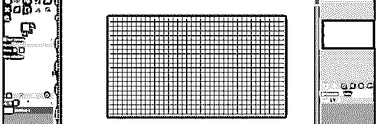

如果您能够看到文档中的网格或者有一个非常小的网格块，那么请转到菜单栏的图像菜单，然后单击“配置网格”选项，查看该菜单的下拉列表。

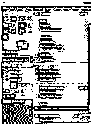

一旦您启用此功能，将会打开一个“配置网格”对话框。让我们分析一下这个对话框的选项。通过更改此对话框的间距选项值，可以更改网格块的水平线和垂直线之间的间距。如果您更改水平间距的值，那么垂直间距将自动更改，因为这些值的链节按钮处于打开状态。

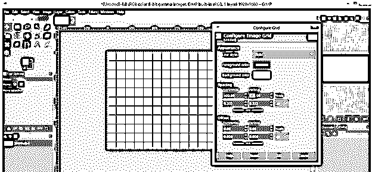

如果您想单独更改这些值，则单击这些值下方的 chain-link 按钮将其禁用。

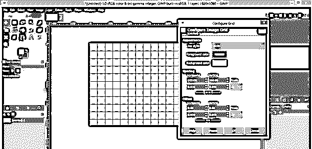

您可以根据您的工作要求从该列表中更改块大小的单位。

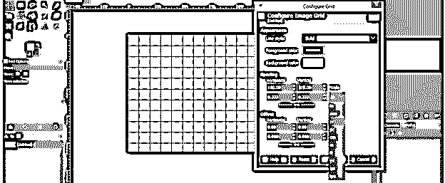

如果要更改网格样式，可以从该对话框的线条样式选项中选择任一选项。

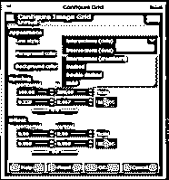

检查所有的线条样式选项，选择适合你的作品。

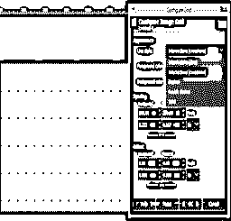

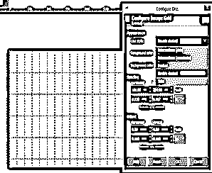

您也可以通过更改此对话框的前景色选项来更改网格线的颜色。只需点击前景色选项的颜色框，从“改变网格前景色”对话框中选择你想要的颜色，然后点击“确定”按钮。

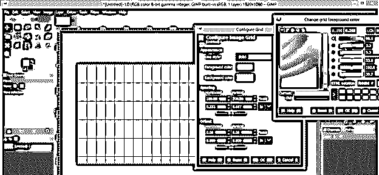

网格线的颜色会像这样变化。

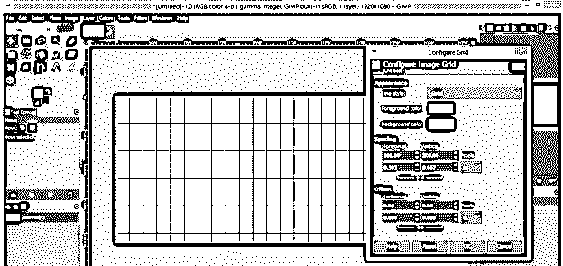

现在转到菜单栏的视图菜单，单击向下滚动列表的对齐网格选项。在使用工具的过程中，它会将任何工具光标与网格对齐，从而使您的工作更加完美。

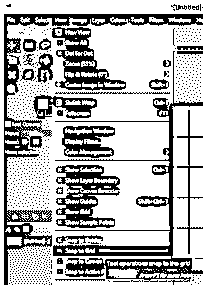

现在从工具面板中选择矩形选择工具，像这样画一个矩形。你画的时候会注意到；它的角会自动与网格线捕捉。

现在从工具面板中选择桶工具，用你想要的颜色填充这个矩形。

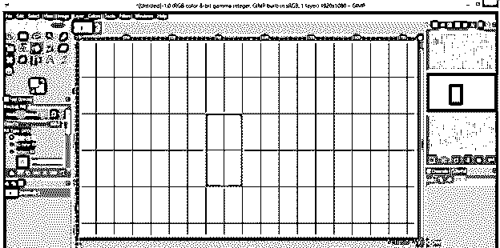

现在让我们将这幅作品导出为 png 文件。要导出它，请转到菜单栏的文件菜单，并单击下拉列表中的导出选项。

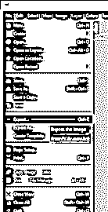

将其保存在您想要的位置。

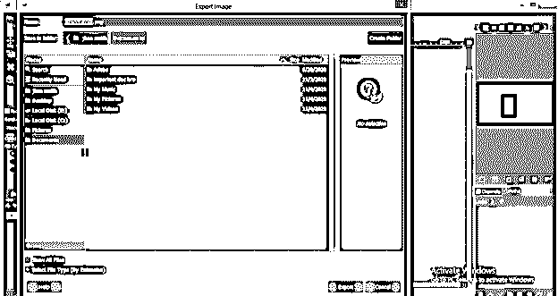

现在，当您打开这个 png 文件时，您会注意到在您的最终输出中没有网格。

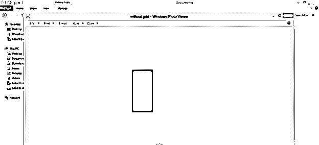

现在让我们尝试另一种类型的网格，我们将导出我们的作品。现在创建一个新的图像或文件，然后转到菜单栏的过滤器菜单。转到过滤器菜单的下拉列表的渲染选项，然后转到模式选项，并点击新的下拉列表的网格选项。

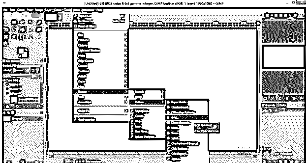

现在你的文档区域就有了这种类型的网格。通过更改“网格”对话框中“宽度”和“高度”选项的值，可以更改此网格的宽度和高度。

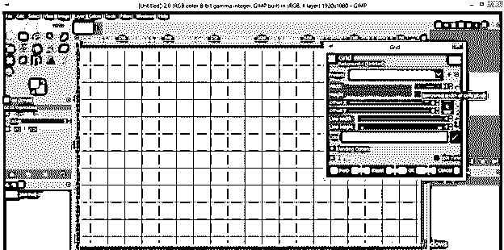

通过更改此对话框的“线宽”和“行高”选项的值，可以增加或减少网格线的粗细。

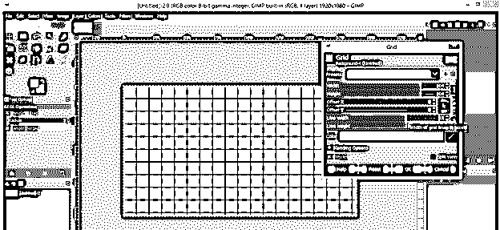

您也可以通过从网格对话框的颜色选项中更改颜色来更改此网格的颜色。只需点击这个对话框的颜色选项的颜色框，从颜色对话框中选择你想要的颜色，然后点击 Ok 按钮框。

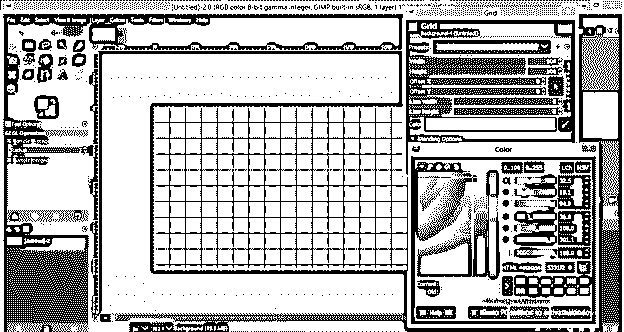

现在，再次使用工具面板的矩形选择工具在这个网格上绘制一个矩形，并使用工具面板的桶工具填充所需的颜色。当你填充这个矩形时，你会注意到桶工具会在一次点击中填充一个方块。发生这种情况只是因为这种类型的网格的块是 GIMP 文档中的一个对象。

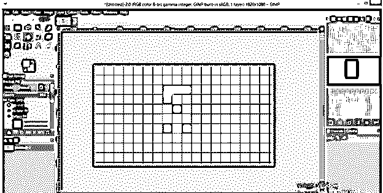

完全填充这个矩形，进入菜单栏的文件菜单的导出选项，然后用你想要的名字保存在你想要的位置。

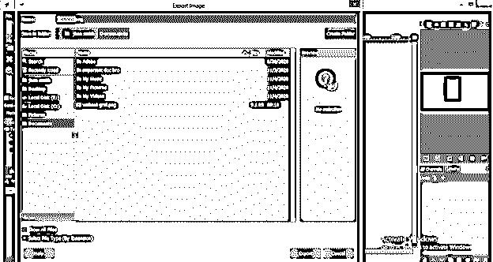

现在打开你保存的作品的 png 填充。在这里，您可以看到我们的最终输出中也有一个网格。

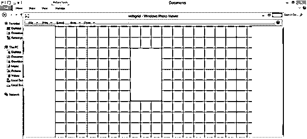

### 结论

现在你可以根据你的工作自由地使用我们上面讨论过的任何类型的网格。在这篇文章之后，GIMP 的网格对你来说是一个完全可以理解的特性；您可以轻松地操作其参数，以在您的作品中获得最佳效果。

### 推荐文章

这是 GIMP 网格的指南。这里我们讨论如何在 GIMP 中使用 Grid 以及 GIMP 的可理解的特性，这样你就可以很容易地操作它的参数。您也可以看看以下文章，了解更多信息–

1.  [GIMP 替代方案](https://www.educba.com/gimp-alternatives/)
2.  [Photoshop 金色渐变](https://www.educba.com/photoshop-gold-gradient/)
3.  [Photoshop 小抄](https://www.educba.com/photoshop-cheat-sheet/)
4.  [扭曲图像 Photoshop](https://www.educba.com/warp-image-photoshop/)

