# GIMP 擦除到透明

> 原文：<https://www.educba.com/gimp-erase-to-transparent/>

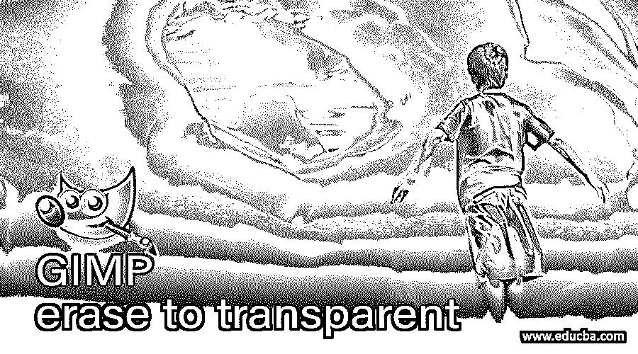

## GIMP 擦除透明简介。

擦除到透明可以理解为一种技术，通过这种技术，你可以根据你的要求将任何特定图像的任何对象的背景转换为透明，或者将图像的某些特定区域转换为透明，在 GIMP 中，我们可以通过使用它的工具面板中的一些工具以及管理它的菜单栏菜单的一些参数来实现这一点。我们通过使用图层菜单中的添加 alpha 通道选项来实现这一点，这是这个过程中非常重要的一部分，它为图层面板中的任何图层提供了透明的背景。因此，让我们找到如何做到这一点。

### 如何在 GIMP 中‘擦除到透明’进程？

我们做这项工作是为了在 GIMP 的编辑或设计工作中进行不同类型的操作。为此，我们必须在 GIMP 的不同特性中做一些参数上的改变。因此，让我们有一个形象的目的。我将使用下载的图像。你用你自己的形象。

<small>3D 动画、建模、仿真、游戏开发&其他</small>

要在 GIMP 中显示图像，请转到菜单栏的文件菜单并点击它。然后点击下拉列表的打开选项，或者你可以按 Ctrl + O 作为这个选项的快捷键，或者你可以简单的借助鼠标键从它保存的文件夹中拖动你想要的 GIMP 中的图片。

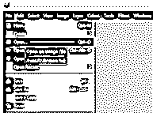

将会打开一个“打开图像”对话框。请从该框中的保存位置选择您想要的图像。我会选择这个花的形象。您还可以在此对话框中看到所选图像的预览。现在点击这个对话框的 Ok 按钮。

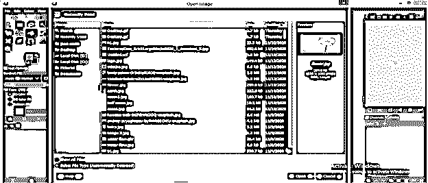

为此你要做的第一件事是去图层面板，选择你想要透明背景的图层，然后右键点击它。将打开一个下拉列表；点击列表中的“添加 Alpha 通道”选项。此选项会将您选择的图层转换成透明的背景图层。

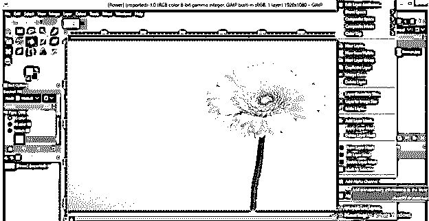

您也可以从菜单栏的图层菜单中找到此选项。只需进入图层菜单并点击它，然后进入下拉列表的透明度选项，并点击新下拉列表的“添加阿尔法通道”选项。

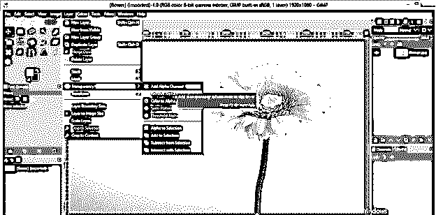

擦除此图像的背景或此图像的任何特定区域后，您将看到透明度。所以让我们这样做吧。现在转到工具面板，点击模糊选择工具的图标，或者你可以按 U 键作为快捷键。

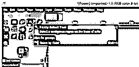

用模糊选择工具在花的背景上点击一下，在花周围做一个选择。如果在此工具的“参数”面板中启用了此工具的“绘制蒙版”选项，单击后，选区将以洋红色高亮显示。您可以多次单击以做出更好的选择。

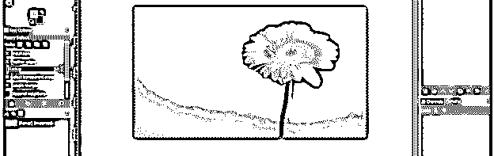

我的选择会像这样。

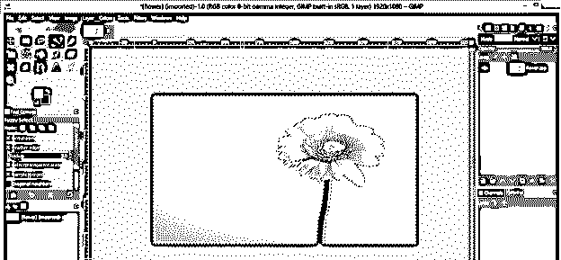

现在右键单击图像区域的任意位置，将会打开一个下拉列表。转到编辑选项，然后单击新下拉列表中的清除选项。

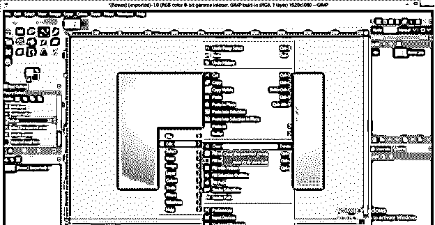

或者您可以在菜单栏的编辑菜单的下拉列表中找到此选项，或者您可以简单地按键盘上的删除按钮。

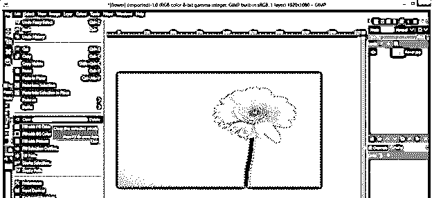

我们花的背景会像这样消失。这样，你可以擦除任何背景透明。

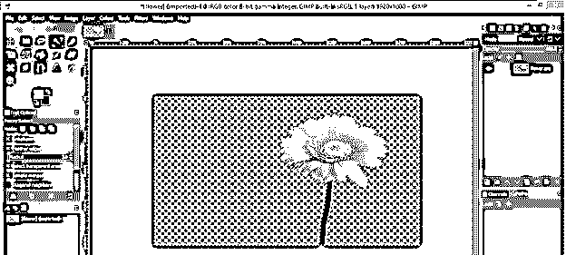

让我们也了解擦除到透明特征的另一个方面。现在，通过按下键盘上的 Ctrl + Z 键并启用围绕这朵花的选择来撤销这个背景。要启用围绕这朵花的选择，请转到菜单栏的选择菜单并单击它。然后点击下拉列表中的“无”选项。

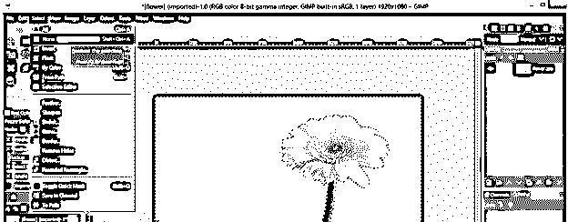

现在从工具面板中选择橡皮擦工具，或者按 Shift + E 作为它的快捷键。

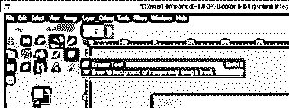

这一次，我们将删除这个图像的小区域，以透明。只需将橡皮擦工具的画笔笔尖拖到图像的任何区域，它就会从该特定部分擦除背景区域。你会在那一部分看到透明，因为我们已经将这一层转换为透明。

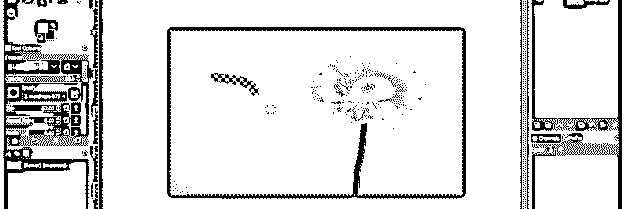

因为橡皮擦工具的尖端有一个笔触，所以您可以从橡皮擦工具的笔刷参数中选择任何图案，以将图像的任何区域擦除为透明。

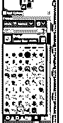

我将选择这个星形图案作为橡皮擦工具的画笔笔尖，并在这个图像的背景上单击，您会注意到我使用图案橡皮擦的区域具有透明度。这样，你就可以在图像上制作任何图案，并消除该图案的透明度。

现在转到图层面板的底部，点击创建新图层按钮，在图层面板中创建一个新图层。

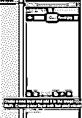

在“新建图层”对话框的“填充”选项中选择透明度选项，创建一个透明图层，点击“确定”按钮。

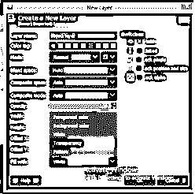

现在，在鼠标左键的帮助下，将下面的透明层移动到图像层。

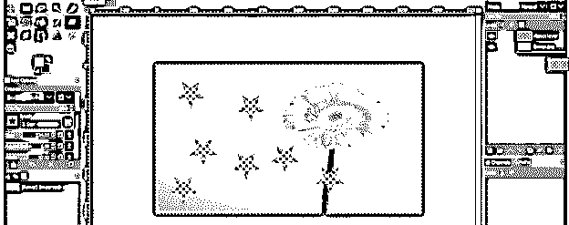

现在在工具面板的前景色框中选择你想要的颜色。

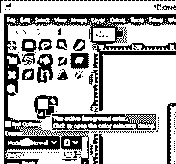

现在转到工具面板，并采取桶工具或按下 Shift + B 按钮作为快捷键。

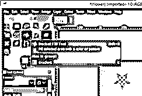

选择图层面板上的透明图层，借助水桶工具点击花朵图像的透明图案区域。它将使用您选择的颜色填充透明层，您可以通过花朵图像层的透明图案看到这种颜色。

通过更改透明层背景层的颜色，可以随时更改图案的颜色。

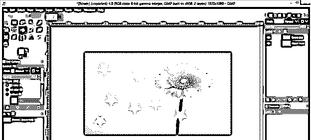

因此，这是一个很好的方法，你可以将任何图像的任何特定区域擦除为透明，并使用它来制作一个好的设计。

### 结论

这很好地解释了如何将任何图像的背景擦除为透明，或者将该图像的任何特定区域擦除为透明，并使用该区域进行任何有效的设计。您还可以浏览该特性的其他参数，以便更好地理解它。

### 推荐文章

这是一个 GIMP 擦除到透明的指南。在这里我们讨论如何在 GIMP 中“擦除到透明”的过程和其他参数，以便更好地理解这一特性。您也可以看看以下文章，了解更多信息–

1.  [GIMP 替代方案](https://www.educba.com/gimp-alternatives/)
2.  [Photoshop 金色渐变](https://www.educba.com/photoshop-gold-gradient/)
3.  [CorelDRAW 标志设计](https://www.educba.com/coreldraw-logo-design/)
4.  [Adobe After Effects 插件](https://www.educba.com/adobe-after-effects-plugins/)

