# GIMP 调整图层大小

> 原文：<https://www.educba.com/gimp-resize-layer/>

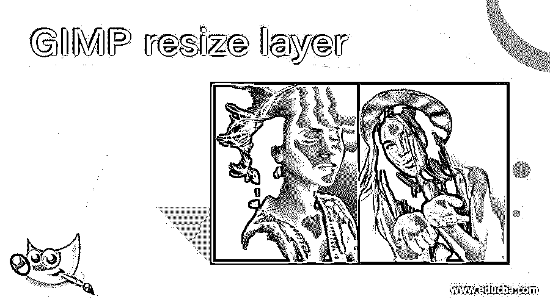

## GIMP 调整层大小简介

在这篇文章中，我们将学习如何在 GIMP 中调整层的大小。图层是创建图像的有用部分，因为它允许我们将图像堆叠在彼此之上，而所有内容都保留在单个文件和单个图像中。层可以是透明和半透明的，我们也可以应用不同的混合模式来改变层的行为。所以，如果你在试验一些东西，图层是非常有用的，这样你就可以在不改变原始图像的情况下添加和删除一些部分。由于每一层都可以独立控制，我们可以创建强大的图像组合；还有一个重要的因素是调整图层的大小，这是我们将要学习的。

### GIMP 调整层大小的步骤

GIMP 调整图层大小的不同步骤如下:

<small>3D 动画、建模、仿真、游戏开发&其他</small>

**第一步:**让我们从文件菜单或按 Ctrl + N 创建一个新的组合开始。您也可以从一个图像开始，但由于我们要用两个图像来创建一个组合，我们将首先创建一个新的图像。

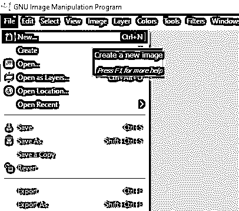

**步骤 2:** 在“创建新图像”对话框中，我们将 rgb 彩色模式下的图像宽度和高度设置为 1920 x 1280 px，分辨率为 72 ppi，因为我们不是在横向模式下打印。将其他高级选项保留为默认值。

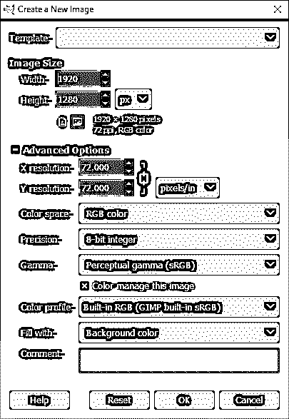

第三步:在图层面板中，你可以看到有一个背景图层。如果“图层”面板没有打开，您可以按 Ctrl + L 或从“窗口”菜单中打开它。

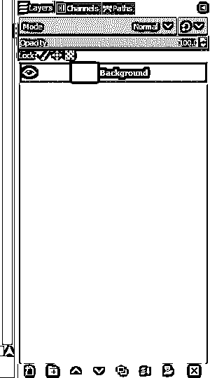

**第四步:**接下来，我们将打开一张图片作为图层；为此，转到文件菜单，然后打开为层…或按 Ctrl + Alt + O

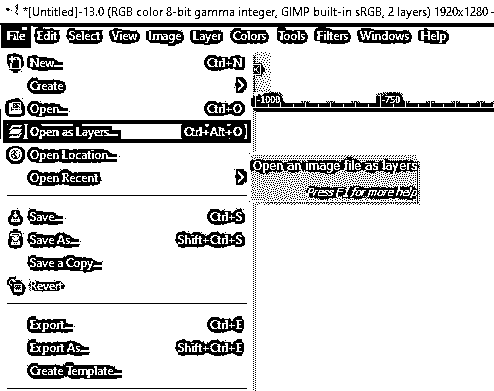

**步骤 5:** 导航到图像文件在计算机上的位置，然后单击打开。

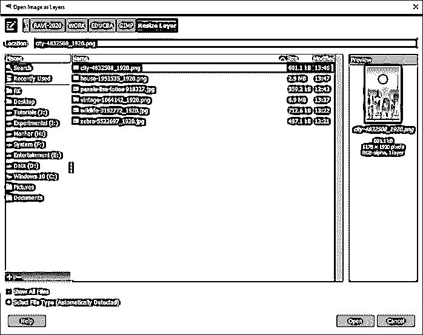

**步骤 6:** 正如我们所看到的，图像被放置在中心，但大小不合适。

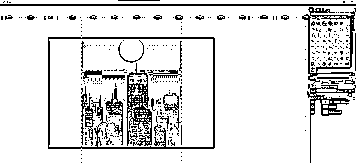

**步骤 7:** 按照上面的步骤，打开第二张图片作为图层。

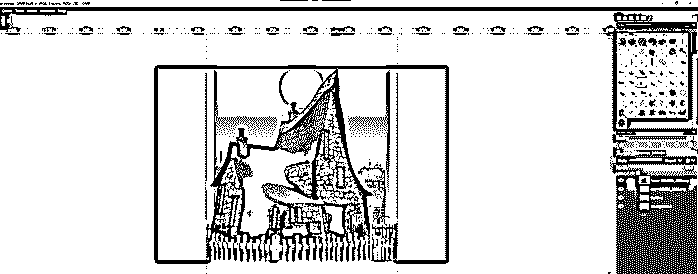

第八步:为了让图像在我们的构图中有合适的尺寸，我们必须缩放图像；为此，我们去工具- >变换工具- >缩放或按 Shift + S

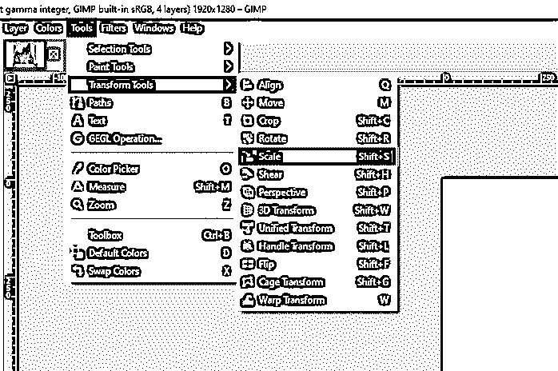

**步骤 9:** 您将获得图像上的手柄，您可以在其中放置精确的尺寸或拖动手柄条进行缩放。如果您按下 shift，这将改变图像的长宽比，并拉伸它。此外，如果从“缩放”弹出菜单中取消链接图标的链接，也可以更改纵横比。但是我们将缩放和对齐图像，如图所示。最后，您可以通过按住 Ctrl 和鼠标滚轮来缩小以查看完整的合成。

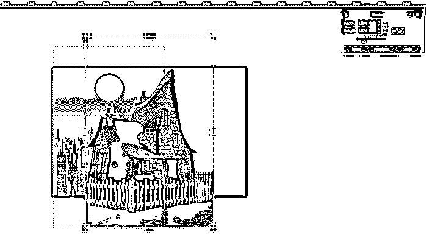

**步骤 10:** 为了测量缩放或收缩图层的准确值，我们可以使用一个向导。所以，让我们从图像- >向导- >新向导创建一个向导(按百分比)。如果要删除参考线，只需将其拖到图像之外。

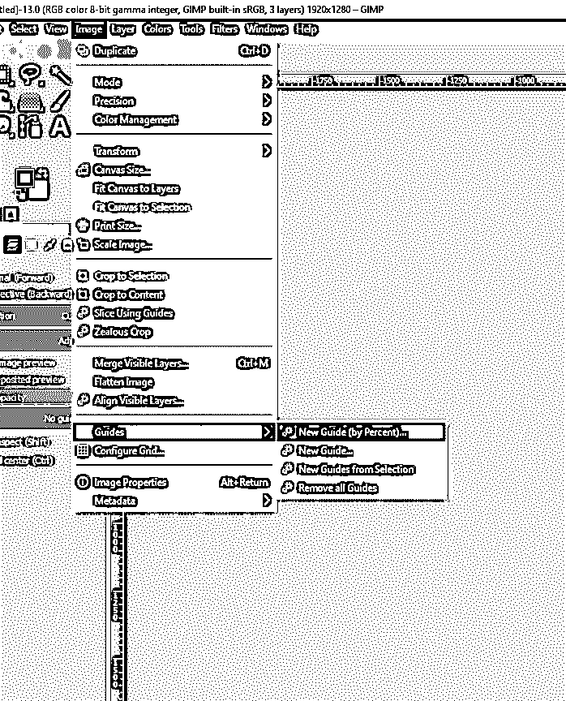

**步骤 11:** 对于方向，有水平或垂直的选项；我们保持垂直，在 50%的组成。

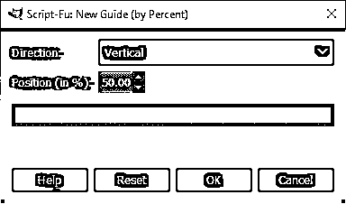

**步骤 12:** 现在，首先，我们将缩放和移动，你也可以从中间的变换手柄和捕捉图像的右侧到参考线。请确保在“视图”菜单中打开“对齐参考线”。

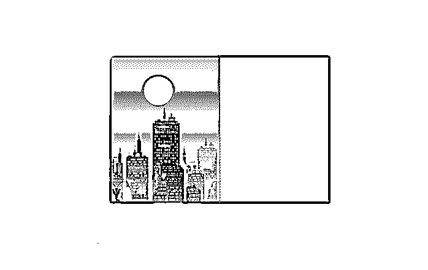

**步骤 13:** 选择另一个图像层，对第二张图像重复同样的缩放和移动步骤。

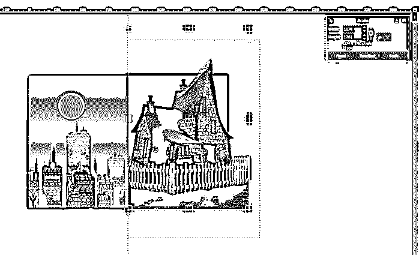

**步骤 14:** 你可以从视图菜单中隐藏参考线，或者按 Ctrl + Shift + T 来获得正确的视图。

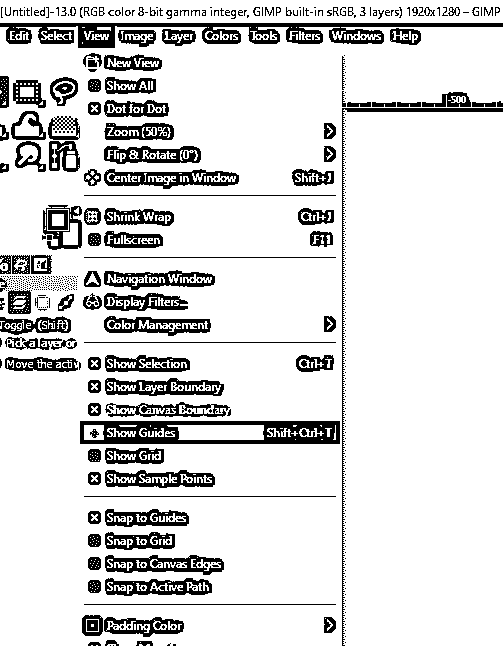

步骤 15: 因此，我们已经在 GIMP 中调整了图层的大小，创建了一个图像组合。

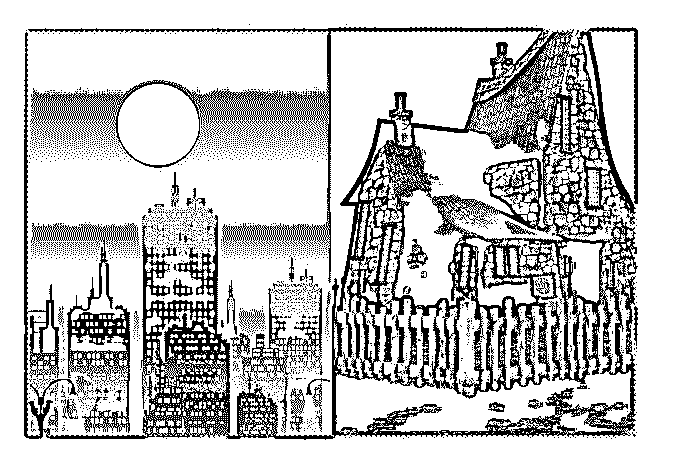

**步骤 16:** 调整图层大小的另一个用途是缩放一幅图像中的多个图层。首先，我们将从资源管理器中拖动我们想要处理的图像，或者进入文件- >打开。

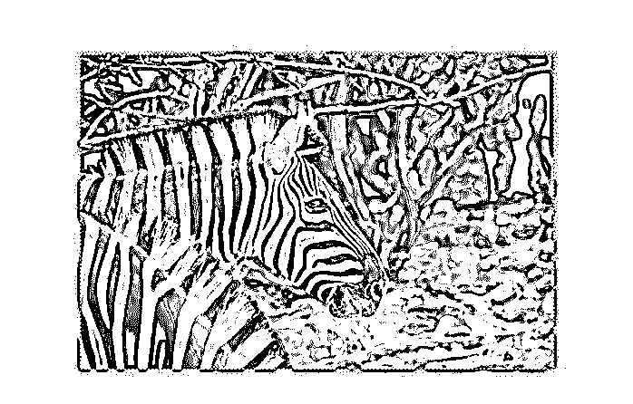

**步骤 17:** 缩放图像的一种方法是进入图像- >缩放图像

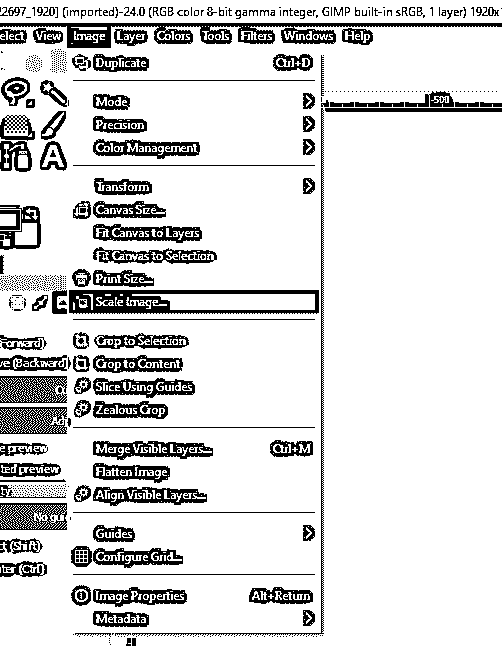

**第 18 步:**这为我们提供了大小、分辨率和质量的各种选项，根据插值类型添加或删除像素，这会影响结果的速度和质量。

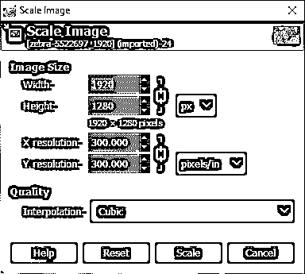

**步骤 19:** 另一个选择是使用一个缩放工具，你可以拖动它来改变缩放比例。

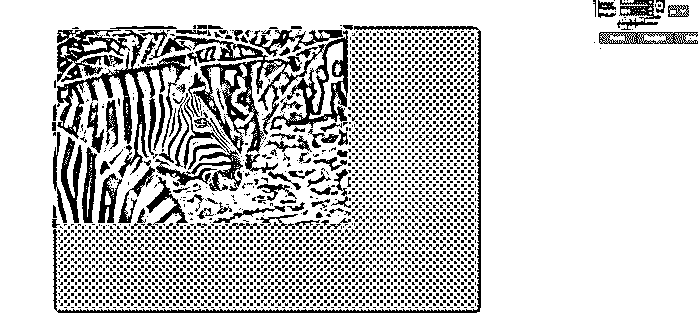

**步骤 20:** 现在，我们将打开一个图像，我们将在图像顶部调整其大小。为此，首先，打开图像。现在，如果我们使用前面的两种方法，即从图像菜单或从缩放工具缩放，它将调整整个图像的大小。

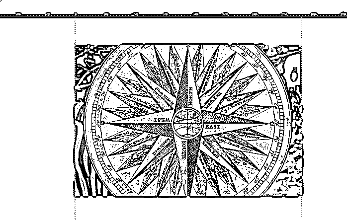

**步骤 21:** 这将是我们缩放图像的结果。这是我们不想要的，因为我们想要缩放特定的层，而不是整个图像。因此，从编辑菜单中撤消这一步，或者按 Ctrl + Z

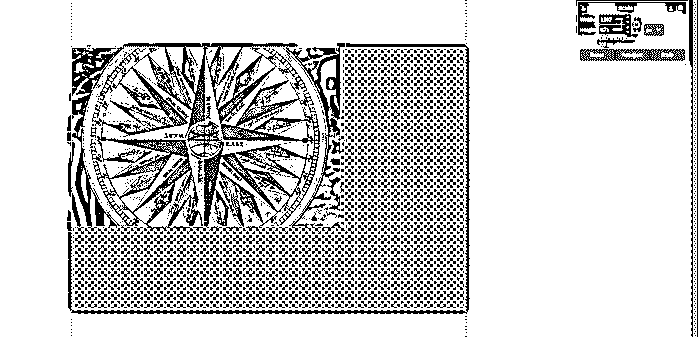

**步骤 22:** 缩放工具为我们提供了缩放图层、选区、路径或图像的选项。到目前为止，我们只是缩放图像，但现在，我们将通过选择第一个变换图标来缩放层。

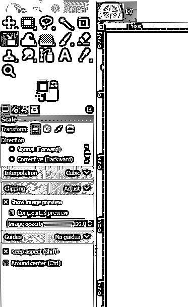

第 23 步:现在使用角柄拖动图像，得到合适的尺寸

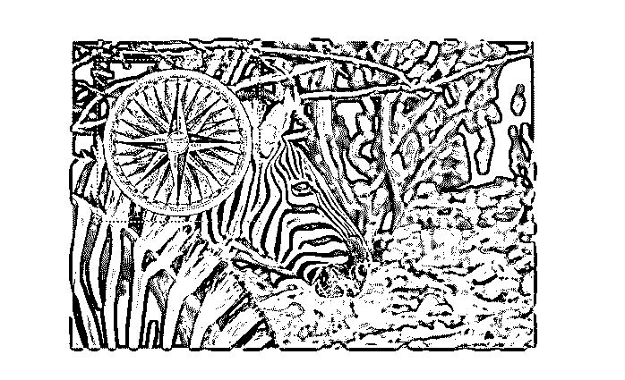

**步骤 24:** 另一个选项是去图层菜单，然后去缩放图层，这也将用于改变图层内容的大小。

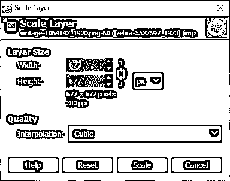

第 25 步:然后将它移动到适当的位置，得到我们想要的构图，即一幅图像叠加在另一幅图像上。因此，我们已经在 GIMP 中完成了调整层的大小。

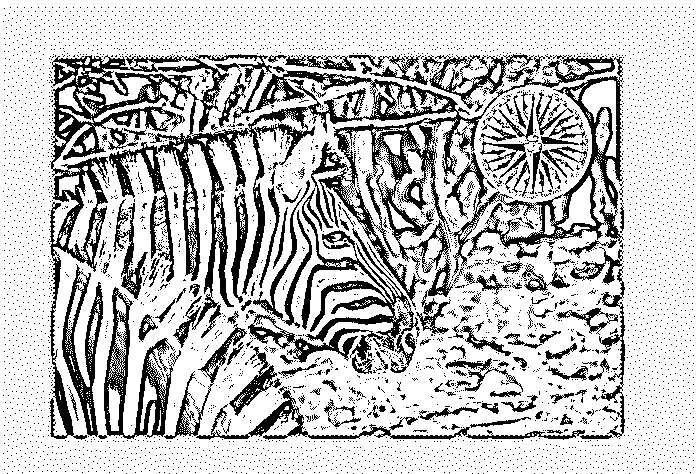

### 结论

在本文中，我们看到了如何在 GIMP 中调整层的大小。此外，我们已经看到了缩放图像和图层的不同方法。首先，我们在指南的帮助下缩放了单个图像并创建了一个组合，然后我们通过调整图层大小将两个图像叠加在一起，以获得所需的效果，而无需调整整个图像的大小。

### 推荐文章

这是 GIMP 调整图层大小的指南。这里我们讨论如何在 GIMP 中调整层的大小，以及缩放图像和层的不同方法。您也可以看看以下文章，了解更多信息–

1.  [GIMP 替代方案](https://www.educba.com/gimp-alternatives/)
2.  [最佳照片编辑](https://www.educba.com/best-photo-editors/)
3.  [最佳平面设计软件](https://www.educba.com/best-graphic-design-software/)
4.  [插画替代方案](https://www.educba.com/illustrator-alternatives/)

