# GIMP 模式

> 原文：<https://www.educba.com/gimp-patterns/>

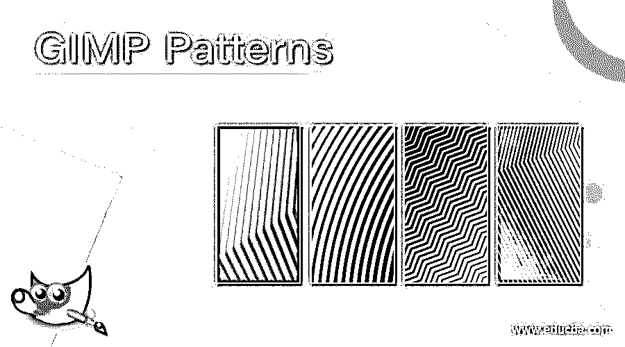

## GIMP 模式介绍

图案可以被理解为从以行或列或以特定顺序排列的任何特定设计中重复出现。图案可以是根据你的想法或任何图像的任何设计，如它可以由不同的自定义形状设计，或任何标志和许多不同的东西的形状。在本文中，我们将学习如何使用 gimp 软件的自定义形状来创建图案设计，以及如何在 gimp 的其他设计工作中使用我们保存的图案。所以让我们通过一个例子来理解这一点。

### 如何在 gimp 中创建和保存模式？

今天我们将通过 gimp 工具面板的椭圆选择工具创建一个图案来学习这个主题。首先，获取一个新文档，它将成为我们模式的参考背景。所以点击菜单栏的文件菜单的新建选项。

<small>3D 动画、建模、仿真、游戏开发&其他</small>

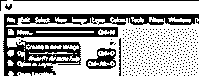

现在，根据您的图案大小设置文档的大小。例如，我将把 100 x 100 像素的尺寸作为我的文档尺寸。

这是我的文件尺寸。

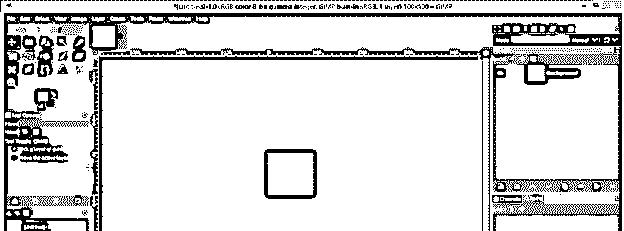

现在点击图层面板的“新建图层”按钮新建一个图层。

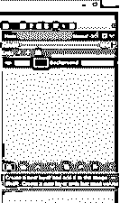

通过单击此对话框的透明度选项创建一个透明层。

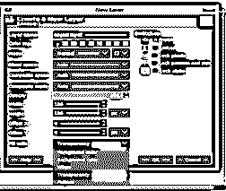

现在让我们有指南指出这个文件的中心。因此，请转到菜单栏的图像菜单，转到指南选项，并单击向下滚动列表的新指南(按百分比)选项。

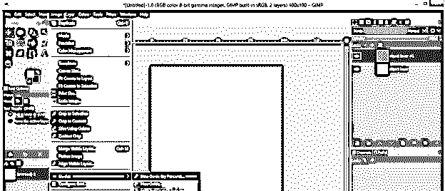

现在将位置值设置为 50%,这样我们就可以得到一个指南作为这个文档的一半。这将是一条水平参考线，因为在此对话框的方向选项中选择了水平选项。

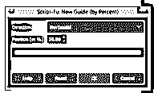

对垂直基准线做同样的操作。

现在你会得到这种类型的指导方针。

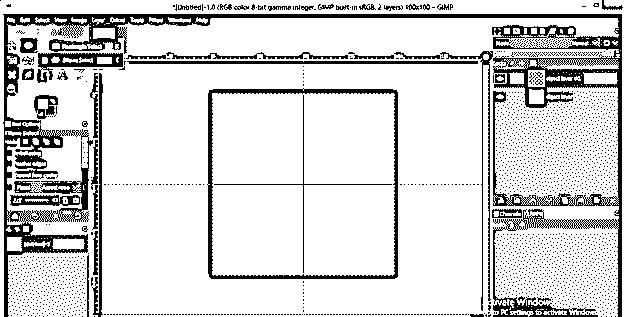

现在从工具面板中选择椭圆选择工具，按住键盘上的 Shift + Ctrl 键画一个圆，然后将它移动到两个参考线的交叉点，这样我们就可以将这个圆放在文档的中心。

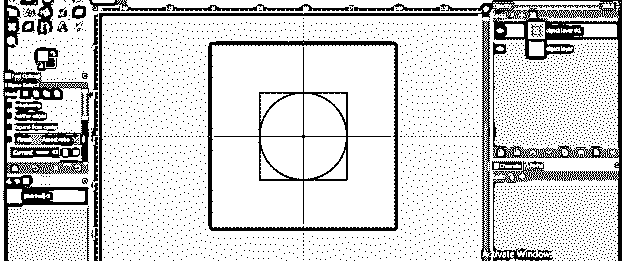

现在从工具面板中选择桶填充工具。

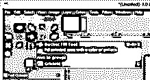

并在工具面板的前景色框中选择您想要的颜色。比如我会选择这种青色。

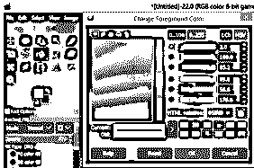

用桶工具在圆圈内点击一下，填充你选择的颜色。

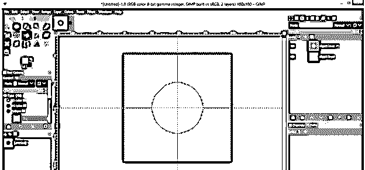

现在转到菜单栏的选择菜单，点击下拉列表的收缩选项。

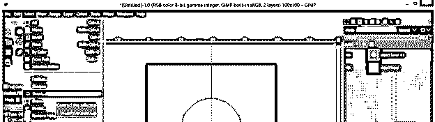

我将缩小这个圆 8 个像素，这意味着缩小选项将使这个圆的副本比这个圆小 8 个像素。

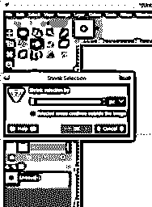

现在按删除按钮删除这个选中的小圆。

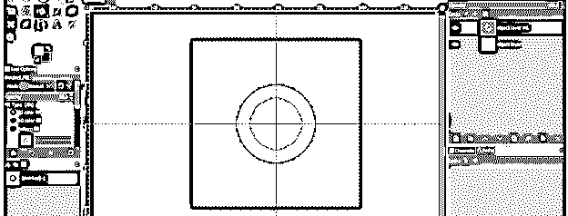

再次缩小 5 个像素，用同样的方法填充颜色。我会把黄色填进去。

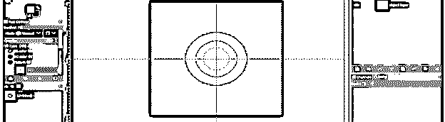

现在转到菜单栏的视图菜单，点击显示网格选项，在我们的文档区域显示网格。

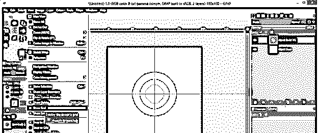

我们将在文档区域中使用这种类型的网格。

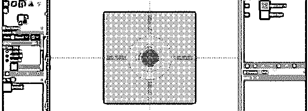

这是一个 1 x 1 像素的网格；你可以放大看。

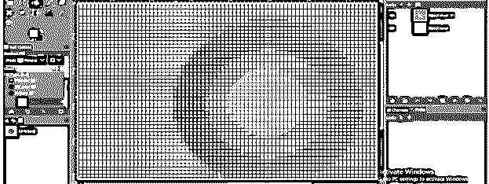

如果您没有这种类型的网格，您可以转到菜单栏的图像菜单，然后单击配置网格选项。

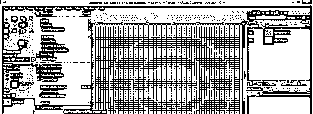

在这个对话框中为网格的水平线和垂直线设置 1 x 1 的值，然后点击 Ok 按钮。

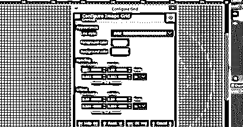

现在转到选择菜单来禁用这个黄色圆圈周围的选择，并点击下拉列表中的无选项。

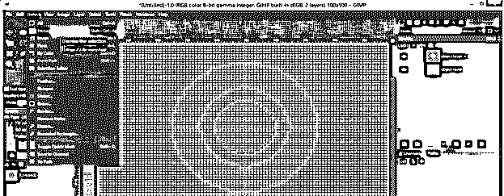

再次创建一个透明的层，方法和我们之前创建的一样。

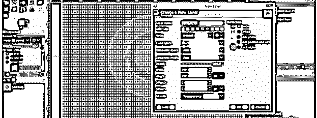

选择这个透明层，并采取铅笔工具从工具面板。

从菜单栏的“视图”菜单中启用“对齐网格”选项，这样当我们在此文档上绘制任何内容时，它都会自动与网格对齐，这样我们就可以在工作中获得准确的结果。

现在放大并用铅笔工具画任何东西。如果你在参数面板中选择 1 x 1 的笔刷大小，铅笔工具会一个接一个的填充这个网格。所以我会用铅笔工具填充这四个方块。

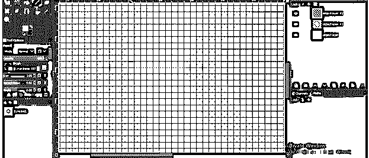

我将改变颜色框的前景色，然后在铅笔工具的帮助下，在我们的图案中心制作这个形状。

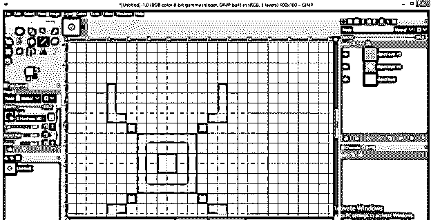

一个图案应该是对称的，所以我在这个圆的反面也做了同样的事情，做出了这种类型的图案设计。

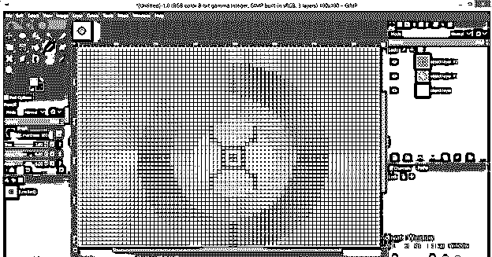

我想要一个透明的图案，这样我就可以删除背景层。你可以根据自己的选择用你想要的颜色保存它。现在关闭网格，从视图菜单中禁用它们。

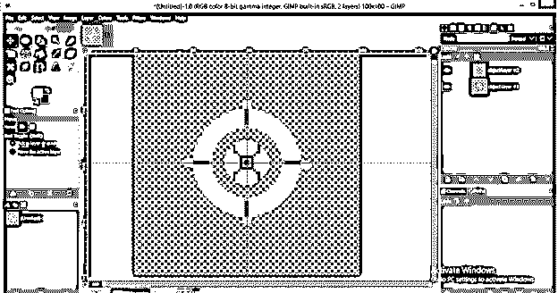

现在通过点击编辑菜单的复制可见选项来复制它。

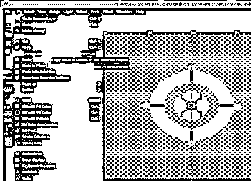

从窗口菜单的可停靠对话框选项中打开图案面板。

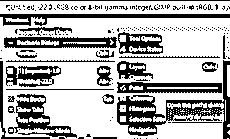

创建一个 1920 x 1080 大小的新文档，您将在图案面板中看到复制的图案，如下所示。

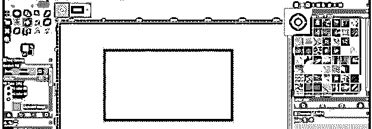

采取桶工具，并启用它的参数面板中的模式填充选项。

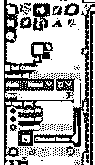

现在用桶工具点击文档区域，你会得到这样的图案。

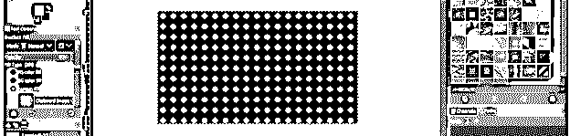

你可以放大看。

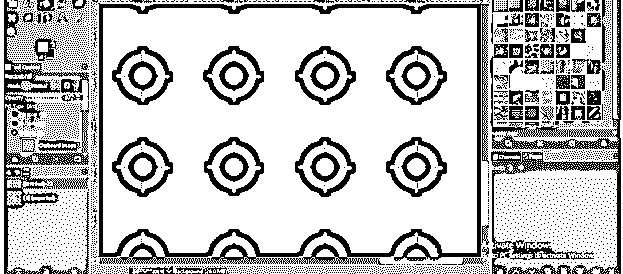

如果您想要保存此模式以供将来使用，请转到“文件”菜单的“导出为”选项。

并将其保存为一个。pat '扩展到您想要的位置。

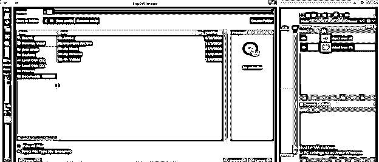

现在打开保存它的文件夹并复制它。

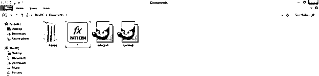

然后粘贴到 GIMP 的 Patterns 文件夹中。你可以在 c 盘>用户>你的电脑名(我的名字是 jhon smith) > AppData >漫游> GIMP > 2.10 >模式中找到模式文件夹。

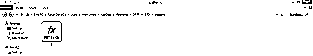

现在刷新模式面板。

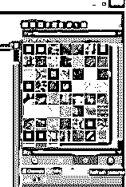

你将有你的模式和你保存的名字。

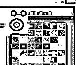

你可以在任何像这样的文件上使用它。

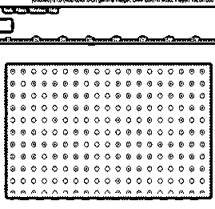

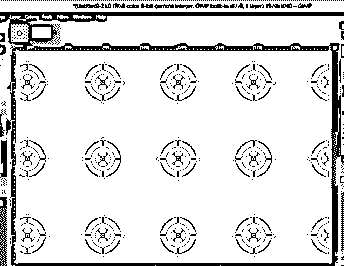

### 结论–GIMP 模式

这是通过使用工具面板中的不同工具在 gimp 中创建您想要的设计模式的最简单的方法。当然，你也可以用任何图像来代替这个设计，但是你只需要做一些参数上的改变，你就可以用这个图像得到一个漂亮的图案。

### 推荐文章

这是一个 GIMP 模式指南。这里我们讨论如何在 gimp 的其他设计工作中使用我们保存的模式。您也可以看看以下文章，了解更多信息–

1.  [GIMP 替代方案](https://www.educba.com/gimp-alternatives/)
2.  [Illustrator 中的平滑工具](https://www.educba.com/smooth-tool-in-illustrator/)
3.  [在 Illustrator 中创建表格](https://www.educba.com/create-table-in-illustrator/)
4.  [Java 设计模式](https://www.educba.com/design-patterns-in-java/)

