# GIMP 扩展

> 原文：<https://www.educba.com/gimp-extensions/>

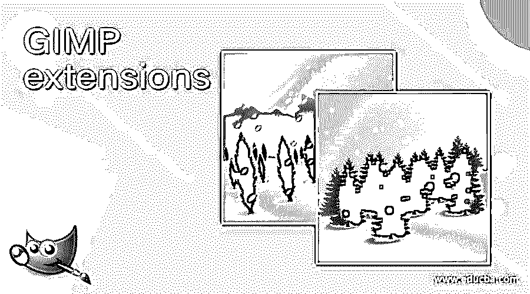

## GIMP 扩展简介

gimp extension 是一个很好的扩展包，可以帮助我们获得很好的插件、脚本和画笔等等，我们可以将它们安装在 GIMP 中，以扩展 GIMP 的工作能力。当你在你的 gimp 软件中使用 gimp 扩展包时，它会覆盖危险安装的扩展。最重要的是，gimp 扩展包的扩展来自 GIMP 的插件注册表。您可以根据您的 gimp 软件版本从互联网上安装 gimp 扩展包，并使用它来简化您在该软件中的工作。让我们分析 GIMP 扩展来获得更多关于它们的知识。

### 如何使用 gimp 扩展？

我们可以用它来了解合适的插件、脚本、画笔和其他增强 gimp 工作能力的附件。所以，首先根据你的 GIMP 软件版本搜索‘GIMP 扩展包’。

<small>3D 动画、建模、仿真、游戏开发&其他</small>

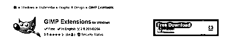

并将其安装到您的计算机上。它将覆盖你以前所有的插件，脚本笔刷等。

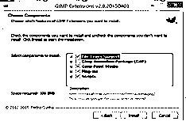

一旦你安装了扩展，你将会在 gimp 的菜单栏中看到这些变化，它位于工作屏幕的顶部。你将不得不更多的菜单，如外汇铸造和脚本福。

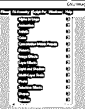

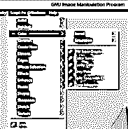

现在让我们使用这些扩展，并分析我们可以用它们做什么。为此，通过单击文件菜单下拉列表中的新建选项或按 Ctrl + N 快捷键来创建一个新文档。

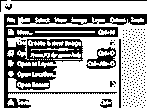

并转到菜单栏的脚本-符菜单。该脚本通常有一个工作组合的预设，这意味着你会得到一个在一个喜欢的许多步骤的结果。让我们通过一个例子来理解它。转到 Scrip-Fu 菜单的下拉列表中的形状选项，并通过单击从新的下拉列表中选择“旧纸”选项。

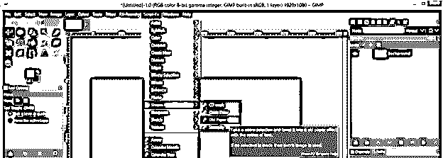

对于该选项，您将看到一个参数设置框。在这里，您可以从纸张颜色选项中选择纸张的颜色，可以选择字体样式、颜色和大小，一旦您完成了所有的设置，您就可以根据您点击此框中的确定按钮在上面进行书写。

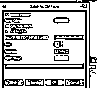

您将在您选择的文档上获得这种类型的旧纸张效果。

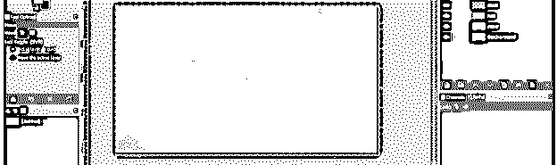

你将在图层面板中有一个单独的图层。我们这里也有一个文本层。所以如果你想在上面输入任何文字，双击文字层就可以了。

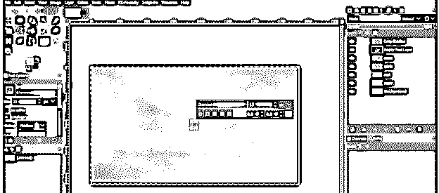

并在此输入您想要的文本。

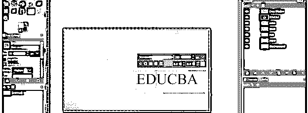

您也可以使用“字体-符”菜单来创建水印。你会在这个菜单的下拉列表的最后找到一个水印选项。转到该选项并单击它。

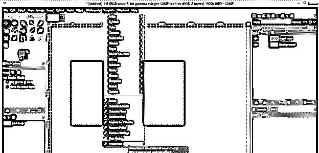

同样，你会看到一个参数设置框。在这里，您可以从该框的文本字符串选项中键入您想要作为水印的文本。

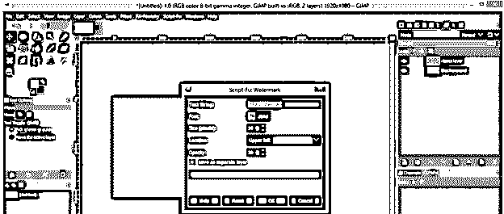

您可以设置字体样式以及文本的大小。只需点击框体字体选项，单独的对话框就会打开；在这里，选择你想要的风格。

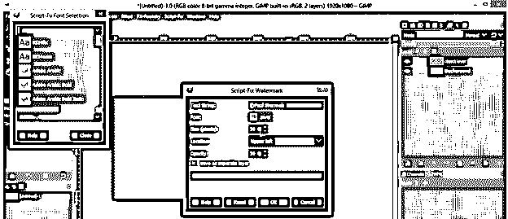

您可以从该列表中选择文本在图像区域的位置。

从这个选项中设置水印的不透明度值，然后点击这个框中的 Ok 按钮。

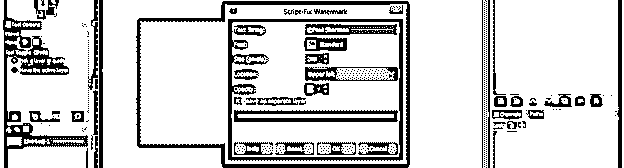

你会在你选择的位置有水印。

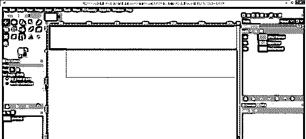

你可以在灰色背景上清楚地看到它。

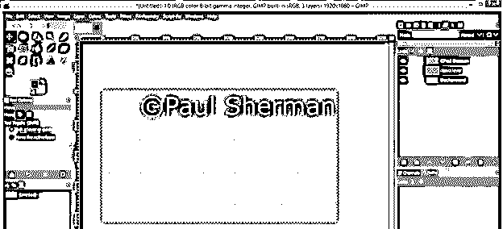

现在让我们通过菜单栏的文件菜单的打开选项在 gimp 中打开一个图像。我将打开这个图像。

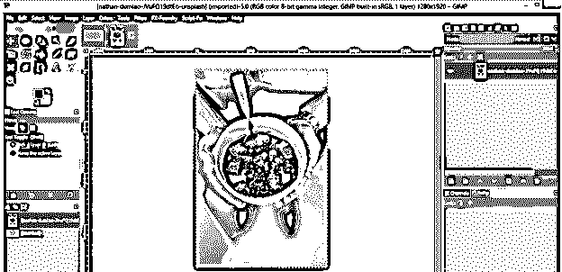

现在从工具面板中选择椭圆选择工具，或者你可以按键盘上的 E 键作为快捷键。

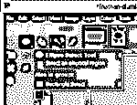

并围绕碗中的食物进行选择。

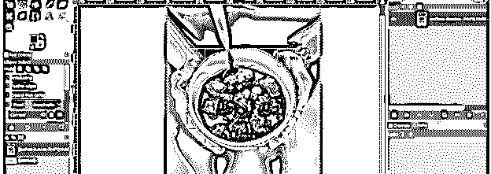

点击键盘上的 enter 按钮启用选择。

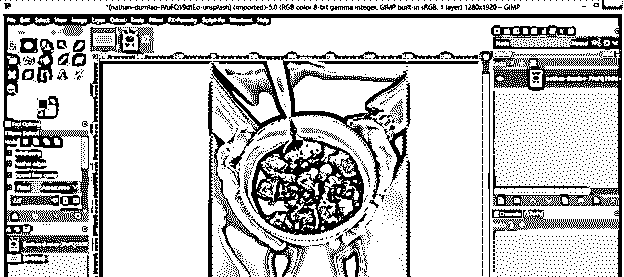

现在进入菜单栏的 Fx-Foundry 菜单，进入下拉列表的选区效果选项，然后点击新下拉列表的纹理化选项。我将在选区添加纹理。

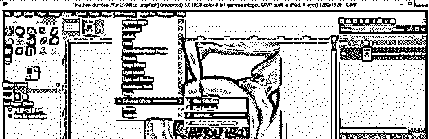

现在纹理参数框将被打开。您可以选择要应用的图案或纹理。

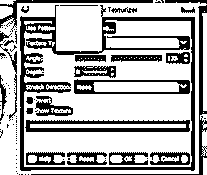

你也可以在这里选择纹理类型。我会从这个列表中选择沙子。

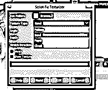

您可以从该框的角度选项中设置所选纹理类型的纹理角度。

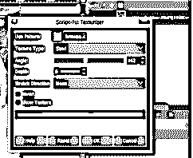

现在，如果您启用此框的显示纹理选项，您也将在一个单独的选项卡上应用纹理。现在点击这个框的 Ok 按钮。

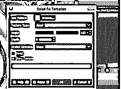

沙子纹理已经准备好了。

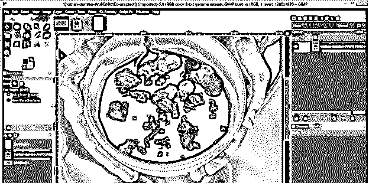

我们应用的纹理也在这样一个不同的选项卡上。因此，您可以在其他图像编辑工作中使用它，或者保存它以供将来使用。

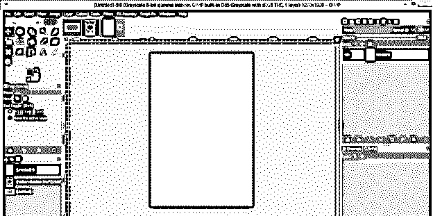

现在让我们看看 FX-Foundry 菜单对这个图像的另一个效果。再次进入 FX-Foundry 菜单并点击它，然后进入下拉列表的图层效果选项。现在，单击新下拉列表中的应用镜像选项。

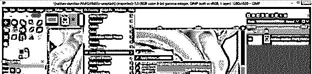

这里我们有这个效果的参数设置对话框。这个效果镜像这个图像的整个层，这样你可以从“迭代(图像每次加倍)”选项中选择镜像对象的数量。我将 1 作为它的值，因为我想要这个图像的一个镜像副本。

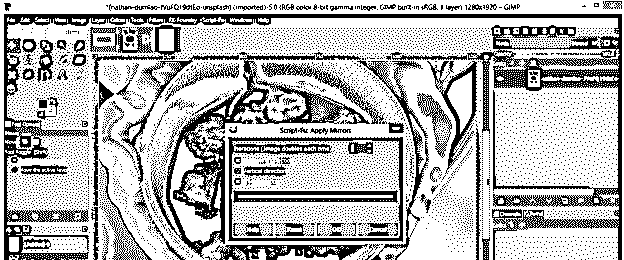

您可以选择镜像此图像的方向。它可以是水平的，也可以是垂直的。我将启用这个对话框的水平选项。只需用鼠标点击水平选项的小复选框即可启用。

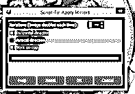

而在这里，原始图像的镜像已经准备好了。您将在一个单独的选项卡中获得新层的镜像效果。所以对你原来的形象是一个非破坏性的改变。

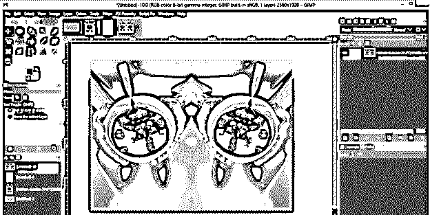

### 结论

你可以在扩展包中找到更多的效果；我们只是讨论了其中的一些，作为 GIMP 扩展的参考。您可以在工作中使用不同的扩展，并通过对它们的参数进行不同的更改来从中受益。

### 推荐文章

这是 GIMP 扩展指南。在这里，我们讨论如何使用 gimp 扩展和分析扩展，以获得更多关于它们的知识。您也可以看看以下文章，了解更多信息–

1.  [GIMP 替代方案](https://www.educba.com/gimp-alternatives/)
2.  [灯箱的替代方案](https://www.educba.com/alternative-for-lightroom/)
3.  [最佳照片编辑](https://www.educba.com/best-photo-editors/)
4.  [最佳平面设计软件](https://www.educba.com/best-graphic-design-software/)

