# GIMP 模糊背景

> 原文：<https://www.educba.com/gimp-blur-background/>

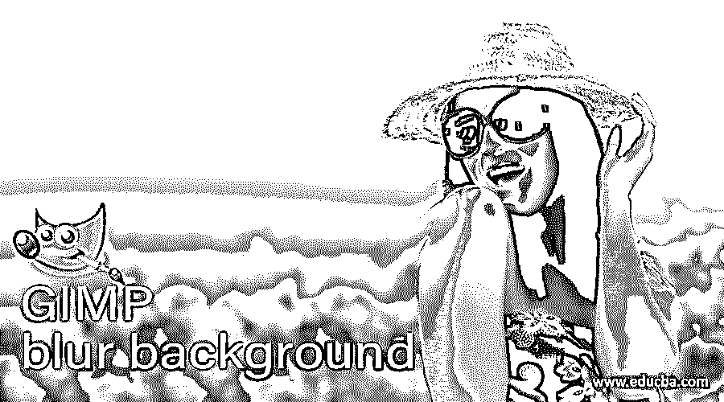

## GIMP 模糊背景介绍

在这篇文章中，我们将学习如何在 GIMP 中模糊背景。你可能在移动相机中使用过肖像模式，这种模式可以保持主体在焦点上，而使其他东西不在焦点上。虽然实际的模糊可以通过任何模糊方法来完成，例如高斯模糊，但在背景上执行模糊时，主要的事情是在模糊背景的同时保持主体在焦点上。我们将在 GIMP 中借助一个名为 resynthesizer 的插件来完成这项工作，它将为我们提供一些过滤器。这项技术让你的图像看起来更专业，同时也减少了干扰。

### GIMP 模糊背景的步骤

不同的是下面提到的步骤:

<small>3D 动画、建模、仿真、游戏开发&其他</small>

第一步:首先，我们需要一些库存图片，你可以从任何库存图片网站如 Unsplash 或 pixels 下载。下载一张图片，前景为主题，背景为焦点。

**第二步:**接下来我们去 https://github . com/boot chk/re synthesizer/blob/master/readme . MD 从 windows 链接下载一个 GIMP 插件 Resynthesizer_v1.0-i686.zip。文件下载完成后，解压文件。

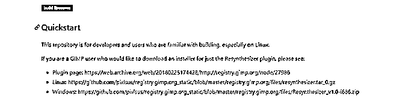

**步骤 3:** 然后打开 GIMP，进入编辑- >首选项，导航到插件部分，找到插件的位置。

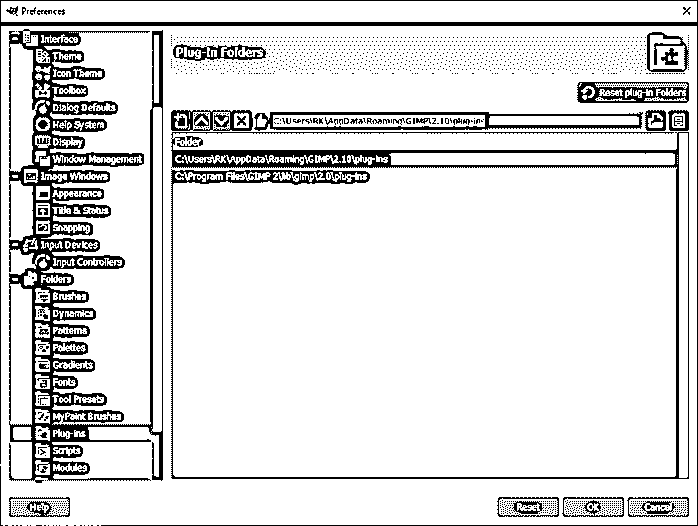

**第四步:**复制路径并粘贴到浏览器中，然后将重新合成器插件的解压文件复制到 GIMP 插件路径中。

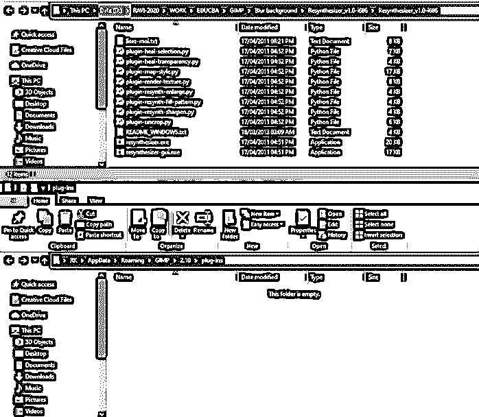

**第五步:**重启 GIMP，检查过滤器- >增强，寻找新的选项。

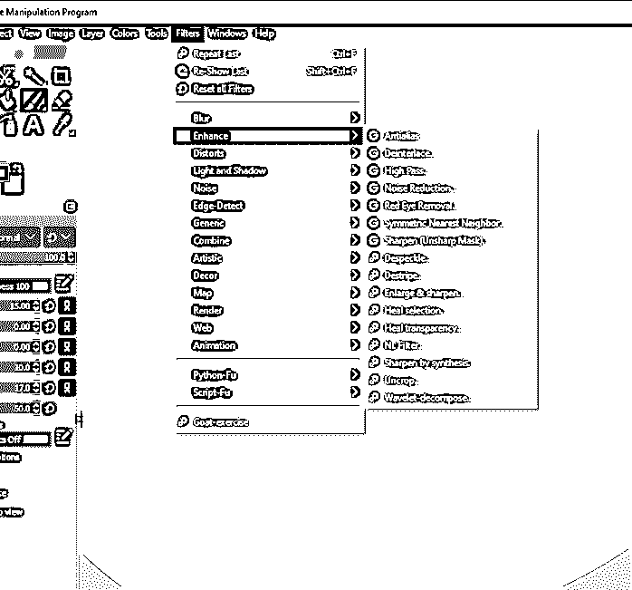

**第六步:**现在，在 GIMP 中打开你想要模糊背景的图片

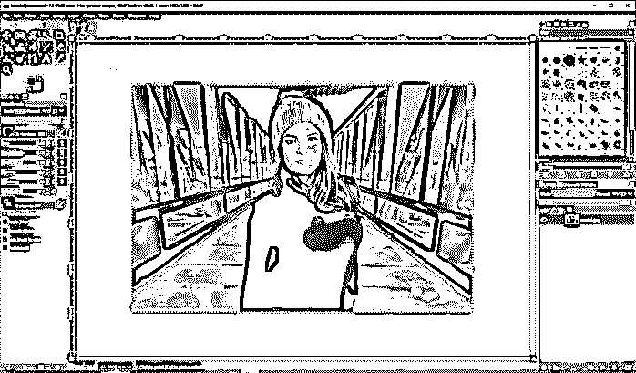

**第 7 步:**右键点击或点击图层面板图标，复制现有图层。

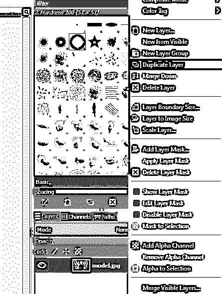

步骤 8: 将第一层重命名为“移除模型”，第二层重命名为“原始”

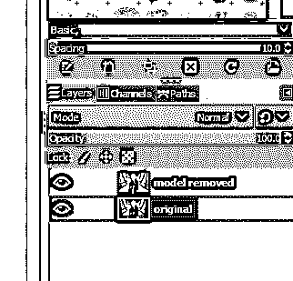

第九步:然后，使用套索或自由选择工具，在模型周围画一个宽松的套索。如果出现错误，您可以通过选择其他选项来添加和删除选择。

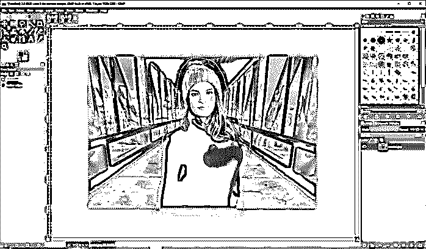

第十步:然后进入滤镜- >增强- >修复选择。请注意，如果您没有按照前面的步骤安装插件，这个选项将不会显示。

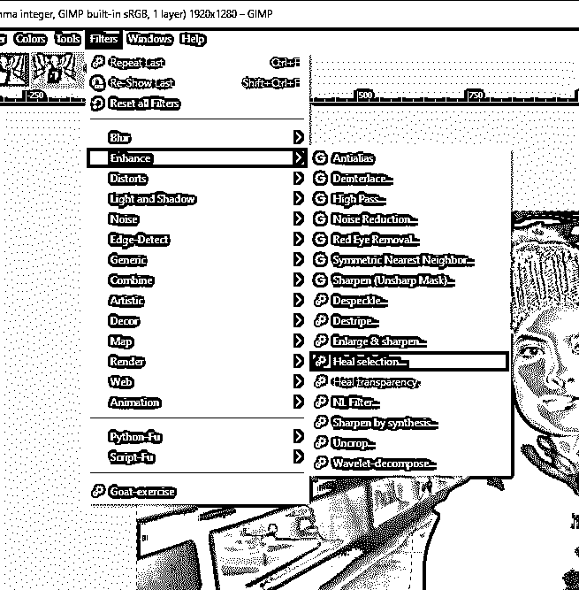

**第 11 步:**如图所示设置参数，即上下文采样宽度为 150px，填充顺序为向中心向内。

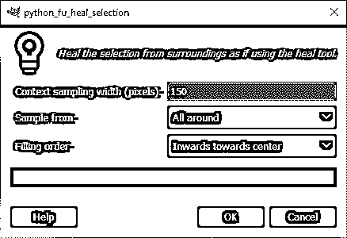

步骤 12: 因为我们不希望模型的颜色在外面变模糊，所以我们执行这个步骤，在这个空间给我们一些背景的粗略近似。

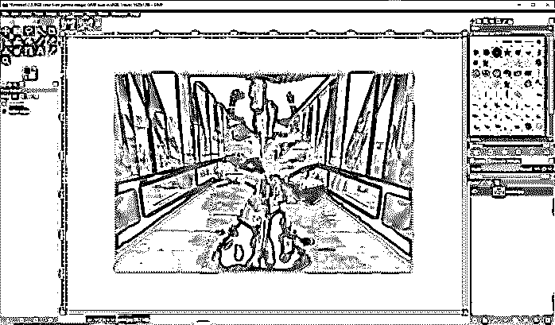

**步骤 13:** 在模型去除层的上面复制原始图像。此外，保留一份原件，以防万一，如果你想比较它与原始图像。

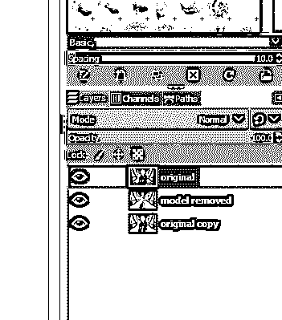

**步骤 14:** 接下来，我们使用前景选择工具，如图所示宽松地选择模型，并关闭循环。

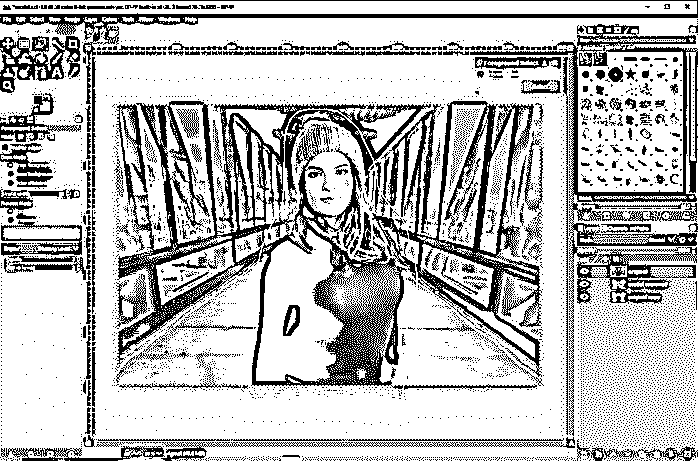

**第 15 步:**一旦选择完成，您已经覆盖了整个模型，然后按 enter 键。您可以看到，现在鼠标指针变成了一个绘画工具。

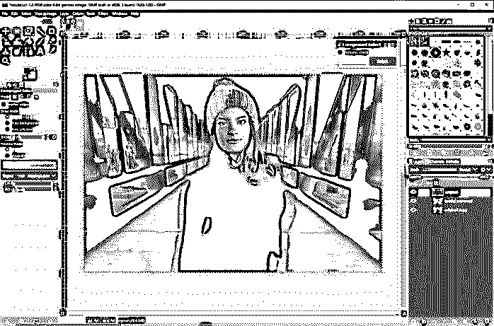

**第十六步:**现在开始绘制模型，模型是前景物体，蓝色区域的任何东西都是背景。很好地覆盖前景，但不需要很精确。完成后，按回车键。此外，确保笔刷已经选择了羽化边缘，这将使背景和前景更加真实。

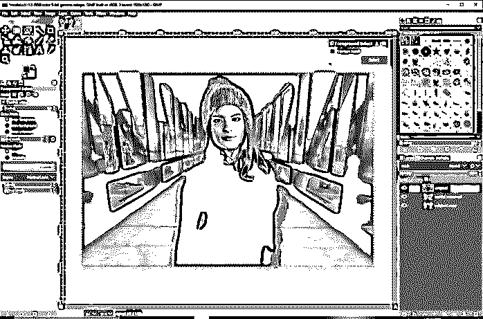

第 17 步:如果你错过了，你现在可以通过将这些部分添加到前景来进行微调。

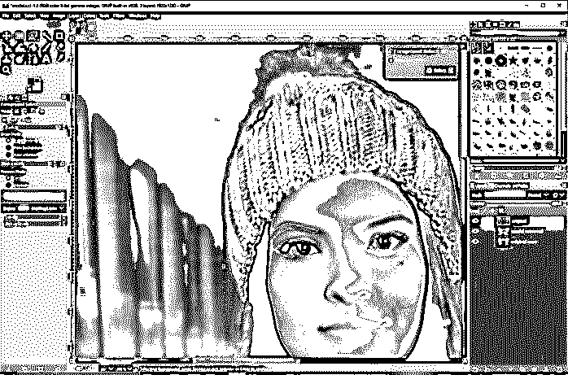

**步骤 18:** 如果你想预览成那样，也可以看看灰度版。

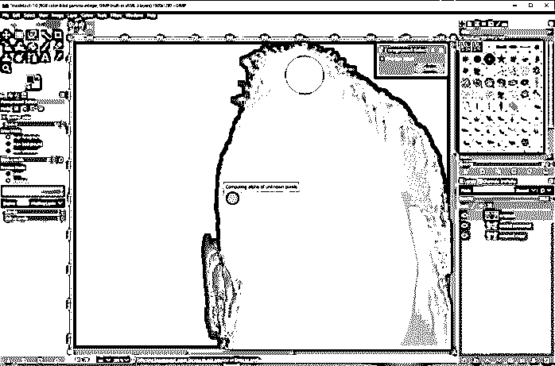

**步骤 19:** 如果是加在前景上的，也可以在背景上画。

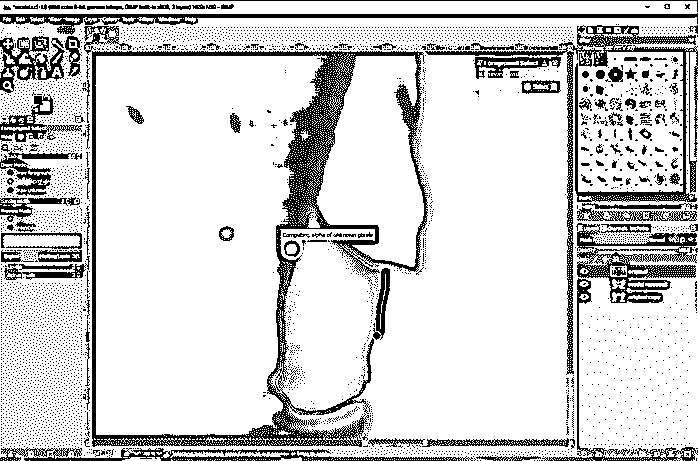

第 20 步:同样，你可以使用前景和背景选项进行微调。

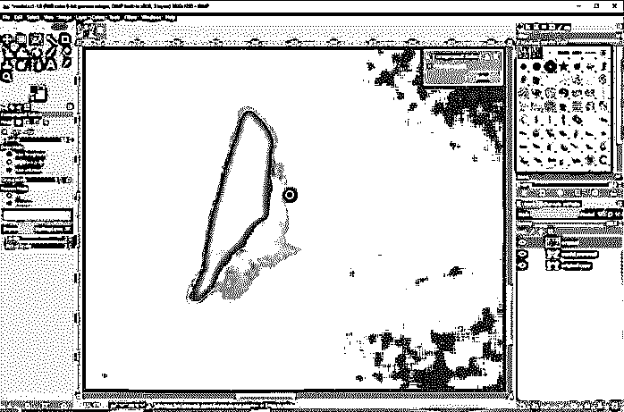

**步骤 21:** 如图所示，首先，前景选择工具在背景中选择了比需要更多的东西，因此我们在前景中进行了绘制调整。调整完成后，按回车键，前景对象将被选中。

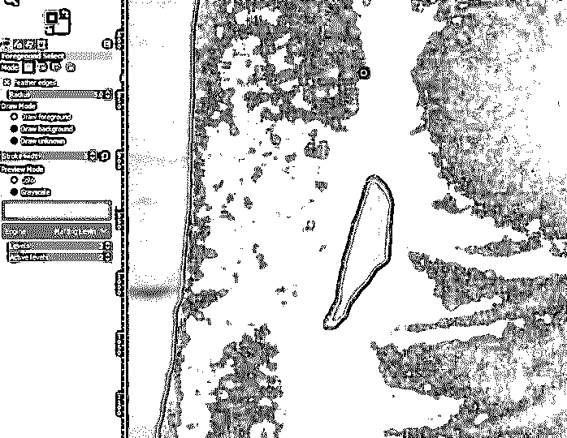

**步骤 22:** 现在选中原来的图层，右键添加图层蒙版。

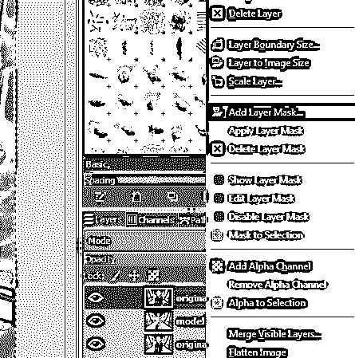

**步骤 23:** 确保选项中的选择被勾选，反转遮罩未被勾选。这将掩盖这一层的一切，除了主题的选择。

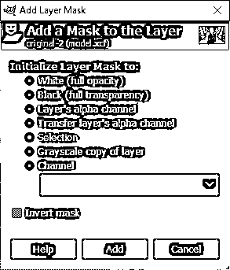

**步骤 24:** 如果你仍然选择了主体，按 ctrl + shift + a，这将取消选择它，然后选择“模型移除”层，然后使用滤镜添加一个模糊- >模糊- >高斯模糊

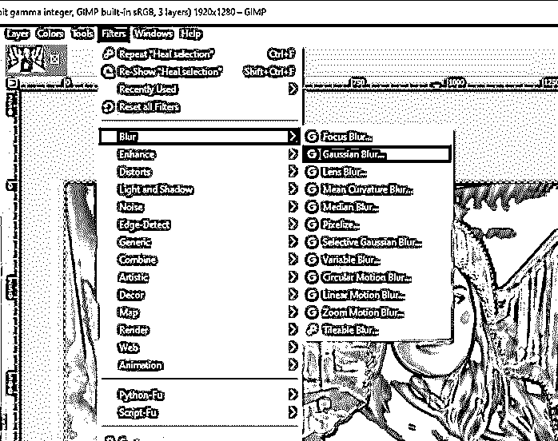

**步骤 25:** 设置尺寸 x 和尺寸 y 为 15，得到合适的背景虚化或者浅景深。

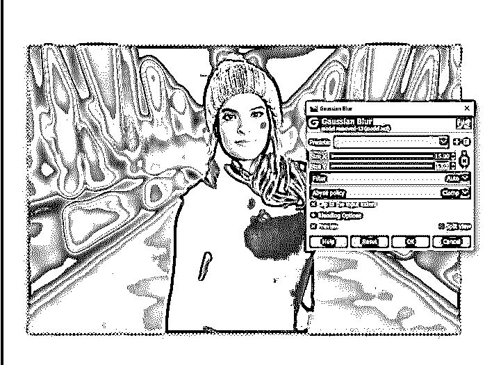

步骤 26: 现在选择蒙版做一些更精细的调整，首先确保前景和背景设置为它们的默认值白色和黑色。然后选择蒙版涂黑添加到蒙版和涂白删除蒙版。

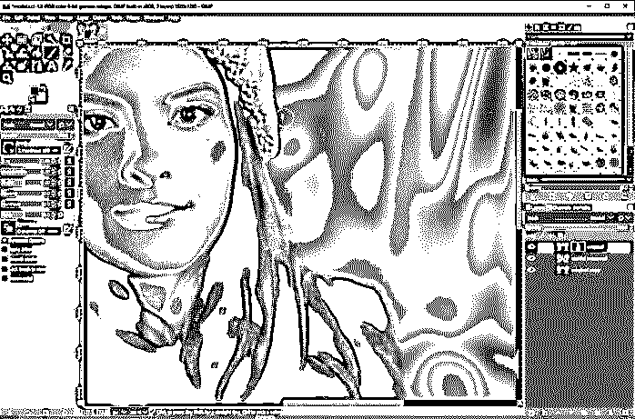

**步骤 27:** 你可以按 X 键切换背景和前景色，设置什么被遮掉，什么不被遮掉。所以，越多的时间花在改进前景和背景对象之间的图层蒙版和边缘上；模糊背景效果的最终结果就越好。

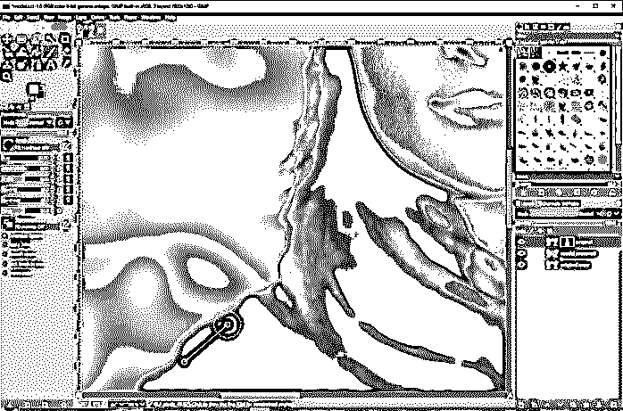

步骤 28: 然后新建一个图层名为 vignette，填充设置为透明。

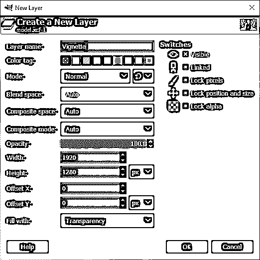

步骤 29: 现在进入滤镜->->光影-晕影

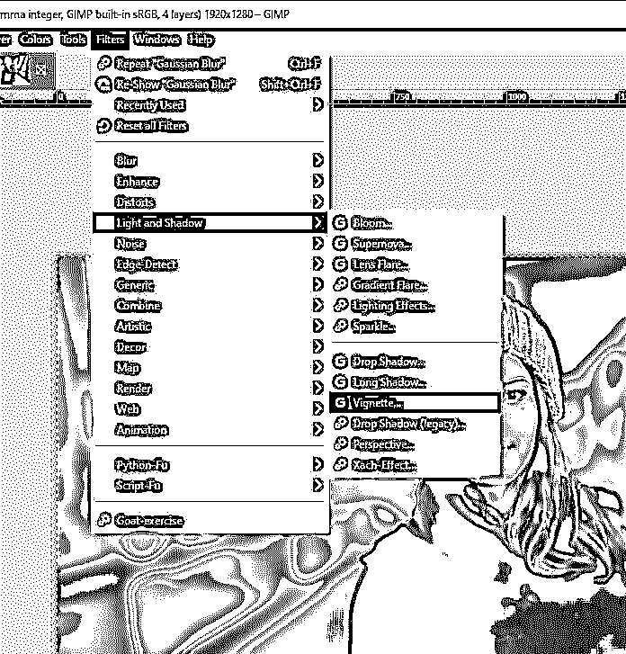

第 30 步:你可以改变半径、柔和度、伽玛和其他参数，这取决于你希望你的主体在焦点上有多突出。

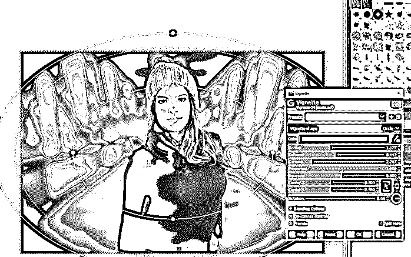

**步骤 31:** 然后降低渐晕图层的不透明度，让它看起来体面一些。

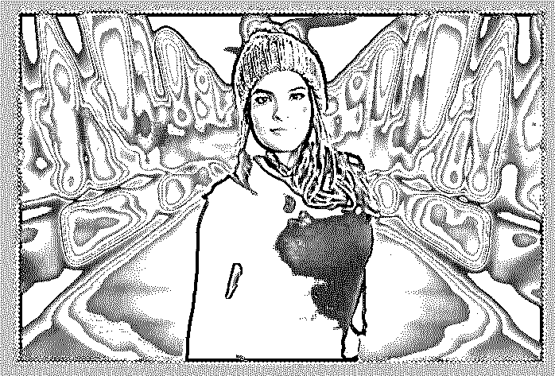

**第 33 步:**最后我们从文件菜单中将其导出为 jpg，得到结果。

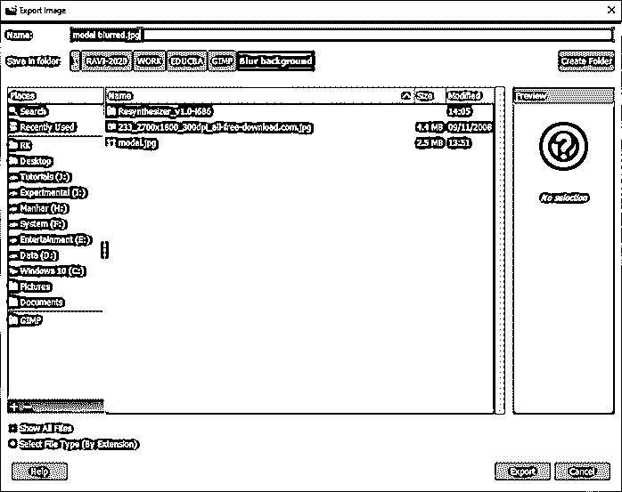

### 结论

在这篇文章中，我们学习了如何使用 GIMP 来模糊背景。首先，我们已经看到了如何使用安装再合成器插件，它为我们提供了必要的工具，然后我们选择了前景选择工具的主题，然后应用图层蒙版选择，然后增强蒙版匹配主题尽可能接近，然后我们完成了一些后期处理效果，如晕影。

### 推荐文章

这是一个 GIMP 模糊背景的指南。这里我们讨论 GIMP 模糊背景的步骤，以及我们如何做模糊背景。您也可以看看以下文章，了解更多信息–

1.  [GIMP 替代方案](https://www.educba.com/gimp-alternatives/)
2.  [Illustrator 中的动作](https://www.educba.com/action-in-illustrator/)
3.  [软件设计](https://www.educba.com/software-design/)
4.  [3ds Max 室内设计](https://www.educba.com/3ds-max-interior-design/)

